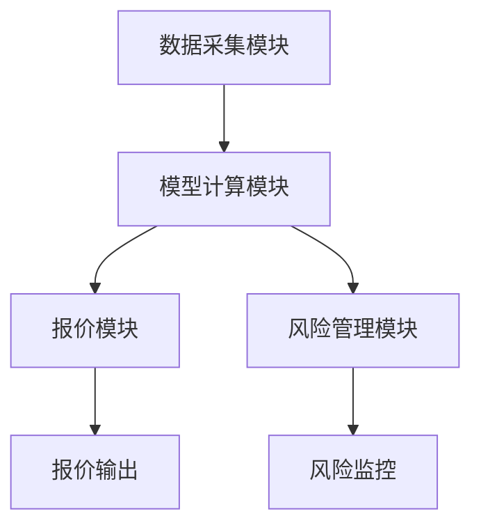
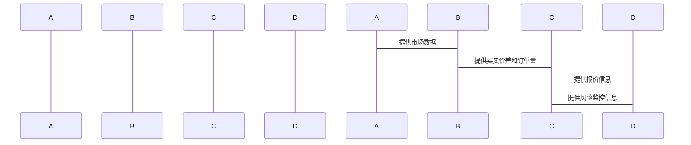

                 


# 金融市场做市商报价优化与风险管理

> 关键词：做市商，报价优化，风险管理，市场微观结构，算法实现

> 摘要：本文系统地探讨了金融市场中做市商报价优化与风险管理的核心概念、算法实现与系统架构设计。通过分析市场微观结构对报价策略的影响，结合数学模型与算法优化，提出了报价优化与风险管理的系统性解决方案。文章从理论到实践，全面阐述了如何在复杂多变的金融市场中，通过技术手段实现报价优化与风险管理的目标。

---

## 第1章: 做市商报价优化与风险管理概述

### 1.1 做市商的基本概念

#### 1.1.1 做市商的定义与角色
做市商（Market Maker）是指在金融市场中提供即时买卖报价，维持市场流动性的机构。做市商通过同时提供买入价（_bid）和卖出价（_ask）来撮合交易，确保市场的深度和稳定性。

#### 1.1.2 做市商在金融市场中的作用
1. 提供流动性：通过持续的买卖报价，做市商确保市场的买卖双方能够快速完成交易。
2. 稳定价格：在市场波动时，做市商通过调整报价来稳定市场价格，减少极端波动。
3. 促进交易：做市商的存在降低了交易成本，提高了市场的交易效率。

#### 1.1.3 做市商的市场结构与运作模式
1. 市场结构：做市商通常在交易所或场外市场（OTC）中进行报价。
2. 运作模式：通过算法和模型，做市商实时调整买卖价差和交易量，以实现利润最大化。

### 1.2 报价优化与风险管理的重要性

#### 1.2.1 报价优化的核心目标
1. 最小化买卖价差：在满足市场深度需求的同时，最小化买卖价差以提高竞争力。
2. 最大化收益：通过优化报价策略，最大化做市商的利润。

#### 1.2.2 风险管理在做市商中的地位
1. 风险来源：市场波动、流动性风险、信用风险等。
2. 风险管理的目标：通过量化和对冲，降低潜在风险对做市商利润的影响。

#### 1.2.3 报价优化与风险管理的相互关系
1. 报价优化为风险管理提供数据支持。
2. 风险管理确保报价策略的稳健性。

### 1.3 本书的核心内容与结构
1. 本书主要探讨做市商的报价优化与风险管理的理论、算法与实践。
2. 结构安排：从基础概念到算法实现，再到系统设计与项目实战。

---

## 第2章: 做市商报价策略与市场微观结构

### 2.1 做市商的报价策略

#### 2.1.1 常见的报价策略类型
1. 被动报价策略：根据市场深度和波动性调整买卖价差。
2. 主动报价策略：基于市场预测主动调整报价。

#### 2.1.2 报价策略的选择依据
1. 市场深度：做市商需要根据市场深度调整报价策略。
2. 市场波动性：高波动性市场需要更保守的报价策略。
3. 成本与收益：平衡报价调整的成本与收益。

#### 2.1.3 报价策略的动态调整
1. 市场深度变化：根据市场订单流动态调整买卖价差。
2. 市场波动性变化：根据波动性调整买卖价差和订单量。

### 2.2 市场微观结构对报价的影响

#### 2.2.1 市场深度与报价策略
1. 市场深度：市场的订单总量，影响做市商的买卖价差。
2. 报价策略：市场深度不足时，做市商会扩大买卖价差。

#### 2.2.2 市场流动性与报价调整
1. 市场流动性：市场的交易活跃程度，影响做市商的订单量。
2. 报价调整：流动性不足时，做市商会减少订单量。

#### 2.2.3 市场波动性与报价优化
1. 市场波动性：市场的价格波动程度，影响做市商的买卖价差。
2. 报价优化：波动性越高，买卖价差越大。

### 2.3 报价模型与数学基础

#### 2.3.1 报价模型的基本框架
1. 基于订单流的报价模型。
2. 基于市场预测的报价模型。

#### 2.3.2 市场微观结构的数学描述
1. 市场深度的数学表达式：$$ D = \sum_{i=1}^{n} O_i $$
2. 市场波动性的数学表达式：$$ V = \sqrt{\frac{1}{T} \sum_{t=1}^{T} (P_t - \bar{P})^2} $$

#### 2.3.3 报价优化的数学公式
1. 买卖价差的优化公式：$$ spread = max( \mu D, V) $$
2. 订单量的优化公式：$$ size = min( S, D) $$

---

## 第3章: 做市商的风险管理框架

### 3.1 风险管理的基本概念

#### 3.1.1 风险的定义与分类
1. 信用风险：交易对手违约的风险。
2. 市场风险：市场价格波动带来的风险。
3. 流动性风险：无法及时变现的风险。

#### 3.1.2 做市商面临的主要风险类型
1. 市场风险：市场价格波动带来的损失。
2. 信用风险：交易对手违约带来的损失。
3. 流动性风险：市场深度不足导致的损失。

#### 3.1.3 风险管理的目标与原则
1. 风险管理的目标：最小化潜在损失，确保做市商的稳健运营。
2. 风险管理的原则：分散化、对冲、监控。

### 3.2 做市商的风险度量方法

#### 3.2.1 风险价值（VaR）的计算
1. VaR的定义：在一定置信水平下，可能的最大损失。
2. VaR的计算公式：$$ VaR = \alpha \times \sigma $$

#### 3.2.2 信用风险与市场风险的度量
1. 信用风险：通过信用评分和违约概率进行度量。
2. 市场风险：通过波动率和相关性进行度量。

#### 3.2.3 风险调整后的回报分析
1. 风险调整后的回报（RAROC）：$$ RAROC = \frac{ROE - R}{\text{风险资本}} $$

### 3.3 风险管理的优化策略

#### 3.3.1 风险敞口的识别与量化
1. 风险敞口的识别：通过市场数据和模型识别潜在风险。
2. 风险敞口的量化：通过数学模型量化潜在风险。

#### 3.3.2 风险对冲与 hedging 战略
1. 对冲策略：通过做空相关资产来对冲风险。
2. hedging 战略：通过套期保值来降低风险。

#### 3.3.3 风险管理系统的设计与实现
1. 风险管理系统的设计：基于实时市场数据和模型，实现风险监控和对冲。
2. 风险管理系统实现：通过软件实现风险监控和对冲。

---

## 第4章: 报价优化算法与实现

### 4.1 报价优化的核心算法

#### 4.1.1 基于机器学习的报价优化
1. 算法选择：随机森林、神经网络等。
2. 算法实现：通过机器学习模型预测市场价格波动，优化买卖价差和订单量。

#### 4.1.2 基于数学模型的报价优化
1. 数学模型选择：随机过程、微分方程等。
2. 数学模型实现：通过数学模型预测市场价格波动，优化买卖价差和订单量。

### 4.2 报价优化的实现步骤

#### 4.2.1 数据收集与预处理
1. 数据来源：市场订单流、价格数据等。
2. 数据预处理：清洗、标准化等。

#### 4.2.2 模型训练与优化
1. 模型训练：使用历史数据训练机器学习模型或数学模型。
2. 模型优化：通过调整参数和优化算法，提高模型预测精度。

#### 4.2.3 实时报价优化
1. 实时数据处理：实时处理市场数据，生成实时报价。
2. 实时模型更新：根据市场变化，实时更新模型参数。

### 4.3 报价优化的数学模型

#### 4.3.1 市场价格预测模型
1. 时间序列模型：ARIMA、GARCH等。
2. 机器学习模型：随机森林、神经网络等。

#### 4.3.2 买卖价差优化模型
1. 买卖价差优化公式：$$ spread = \mu \times D + \alpha \times V $$
2. 订单量优化公式：$$ size = \min(S, D) $$

---

## 第5章: 系统架构设计与实现

### 5.1 系统架构设计

#### 5.1.1 系统模块划分
1. 数据采集模块：实时采集市场数据。
2. 模型计算模块：计算买卖价差和订单量。
3. 报价模块：根据计算结果生成实时报价。
4. 风险管理模块：监控和管理风险。

#### 5.1.2 系统架构图


#### 5.1.3 系统接口设计
1. 数据接口：数据采集模块与外部数据源的接口。
2. 模型接口：模型计算模块与报价模块的接口。
3. 风险接口：风险管理模块与报价模块的接口。

#### 5.1.4 系统交互流程


### 5.2 系统实现与优化

#### 5.2.1 系统实现
1. 数据采集模块：使用API接口实时采集市场数据。
2. 模型计算模块：基于机器学习或数学模型，计算买卖价差和订单量。
3. 报价模块：根据计算结果生成实时报价。
4. 风险管理模块：监控风险，并根据风险情况调整报价。

#### 5.2.2 系统优化
1. 性能优化：通过并行计算和优化算法，提高系统运行效率。
2. 可扩展性优化：通过模块化设计，提高系统的可扩展性。
3. 可靠性优化：通过冗余设计和错误处理，提高系统的可靠性。

---

## 第6章: 项目实战与经验分享

### 6.1 项目实战

#### 6.1.1 项目背景
1. 项目目标：优化做市商的报价策略，降低风险。
2. 项目需求：实现报价优化与风险管理的系统。

#### 6.1.2 环境配置
1. 开发环境：Python、Jupyter Notebook、机器学习库（如scikit-learn、TensorFlow）。
2. 数据源：交易所提供的市场数据。

#### 6.1.3 核心代码实现
```python
# 数据预处理
import pandas as pd
import numpy as np

data = pd.read_csv('market_data.csv')
data_processed = data.dropna().astype(float)

# 模型训练
from sklearn.ensemble import RandomForestRegressor
model = RandomForestRegressor(n_estimators=100)
model.fit(data_processed[['bid', 'ask', 'volume']], data_processed['price'])

# 实时报价
import time
while True:
    current_data = get_realtime_data()
    predicted_price = model.predict(current_data)
    spread = model.predict_spread(current_data)
    print(f'Current bid: {predicted_price - spread/2}, Current ask: {predicted_price + spread/2}')
    time.sleep(1)
```

#### 6.1.4 案例分析
1. 案例分析：通过具体案例分析，展示如何优化报价策略。
2. 经验总结：总结项目实施中的经验和教训。

### 6.2 经验分享

#### 6.2.1 报价优化的经验
1. 算法选择：选择适合的算法，提高报价优化的精度。
2. 数据处理：数据预处理是关键，确保数据的准确性和完整性。

#### 6.2.2 风险管理的经验
1. 风险监控：实时监控风险，及时调整报价策略。
2. 风险对冲：通过对冲降低风险。

#### 6.2.3 系统设计的经验
1. 模块化设计：提高系统的可维护性和可扩展性。
2. 并行计算：提高系统的运行效率。

---

## 第7章: 总结与展望

### 7.1 本章总结
1. 本文系统地探讨了金融市场中做市商报价优化与风险管理的核心概念、算法实现与系统架构设计。
2. 通过分析市场微观结构对报价策略的影响，结合数学模型与算法优化，提出了报价优化与风险管理的系统性解决方案。

### 7.2 未来研究方向
1. 深度学习在报价优化中的应用。
2. 多因子模型在风险管理系统中的应用。
3. 去中心化金融（DeFi）环境下的报价优化与风险管理。

### 7.3 注意事项
1. 报价优化与风险管理需要结合市场实际情况。
2. 系统设计需要考虑实时性和稳定性。
3. 风险管理需要实时监控和及时调整。

### 7.4 最佳实践 Tips
1. 数据处理是关键，确保数据的准确性和完整性。
2. 算法选择要结合实际，选择适合的算法。
3. 系统设计要模块化，提高系统的可维护性和可扩展性。

---

## 作者：AI天才研究院/AI Genius Institute & 禅与计算机程序设计艺术 /Zen And The Art of Computer Programming

