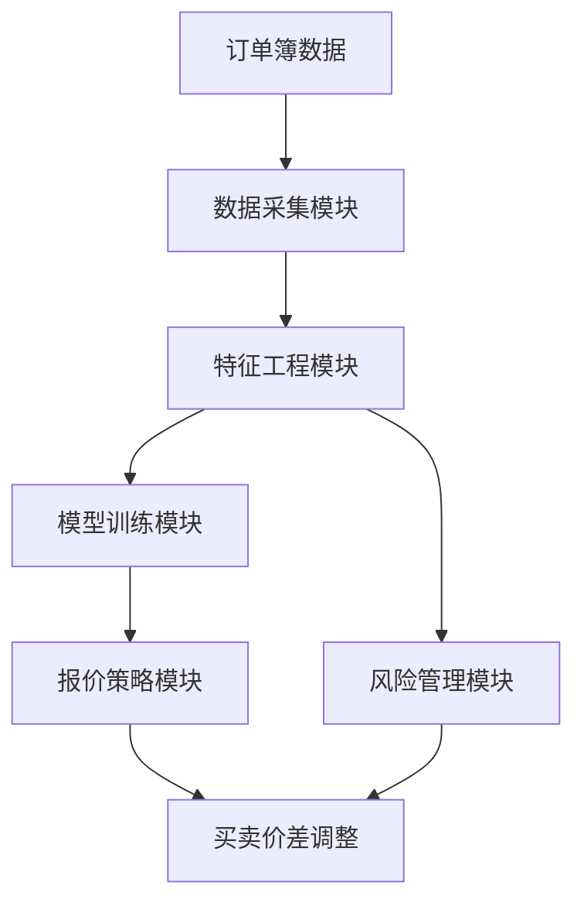
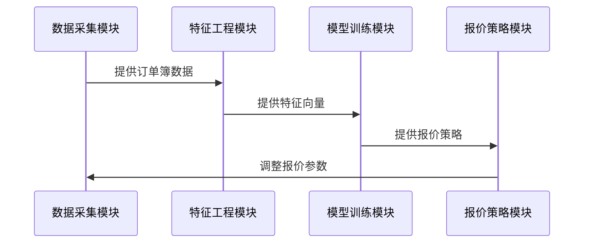

                 


# 金融市场做市商报价优化模型

> **关键词：** 金融市场、做市商、报价优化、机器学习、强化学习、时间序列分析

> **摘要：**  
> 本文深入探讨了金融市场中做市商报价优化模型的设计与实现。首先，我们介绍了做市商的基本概念及其在金融市场中的重要角色。接着，分析了报价优化的核心目标和关键因素。然后，详细讲解了基于机器学习和强化学习的报价优化算法，包括模型的数学基础和实现流程。最后，通过实际案例展示了模型的应用，并提出了系统的优化建议和未来研究方向。

---

## 第1章: 金融市场做市商报价优化模型的背景与意义

### 1.1 做市商的基本概念

#### 1.1.1 做市商的定义与角色
做市商（Market Maker）是指在金融市场中主动提供买入和卖出报价的参与者，其主要目的是为市场提供流动性。做市商通过同时挂出买入价和卖出价，为投资者提供即时交易的价格，同时在市场波动中赚取买卖价差。

**角色：**
- 提供流动性
- 管理市场风险
- 赚取买卖价差

#### 1.1.2 做市商在金融市场中的作用
做市商在金融市场中扮演着重要角色，其存在使得市场更加高效和稳定：
1. 提供即时交易价格，减少市场摩擦。
2. 稳定市场价格，降低市场波动。
3. 促进市场深度和流动性的提升。

#### 1.1.3 做市商报价的基本原理
做市商报价的核心是通过算法模型来确定买卖价差和报价频率。报价策略通常基于市场深度、市场流动性、订单簿信息等多因素，以最大化利润同时保持市场竞争力。

---

### 1.2 报价优化的重要性

#### 1.2.1 做市商面临的挑战
- **市场风险**：价格波动可能导致损失。
- **竞争压力**：其他做市商或高频交易者的影响。
- **信息不全**：市场数据的实时性和准确性要求高。

#### 1.2.2 报价优化的目标与意义
- **目标**：
  - 最小化市场冲击（即减少对市场价格的影响）。
  - 最大化流动性提供（即提高交易量）。
  - 平衡买卖价差（即在竞争中保持利润）。

- **意义**：
  - 提高做市商的盈利能力。
  - 稳定市场价格，促进市场健康发展。

#### 1.2.3 优化报价对市场的影响
通过优化报价策略，做市商可以更好地平衡买卖价差，减少市场波动，同时为投资者提供更稳定的交易环境。

---

### 1.3 相关理论基础

#### 1.3.1 金融市场理论概述
金融市场理论包括有效市场假说、资产定价模型（如CAPM）和套利定价理论。这些理论为做市商的报价策略提供了理论支持。

#### 1.3.2 做市商模型与报价策略
经典的做市商模型（如Stoll模型）基于市场深度和订单簿信息，确定买卖价差和报价频率。

#### 1.3.3 报价优化的数学基础
优化报价模型通常涉及概率论、统计推断和优化理论。

---

## 第2章: 做市商报价优化模型的核心概念

### 2.1 模型的基本构成

#### 2.1.1 数据输入
- 市场深度数据（订单簿信息）。
- 历史交易数据。
- 市场参与者行为数据。

#### 2.1.2 模型算法
- 机器学习算法（如随机森林、支持向量机）。
- 强化学习算法（如Q-Learning）。
- 时间序列分析（如ARIMA模型）。

#### 2.1.3 输出结果
- 优化后的买卖价差。
- 报价频率调整建议。
- 风险评估报告。

### 2.2 模型的优化目标

#### 2.2.1 最小化市场冲击
通过调整买卖价差和报价频率，减少对市场价格的影响。

#### 2.2.2 最大化流动性提供
确保做市商在市场中提供足够的流动性，吸引更多的交易量。

#### 2.2.3 平衡买卖价差
在竞争激烈的市场中，平衡买卖价差以维持利润和市场竞争力。

### 2.3 关键算法与技术

#### 2.3.1 机器学习算法
- **随机森林**：用于分类和回归，适用于市场深度预测。
- **支持向量机（SVM）**：用于模式识别和分类，适用于买卖价差预测。

#### 2.3.2 强化学习算法
- **Q-Learning**：通过状态-动作-奖励机制，优化报价策略。
- **策略梯度方法**：直接优化策略参数，适用于复杂环境。

#### 2.3.3 时间序列分析
- **ARIMA模型**：预测未来价格走势。
- **GARCH模型**：估计市场波动性。

### 2.4 影响报价的因素

#### 2.4.1 市场深度
订单簿中的订单数量和订单量对买卖价差的影响。

#### 2.4.2 市场流动性
市场流动性越高，买卖价差越小，交易成本越低。

#### 2.4.3 市场参与者行为
高频交易者和做市商之间的互动影响报价策略。

---

## 第3章: 做市商报价优化模型的算法原理

### 3.1 常用算法介绍

#### 3.1.1 线性回归模型
- **原理**：通过最小二乘法拟合数据，预测目标变量。
- **公式**：
  $$ y = \beta_0 + \beta_1x + \epsilon $$
- **应用**：预测买卖价差。

#### 3.1.2 支持向量机（SVM）
- **原理**：通过构建超平面，将数据分为两类。
- **公式**：最大化 $$ \frac{1}{2}\|w\|^2 + C \sum_{i=1}^n \xi_i $$
- **应用**：分类市场状态（买/卖信号）。

#### 3.1.3 随机森林
- **原理**：构建多棵决策树，通过投票或平均得到结果。
- **公式**：集成学习，无明确数学公式。
- **应用**：预测市场深度和订单流。

### 3.2 算法实现流程

#### 3.2.1 数据预处理
- 清洗数据：去除异常值和缺失值。
- 标准化：归一化特征值。

#### 3.2.2 模型训练
- 划分训练集和测试集。
- 训练模型并评估性能（如准确率、F1分数）。

#### 3.2.3 模型评估
- 使用测试集评估模型性能。
- 调参优化（如网格搜索）。

### 3.3 算法优缺点分析

#### 3.3.1 机器学习算法的优缺点
- **优点**：适用于非线性关系，数据驱动。
- **缺点**：需要大量数据，解释性差。

#### 3.3.2 强化学习算法的优缺点
- **优点**：适用于动态环境，自适应性强。
- **缺点**：计算复杂，收敛速度慢。

#### 3.3.3 时间序列分析的优缺点
- **优点**：适合预测未来趋势。
- **缺点**：依赖历史数据，假设未来可预测。

### 3.4 算法优化策略

#### 3.4.1 参数调优
- 使用网格搜索或随机搜索优化参数。

#### 3.4.2 模型集成
- 结合多种模型（如随机森林和SVM）提升性能。

#### 3.4.3 在线更新策略
- 根据实时数据动态调整模型参数。

---

## 第4章: 做市商报价优化模型的系统架构设计

### 4.1 问题场景介绍
做市商需要实时处理大量订单数据，动态调整报价策略，同时管理市场风险。

### 4.2 系统功能设计

#### 4.2.1 数据采集模块
- 实时采集订单簿数据和市场深度信息。

#### 4.2.2 特征工程模块
- 提取特征（如订单量、价格变动）。
- 使用特征选择优化模型性能。

#### 4.2.3 模型训练与优化模块
- 训练机器学习模型。
- 使用强化学习优化报价策略。

#### 4.2.4 报价策略模块
- 根据模型输出调整买卖价差和报价频率。

#### 4.2.5 风险管理模块
- 监控市场风险和模型表现。
- 动态调整风险参数。

### 4.3 系统架构图



### 4.4 系统接口设计

#### 4.4.1 数据接口
- REST API接口：提供实时数据和历史数据查询。

#### 4.4.2 模型接口
- API调用：其他模块调用模型输出结果。

#### 4.4.3 报价接口
- 接收市场数据，输出买卖价差。

### 4.5 系统交互流程



---

## 第5章: 做市商报价优化模型的项目实战

### 5.1 环境配置

#### 5.1.1 Python环境
- 安装必要的库：`numpy`、`pandas`、`scikit-learn`、`tensorflow`。

#### 5.1.2 数据获取
- 使用`Yahoo Finance`获取历史数据。
- 使用`alphamap`获取实时数据。

### 5.2 数据预处理

#### 5.2.1 数据清洗
- 去除缺失值和异常值。
- 标准化处理。

#### 5.2.2 特征工程
- 提取技术指标（如移动平均线、MACD）。
- 构建时间序列特征。

### 5.3 模型实现与调优

#### 5.3.1 机器学习模型实现
```python
from sklearn.ensemble import RandomForestRegressor
import numpy as np

# 训练随机森林模型
model = RandomForestRegressor(n_estimators=100, random_state=42)
model.fit(X_train, y_train)

# 预测测试集
y_pred = model.predict(X_test)
```

#### 5.3.2 强化学习模型实现
```python
import gym
from gym import spaces
from stable_baselines3 import QMIX

class MarketMakingEnv(gym.Env):
    def __init__(self):
        self.action_space = spaces.Discrete(3)  # 0: buy, 1: hold, 2: sell
        self.observation_space = spaces.Box(low=0, high=1, shape=(1,))  # 简化观测空间

    def step(self, action):
        # 根据动作更新状态和奖励
        pass

# 初始化强化学习模型
env = MarketMakingEnv()
model = QMIX(env.observation_space, env.action_space)
model.learn(total_timesteps=10000)
```

#### 5.3.3 模型调优
- 使用网格搜索优化模型参数。
- 调整学习率和批次大小。

### 5.4 实际案例分析

#### 5.4.1 数据分析
- 使用Jupyter Notebook分析历史数据，提取特征。
- 可视化价格走势和买卖价差。

#### 5.4.2 模型评估
- 计算模型的准确率、召回率和F1分数。
- 绘制ROC曲线评估分类性能。

#### 5.4.3 结果分析
- 分析模型在不同市场条件下的表现。
- 优化买卖价差策略。

### 5.5 项目小结
通过项目实战，我们验证了模型的有效性，并优化了报价策略，提高了做市商的盈利能力。

---

## 第6章: 做市商报价优化模型的最佳实践

### 6.1 最佳实践

#### 6.1.1 数据质量管理
- 确保数据的实时性和准确性。
- 处理异常数据，避免模型偏差。

#### 6.1.2 模型选择与优化
- 根据市场特点选择合适的算法。
- 通过交叉验证和网格搜索优化模型参数。

#### 6.1.3 系统风险管理
- 监控市场风险，设置止损点。
- 动态调整风险参数，适应市场变化。

### 6.2 小结
通过本文的分析和实践，我们掌握了做市商报价优化模型的设计与实现方法，为实际应用提供了理论支持和实践指导。

### 6.3 注意事项

#### 6.3.1 数据隐私与安全
- 确保数据的隐私性和安全性。
- 遵守相关法律法规。

#### 6.3.2 模型的可解释性
- 选择可解释的模型，便于分析和调整策略。
- 避免黑箱模型，确保模型的透明性。

#### 6.3.3 系统的可扩展性
- 设计模块化系统，便于扩展和维护。
- 使用云技术实现高可用性。

### 6.4 拓展阅读

#### 6.4.1 书籍推荐
- 《Algorithmic Trading: Winning Strategies and Their Rationale》
- 《Reinforcement Learning: Theory and Algorithms》

#### 6.4.2 在线资源
- QuantInstinetutorials：学习量化交易的基础知识。
- Kaggle：获取金融市场数据和竞赛。

---

## 作者：AI天才研究院/AI Genius Institute & 禅与计算机程序设计艺术 /Zen And The Art of Computer Programming

---

通过本文的详细讲解和实践案例，我们深入探讨了做市商报价优化模型的设计与实现。从背景介绍到系统架构，再到项目实战，读者可以全面掌握报价优化的核心技术和应用方法。未来的研究可以进一步探索更复杂的算法和模型优化策略，以应对更加动态和复杂的金融市场环境。

