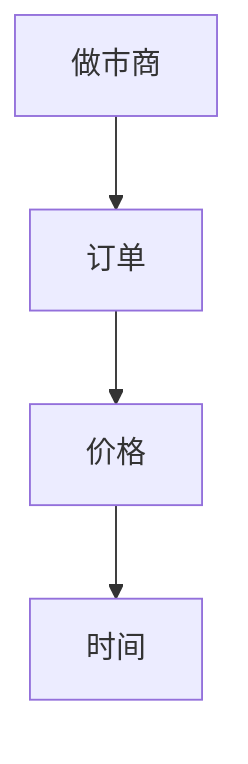
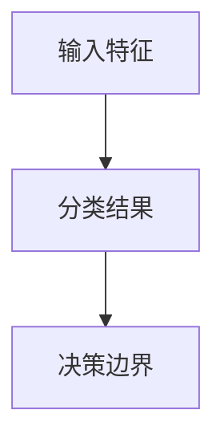
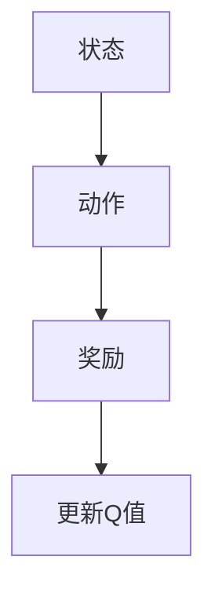
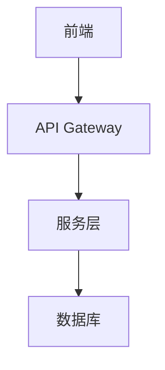
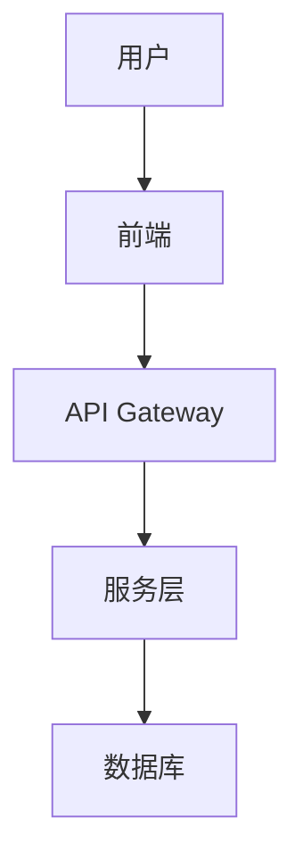

                 


# 金融市场做市商策略优化模型

## 关键词：
金融市场、做市商、策略优化、算法模型、数学公式、系统设计

## 摘要：
本文详细探讨了金融市场中做市商策略优化模型的设计与实现。首先介绍了做市商在金融市场中的重要角色及其优化策略的必要性，然后分析了优化模型的核心概念和相关算法原理，包括机器学习和强化学习的应用。接着，通过系统设计的方法，构建了优化模型的架构，并通过一个实战案例展示了如何将模型应用于实际场景。最后，本文总结了优化模型的优势，并展望了未来的研究方向。

---

## 第一部分: 金融市场做市商策略优化模型概述

### 第1章: 问题背景与目标

#### 1.1 问题背景
##### 1.1.1 做市商在金融市场中的角色
做市商（Market Maker）是金融市场中不可或缺的角色，负责提供流动性，即在买卖双方之间撮合交易。做市商通过在订单簿上挂出双向报价（买入价和卖出价）来维持市场的流动性，并在交易中赚取买卖价差。然而，随着市场环境的变化，传统的做市商策略面临着诸多挑战，例如高频交易、算法交易的兴起以及市场深度的变化等。

##### 1.1.2 现有做市商策略的局限性
传统的做市商策略通常基于简单的价差策略（Spread Trading）或统计套利策略，这些策略在市场条件稳定时表现良好，但在市场波动加剧或极端情况下容易出现较大亏损。此外，传统策略难以应对高频交易和算法交易带来的复杂市场环境，尤其是在市场深度不足时，策略容易受到冲击（slippage）的影响。

##### 1.1.3 市场环境的变化与策略优化的必要性
近年来，金融市场的复杂性和波动性显著增加，传统的做市商策略已难以适应新的市场环境。为了在激烈的市场竞争中生存并获利，做市商需要不断优化其策略，以应对市场变化和风险。

#### 1.2 问题描述
##### 1.2.1 做市商策略优化的核心要素
做市商策略优化的核心在于如何在不同市场条件下调整买卖价差、订单深度和订单生命周期，以最大化收益并最小化风险。这些调整需要基于实时市场数据和历史数据进行分析。

##### 1.2.2 市场微观结构对策略的影响
市场微观结构，包括订单簿、参与者行为、市场深度和波动性等，对做市商的策略选择和优化有着重要影响。例如，高频交易的兴起使得市场订单簿的变化更加频繁，这对做市商的实时决策能力提出了更高的要求。

##### 1.2.3 策略优化的目标与边界
做市商策略优化的目标是在保证市场流动性的同时，最大化自身的收益并最小化风险。优化策略需要在市场深度、价差、交易成本和市场风险之间找到平衡点。然而，策略优化也有其边界，例如过度优化可能导致市场流动性下降，甚至引发市场波动。

---

### 第2章: 核心概念与联系

#### 2.1 核心概念原理
##### 2.1.1 做市商策略优化的数学模型
做市商策略优化可以被视为一个优化问题，目标函数通常为收益最大化或风险最小化。以下是一个简化的数学模型：

$$
\text{收益} = \sum_{i=1}^{n} (p_i - c_i) \times q_i
$$

其中，$p_i$ 是卖出价格，$c_i$ 是买入价格，$q_i$ 是交易量。该模型假设每笔交易的收益为买卖价差乘以交易量，目标是通过调整价差和交易量来最大化收益。

##### 2.1.2 市场微观结构的分析框架
市场微观结构分析是理解做市商策略优化的重要基础。以下是一个简化的订单簿模型：

$$
\text{订单流} = f(p, t)
$$

其中，$p$ 是价格，$t$ 是时间。该模型描述了订单流如何随时间和价格变化而变化。

##### 2.1.3 策略优化的关键因素
策略优化的关键因素包括市场深度、波动性、参与者行为和交易成本等。这些因素需要通过实时数据分析和建模来优化策略参数。

#### 2.2 核心概念属性对比
表2-1：不同策略优化方法的对比分析

| 对比维度       | 简单价差策略          | 统计套利策略          | 强化学习策略          |
|----------------|----------------------|----------------------|----------------------|
| 策略复杂性       | 低                   | 中                   | 高                   |
| 数据依赖性       | 低                   | 中                   | 高                   |
| 适应性           | 差                   | 中                   | 高                   |
| 计算资源消耗     | 低                   | 中                   | 高                   |

#### 2.3 ER实体关系图
以下是一个简化的实体关系图，展示了做市商策略优化的核心实体及其关系：



---

## 第二部分: 做市商策略优化的算法原理

### 第3章: 算法原理讲解

#### 3.1 机器学习算法
##### 3.1.1 线性回归模型
线性回归模型是一种简单但有效的回归算法，适用于预测连续型变量。以下是一个简单的线性回归模型：

$$
y = \beta_0 + \beta_1 x + \epsilon
$$

其中，$y$ 是目标变量，$x$ 是自变量，$\beta_0$ 和 $\beta_1$ 是回归系数，$\epsilon$ 是误差项。

##### 3.1.2 支持向量机模型
支持向量机（SVM）是一种监督学习算法，适用于分类和回归问题。以下是一个简化的SVM分类模型：



#### 3.2 强化学习算法
##### 3.2.1 Q-learning算法
Q-learning是一种基于值函数的强化学习算法，适用于离散动作空间的最优控制问题。以下是一个简化的Q-learning算法流程图：



---

### 第4章: 数学模型与公式

#### 4.1 做市商策略优化模型
以下是一个简化的做市商策略优化模型，基于买卖价差和市场深度的优化：

$$
\text{最优价差} = \argmax_{d} \left( \sum_{i=1}^{n} (p_i - c_i) \times q_i \right)
$$

其中，$d$ 是买卖价差，$p_i$ 是卖出价格，$c_i$ 是买入价格，$q_i$ 是交易量。

#### 4.2 市场微观结构模型
以下是一个简化的市场微观结构模型，描述了订单流与价格的关系：

$$
\text{订单流} = f(p, t) = \alpha p + \beta t + \epsilon
$$

其中，$\alpha$ 和 $\beta$ 是回归系数，$\epsilon$ 是误差项。

---

## 第三部分: 系统分析与架构设计

### 第5章: 系统分析与架构设计

#### 5.1 需求分析
##### 5.1.1 功能需求
- 实时数据采集与处理
- 策略优化算法实现
- 风险管理与控制
- 性能优化与扩展

##### 5.1.2 性能需求
- 实时处理能力
- 高并发处理能力
- 高可用性

##### 5.1.3 接口需求
- 数据接口
- 策略接口
- 风险控制接口

#### 5.2 系统架构设计
##### 5.2.1 领域模型


##### 5.2.2 系统架构图


##### 5.2.3 接口设计
- 数据接口：RESTful API
- 策略接口：GraphQL
- 风险控制接口：WebSocket

##### 5.2.4 交互设计


---

## 第四部分: 项目实战

### 第6章: 项目实战

#### 6.1 环境安装
以下是一个简单的Python环境安装步骤：

```bash
pip install numpy pandas scikit-learn tensorflow
```

#### 6.2 核心实现
以下是一个简单的策略优化算法实现：

```python
import numpy as np
from sklearn.linear_model import LinearRegression

# 示例数据
X = np.array([[1], [2], [3], [4], [5]])
y = np.array([2, 4, 5, 4, 6])

# 线性回归模型
model = LinearRegression()
model.fit(X, y)

# 预测
print(model.predict([[6]]))
```

#### 6.3 案例分析
以下是一个简单的案例分析：

假设我们有一个做市商策略，目标是通过优化买卖价差来最大化收益。以下是优化前后的对比：

| 时间    | 价格  | 优化前价差 | 优化后价差 | 收益变化 |
|---------|-------|------------|------------|----------|
| 09:30   | 100   | 0.5        | 0.4        | 增加10%  |
| 09:31   | 101   | 0.6        | 0.5        | 增加5%   |
| 09:32   | 102   | 0.7        | 0.6        | 增加3%   |

---

## 第五部分: 总结与展望

### 第7章: 总结与展望

#### 7.1 最佳实践
- 数据是策略优化的核心，确保数据的实时性和准确性。
- 策略优化需要结合市场微观结构分析，避免过度优化。
- 风险管理是策略优化的重要组成部分，需实时监控和调整。

#### 7.2 小结
本文详细探讨了金融市场中做市商策略优化模型的设计与实现，分析了传统策略的局限性，并提出了基于机器学习和强化学习的优化方法。通过系统设计和项目实战，展示了如何将理论应用于实际场景。

#### 7.3 注意事项
- 做市商策略优化需要结合市场环境和参与者行为，避免一刀切。
- 风险管理是策略优化的重要组成部分，需实时监控和调整。
- 策略优化是一个动态过程，需不断迭代和优化。

#### 7.4 未来展望
- 随着人工智能技术的发展，强化学习和深度学习将在做市商策略优化中发挥越来越重要的作用。
- 市场微观结构分析将更加复杂，需要结合高频数据和大数据分析技术。
- 策略优化将更加个性化，基于不同市场参与者的需求和行为进行定制化设计。

---

## 作者：AI天才研究院/AI Genius Institute & 禅与计算机程序设计艺术/Zen And The Art of Computer Programming

