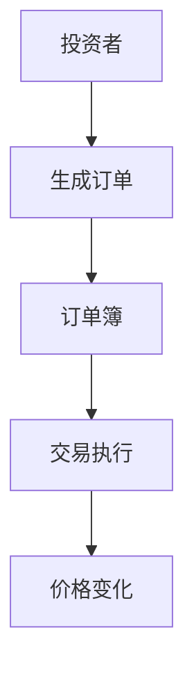
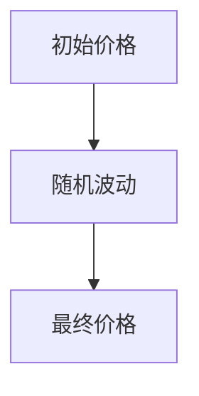
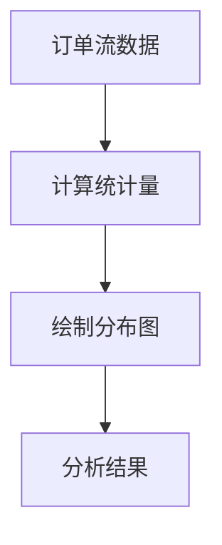
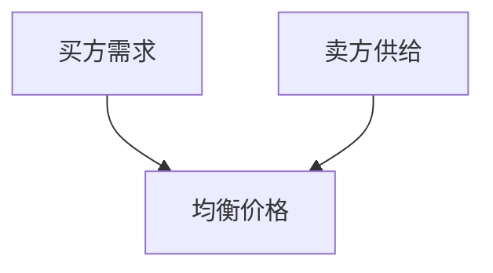
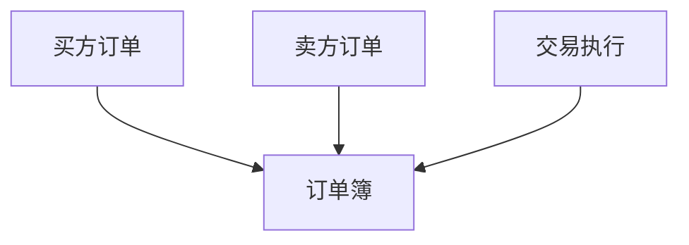
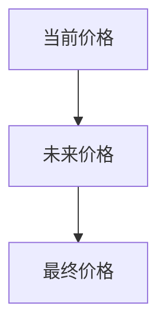
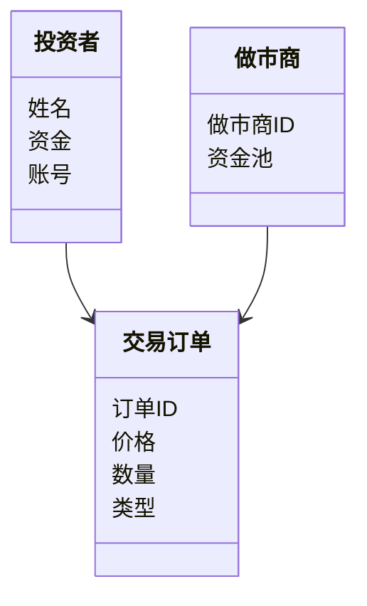
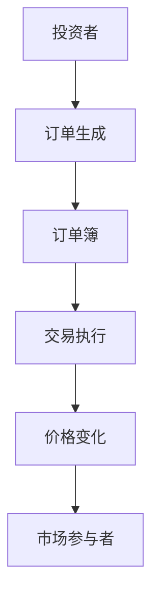
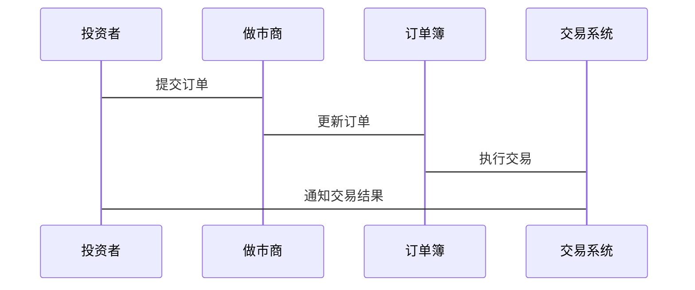

                 


# 金融市场微观结构分析

> 关键词：金融市场，微观结构，价格形成，交易行为，市场参与者

> 摘要：本文深入探讨金融市场微观结构的核心概念、市场参与者的交易行为、价格形成机制以及系统架构设计。通过分析订单簿模型、交易策略、流动性管理等关键要素，结合数学模型和实际案例，揭示金融市场微观结构的内在规律，帮助读者理解并应用这些知识。

---

## 第二章: 市场参与者与交易行为分析

### 2.1 市场参与者的分类

#### 2.1.1 投资者类型
投资者是金融市场的核心参与者，主要分为以下几类：

| 投资者类型 | 特点 | 目标 |
|------------|------|------|
| 零散投资者 | 交易量小，信息获取有限 | 资本保值与增值 |
| 机构投资者 | 交易量大，信息优势 | 优化资产配置 |
| 对冲基金 | 高风险高回报，使用杠杆 | 利用市场套利机会 |

##### 图2-1: 市场参与者ER关系图
```mermaid
er
actor 投资者 {
    string 姓名
    string 账号
    string 资金
}
actor 做市商 {
    string 做市商ID
    string 资金池
}
actor 交易商 {
    string 交易商ID
    string 交易策略
}
```

#### 2.1.2 做市商与交易商的角色
- **做市商**：提供流动性，维护市场深度。通过双向报价机制，确保市场稳定。
- **交易商**：执行交易，利用价格差异获利。

#### 2.1.3 机构投资者的行为特征
机构投资者通常基于基本面分析和市场趋势进行投资决策。他们的行为对市场价格有显著影响，尤其是在大额交易时。

### 2.2 交易行为的驱动因素

#### 2.2.1 信息驱动的交易行为
- **信息优势**：掌握内部信息的投资者倾向于在信息公布前进行交易。
- **信息不对称**：导致市场参与者的交易行为差异。

#### 2.2.2 噪声交易与噪声 trader 模型
- **噪声交易**：基于错误信息或情绪的交易行为。
- **噪声 trader 模型**：描述噪声交易对市场价格的影响，通常表现为价格的随机波动。

#### 2.2.3 市场情绪与羊群效应
- **市场情绪**：投资者的心理状态影响交易行为，可能导致非理性决策。
- **羊群效应**：投资者跟随 majority 的行为，放大市场波动。

### 2.3 交易策略与订单生成

#### 2.3.1 简单交易策略
- **均值回归策略**：假设价格会回归均值，适用于波动性市场。
- **动量策略**：利用价格动量，买入上涨趋势，卖出下跌趋势。

#### 2.3.2 复杂交易策略
- **高频交易**：利用算法在极短时间内完成大量交易，依赖低延迟网络和高性能计算。
- **算法交易**：基于复杂模型自动执行交易，减少人为干扰。

#### 2.3.3 订单生成过程的数学模型
订单生成可以看作一个随机过程，常用泊松过程模型描述订单到达的频率。

##### 图2-2: 订单生成过程


##### 代码示例：泊松过程模拟
```python
import numpy as np
import matplotlib.pyplot as plt

# 参数：λ=订单到达率，t=时间区间
def poisson_process(λ, t):
    n = 1000  # 时间步数
    rt = np.random.poisson(λ, n)
    t = np.arange(n)
    plt.step(t, rt, where='left')
    plt.title(f'泊松过程，λ={λ}')
    plt.xlabel('时间')
    plt.ylabel('订单数')
    plt.show()

poisson_process(2, 100)
```

### 2.4 价格形成机制的数学模型

#### 2.4.1 市场价格的随机过程
价格变化可以用随机游走模型描述，假设价格变化服从正态分布。

##### 图2-3: 随机游走模型


##### 代码示例：随机游走模拟
```python
import numpy as np
import matplotlib.pyplot as plt

# 初始价格
price = 100
# 时间步数
n = 100
# 随机波动
steps = np.random.normal(0, 1, n)
price_path = [price]
for step in steps:
    price += step
    price_path.append(price)

plt.plot(price_path)
plt.title('随机游走模型')
plt.xlabel('时间')
plt.ylabel('价格')
plt.show()
```

#### 2.4.2 订单流的统计分析
订单流的统计分析通常包括对订单到达时间、订单量和价格变化的统计分析。

##### 图2-4: 订单流统计分析流程


##### 代码示例：订单流统计分析
```python
import pandas as pd
import matplotlib.pyplot as plt

# 模拟订单流数据
data = {'时间': np.random.uniform(0, 100, 1000),
        '订单量': np.random.poisson(5, 1000)}
df = pd.DataFrame(data)
print(df.head())
# 绘制订单量分布图
df['订单量'].hist(bins=20, alpha=0.5)
plt.title('订单量分布')
plt.xlabel('订单量')
plt.ylabel('频率')
plt.show()
```

## 第三章: 价格形成机制与市场微观结构

### 3.1 价格形成的动态过程

#### 3.1.1 买卖双方力量的均衡
市场价格由买方需求和卖方供给共同决定，形成均衡价格。

##### 图3-1: 市场均衡模型


#### 3.1.2 市场深度与价格弹性
市场深度影响价格弹性，市场深度越高，价格波动越小。

#### 3.1.3 时间与价格的关系
短期价格波动受交易者情绪影响，长期价格反映基本面因素。

### 3.2 市场微观结构的核心要素

#### 3.2.1 订单簿的结构与运作
订单簿记录所有未成交订单，包括买价、卖价和订单数量。

##### 图3-2: 订单簿结构


#### 3.2.2 最优订单簿模型
最优订单簿模型旨在最小化交易成本，平衡市场深度与价格冲击。

#### 3.2.3 市场微观结构的均衡状态
均衡状态是指买方需求与卖方供给相等，市场价格稳定。

### 3.3 价格发现机制的数学模型

#### 3.3.1 市场微观结构的随机过程模型
价格变化可以用马尔可夫链模型描述，考虑当前价格对未来价格的影响。

##### 图3-3: 马尔可夫链模型


##### 代码示例：马尔可夫链模拟
```python
import numpy as np
import matplotlib.pyplot as plt

# 状态转移矩阵
states = ['高价', '中价', '低价']
P = np.array([
    [0.3, 0.5, 0.2],
    [0.1, 0.6, 0.3],
    [0.2, 0.3, 0.5]
])

# 初始状态分布
initial = np.array([1, 0, 0])

# 计算n步转移概率
n = 10
current = initial
for _ in range(n):
    current = current.dot(P)
    print(f'第 {_+1} 步状态分布: {current}')
```

---

## 第四章: 市场流动性与交易成本分析

### 4.1 市场流动性的定义与测量

#### 4.1.1 流动性的静态与动态测量
静态流动性衡量市场深度，动态流动性衡量市场深度的变化。

#### 4.1.2 市场深度与市场广度
市场深度反映即时订单量，市场广度反映长期订单量。

#### 4.1.3 流动性风险的定义与度量
流动性风险是指无法以合理价格快速买卖资产的风险。

### 4.2 交易成本的构成与影响

#### 4.2.1 显性交易成本
显性成本包括佣金、买卖价差等。

#### 4.2.2 隐性交易成本
隐性成本包括信息成本、机会成本等。

#### 4.2.3 交易成本对价格的影响
交易成本增加会导致价格偏离均衡价格。

---

## 第五章: 金融市场微观结构的系统架构设计

### 5.1 问题场景介绍
本文将设计一个简单的订单簿系统，用于模拟金融市场微观结构。

### 5.2 系统功能设计

#### 5.2.1 领域模型


### 5.3 系统架构设计

#### 5.3.1 系统架构图


### 5.4 系统接口设计

#### 5.4.1 接口设计
- **接口1**: 投资者提交订单
- **接口2**: 订单簿更新价格
- **接口3**: 交易执行通知

### 5.5 系统交互序列图

#### 5.5.1 交易执行流程


---

## 第六章: 项目实战

### 6.1 环境安装

#### 6.1.1 安装Python
```bash
python --version
pip install numpy matplotlib pandas
```

### 6.2 系统核心实现源代码

#### 6.2.1 订单簿实现
```python
class OrderBook:
    def __init__(self):
        self.buys = {}
        self.sells = {}
    
    def add_buy(self, price, qty):
        self.buys[price] = self.buys.get(price, 0) + qty
    
    def add_sell(self, price, qty):
        self.sells[price] = self.sells.get(price, 0) + qty
    
    def get_best_bid(self):
        return max(self.buys.keys()) if self.buys else None
    
    def get_best_ask(self):
        return min(self.sells.keys()) if self.sells else None
```

### 6.3 代码应用解读与分析
订单簿实现包括买卖订单的添加和最优价格的获取。买卖订单存储在字典中，便于快速查找最优价格。

### 6.4 实际案例分析
模拟一个简单的订单簿，投资者提交买入和卖出订单，系统执行交易并更新价格。

### 6.5 项目小结
通过实现订单簿系统，理解金融市场微观结构的基本原理和实际应用。

---

## 第七章: 最佳实践

### 7.1 小结
本文深入分析了金融市场微观结构的核心概念和系统架构设计。

### 7.2 注意事项
- 数据采集与处理需谨慎，确保数据的准确性和完整性。
- 模型假设需合理，避免过度简化或复杂化问题。
- 系统设计需考虑可扩展性和可维护性。

### 7.3 拓展阅读
- 建议阅读《金融市场中的数学模型》和《算法交易入门》等书籍。

---

## 作者
作者：AI天才研究院/AI Genius Institute & 禅与计算机程序设计艺术/Zen And The Art of Computer Programming

---

通过以上内容，读者可以系统地理解金融市场微观结构的分析方法，并掌握实际应用中的关键点。

