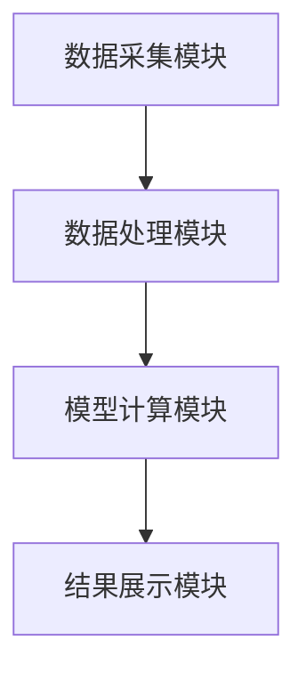

                 


# 金融市场微观结构变化对流动性影响分析

> 关键词：金融市场、微观结构、流动性、交易机制、信息流动、市场参与者、系统架构

> 摘要：本文从金融市场微观结构的定义与核心概念出发，分析了微观结构变化对流动性的影响机制。通过详细探讨市场参与者行为、交易机制创新与信息流动对流动性的影响，本文提出了一个系统化的分析框架，并通过具体案例分析，展示了如何利用算法模型量化微观结构变化对流动性的影响。最后，本文总结了研究发现，并提出了实际应用中的注意事项和未来研究方向。

---

# 第一部分：金融市场微观结构与流动性概述

## 第1章：金融市场微观结构与流动性基础

### 1.1 金融市场微观结构的定义与核心概念

#### 1.1.1 金融市场的定义与分类
金融市场是资金供需双方进行交易的场所，可以分为一级市场和二级市场。一级市场主要涉及新发行证券的买卖，二级市场则是已发行证券的交易场所。

#### 1.1.2 微观结构的核心要素
- **市场参与者**：包括投资者、交易商、做市商等。
- **交易机制**：如订单驱动、拍卖机制等。
- **信息流动**：市场参与者之间的信息传递和处理。

#### 1.1.3 流动性的定义与衡量指标
流动性是指资产在短时间内以合理价格买卖的能力。衡量指标包括市场深度、买卖价差、订单簿深度等。

### 1.2 金融市场微观结构变化的背景与意义
#### 1.2.1 当前金融市场的发展趋势
近年来，金融市场的电子化、自动化和全球化趋势显著增强，导致微观结构发生了深刻变化。

#### 1.2.2 微观结构变化的驱动因素
- 技术进步：高频交易、算法交易的兴起。
- 市场参与者结构变化：机构投资者比例增加。
- 监管政策：监管框架的调整对市场结构产生影响。

#### 1.2.3 研究流动性影响的现实意义
流动性是市场效率的重要指标，直接影响市场的稳定性和投资者行为。

### 1.3 本书研究的核心问题与目标
#### 1.3.1 核心问题的提出
随着金融市场微观结构的变化，流动性的影响机制变得复杂，需要系统化地研究。

#### 1.3.2 研究目标与框架
本文旨在通过分析微观结构变化对流动性的影响，构建一个系统化的分析框架。

#### 1.3.3 研究方法与创新点
结合理论分析和实证研究，采用数学建模和算法模拟的方法，创新性地提出了微观结构变化对流动性影响的系统性分析框架。

---

# 第二部分：微观结构变化对流动性影响的核心机制

## 第2章：微观结构变化对流动性影响的核心机制

### 2.1 微观结构变化的多维度分析
#### 2.1.1 市场参与者的结构变化
- 投资者行为的多样性：机构投资者和个人投资者的行为差异。
- 做市商的角色演变：从传统的做市商到算法化做市商的转变。

#### 2.1.2 交易机制的创新与演变
- 算法交易的兴起：高频交易、统计套利等。
- 订单类型的变化： iceberg订单、冰山订单等。

#### 2.1.3 信息流动的影响路径
- 信息不对称的形成与消除：市场参与者通过信息优势获利。
- 信息流动的速度与范围：影响市场深度和流动性的关键因素。

### 2.2 微观结构与流动性之间的关系
#### 2.2.1 微观结构对流动性的正向影响
- 市场参与者结构的优化：更多机构投资者参与提高流动性。
- 交易机制的改进：订单匹配算法的优化提高交易效率。

#### 2.2.2 微观结构对流动性的负向影响
- 市场参与者结构的失衡：单一类型的参与者可能导致流动性不足。
- 交易机制的过度复杂化：增加交易成本，降低流动性。

#### 2.2.3 综合影响的平衡机制
- 市场深度与广度的平衡：通过多样化市场参与者和交易机制设计，实现流动性稳定。

### 2.3 流动性影响的多层次分析
#### 2.3.1 市场深度的影响
- 市场深度是指在给定价格下可交易的数量。
- 深度不足可能导致价格波动，影响流动性。

#### 2.3.2 市场广度的影响
- 市场广度是指市场覆盖的参与者和资产范围。
- 广度不足可能导致市场分割，影响流动性。

#### 2.3.3 市场效率的影响
- 市场效率是指资源的优化配置程度。
- 高效市场能够更好地匹配供需，提高流动性。

---

# 第三部分：微观结构变化对流动性影响的机制分析

## 第3章：微观结构变化对流动性影响的机制分析

### 3.1 市场参与者行为对流动性的影响
#### 3.1.1 投资者行为的多样性
- 不同类型投资者的行为差异：个人投资者倾向于短期交易，机构投资者注重长期投资。
- 行为对流动性的影响：短期交易可能导致流动性波动，长期投资有助于市场稳定。

#### 3.1.2 市场参与者结构变化的驱动因素
- 市场环境变化：监管政策、技术进步等。
- 市场参与者的利益驱动：追求利润最大化。

#### 3.1.3 行为对流动性的具体影响路径
- 交易频率：高频交易增加市场流动性，但可能引发短期波动。
- 投资策略：套利策略可能提高流动性，但过度套利可能导致市场失灵。

### 3.2 交易机制对流动性的影响
#### 3.2.1 不同交易机制的比较分析
- **订单驱动机制**：以订单簿为基础，实时匹配买卖订单。
- **拍卖机制**：定期拍卖资产，如股票市场中的集合竞价。

#### 3.2.2 交易机制对市场深度的影响
- 订单匹配算法：如最优匹配算法、随机匹配算法等。
- 做市商机制：做市商提供连续的买卖报价，维护市场深度。

#### 3.2.3 交易机制对市场流动性的动态调整
- 算法交易的高频特性：通过算法快速匹配订单，提高流动性。
- 市场机制的适应性：根据市场情况动态调整交易规则，维持流动性。

### 3.3 信息流动对流动性的影响
#### 3.3.1 信息不对称的形成与影响
- 信息不对称可能导致市场参与者行为的扭曲，进而影响流动性。
- 例如，部分投资者掌握内部信息，可能导致价格操纵，破坏市场流动性。

#### 3.3.2 信息流动的路径与速度
- 信息传播速度：信息快速传播可以减少信息不对称，提高流动性。
- 信息传播渠道：通过媒体、社交网络等多渠道传播。

#### 3.3.3 信息对市场参与者行为的引导作用
- 信息的透明化：提高市场透明度，增强投资者信心，促进流动性。
- 信息的误导性：虚假信息可能导致市场恐慌，降低流动性。

---

# 第四部分：不同市场环境下的流动性影响分析

## 第4章：不同市场环境下的流动性影响分析

### 4.1 场内市场的流动性影响分析
#### 4.1.1 场内市场的微观结构特点
- 交易规则统一：如订单簿机制、撮合成交机制。
- 市场参与者众多：包括机构投资者、个人投资者等。

#### 4.1.2 场内市场流动性的影响因素
- 市场深度：订单簿深度决定市场深度。
- 市场广度：场内市场的资产种类和参与者数量。

#### 4.1.3 场内市场流动性变化的典型案例
- 例如，某股票因消息传闻导致订单簿深度下降，引发流动性危机。

### 4.2 场外市场的流动性影响分析
#### 4.2.1 场外市场的微观结构特点
- 交易非标准化：如场外衍生品市场。
- 交易对手信用风险较高。

#### 4.2.2 场外市场流动性的影响因素
- 市场深度不足：场外市场通常缺乏深度，导致流动性不足。
- 信息不对称：场外市场的信息透明度较低，影响流动性。

#### 4.2.3 场外市场流动性变化的典型案例
- 例如，某债券因评级下调导致交易量骤减，引发流动性危机。

### 4.3 跨市场环境下的流动性影响分析
#### 4.3.1 跨市场环境的特点
- 跨市场交易：投资者可以在不同市场之间进行交易。
- 跨市场信息流动：信息在不同市场之间的流动影响流动性。

#### 4.3.2 跨市场环境对流动性的影响
- 跨市场交易可能提高流动性，但也可能导致市场波动。
- 信息流动的跨国界可能导致全球市场联动，影响流动性。

#### 4.3.3 跨市场环境下的流动性管理
- 建立全球化的流动性监控系统。
- 制定跨国监管政策，协调不同市场的流动性管理。

---

# 第五部分：算法模型与系统架构设计

## 第5章：算法模型与系统架构设计

### 5.1 算法模型的设计与实现
#### 5.1.1 算法模型的数学原理
- **随机游走模型**：用于模拟市场价格的随机波动。
- **马尔可夫链模型**：用于模拟市场状态的转移。

#### 5.1.2 算法模型的实现
```python
import numpy as np
import matplotlib.pyplot as plt

# 随机游走模型
def random_walk(n_steps):
    steps = np.random.choice([1, -1], size=n_steps)
    position = np.cumsum(steps)
    return position

# 马尔可夫链模型
def markov_chain(n_states, n_steps):
    transition_matrix = np.random.rand(n_states, n_states)
    state = 0
    states = [state]
    for _ in range(n_steps):
        state = np.random.choice(range(n_states), p=transition_matrix[state])
        states.append(state)
    return states

# 可视化
position = random_walk(100)
plt.plot(position)
plt.title('Random Walk Model')
plt.show()

states = markov_chain(3, 20)
plt.plot(states)
plt.title('Markov Chain Model')
plt.show()
```

#### 5.1.3 算法模型的优化与改进
- 通过参数调整提高模型的拟合精度。
- 结合实际市场数据进行模型校准。

### 5.2 系统架构设计
#### 5.2.1 系统功能设计
- 数据采集模块：采集市场数据。
- 数据处理模块：清洗和预处理数据。
- 模型计算模块：运行算法模型进行流动性分析。
- 结果展示模块：可视化分析结果。

#### 5.2.2 系统架构图


#### 5.2.3 系统接口设计
- 数据接口：与数据源对接，获取市场数据。
- 模型接口：与其他系统对接，提供流动性分析结果。

### 5.3 项目实战与案例分析
#### 5.3.1 项目环境安装
- 安装必要的Python库：numpy、pandas、matplotlib等。

#### 5.3.2 核心实现代码
```python
import pandas as pd
import numpy as np

# 数据加载
data = pd.read_csv('market_data.csv')

# 数据处理
data['log_return'] = np.log(data['price'].shift(1))

# 模型计算
def calculate流动性(data):
    # 计算市场深度
    market_depth = data['volume'].rolling(window=5).mean()
    return market_depth

market_depth = calculate流动性(data)
```

#### 5.3.3 案例分析与解读
- 通过实际市场数据，分析不同交易机制对流动性的影响。
- 对比不同市场环境下的流动性变化。

---

# 第六部分：总结与展望

## 第6章：总结与展望

### 6.1 研究总结
- 本文系统地分析了金融市场微观结构变化对流动性的影响，构建了完整的分析框架。
- 提出了算法模型和系统架构设计，为实际应用提供了理论支持。

### 6.2 研究发现
- 微观结构变化对流动性的影响是多维度的，需要综合考虑市场参与者、交易机制和信息流动等因素。
- 算法交易和高频交易的兴起对流动性的影响具有双重性，既有正面作用，也可能引发市场波动。

### 6.3 实际应用中的注意事项
- 在实际应用中，需要结合具体市场环境和参与者行为，制定合理的流动性管理策略。
- 加强对算法交易的监管，防范市场失灵。

### 6.4 未来研究方向
- 进一步研究微观结构变化对市场稳定性的长期影响。
- 探索新的算法模型，提高流动性分析的准确性。

---

# 作者信息

作者：AI天才研究院/AI Genius Institute & 禅与计算机程序设计艺术 /Zen And The Art of Computer Programming

---

本文通过系统化地分析金融市场微观结构变化对流动性的影响，结合理论分析和实证研究，为实际应用提供了理论支持和实践指导。希望本文能够为金融市场研究者和从业者提供有价值的参考。

