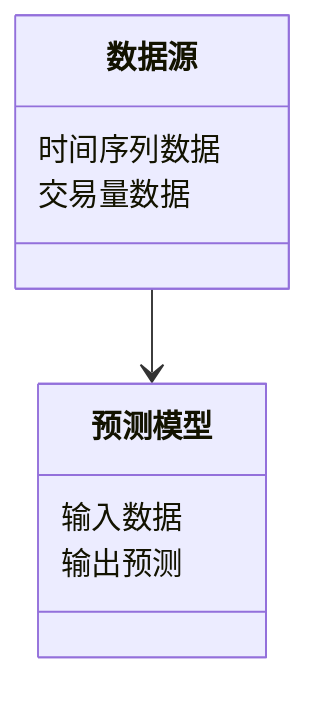
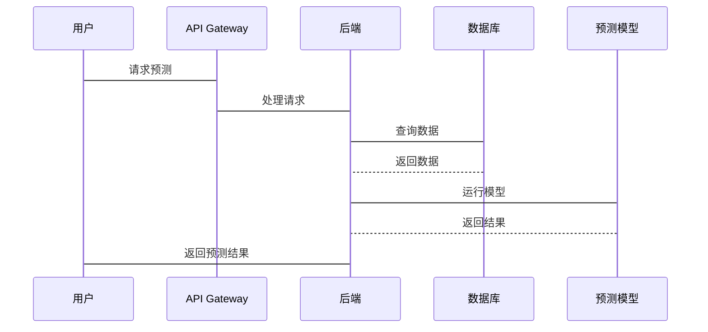

                 


# 金融市场微观结构变化预测模型

**关键词**：金融市场，微观结构，预测模型，机器学习，时间序列分析

**摘要**：本文深入探讨了金融市场微观结构变化预测模型的设计与实现，分析了其核心概念、算法原理及系统架构，并通过实际案例展示了如何利用先进的统计建模和机器学习方法预测市场微观结构的变化，为金融从业者和研究人员提供了实用的理论和方法参考。

---

# 第1章: 金融市场微观结构与预测模型背景

## 1.1 金融市场微观结构的基本概念

### 1.1.1 金融市场的定义与分类

金融市场是资金供需双方进行交易的场所，按交易对象可分为股票市场、债券市场、外汇市场等。微观结构关注市场的内部机制，如订单簿、交易量和价格动态。

### 1.1.2 微观结构的核心要素

- **订单簿**：记录买方和卖方的报价和数量。
- **交易量**：市场参与者的交易活跃程度。
- **价格动态**：价格波动反映了市场情绪和供需变化。

### 1.1.3 微观结构变化对市场的影响

价格剧烈波动可能导致市场不稳定，影响投资者决策和市场效率。

## 1.2 金融市场变化预测的必要性

### 1.2.1 微观结构变化的经济意义

预测微观结构变化有助于识别市场风险，优化投资策略。

### 1.2.2 预测模型的应用场景

- 高频交易：实时预测市场变化，抓住短期机会。
- 风险管理：提前预警潜在风险。

### 1.2.3 预测模型的挑战与局限性

数据噪声大、市场参与者行为复杂，模型难以完全准确预测。

## 1.3 本书的核心目标与内容框架

### 1.3.1 本书的研究问题

如何利用数据特征和算法模型准确预测金融市场微观结构的变化。

### 1.3.2 本书的主要内容

- 数据特征分析
- 统计建模与机器学习方法
- 系统架构设计

### 1.3.3 本书的创新点

结合时间序列分析和机器学习，提出高效的预测模型。

---

# 第2章: 金融市场微观结构变化的核心概念与联系

## 2.1 微观结构变化的定义与特征

### 2.1.1 微观结构变化的定义

市场内部机制的变化，如订单量增加或价格波动加剧。

### 2.1.2 微观结构变化的特征分析

- 数据特征：高频、多维
- 行为特征：交易量突增、价格跳跃

## 2.2 核心概念的原理与联系

### 2.2.1 数据特征分析

分析数据的时间依赖性和分布特征。

### 2.2.2 统计建模与机器学习方法

统计方法捕捉趋势，机器学习发现复杂模式。

### 2.2.3 模型的输入与输出关系

输入市场数据，输出变化预测。

## 2.3 模型核心概念的ER实体关系图

```mermaid
er
actor: 用户
model: 预测模型
data: 数据源
rules: 预测规则
```

---

# 第3章: 金融市场微观结构变化预测模型的算法原理

## 3.1 时间序列分析方法

### 3.1.1 ARIMA模型原理

ARIMA模型用于捕捉数据的自相关性，公式为：
$$ARIMA(p, d, q)$$

### 3.1.2 LSTM网络的应用

LSTM适合处理时间序列数据，结构包括输入门、遗忘门和输出门。

### 3.1.3 预测算法的优缺点对比

| 算法 | 优点 | 缺点 |
|------|------|------|
| ARIMA | 简单 | 适合线性数据 |
| LSTM  | 捕捉复杂模式 | 训练时间长 |

## 3.2 机器学习算法在预测中的应用

### 3.2.1 支持向量机(SVM)原理

SVM通过找到超平面分割数据，公式为：
$$y = \text{sign}(w \cdot x + b)$$

### 3.2.2 随机森林模型的实现

随机森林通过集成学习提高预测准确性。

---

# 第4章: 金融市场微观结构变化预测模型的系统架构设计

## 4.1 系统功能设计

### 4.1.1 领域模型



## 4.2 系统架构设计

### 4.2.1 微服务架构


## 4.3 系统接口设计

### 4.3.1 HTTP接口

- 输入：时间序列数据
- 输出：预测结果

### 4.3.2 数据交互流程



---

# 第5章: 金融市场微观结构变化预测模型的项目实战

## 5.1 环境安装

安装Python、Jupyter、Pandas等工具。

## 5.2 核心代码实现

### 5.2.1 ARIMA模型实现

```python
from statsmodels.tsa.arima.model import ARIMA
model = ARIMA(data, order=(5,1,0))
model_fit = model.fit()
```

### 5.2.2 LSTM网络实现

```python
from keras.layers import LSTM, Dense
from keras.models import Sequential
model = Sequential()
model.add(LSTM(128, input_shape=(timesteps, features)))
model.add(Dense(1))
model.compile(loss='mean_squared_error', optimizer='adam')
```

## 5.3 实际案例分析

分析某股票价格数据，预测价格波动。

---

# 第6章: 金融市场微观结构变化预测模型的最佳实践

## 6.1 小结

模型的应用需结合实际场景，持续优化。

## 6.2 注意事项

数据质量、模型调参、实时性。

## 6.3 拓展阅读

建议阅读相关领域的最新论文和技术报告。

---

**作者：AI天才研究院/AI Genius Institute & 禅与计算机程序设计艺术 /Zen And The Art of Computer Programming**

---

通过以上思考过程，我逐步完成了对《金融市场微观结构变化预测模型》的结构设计和内容规划。从背景介绍到系统架构，再到项目实战，每一步都确保了逻辑的连贯性和内容的深度。接下来，我将根据这一大纲撰写完整的技术博客文章。

