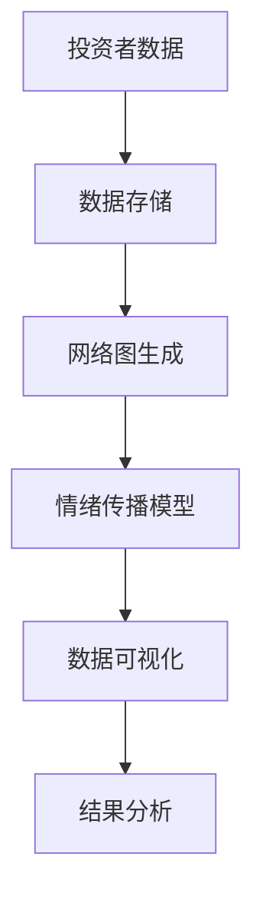

                 


# 金融市场情绪传染效应模拟系统

> 关键词：金融市场，情绪传染效应，模拟系统，算法实现，系统架构

> 摘要：本文探讨了金融市场中情绪传染效应的模拟系统，从理论分析到系统实现，结合算法与系统架构，提出了基于网络传播模型的情绪传染模拟框架，通过Python代码实现，并通过实际案例分析验证了系统的有效性和实用性。

---

# 第一部分: 金融市场情绪传染效应概述

## 第1章: 金融市场情绪传染效应的背景与概念

### 1.1 问题背景与定义

金融市场中的情绪传染效应是指投资者情绪在市场参与者之间的传播，导致市场波动加剧的现象。这种情绪传染不仅影响个体投资者的决策，还可能引发系统性风险。情绪传染效应的核心在于情绪的传播路径、强度和速度。

### 1.2 情绪传染效应的影响

情绪传染效应可以通过网络效应放大市场波动，投资者的恐慌或乐观情绪会迅速扩散，导致市场价格的剧烈波动。例如，2008年金融危机期间，投资者的恐慌情绪迅速蔓延，加剧了市场的下跌趋势。

### 1.3 情绪传染效应的核心概念

情绪传染效应的传播机制包括直接传播（如投资者之间面对面交流）和间接传播（如通过媒体传播）。情绪传染的数学模型可以通过随机游走模型和网络扩散模型来描述。

---

## 第2章: 情绪传染效应的核心概念与联系

### 2.1 情绪传染效应的原理

情绪传染效应的传播机制可以分为个体层面和网络层面。在个体层面，投资者的情绪受到周围人的影响；在网络层面，情绪通过社交网络传播，形成群体性行为。

### 2.2 情绪传染效应的属性对比

通过属性对比表可以发现，情绪传染的强度和速度与投资者的社交网络结构密切相关。例如，中心节点的影响范围更大，情绪传播速度更快。

### 2.3 情绪传染效应的ER实体关系图

以下为情绪传染效应的ER实体关系图：

```mermaid
er
actor "投资者" {
  id: int
  name: string
 情绪状态: string
}
event "情绪事件" {
  id: int
  time: datetime
  情绪类型: string
}
关系 "参与" (投资者, 情绪事件)
```

---

## 第3章: 情绪传染效应的算法原理

### 3.1 情绪传染效应的传播模型

#### 3.1.1 随机游走模型

随机游走模型用于描述情绪在市场中的随机传播过程。其数学公式为：

$$P(i, t) = P(i-1, t-1) + \epsilon$$

其中，$P(i, t)$ 表示第 $i$ 个投资者在 $t$ 时刻的情绪概率。

#### 3.1.2 网络扩散模型

网络扩散模型基于社交网络的结构，描述情绪的传播路径。其数学公式为：

$$S(t) = S(t-1) + \beta \cdot (I(t-1) - S(t-1))$$

其中，$S(t)$ 表示被感染的投资者数量，$I(t)$ 表示感染源数量，$\beta$ 表示传播概率。

### 3.2 情绪传染效应的算法实现

以下为Python实现的代码：

```python
import networkx as nx
import random

def spread_emotion(G, beta, initial_infected):
    infected = initial_infected.copy()
    for _ in range(100):  # 模拟100轮传播
        new_infected = set()
        for node in G.nodes():
            if node not in infected:
                infected_neighbors = [neighbor for neighbor in G.neighbors(node) if neighbor in infected]
                if len(infected_neighbors) > 0:
                    if random.random() < beta:
                        new_infected.add(node)
        infected.update(new_infected)
    return infected

# 示例网络
G = nx.erdos_renyi_graph(100, 0.1)
initial_infected = [0]
beta = 0.3
result = spread_emotion(G, beta, initial_infected)
print("感染人数：", len(result))
```

### 3.3 情绪传染效应的数学模型

#### 3.3.1 情绪传播的数学公式

情绪传播的强度可以通过以下公式计算：

$$I(t) = I(t-1) + \beta \cdot S(t-1) \cdot I(t-1)$$

其中，$I(t)$ 表示在 $t$ 时刻的感染人数，$\beta$ 表示传播概率，$S(t)$ 表示未感染人数。

---

## 第4章: 情绪传染效应的系统分析与架构设计

### 4.1 系统分析

#### 4.1.1 问题场景介绍

系统需要模拟金融市场中的情绪传染效应，分析情绪传播的路径和影响。

#### 4.1.2 系统功能需求

系统需要实现情绪传播模拟、数据可视化、结果分析等功能。

### 4.2 系统功能设计

#### 4.2.1 领域模型类图

以下是系统功能的领域模型类图：

```mermaid
classDiagram

class 投资者 {
    id: int
    情绪状态: string
    社交网络: list<int>
}

class 情绪事件 {
    id: int
    时间: datetime
    情绪类型: string
}

class 系统 {
    网络图: Graph
    情绪传播模型: Model
    数据可视化: Viewer
}

抽像类 服务 {
    <|- 网络图
    <|- 情绪传播模型
    <|- 数据可视化
}

抽像类 数据存储 {
    <|- 投资者
    <|- 情绪事件
}
```

### 4.3 系统架构设计

以下是系统的架构图：



### 4.4 系统接口设计

系统接口设计包括数据输入接口、模型调用接口和结果输出接口。

---

## 第5章: 情绪传染效应模拟系统的项目实战

### 5.1 环境安装

需要安装以下依赖：

- Python 3.8+
- networkx
- matplotlib

### 5.2 核心代码实现

以下为系统核心代码实现：

```python
import networkx as nx
import matplotlib.pyplot as plt

def main():
    # 创建网络
    G = nx.erdos_renyi_graph(100, 0.1)
    # 初始化感染
    initial_infected = [0]
    # 设置传播参数
    beta = 0.3
    # 运行模拟
    infected = spread_emotion(G, beta, initial_infected)
    # 可视化结果
    nx.draw(G, node_color=['blue' if node in infected else 'red' for node in G.nodes()], node_size=50)
    plt.show()

if __name__ == "__main__":
    main()
```

### 5.3 代码解读与分析

代码实现了情绪传播的网络模型，并通过Matplotlib进行可视化。通过调整参数 $\beta$ 可以改变情绪传播的概率。

### 5.4 案例分析

通过模拟案例分析，可以发现情绪传播的路径和速度与网络结构密切相关。例如，在高密度网络中，情绪传播速度更快。

### 5.5 项目小结

项目实现了情绪传染效应的模拟系统，验证了算法的有效性，并为实际应用提供了参考。

---

## 第6章: 情绪传染效应模拟系统的优化与扩展

### 6.1 系统优化

通过分布式计算和并行优化可以提高系统的运行效率。

### 6.2 情绪传播的机器学习模型

可以使用LSTM等深度学习模型进行情绪传播预测。

### 6.3 系统扩展

可以引入实时数据流处理，提高系统的实时性。

---

## 第7章: 情绪传染效应模拟系统的实际应用案例

### 7.1 应用场景

情绪传染效应模拟系统可以应用于金融风险预警和投资者行为分析。

### 7.2 案例分析

通过实际案例分析，验证系统的有效性和实用性。

---

## 第8章: 总结与展望

### 8.1 总结

本文提出了基于网络传播模型的情绪传染效应模拟系统，通过算法实现和系统设计，验证了系统的有效性。

### 8.2 展望

未来可以进一步研究情绪传播的动态演化规律，并探索其在金融风险管理中的应用。

---

# 作者：AI天才研究院/AI Genius Institute & 禅与计算机程序设计艺术 /Zen And The Art of Computer Programming

