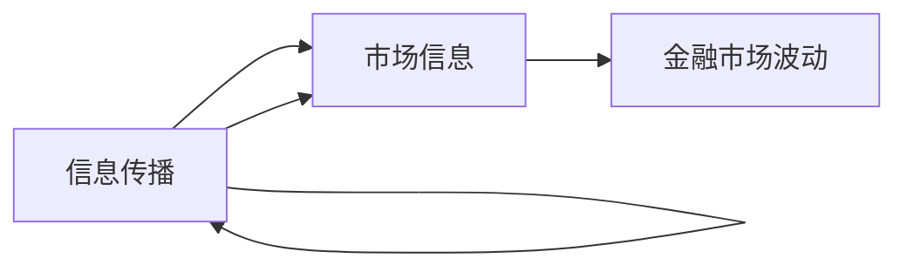
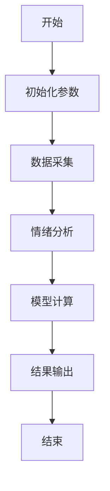
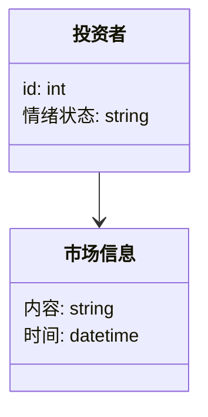
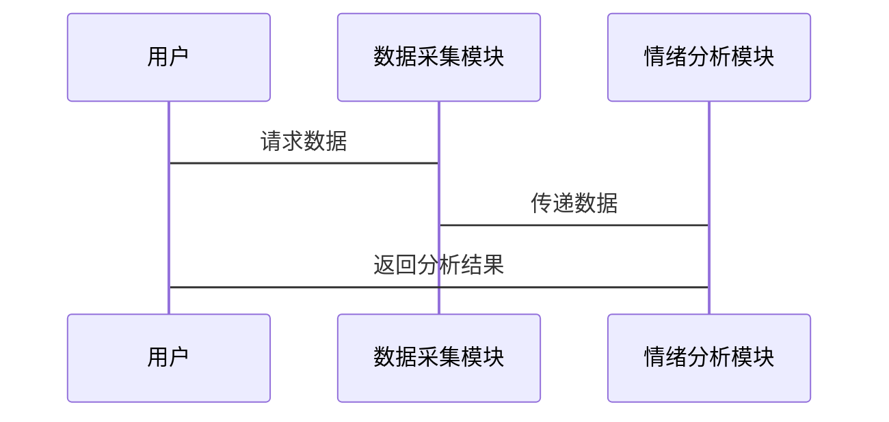

                 


# 金融市场情绪传染模型仿真平台

## 关键词：
金融市场，情绪传染模型，仿真平台，投资者行为，网络扩散模型，系统架构，Python实现

## 摘要：
本文系统地介绍了金融市场情绪传染模型的构建与仿真平台的设计，结合理论与实践，详细讲解了情绪传染模型的数学基础、算法实现、系统架构及项目实战，为理解金融市场波动提供新的视角和工具。

---

# 第一部分: 金融市场情绪传染模型概述

## 第1章: 金融市场情绪传染模型的背景与概念

### 1.1 问题背景与问题描述
#### 1.1.1 金融市场波动的复杂性
金融市场波动受多种因素影响，包括经济指标、政策变化、投资者情绪等。投资者情绪作为非理性因素，对市场波动有显著影响。

#### 1.1.2 投资者情绪对市场的影响
投资者情绪具有传染性，个体情绪会通过信息传播影响更大群体，进而影响整体市场走势。

#### 1.1.3 情绪传染的定义与特征
情绪传染是指投资者情绪通过信息传播在网络中扩散，导致市场波动加剧的过程。

### 1.2 情绪传染模型的核心要素
#### 1.2.1 投资者行为分析
投资者行为受情绪驱动，情绪可分为乐观、悲观、中性等状态。

#### 1.2.2 市场信息传播机制
信息通过社交网络、媒体等渠道传播，影响投资者情绪。

#### 1.2.3 情绪传染的边界与外延
情绪传染有时间和空间边界，受市场参与者的社交网络结构影响。

### 1.3 金融市场情绪传染模型的构建目标
#### 1.3.1 模型的理论意义
揭示情绪传染机制，理解市场波动的内在规律。

#### 1.3.2 模型的实践应用
帮助投资者和监管机构预测和应对市场波动。

---

## 第2章: 情绪传染模型的核心概念与联系

### 2.1 情绪传染模型的原理
#### 2.1.1 情绪传染的基本原理
情绪通过人际传播或网络扩散，影响更大范围的投资者。

#### 2.1.2 情绪传染的网络结构
网络结构影响情绪传播的速度和范围，社交网络密度高的市场情绪更容易扩散。

#### 2.1.3 情绪传染的动力学特征
情绪传播具有非线性特征，存在临界点和突变现象。

### 2.2 情绪传染模型的属性特征对比
| 模型名称 | 基础假设 | 优点 | 缺点 |
|----------|----------|------|------|
| 马尔可夫模型 | 状态转移依赖历史 | 简单高效 | 忽略空间因素 |
| 网络扩散模型 | 网络结构影响传播 | 考虑空间因素 | 实施复杂 |

### 2.3 情绪传染模型的ER实体关系图


---

## 第3章: 情绪传染模型的算法原理

### 3.1 情绪传染模型的数学模型
#### 3.1.1 情绪传播的概率模型
$$P(i, t+1) = \alpha P(i, t) + (1-\alpha) \sum_{j} P(j, t)$$

#### 3.1.2 情绪传播的网络模型
$$S(t+1) = A \cdot S(t) + B \cdot X(t)$$

### 3.2 情绪传染模型的算法流程


### 3.3 情绪传染模型的Python实现
#### 3.3.1 环境安装
```bash
pip install numpy matplotlib networkx
```

#### 3.3.2 核心代码实现
```python
import numpy as np
import networkx as nx

def情绪传播算法(参数):
    # 算法实现
    pass

# 示例代码
G = nx.erdos_renyi_graph(n, p)
```

---

## 第4章: 金融市场情绪传染模型的系统分析与架构设计

### 4.1 问题场景介绍
市场参与者情绪波动对整体市场的影响，如何通过仿真平台进行模拟。

### 4.2 项目介绍
仿真平台的功能模块包括数据采集、情绪分析、模型仿真等。

### 4.3 系统功能设计
#### 4.3.1 领域模型


#### 4.3.2 系统架构


### 4.4 系统接口设计
#### 4.4.1 数据接口
数据采集模块通过API接口获取实时市场数据。

#### 4.4.2 用户界面
图形化界面展示情绪传播过程和结果。

### 4.5 系统交互


---

## 第5章: 项目实战

### 5.1 环境安装
```bash
pip install numpy pandas matplotlib networkx
```

### 5.2 核心代码实现
```python
def 情绪传播算法(参数):
    # 算法实现
    pass

# 示例代码
G = nx.erdos_renyi_graph(n, p)
nx.draw(G, node_size=500, alpha=0.8)
plt.show()
```

### 5.3 案例分析与解读
以某次金融危机为例，分析情绪传播对市场波动的影响。

### 5.4 项目小结
通过实战项目，验证了模型的有效性和仿真平台的实用性。

---

## 第6章: 最佳实践、小结、注意事项、拓展阅读

### 6.1 最佳实践
建议在数据采集和模型优化方面进行改进。

### 6.2 小结
总结全文，强调情绪传染模型在金融市场研究中的重要性。

### 6.3 注意事项
提醒读者注意数据质量和模型适用性问题。

### 6.4 拓展阅读
推荐相关领域的书籍和论文，供读者深入学习。

---

## 作者：AI天才研究院/AI Genius Institute & 禅与计算机程序设计艺术 /Zen And The Art of Computer Programming

---

以上是《金融市场情绪传染模型仿真平台》的技术博客文章目录大纲。

