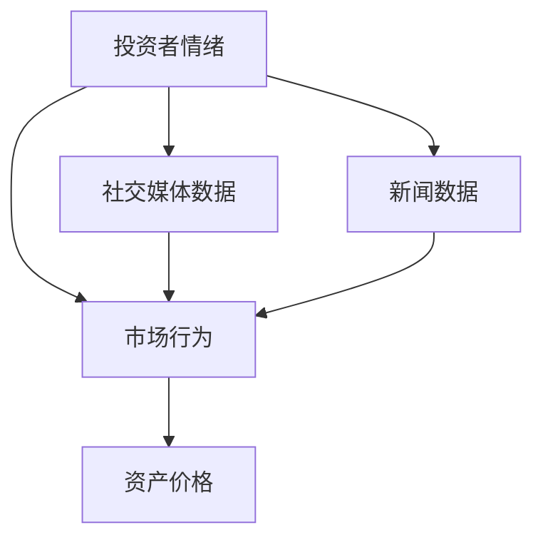
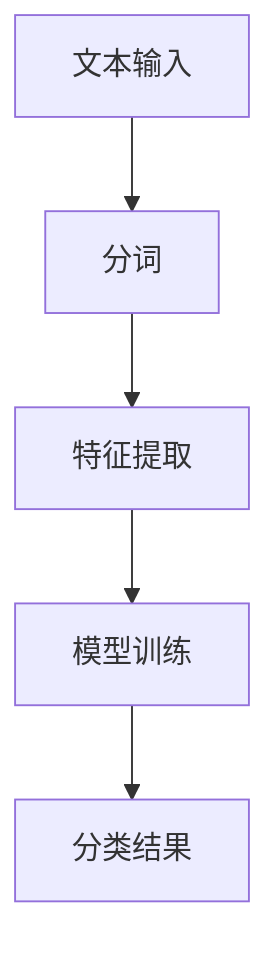
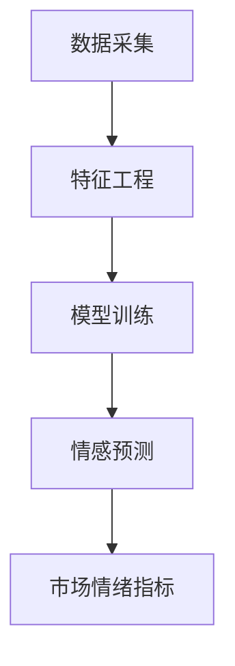
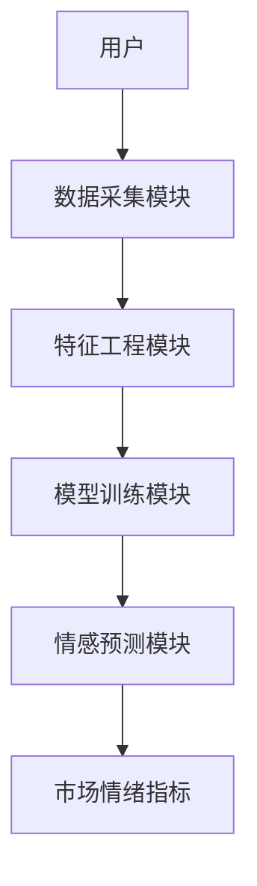

                 


# 金融市场情绪分析与预测

> 关键词：金融市场情绪分析，自然语言处理，机器学习，深度学习，情感分类，量化交易

> 摘要：本文深入探讨了金融市场情绪分析与预测的方法与技术。首先，我们介绍了金融市场情绪分析的基本概念、背景及其在投资决策中的重要性。接着，详细分析了金融市场情绪分析的核心概念与技术基础，包括情感极性分析、情感强度分析和情感主题分析等。随后，我们从算法原理的角度，探讨了基于机器学习和深度学习的情感分类方法，并通过数学公式和流程图展示了这些算法的工作原理。此外，我们还设计了金融市场情绪分析的系统架构，并通过具体案例展示了如何利用社交媒体数据进行情绪分析与预测。最后，我们总结了全文，并展望了未来的研究方向。

---

## 第1章: 金融市场情绪分析的背景与意义

### 1.1 金融市场情绪分析的定义

金融市场情绪分析是一种利用自然语言处理（NLP）和机器学习技术，从新闻、社交媒体、论坛等文本数据中提取市场参与者的心理状态和情感倾向的方法。这些情感信息可以用来预测市场走势、评估风险并辅助投资决策。

#### 1.1.1 情绪分析的基本概念

情绪分析是对文本数据中情感倾向的识别与量化。在金融市场中，情绪分析关注的是投资者、交易者和市场参与者的情绪状态，例如乐观、悲观、恐慌等。

#### 1.1.2 金融市场中的情绪分析

金融市场情绪分析通过分析新闻标题、社交媒体帖子、公司财报电话会议等内容，捕捉市场参与者的心理状态，进而预测资产价格波动、市场趋势和风险事件。

#### 1.1.3 情绪分析的分类与应用场景

情绪分析可以分为情感极性分析（判断情感是正面、负面还是中性）和情感强度分析（量化情感的程度）。其应用场景包括量化交易、风险管理、市场研究和投资决策支持。

---

### 1.2 金融市场情绪分析的重要性

#### 1.2.1 情绪分析在投资决策中的作用

市场情绪是影响资产价格的重要因素。通过分析市场情绪，投资者可以更好地理解市场的波动性，并制定相应的交易策略。

#### 1.2.2 情绪分析对市场风险控制的意义

情绪分析可以帮助识别市场中的非理性波动，从而为风险控制提供依据。例如，在市场恐慌时期，情绪分析可以帮助投资者提前识别潜在的崩盘风险。

#### 1.2.3 情绪分析在量化交易中的应用

量化交易依赖于对市场数据的实时分析。情绪分析可以为量化交易模型提供额外的输入信号，例如社交媒体上的市场情绪数据，从而提高交易策略的有效性。

---

### 1.3 金融市场情绪分析的技术基础

#### 1.3.1 自然语言处理（NLP）与文本挖掘

NLP技术用于从文本数据中提取有意义的信息。文本挖掘则通过统计方法进一步分析这些信息，以发现潜在的模式和趋势。

#### 1.3.2 统计学习与机器学习

统计学习方法（如朴素贝叶斯）和机器学习方法（如支持向量机、随机森林）是情感分类的常用技术。这些方法可以帮助模型从文本数据中学习情感特征。

#### 1.3.3 情感计算与数据挖掘

情感计算关注于从文本数据中提取情感信息。数据挖掘技术则用于从大量数据中发现隐藏的模式和关系。

---

## 第2章: 金融市场情绪分析的核心概念与联系

### 2.1 情绪分析的核心概念

#### 2.1.1 情感极性分析

情感极性分析是判断文本的情感倾向是正面、负面还是中性。在金融市场中，这种分析可以帮助投资者了解市场参与者的情绪状态。

#### 2.1.2 情感强度分析

情感强度分析是对情感程度的量化，例如从“非常乐观”到“极度悲观”。这种分析可以为投资决策提供更精细的信号。

#### 2.1.3 情感主题分析

情感主题分析关注于情感发生的具体主题或事件。例如，分析市场参与者对某家公司的乐观情绪是否与该公司新产品发布有关。

---

### 2.2 情感分析与金融市场的关系

#### 2.2.1 市场情绪与资产价格的关系

市场情绪可以通过影响投资者的行为间接影响资产价格。例如，乐观的市场情绪可能导致资产价格上涨，而悲观的市场情绪可能导致资产价格下跌。

#### 2.2.2 情感传播与市场波动

情绪可以通过社交媒体、新闻媒体等渠道迅速传播，从而引发市场波动。情绪传播的速度和强度可以作为市场风险的预警信号。

#### 2.2.3 情感预测与交易策略

通过预测市场情绪的变化，投资者可以制定更具前瞻性的交易策略。例如，在市场情绪过度乐观时，投资者可以考虑卖出资产以规避风险。

---

### 2.3 情感分析的关键技术与方法

#### 2.3.1 基于规则的文本分析

基于规则的文本分析通过预定义的规则来识别情感信息。例如，使用情感词典来判断文本中的关键词是否具有正面或负面情感。

#### 2.3.2 基于统计的文本分析

基于统计的文本分析方法（如朴素贝叶斯）通过统计文本中的情感词汇出现的频率来分类情感。

#### 2.3.3 基于深度学习的文本分析

深度学习方法（如LSTM）可以自动学习文本中的情感特征，从而实现更准确的情感分类。

---

### 2.4 情感分析的实体关系图



---

### 2.5 本章小结

#### 2.5.1 核心概念总结

市场情绪是影响资产价格的重要因素，情感分析可以通过文本数据捕捉市场参与者的心理状态。

#### 2.5.2 关键技术对比

基于规则的分析方法简单但不够灵活；基于统计的分析方法鲁棒性强但依赖于特征工程；基于深度学习的分析方法自动学习能力强但需要大量数据。

#### 2.5.3 实体关系图的意义

实体关系图展示了市场情绪与资产价格之间的关系，以及情绪数据的来源。

---

## 第3章: 金融市场情绪分析的算法原理

### 3.1 情感分析的文本预处理

#### 3.1.1 文本清洗与分词

文本清洗包括去除停用词、标点符号等。分词是将文本分割成单词或短语的过程。

#### 3.1.2 停用词处理与词干提取

停用词处理可以减少文本中的冗余信息。词干提取可以将不同形式的单词统一为词干，例如“trading”和“trader”可以统一为“trad”。

#### 3.1.3 词袋模型与词嵌入

词袋模型将文本表示为单词的集合，而词嵌入（如Word2Vec）则将单词映射到低维向量空间。

---

### 3.2 基于机器学习的情感分类

#### 3.2.1 支持向量机（SVM）模型

SVM通过寻找最优超平面将数据分为不同类别。在情感分类中，SVM可以用于区分正面和负面情感。

#### 3.2.2 随机森林（Random Forest）模型

随机森林是一种基于决策树的集成学习方法，具有较强的鲁棒性和抗过拟合能力。

#### 3.2.3 线性回归模型

线性回归模型可以用于情感强度分析，通过回归系数来预测情感强度。

---

### 3.3 基于深度学习的情感分类

#### 3.3.1 卷积神经网络（CNN）

CNN通过卷积操作提取文本中的局部特征，适用于短文本的情感分类。

#### 3.3.2 循环神经网络（RNN）

RNN适用于长文本的情感分类，可以捕捉文本中的时序信息。

#### 3.3.3 变量长度的序列处理（LSTM）

LSTM通过门控机制解决RNN的梯度消失问题，适用于处理长序列文本。

---

### 3.4 情感分析的算法流程图



---

### 3.5 本章小结

#### 3.5.1 算法原理总结

不同算法适用于不同类型的文本数据和情感分析任务。深度学习方法在情感分类中表现优于传统机器学习方法。

#### 3.5.2 深度学习的优势

深度学习方法可以自动学习文本中的情感特征，减少特征工程的工作量。

#### 3.5.3 算法选择的注意事项

算法选择需要考虑数据规模、文本长度和任务类型等因素。

---

## 第4章: 金融市场情绪分析的数学模型与公式

### 4.1 文本表示的向量空间模型

#### 4.1.1 词袋模型

词袋模型将文本表示为单词的集合，可以用向量表示为：

$$
\text{文本向量} = \sum_{i=1}^{n} w_i \cdot v_i
$$

其中，\( w_i \) 是第 \( i \) 个单词的权重，\( v_i \) 是第 \( i \) 个单词的词向量。

---

### 4.2 情感分类的数学模型

#### 4.2.1 逻辑回归模型

逻辑回归模型用于情感二分类问题，其概率函数为：

$$
P(y=1|x) = \frac{e^{\beta x}}{1 + e^{\beta x}}
$$

其中，\( \beta \) 是模型参数，\( x \) 是输入特征向量。

---

### 4.3 时间序列模型

时间序列模型（如ARIMA）可以用于预测市场情绪的时间变化趋势。其一般形式为：

$$
y_t = \alpha + \beta y_{t-1} + \epsilon_t
$$

其中，\( y_t \) 是第 \( t \) 时刻的市场情绪指标，\( \epsilon_t \) 是随机误差项。

---

### 4.4 本章小结

#### 4.4.1 文本表示方法

词袋模型和词嵌入模型是常用的文本表示方法，各有优缺点。

#### 4.4.2 情感分类模型

逻辑回归和深度学习模型是情感分类的常用方法，适用于不同场景。

#### 4.4.3 时间序列模型

时间序列模型可以用于预测市场情绪的变化趋势。

---

## 第5章: 金融市场情绪分析的系统架构设计

### 5.1 系统功能设计

#### 5.1.1 数据采集模块

数据采集模块负责从社交媒体、新闻媒体等来源获取文本数据。

#### 5.1.2 特征工程模块

特征工程模块对文本数据进行清洗、分词和特征提取。

#### 5.1.3 模型训练模块

模型训练模块使用训练数据对情感分类模型进行训练和优化。

#### 5.1.4 情感预测模块

情感预测模块对实时文本数据进行情感分类，生成市场情绪指标。

---

### 5.2 系统架构设计



---

### 5.3 系统接口设计

系统接口包括数据输入接口、模型训练接口和结果输出接口。

---

### 5.4 系统交互设计



---

## 第6章: 金融市场情绪分析的项目实战

### 6.1 环境安装

需要安装Python、TensorFlow、Keras等工具。

### 6.2 核心实现代码

```python
import pandas as pd
from sklearn.model

