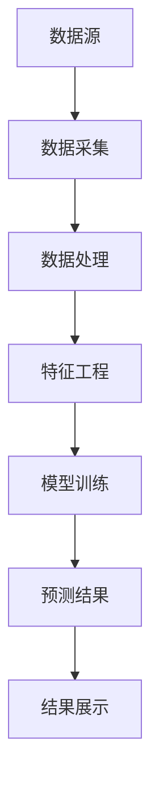
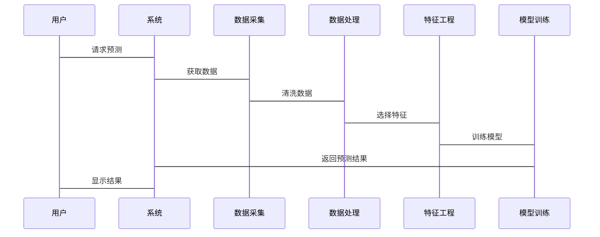

                 


# 金融市场流动性供给预测模型

## 关键词：金融市场流动性、预测模型、机器学习、时间序列分析、系统设计

## 摘要：本文构建了一个基于机器学习的时间序列预测模型，用于金融市场流动性供给的预测。通过分析市场行为数据，模型能够有效预测流动性供给，帮助投资者和监管机构做出明智决策。文章详细介绍了模型的构建过程，包括数据预处理、特征工程、算法选择、系统设计和项目实战。

---

# 第一部分: 金融市场流动性供给预测模型概述

## 第1章: 金融市场流动性供给预测模型的背景与意义

### 1.1 金融市场流动性概述

#### 1.1.1 金融市场的基本概念
金融市场是资金流动和资产交易的场所，参与者包括个人、机构和政府。流动性指资产转化为现金的能力，是金融市场的核心要素。

#### 1.1.2 流动性供给的定义与作用
流动性供给是市场参与者提供的资金，用于支持交易和资产转换。充足流动性供给确保市场稳定，防止资金短缺引发的市场波动。

#### 1.1.3 流动性供给预测的重要性
准确预测流动性供给有助于投资者优化资产配置，监管机构维护市场稳定。预测模型能捕捉市场趋势，提前应对潜在风险。

### 1.2 问题背景与描述

#### 1.2.1 金融市场波动的挑战
市场波动性高，受多种因素影响，如经济指标、政策变化和突发事件。预测模型需具备高精度和适应性。

#### 1.2.2 流动性供给预测的必要性
流动性供给直接关系到市场的深度和效率。准确预测有助于机构合理配置资金，降低流动性风险。

#### 1.2.3 问题解决的思路与方法
采用机器学习算法，结合时间序列分析，构建预测模型。通过历史数据训练模型，预测未来流动性供给。

### 1.3 核心概念与边界

#### 1.3.1 核心概念的结构与组成
流动性供给模型涉及市场参与者、资金流动、交易行为等因素。模型需整合这些因素，分析其相互作用。

#### 1.3.2 涉及的主要变量与参数
关键变量包括市场成交量、波动率、资金流入/流出、宏观经济指标等。参数如模型权重、超参数需调整优化。

#### 1.3.3 模型的边界与适用范围
模型适用于短期流动性预测，长周期预测准确性较低。适用于稳定市场环境，极端情况需另行处理。

### 1.4 本章小结
本章介绍了金融市场流动性的重要性，阐述了流动性供给预测的必要性，明确了模型构建的核心概念和边界条件。

---

# 第二部分: 金融市场流动性供给预测的理论基础

## 第2章: 金融学基础与流动性分析

### 2.1 金融市场中的流动性需求与供给

#### 2.1.1 流动性需求的来源
市场参与者为交易、 hedging 或投资目的需要资金。机构和个人投资者根据需求决定资金投入。

#### 2.1.2 流动性供给的主要渠道
- **银行贷款**：金融机构向企业提供贷款。
- **债券发行**：政府和企业发行债券融资。
- **股票发行**：企业通过IPO或增发筹集资金。

#### 2.1.3 市场参与者的角色分析
- **买方**：资金需求方，如企业和投资者。
- **卖方**：资金供给方，如银行和机构投资者。

### 2.2 时间序列分析基础

#### 2.2.1 时间序列的基本特征
时间序列数据具有趋势性、周期性、随机性。分析这些特征有助于识别数据模式。

#### 2.2.2 常见的时间序列模型
- **ARIMA**：自回归积分滑动平均模型，适用于线性时间序列预测。
- **GARCH**：广义自回归条件异方差模型，用于预测波动性。

#### 2.2.3 金融数据的特性与挑战
金融数据高度波动，存在异方差性和厚尾现象。非线性关系复杂，传统模型效果有限。

### 2.3 机器学习在流动性预测中的应用

#### 2.3.1 机器学习的基本概念
机器学习通过数据训练模型，识别模式和关系。适用于复杂非线性问题。

#### 2.3.2 常见的机器学习算法
- **线性回归**：适用于线性关系预测。
- **支持向量机（SVM）**：处理非线性分类和回归问题。
- **随机森林与梯度提升树**：集成方法，提高预测准确性。

#### 2.3.3 机器学习在金融中的优势
- **高精度**：复杂算法捕捉市场细微变化。
- **实时性**：快速处理数据，支持实时决策。
- **适应性**：自动调整模型，适应市场变化。

### 2.4 本章小结
本章介绍了金融市场的流动性需求与供给，分析了时间序列模型，并探讨了机器学习在流动性预测中的应用优势。

---

# 第三部分: 流动性供给预测模型的构建

## 第3章: 数据预处理与特征工程

### 3.1 数据收集与清洗

#### 3.1.1 数据来源与收集方法
数据来源包括金融数据供应商（如 Bloomberg、Reuters）和政府统计机构。需确保数据的准确性和完整性。

#### 3.1.2 数据清洗的步骤与技巧
- **缺失值处理**：删除或插值处理。
- **异常值处理**：识别并修正异常数据。
- **重复数据处理**：删除重复记录。

#### 3.1.3 数据标准化与归一化
标准化（Z-score）和归一化（Min-Max）处理，确保不同特征具有可比性。

### 3.2 特征选择与工程

#### 3.2.1 常见的特征类型
- **市场指标**：成交量、波动率、市场情绪指数。
- **宏观经济指标**：GDP、利率、通货膨胀率。
- **技术指标**：移动平均线、相对强弱指数（RSI）。

#### 3.2.2 特征选择的方法与策略
- **基于统计的方法**：如卡方检验、相关系数分析。
- **基于模型的方法**：如Lasso回归、随机森林特征重要性。

#### 3.2.3 特征工程的实践案例
构造复合特征，如市场情绪与成交量的乘积，增强模型表现。

### 3.3 数据集划分与验证

#### 3.3.1 训练集、验证集与测试集的划分
- 训练集用于模型训练。
- 验证集用于参数调优。
- 测试集用于最终评估。

#### 3.3.2 交叉验证的方法
K折交叉验证，确保模型泛化能力。

#### 3.3.3 数据集的平衡性处理
处理类别不平衡问题，如过采样或欠采样技术。

### 3.4 本章小结
本章详细介绍了数据预处理和特征工程的方法，确保数据质量和特征的有效性。

---

## 第4章: 算法选择与模型构建

### 4.1 常见的预测算法

#### 4.1.1 线性回归模型
线性回归通过最小二乘法拟合直线，适用于线性关系。公式：$y = \beta_0 + \beta_1 x + \epsilon$。

#### 4.1.2 支持向量机（SVM）
SVM通过构建超平面分割数据，适用于高维数据分类。数学公式：$\text{min} \frac{1}{2} ||\beta||^2 + C \sum_{i=1}^n \xi_i$，约束条件：$y_i (βx_i + β_0) \geq 1 - \xi_i$，$\xi_i \geq 0$。

#### 4.1.3 随机森林与梯度提升树
随机森林通过集成决策树提高准确性和鲁棒性。梯度提升树通过逐层优化，提高模型性能。

### 4.2 基于机器学习的流动性预测模型

#### 4.2.1 模型的选择与优化
选择随机森林和梯度提升树作为候选模型，通过交叉验证选择最佳模型。

#### 4.2.2 模型的训练与调参
调整模型超参数，如学习率、树的深度，优化模型性能。

#### 4.2.3 模型评估与比较
使用均方误差（MSE）、R²系数等指标评估模型性能，比较不同算法的效果。

### 4.3 本章小结
本章分析了常用预测算法，构建了基于机器学习的流动性预测模型，并进行了模型优化和评估。

---

## 第5章: 系统设计与实现

### 5.1 系统架构设计

#### 5.1.1 系统功能模块
- 数据采集模块：获取金融市场数据。
- 数据处理模块：预处理和特征工程。
- 模型训练模块：训练预测模型。
- 结果展示模块：可视化预测结果。

#### 5.1.2 系统架构图


### 5.2 系统功能设计

#### 5.2.1 领域模型（类图）


### 5.3 系统交互设计

#### 5.3.1 系统交互流程图


### 5.4 本章小结
本章设计了系统的架构和功能模块，展示了各模块的交互关系。

---

## 第6章: 项目实战

### 6.1 环境安装

#### 6.1.1 安装Python环境
使用Anaconda安装Python 3.8及以上版本。

#### 6.1.2 安装必要的库
安装Pandas、NumPy、Scikit-learn、XGBoost等库：
```bash
pip install pandas numpy scikit-learn xgboost
```

### 6.2 核心代码实现

#### 6.2.1 数据预处理代码
```python
import pandas as pd
import numpy as np

# 读取数据
data = pd.read_csv('market_data.csv')

# 处理缺失值
data = data.dropna()

# 标准化处理
from sklearn.preprocessing import StandardScaler
scaler = StandardScaler()
data_scaled = scaler.fit_transform(data)
```

#### 6.2.2 模型训练代码
```python
from sklearn.ensemble import RandomForestRegressor
from sklearn.metrics import mean_squared_error

# 划分数据集
X = data_scaled[:-100]
y = data[' liquidity'][:-100]

# 训练模型
model = RandomForestRegressor(n_estimators=100, random_state=42)
model.fit(X, y)

# 预测
predicted = model.predict(data_scaled[-100:])
actual = data[' liquidity'][-100:]

# 评估
 mse = mean_squared_error(predicted, actual)
 print(f'MSE: {mse}')
```

### 6.3 案例分析

#### 6.3.1 数据来源与特征选择
使用股票市场数据，选择成交量、波动率和宏观经济指标作为特征。

#### 6.3.2 模型训练与预测
训练模型后，预测未来100天的流动性供给，并与实际数据对比，评估模型性能。

### 6.4 本章小结
本章通过具体案例展示了模型的实现过程，验证了模型的有效性。

---

## 第7章: 总结与展望

### 7.1 总结

#### 7.1.1 核心内容回顾
本文构建了一个基于机器学习的流动性供给预测模型，详细介绍了模型的构建过程和应用。

#### 7.1.2 模型的优势
- 高精度：机器学习算法捕捉复杂关系。
- 实时性：支持实时数据处理。
- 可扩展性：适用于不同市场和资产。

### 7.2 展望

#### 7.2.1 模型优化
引入更多数据源，如新闻情绪分析、社交媒体数据，提高预测准确性。

#### 7.2.2 新兴技术应用
探索深度学习技术，如LSTM，处理时间序列数据的长期依赖关系。

#### 7.2.3 应用场景扩展
将模型应用于更多金融领域，如风险管理、投资组合优化。

### 7.3 本章小结
本文总结了流动性供给预测模型的核心内容，并展望了未来的研究方向。

---

# 作者：AI天才研究院（AI Genius Institute） & 禅与计算机程序设计艺术（Zen And The Art of Computer Programming）

