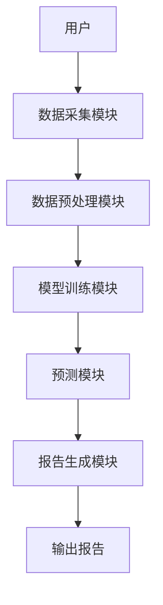
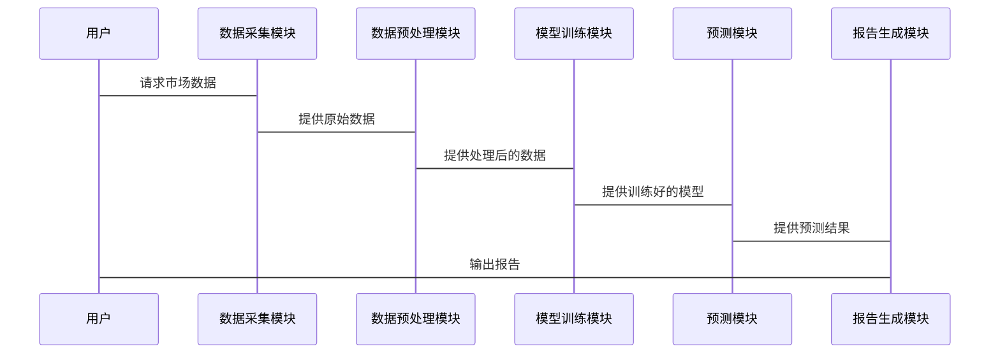

                 


```markdown
# 金融市场流动性分析工具

> 关键词：金融市场流动性，分析工具，算法原理，系统架构，项目实战

> 摘要：金融市场流动性分析是金融学中的核心问题之一。本文将详细探讨流动性分析工具的设计与实现，涵盖从基础概念到高级算法的应用，结合实际案例分析，帮助读者全面理解如何利用技术手段分析金融市场流动性。

---

# 第一部分: 金融市场流动性分析工具概述

## 第1章: 金融市场流动性分析概述

### 1.1 金融市场的基本概念

#### 1.1.1 金融市场的定义与分类
金融市场的定义是资金流动的场所，分为货币市场、资本市场、外汇市场等。流动性是衡量市场活跃程度的重要指标。

#### 1.1.2 流动性的定义与重要性
流动性指资产快速转化为现金的能力。高流动性意味着交易容易进行，价格波动小，对市场稳定至关重要。

#### 1.1.3 分析工具的必要性
传统的图表分析和手动计算效率低，现代技术如大数据和AI提升了分析效率和精度。

### 1.2 流动性分析工具的技术背景

#### 1.2.1 数据来源与预处理
- 数据来源包括K线数据、订单簿数据和市场参与者行为数据。
- 预处理步骤包括数据清洗、标准化和特征提取。

#### 1.2.2 数据分析技术
- 使用时间序列分析、统计建模和机器学习模型。
- 大数据技术处理海量数据，提升分析效率。

#### 1.2.3 可视化工具
- 使用Matplotlib、Plotly等工具进行数据可视化。
- 生成实时图表，帮助用户直观理解市场流动性。

## 第2章: 流动性分析的核心概念与联系

### 2.1 流动性分析的核心原理

#### 2.1.1 市场深度分析
- 市场深度指在特定价格下可交易的资产数量。
- 深度高的市场流动性好，价格稳定。

#### 2.1.2 市场广度分析
- 市场广度指在不同价格下的可交易数量。
- 广度广的市场能承受更大的交易量而不影响价格。

#### 2.1.3 流动性缺口分析
- 识别市场中的流动性不足点，提前预警风险。

### 2.2 流动性分析的核心概念对比

#### 2.2.1 流动性与市场深度
- 深度影响流动性的稳定性。
- 深度高，流动性好。

#### 2.2.2 流动性与市场广度
- 广度决定流动性的可持续性。
- 广度大，流动性持续稳定。

#### 2.2.3 流动性与波动性
- 波动性高的市场流动性差，交易风险大。

### 2.3 ER实体关系图
```mermaid
er
    actor 流动性分析者
    actor 数据源
    actor 分析工具
    actor 输出结果
    database 市场数据
    database 分析结果
    relationship 流动性分析者 -> 数据源: 提供数据
    relationship 数据源 -> 市场数据: 存储数据
    relationship 分析工具 -> 市场数据: 加工数据
    relationship 分析工具 -> 分析结果: 输出结果
    relationship 流动性分析者 -> 分析结果: 使用结果
```

---

# 第二部分: 流动性分析的算法原理

## 第3章: 流动性分析的算法原理

### 3.1 常用的流动性分析指标

#### 3.1.1 市场深度指标
- 包括订单簿中的买价和卖价之间的价差、买卖订单的数量等。

#### 3.1.2 成交量与波动性
- 成交量大的资产流动性好，波动性小。

#### 3.1.3 市场参与者行为分析
- 通过分析参与者的行为模式，预测流动性变化。

### 3.2 流动性预测模型

#### 3.2.1 时间序列预测模型
- 使用ARIMA模型进行预测。
- ARIMA模型的数学表达式为：ARIMA(p, d, q)。

#### 3.2.2 机器学习模型
- 使用随机森林和XGBoost进行分类和回归分析。
- 示例代码：
```python
import pandas as pd
from sklearn.ensemble import RandomForestRegressor
model = RandomForestRegressor(n_estimators=100)
model.fit(X_train, y_train)
```

#### 3.2.3 异常检测
- 使用Isolation Forest算法识别市场流动性异常。
- 示例代码：
```python
from sklearn.ensemble import IsolationForest
model = IsolationForest(n_estimators=100, random_state=42)
model.fit(X)
```

### 3.3 流动性风险评估模型

#### 3.3.1 风险评估指标
- 包括VaR（在险价值）和CVaR（条件在险价值）。

#### 3.3.2 模型实现
- 使用蒙特卡洛模拟评估流动性风险。
- 示例代码：
```python
import numpy as np
def monte_carlo_simulation(n_samples=1000):
    np.random.seed(42)
    samples = np.random.normal(0, 1, n_samples)
    return samples
```

---

# 第三部分: 系统架构设计

## 第4章: 流动性分析系统架构

### 4.1 问题场景描述

#### 4.1.1 数据获取与处理
- 使用API获取实时市场数据。
- 数据清洗和特征提取。

#### 4.1.2 分析与预测
- 应用机器学习模型进行流动性预测。
- 结果可视化和报告生成。

### 4.2 系统功能设计

#### 4.2.1 系统功能模块
- 数据采集模块、分析模块、预测模块和报告生成模块。

#### 4.2.2 功能流程
1. 数据采集：获取市场数据。
2. 数据预处理：清洗和转换。
3. 模型训练：训练流动性预测模型。
4. 预测与报告：生成预测结果和分析报告。

### 4.3 系统架构设计

#### 4.3.1 系统架构图


#### 4.3.2 关键接口设计
- 数据接口：提供市场数据API。
- 模型接口：定义模型输入和输出格式。

### 4.4 系统交互设计

#### 4.4.1 交互流程


---

# 第四部分: 项目实战

## 第5章: 流动性分析工具开发与应用

### 5.1 项目环境搭建

#### 5.1.1 安装依赖
- 使用Anaconda安装所需库：`pip install pandas numpy scikit-learn matplotlib`

#### 5.1.2 开发工具
- 使用Jupyter Notebook进行开发和测试。

### 5.2 核心代码实现

#### 5.2.1 数据预处理代码
```python
import pandas as pd
def preprocess_data(data):
    data['datetime'] = pd.to_datetime(data['datetime'])
    data.set_index('datetime', inplace=True)
    return data
```

#### 5.2.2 流动性预测模型代码
```python
from sklearn.ensemble import RandomForestRegressor
def train_model(X_train, y_train):
    model = RandomForestRegressor(n_estimators=100, random_state=42)
    model.fit(X_train, y_train)
    return model
```

### 5.3 实际案例分析

#### 5.3.1 案例背景
- 选取某股票的历史交易数据进行分析。

#### 5.3.2 数据分析与预测
- 使用训练好的模型预测未来一周的流动性情况。

#### 5.3.3 结果解读
- 预测结果展示，分析模型的准确性和适用性。

### 5.4 项目小结

#### 5.4.1 开发总结
- 系统设计的合理性和可扩展性。
- 数据预处理和模型选择的关键作用。

#### 5.4.2 实际应用中的注意事项
- 数据质量和实时性对分析结果的影响。
- 模型的维护和更新频率。

---

# 第五部分: 最佳实践与未来展望

## 第6章: 最佳实践与未来展望

### 6.1 最佳实践

#### 6.1.1 数据选择与处理
- 确保数据的完整性和准确性。
- 定期更新数据源和预处理方法。

#### 6.1.2 模型优化
- 使用超参数调优和交叉验证提升模型性能。
- 结合多种算法进行集成学习。

#### 6.1.3 可视化与报告
- 使用图表清晰展示分析结果。
- 提供详细的报告解读，帮助用户做出决策。

### 6.2 未来展望

#### 6.2.1 新技术的应用
- 引入区块链技术提升数据安全性和交易透明度。
- 利用AI技术实现更精准的流动性预测。

#### 6.2.2 市场发展的影响
- 金融市场的全球化和数字化发展。
- 新兴市场的流动性分析需求增长。

---

# 结语

金融市场流动性分析是一个复杂而重要的领域。通过技术手段如大数据和人工智能，我们可以更高效地分析市场流动性，为投资者和监管机构提供有力支持。未来，随着技术的进步，流动性分析工具将更加智能化和精准化。

---

作者：AI天才研究院/AI Genius Institute & 禅与计算机程序设计艺术 /Zen And The Art of Computer Programming
```

