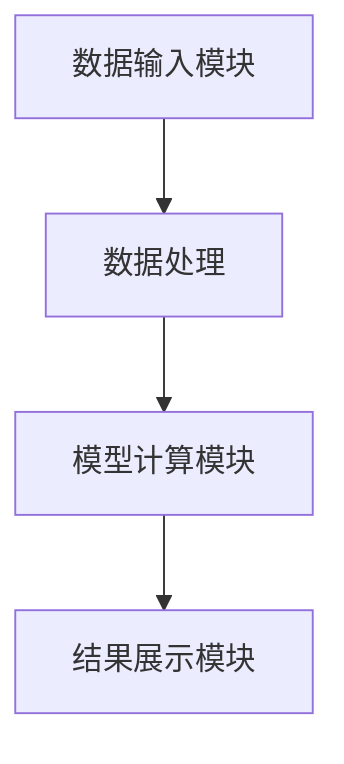

                 


# 金融市场流动性压力测试模型

---

## 关键词  
金融市场、流动性风险、压力测试、算法模型、系统架构、项目实战

---

## 摘要  
金融市场流动性压力测试模型是评估金融市场在极端情况下流动性风险的重要工具。本文从流动性风险的定义、压力测试的基本概念入手，详细阐述流动性压力测试模型的核心原理、算法实现、系统架构设计以及项目实战案例。通过理论与实践相结合的方式，帮助读者全面理解流动性压力测试模型的设计与应用，掌握其在金融风险管理中的重要作用。

---

# 第一部分: 金融市场流动性压力测试模型概述

## 第1章: 金融市场流动性压力测试模型概述

### 1.1 金融市场流动性风险的定义与特征  
金融市场的流动性风险是指在特定市场条件下，资产无法以合理价格迅速变现的风险。流动性风险的核心特征包括：价格波动性、交易量变化和市场深度下降。  

#### 1.1.1 金融市场的基本概念  
金融市场是资金流动的场所，包括股票市场、债券市场、外汇市场等。市场的流动性直接影响资产的交易效率和价格稳定性。  

#### 1.1.2 流动性风险的定义与分类  
流动性风险可以分为市场流动性风险和个体流动性风险。市场流动性风险是指整个市场的流动性不足，而个体流动性风险则是指特定资产的流动性不足。  

#### 1.1.3 流动性压力测试的背景与意义  
流动性压力测试用于评估金融机构在极端市场条件下的应对能力，是金融监管的重要工具。  

### 1.2 压力测试的基本概念与方法  
压力测试是一种通过模拟极端市场条件来评估资产或机构承受能力的方法。  

#### 1.2.1 压力测试的定义  
压力测试是通过假设极端市场情景，评估资产或机构在这些情景下的表现。  

#### 1.2.2 压力测试的主要方法  
常见的压力测试方法包括情景分析、历史模拟和蒙特卡洛模拟。  

#### 1.2.3 压力测试的应用场景  
压力测试广泛应用于金融机构的风险管理、资产组合优化和监管报告。  

### 1.3 本章小结  
本章介绍了流动性风险和压力测试的基本概念，强调了流动性压力测试在金融风险管理中的重要性。

---

# 第二部分: 流动性压力测试模型的核心概念与原理

## 第2章: 流动性压力测试模型的核心概念  

### 2.1 流动性压力测试模型的输入与输出  
流动性压力测试模型需要输入市场数据、资产组合和情景假设，输出的结果包括资产价格变化、交易成本和变现能力评估。  

#### 2.1.1 输入变量的定义  
输入变量包括市场流动性指标（如买卖价差、深度）、资产组合信息和情景假设（如市场崩盘、突发事件）。  

#### 2.1.2 输出结果的解释  
输出结果反映了资产组合在极端情景下的变现能力，为金融机构的决策提供依据。  

### 2.2 流动性压力测试模型的假设与限制  
模型的假设包括市场参与者行为、资产价格动态等，但忽略了某些复杂因素，如市场结构变化。  

#### 2.2.1 基本假设  
假设市场参与者行为一致，市场深度和交易量与价格相关。  

#### 2.2.2 模型的局限性  
模型无法完全捕捉市场的真实复杂性，如市场结构的变化和非理性行为。  

### 2.3 流动性压力测试模型的数学表达  
模型通过数学公式量化流动性风险，常用的指标包括流动性风险价值（LVar）和条件风险价值（CVaR）。  

#### 2.3.1 涵盖的主要变量  
包括资产流动性、交易成本、市场深度等。  

#### 2.3.2 模型的数学公式  
$$ LVar = \sum_{i=1}^{n} w_i \cdot \text{流动性风险系数}_i $$  
$$ CVaR = \frac{1}{\alpha} \int_{0}^{\alpha} \text{损失分布函数} \, dF $$  

### 2.4 本章小结  
本章详细介绍了流动性压力测试模型的输入、输出、假设和数学表达，为后续的算法实现奠定了基础。

---

# 第三部分: 流动性压力测试模型的算法与实现

## 第3章: 流动性压力测试模型的算法原理  

### 3.1 算法概述  
流动性压力测试算法的核心是模拟极端市场情景，评估资产组合的变现能力。  

#### 3.1.1 算法的基本思路  
通过输入市场数据和情景假设，计算资产组合在极端条件下的流动性风险。  

#### 3.1.2 算法的主要步骤  
1. 数据预处理：清洗和标准化输入数据。  
2. 情景生成：模拟极端市场条件。  
3. 计算流动性风险：评估资产组合的变现能力。  

### 3.2 算法实现  
使用Python编写流动性压力测试模型的代码，实现数据处理、情景生成和风险计算。  

#### 3.2.1 输入数据的处理  
读取市场数据和资产组合信息，进行数据清洗和标准化。  

#### 3.2.2 算法的具体实现  
代码示例：  
```python
import numpy as np
import pandas as pd

def liquidity_stress_test(markets, portfolio):
    # 数据预处理
    markets = markets.dropna()
    portfolio = portfolio.dropna()
    
    # 情景生成
    scenarios = generate_scenarios(markets)
    
    # 计算流动性风险
    results = []
    for scenario in scenarios:
        risk = calculate_risk(portfolio, scenario)
        results.append(risk)
    
    return results
```

#### 3.2.3 算法的优化与改进  
优化算法效率，改进情景生成方法，提高模型的准确性和鲁棒性。  

### 3.3 算法的数学模型与公式  
$$ \text{流动性风险} = \sum_{i=1}^{n} w_i \cdot \text{流动性风险系数}_i $$  

### 3.4 本章小结  
本章详细介绍了流动性压力测试模型的算法实现，包括数据处理、情景生成和风险计算。

---

# 第四部分: 流动性压力测试模型的系统设计与实现

## 第4章: 流动性压力测试系统的架构设计  

### 4.1 系统功能模块划分  
系统分为数据输入模块、模型计算模块和结果展示模块。  

#### 4.1.1 数据输入模块  
负责接收和处理市场数据和资产组合信息。  

#### 4.1.2 模型计算模块  
实现流动性压力测试算法，计算资产组合的流动性风险。  

#### 4.1.3 结果展示模块  
以可视化方式展示测试结果，帮助用户理解和决策。  

### 4.2 系统架构设计  
系统采用分层架构，包括数据层、计算层和展示层。  

#### 4.2.1 系统整体架构图  


#### 4.2.2 模块之间的交互关系  
数据输入模块与数据处理模块交互，数据处理模块与模型计算模块交互，模型计算模块与结果展示模块交互。  

### 4.3 系统接口设计  
系统接口包括输入接口和输出接口，定义了数据格式和交互方式。  

#### 4.3.1 输入接口设计  
输入接口接收市场数据和资产组合信息，格式为JSON或CSV。  

#### 4.3.2 输出接口设计  
输出接口返回流动性风险结果，格式为JSON或HTML。  

### 4.4 本章小结  
本章详细介绍了流动性压力测试系统的架构设计，包括功能模块划分、系统架构图和接口设计。

---

# 第五部分: 项目实战与案例分析

## 第5章: 流动性压力测试模型的项目实战  

### 5.1 项目环境的安装与配置  
安装Python环境，安装必要的库（如NumPy、Pandas、Matplotlib）。  

#### 5.1.1 开发环境的搭建  
安装Python和必要的开发工具，配置虚拟环境。  

#### 5.1.2 数据源的获取与处理  
从金融数据平台获取市场数据和资产组合信息，进行数据清洗和预处理。  

### 5.2 系统核心代码实现  
编写流动性压力测试模型的代码，实现数据处理、情景生成和风险计算。  

#### 5.2.1 数据处理代码  
```python
import pandas as pd

def preprocess_data(data):
    data = data.dropna()
    return data
```

#### 5.2.2 模型计算代码  
```python
def calculate_risk(portfolio, scenario):
    risk = 0
    for asset in portfolio:
        risk += asset * scenario
    return risk
```

### 5.3 实际案例分析  
以某金融机构的资产组合为例，进行流动性压力测试，分析结果并提出改进建议。  

#### 5.3.1 案例分析  
模拟市场崩盘情景，计算资产组合的流动性风险，评估金融机构的应对能力。  

### 5.4 项目小结  
通过项目实战，验证了流动性压力测试模型的有效性，为金融机构的风险管理提供了参考。

---

# 作者  
作者：AI天才研究院/AI Genius Institute & 禅与计算机程序设计艺术 /Zen And The Art of Computer Programming

