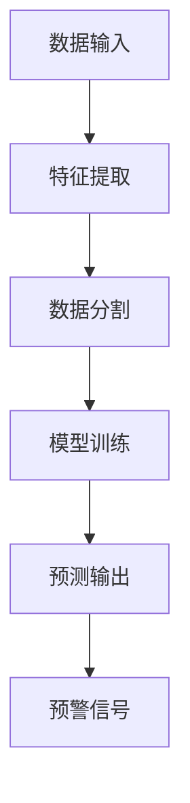
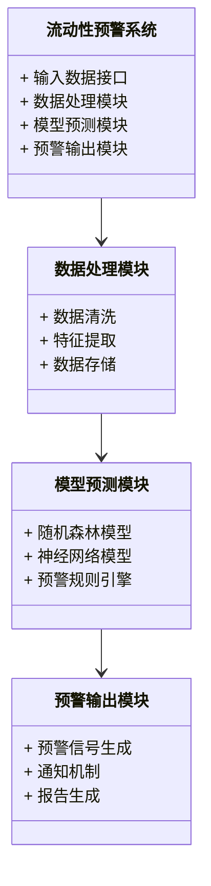

                 


# 金融市场流动性枯竭预警模型

> 关键词：金融市场流动性、流动性风险、预警模型、机器学习、金融风险管理、金融数据分析

> 摘要：金融市场流动性枯竭是金融风险管理中的一个重要问题。本文从流动性风险的定义和表现入手，详细阐述了流动性枯竭预警模型的构建方法，包括数据收集、特征工程、模型设计、算法实现以及系统架构设计。通过随机森林和神经网络等机器学习算法，结合实际案例分析，本文提出了一个高效的流动性枯竭预警模型，并对模型的应用和优化进行了深入探讨。

---

# 第一部分: 金融市场流动性枯竭预警模型背景与概念

## 第1章: 金融市场流动性概述

### 1.1 金融市场的基本概念
#### 1.1.1 金融市场的定义与分类
金融市场是资金流动和金融资产交易的场所，可以分为货币市场、资本市场、外汇市场和衍生品市场等。流动性是金融市场的重要特征之一，指资产能够迅速转化为现金而不遭受损失的能力。

#### 1.1.2 流动性风险的定义与特征
流动性风险是指在特定市场条件下，资产难以以合理价格快速变现的风险。其主要特征包括：市场深度不足、市场波动性增加、交易对手减少等。

#### 1.1.3 流动性风险的影响
流动性风险可能导致市场价格剧烈波动，增加金融机构的损失，甚至引发系统性金融危机。因此，建立有效的流动性枯竭预警模型至关重要。

---

## 第2章: 流动性枯竭预警模型的核心概念与联系

### 2.1 核心概念原理
#### 2.1.1 流动性风险的多维度分析
流动性风险可以从市场深度、交易活跃度、资产价格波动性等多个维度进行分析。这些维度相互关联，共同影响市场的流动性状况。

#### 2.1.2 预警模型的输入输出关系
预警模型的输入包括市场数据、交易数据和宏观经济指标等，输出是流动性枯竭的预警信号。模型通过分析输入数据的变化，预测流动性风险的发生概率。

#### 2.1.3 模型的数学表达与逻辑框架
流动性枯竭预警模型可以通过逻辑回归、随机森林等算法进行构建。模型的逻辑框架如下：
1. 数据预处理与特征提取
2. 模型训练与参数优化
3. 预警信号的生成与输出

---

### 2.2 核心概念属性特征对比
#### 2.2.1 流动性与市场深度的关系
市场深度越大，流动性越好。市场深度可以通过成交量、订单簿深度等指标来衡量。

#### 2.2.2 流动性与市场波动性的对比
高波动性通常伴随着低流动性，因为市场参与者在价格剧烈波动时更倾向于观望。

#### 2.2.3 流动性与交易成本的关联
流动性不足会增加交易成本，因为买卖价差可能扩大，且订单执行时间可能延长。

---

### 2.3 ER实体关系图
以下是一个简单的ER实体关系图，展示了流动性枯竭预警模型的核心要素：

```mermaid
erd
    左右排列
    entity 交易主体 {
        key 用户ID
        属性 交易金额, 交易时间, 资产类别
    }
    entity 交易标的 {
        key 标的ID
        属性 标的价格, 市场深度, 波动率
    }
    entity 流动性指标 {
        key 时间戳
        属性 市场深度, 买卖价差, 成交量
    }
    entity 预警信号 {
        key 信号ID
        属性 预警级别, 预警时间, 预警原因
    }
    关系 交易主体 --> 交易标的 (持有关系)
    关系 交易标的 --> 流动性指标 (指标关系)
    关系 流动性指标 --> 预警信号 (预警触发)
```

---

# 第二部分: 流动性枯竭预警模型的算法实现

## 第3章: 数据收集与特征工程

### 3.1 数据来源与预处理
#### 3.1.1 市场数据的收集渠道
市场数据可以从交易所、数据供应商（如 Bloomberg、Wind）和社交媒体等渠道获取。

#### 3.1.2 数据清洗与标准化
数据清洗包括处理缺失值、异常值和重复值。标准化通常涉及归一化和正则化处理，以确保不同特征之间的可比性。

#### 3.1.3 数据特征的提取与选择
特征提取可以从原始数据中提取有用的特征，如开盘价、收盘价、最高价、最低价、成交量等。特征选择可以通过相关性分析和主成分分析（PCA）进行。

---

## 第4章: 流动性枯竭预警模型的算法原理

### 4.1 基于机器学习的预警算法
#### 4.1.1 随机森林模型的原理
随机森林是一种基于树的集成学习方法，通过构建多个决策树并进行投票或加权平均来提高模型的准确性和稳定性。其优点包括高精度、强抗过拟合能力和良好的特征重要性分析能力。

#### 4.1.2 支持向量机（SVM）的应用
SVM是一种监督学习算法，主要用于分类和回归问题。其核心思想是通过构建一个超平面，将数据点分为两类。在流动性预警中，SVM可以用于分类市场状态。

#### 4.1.3 神经网络模型的构建
神经网络是一种模仿人脑结构的深度学习算法，具有强大的非线性拟合能力。在流动性预警中，神经网络可以用于捕捉复杂的市场模式和非线性关系。

---

### 4.2 算法流程图
以下是随机森林模型的算法流程图：



---

### 4.3 算法实现的数学模型
#### 4.3.1 随机森林模型的数学表达
随机森林模型通过构建多个决策树并进行集成，最终的预测结果是各个决策树预测结果的加权平均或投票结果。其数学表达如下：

$$
\hat{y} = \frac{1}{n} \sum_{i=1}^{n} T_i(x)
$$

其中，$T_i(x)$ 表示第 $i$ 棵决策树的预测结果，$n$ 是决策树的数量。

#### 4.3.2 神经网络模型的数学公式
神经网络模型的输入层、隐藏层和输出层通过权重矩阵和激活函数进行连接。其数学公式如下：

$$
a^{(l+1)} = \sigma(w^{(l)} a^{(l)} + b^{(l)})
$$

其中，$a^{(l)}$ 是第 $l$ 层的激活值，$w^{(l)}$ 是权重矩阵，$b^{(l)}$ 是偏置项，$\sigma$ 是激活函数（如ReLU或sigmoid）。

---

## 第5章: 系统架构设计

### 5.1 问题场景介绍
流动性枯竭预警系统需要实时监测市场数据，分析市场风险，并及时发出预警信号。系统需要具备高可用性、实时性和可扩展性。

### 5.2 系统功能设计
以下是系统的功能模块设计：



---

## 第6章: 项目实战

### 6.1 环境安装
以下是项目所需的环境和工具：

- Python 3.8+
- Jupyter Notebook
- Pandas、NumPy、Scikit-learn、TensorFlow

### 6.2 核心实现代码
以下是随机森林模型的核心实现代码：

```python
import pandas as pd
from sklearn.ensemble import RandomForestClassifier
from sklearn.metrics import accuracy_score

# 数据加载
data = pd.read_csv('market_data.csv')

# 特征与标签分离
X = data.drop('label', axis=1)
y = data['label']

# 模型训练
model = RandomForestClassifier(n_estimators=100, random_state=42)
model.fit(X, y)

# 模型预测
y_pred = model.predict(X)

# 模型评估
print("Accuracy:", accuracy_score(y, y_pred))
```

---

## 第7章: 总结与展望

### 7.1 项目小结
本文详细介绍了流动性枯竭预警模型的构建过程，包括数据收集、特征工程、模型设计和系统架构设计。通过随机森林和神经网络等算法，本文提出了一个高效的流动性预警系统。

### 7.2 注意事项
- 数据质量对模型性能有重要影响，需注意数据清洗和特征选择。
- 模型的可解释性可能较低，需结合业务知识进行解释。
- 系统的实时性和稳定性需要进一步优化。

### 7.3 拓展阅读
- 《金融风险管理》
- 《机器学习实战》
- 《深度学习》

---

作者：AI天才研究院/AI Genius Institute & 禅与计算机程序设计艺术 /Zen And The Art of Computer Programming

