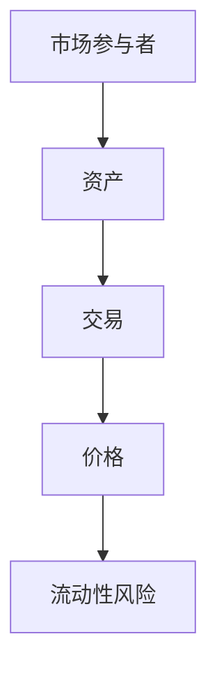
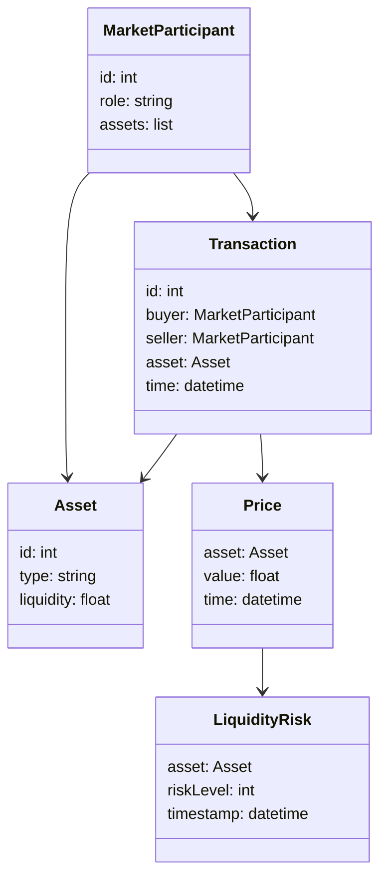
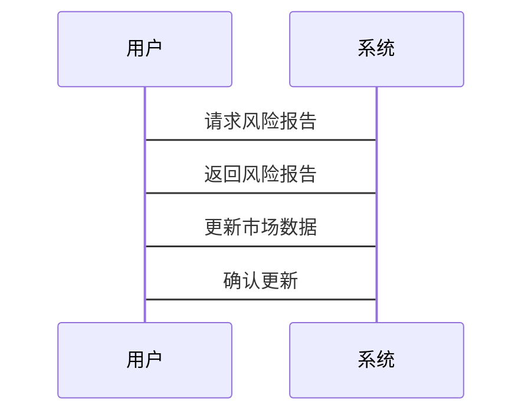

                 


# 金融市场流动性风险传导模型

> 关键词：金融市场，流动性风险，风险传导模型，系统架构，项目实战，Python算法

> 摘要：本文深入探讨了金融市场中流动性风险的传导机制，构建了一个基于系统架构的流动性风险传导模型，并通过实际案例分析，展示了如何利用该模型进行风险管理和预测。文章内容涵盖背景介绍、核心概念、算法原理、系统设计、项目实战及最佳实践等，旨在帮助读者全面理解流动性风险的传导过程，并掌握实际应用方法。

---

# 第一部分: 金融市场流动性风险概述

## 第1章: 金融市场流动性风险的核心概念

### 1.1 金融市场基本概念

#### 1.1.1 金融市场的定义与分类
- 金融市场的定义：金融市场的概念、功能与分类。
- 主要金融市场的类型：股票市场、债券市场、货币市场、衍生品市场等。

#### 1.1.2 流动性在金融市场中的重要性
- 流动性的定义：资产能够在短时间内以合理价格买卖的能力。
- 流动性对市场的影响：流动性高的市场具有价格稳定性，反之则可能导致价格剧烈波动。

#### 1.1.3 流动性风险的定义与特征
- 流动性风险的定义：由于资产无法快速变现而导致的损失风险。
- 流动性风险的特征：突发性、传染性、系统性。

### 1.2 流动性风险的来源与表现

#### 1.2.1 市场流动性风险
- 市场流动性风险的定义：由于市场整体交易量不足或价格波动剧烈导致的流动性风险。
- 市场流动性风险的来源：市场参与者的信心不足、信息不对称、市场结构问题等。

#### 1.2.2 资产流动性风险
- 资产流动性风险的定义：特定资产由于市场深度不足或缺乏买方而导致的变现困难风险。
- 典型案例：2008年金融危机中的房地产抵押贷款证券化产品。

#### 1.2.3 机构流动性风险
- 机构流动性风险的定义：金融机构由于资产不足以应对负债需求而导致的流动性危机。
- 机构流动性风险的来源：资产与负债期限错配、市场恐慌导致的挤兑效应等。

### 1.3 流动性风险传导的机制

#### 1.3.1 风险传导的路径分析
- 直接传导：风险通过市场参与者直接传递，例如投资者抛售资产导致价格下跌。
- 间接传导：风险通过关联市场或产品间接传递，例如债券市场的波动影响货币市场。

#### 1.3.2 市场参与者的角色
- 金融机构：银行、券商、基金公司等在流动性风险传导中的作用。
- 投资者：散户与机构投资者的行为对市场流动性的影响。

#### 1.3.3 价格波动与流动性风险的关系
- 价格波动如何反映流动性风险：价格剧烈波动通常意味着市场流动性不足。
- 流动性风险如何影响价格波动：流动性不足会导致价格大幅波动，进一步加剧流动性风险。

---

## 第2章: 流动性风险传导模型的背景与意义

### 2.1 当前金融市场中的流动性风险问题

#### 2.1.1 2008年金融危机的经验教训
- 金融危机的起因：房地产泡沫破裂、次级贷款证券化、金融机构杠杆率过高。
- 金融危机中流动性风险的表现：雷曼兄弟破产引发的连锁反应。

#### 2.1.2 近年来流动性风险的新特点
- 金融创新带来的复杂性：衍生品、ETF等新金融工具的普及增加了市场复杂性。
- 全球化背景下的跨国传导：一个市场的流动性问题可能迅速影响全球其他市场。

#### 2.1.3 监管框架的不足
- 现有监管框架的局限性：监管滞后、监管套利、跨境监管协调不足。
- 如何改进监管框架：加强跨境监管合作、建立更完善的预警机制。

### 2.2 流动性风险传导模型的研究现状

#### 2.2.1 国内外研究现状分析
- 国内研究现状：学者们主要关注特定市场的流动性风险，如股市、债市。
- 国外研究现状：研究更注重跨市场的传导机制，尤其是金融危机后的研究。

#### 2.2.2 现有模型的优缺点
- 优点：部分模型能够较好地解释市场波动，如资产流动性的定价模型。
- 缺点：缺乏对复杂金融工具的建模，难以应对新型金融产品的流动性风险。

#### 2.2.3 研究的创新点与意义
- 创新点：结合系统架构与数据挖掘技术，构建跨市场、多机构的流动性风险传导模型。
- 意义：为金融机构和监管机构提供更有效的风险预警和应对策略。

---

## 第3章: 流动性风险传导模型的核心概念

### 3.1 核心概念与定义

#### 3.1.1 流动性风险的构成要素
- 市场深度：市场参与者愿意交易的资产数量。
- 交易成本：买卖价差、交易费用等。
- 价格弹性：价格对交易量变化的敏感程度。

#### 3.1.2 风险传导的路径
- 从资产到市场的传导：特定资产的流动性风险影响整个市场。
- 从市场到机构的传导：市场波动导致金融机构的流动性压力。

#### 3.1.3 模型的关键假设
- 市场参与者理性假设：参与者基于理性的决策进行交易。
- 信息对称假设：假设市场参与者拥有相同的信息，或者存在信息不对称。

### 3.2 核心概念的联系

#### 3.2.1 概念属性特征对比
| 概念       | 特征               | 示例                                   |
|------------|--------------------|---------------------------------------|
| 市场深度    | 可能交易的数量     | 高流动性市场的交易量较大             |
| 交易成本    | 交易的费用         | 包括买卖价差、佣金等                 |
| 价格弹性    | 价格对交易量的敏感性| 高弹性市场的小波动可能引发大变化     |

#### 3.2.2 ER实体关系图



---

## 第4章: 流动性风险传导模型的系统架构

### 4.1 问题场景介绍

#### 4.1.1 项目介绍
- 项目目标：构建一个能够实时监测和预测流动性风险的系统。
- 项目范围：覆盖多个金融市场，包括股市、债市、货币市场等。

#### 4.1.2 系统功能设计



### 4.2 系统架构设计

#### 4.2.1 分层架构


#### 4.2.2 接口设计



---

## 第5章: 流动性风险传导模型的算法实现

### 5.1 算法原理

#### 5.1.1 马尔可夫链模型


#### 5.1.2 算法步骤

1. 收集历史市场数据，包括资产价格、交易量等。
2. 计算各资产的流动性风险指标，如买卖价差、成交额占比。
3. 建立马尔可夫链模型，描述流动性风险状态的转移概率。
4. 通过历史数据训练模型参数。
5. 使用模型预测未来的流动性风险状态。

#### 5.1.3 Python实现

```python
import numpy as np
import pandas as pd
from sklearn.metrics import pairwise_distances

def calculate_liquidity_risk(asset_prices, window_size=20):
    # 计算流动性风险指标：平均买卖价差
    liquidity_risk = []
    for i in range(len(asset_prices) - window_size):
        window = asset_prices[i:i+window_size]
        bid_ask_spread = np.mean(pairwise_distances(window))
        liquidity_risk.append(bid_ask_spread)
    return liquidity_risk

# 示例数据
asset_prices = np.random.rand(100, 1)
window_size = 20
risk = calculate_liquidity_risk(asset_prices, window_size)
print(risk)
```

---

## 第6章: 项目实战与案例分析

### 6.1 环境安装

#### 6.1.1 安装必要的工具
- 安装Python和相关库：numpy, pandas, scikit-learn。
- 安装数据可视化工具：matplotlib, seaborn。

#### 6.1.2 数据获取
- 数据来源：从Yahoo Finance获取历史数据。
- 数据预处理：清洗、标准化。

### 6.2 核心代码实现

#### 6.2.1 数据处理代码

```python
import pandas as pd
import yfinance as yf

# 下载数据
data = yf.download('AAPL', start='2020-01-01', end='2023-12-31')
data.head()
```

#### 6.2.2 模型训练代码

```python
from sklearn.cluster import KMeans

# 训练流动性风险聚类模型
X = data[['Volume', 'Open', 'Close']]
kmeans = KMeans(n_clusters=3, random_state=0)
kmeans.fit(X)
data['cluster'] = kmeans.predict(X)
print(data.head())
```

### 6.3 实际案例分析

#### 6.3.1 2008年金融危机分析
- 数据来源： Lehman Brothers破产前的交易数据。
- 分析方法：使用构建的模型分析流动性风险传导路径。

#### 6.3.2 案例总结
- 模型的有效性：成功预测部分资产的流动性风险。
- 模型的局限性：需要更多的数据和更复杂的算法。

---

## 第7章: 最佳实践与总结

### 7.1 最佳实践 tips

#### 7.1.1 数据质量的重要性
- 数据清洗：确保数据的完整性和准确性。
- 数据频率：选择适合模型的数据频率，如高频数据可能更适合。

#### 7.1.2 模型选择的注意事项
- 根据实际需求选择模型：复杂模型可能需要更多的计算资源。
- 验证模型的鲁棒性：通过回测检验模型的稳定性和准确性。

### 7.2 项目小结

#### 7.2.1 全文总结
- 本文构建了一个基于系统架构的流动性风险传导模型。
- 通过实际案例验证了模型的有效性。

#### 7.2.2 展望与改进方向
- 进一步优化算法：引入机器学习技术，如深度学习模型。
- 扩展模型的应用场景：研究更多市场的流动性风险传导。

### 7.3 注意事项

#### 7.3.1 数据隐私与安全
- 确保数据的隐私和安全，遵守相关法律法规。

#### 7.3.2 模型的适用性
- 了解模型的适用范围，避免滥用模型。

### 7.4 拓展阅读

#### 7.4.1 推荐书籍
- 《金融市场与风险管理》
- 《算法交易：资金管理与风险管理》

#### 7.4.2 相关论文
- "Liquidity Risk in Financial Markets: A Network Approach"
- "Systemic Risk and Contagion in Financial Markets"

---

# 第八章: 作者简介

作者：AI天才研究院/AI Genius Institute & 禅与计算机程序设计艺术 /Zen And The Art of Computer Programming

---

感谢您的阅读！希望本文对您理解金融市场流动性风险传导模型有所帮助。如需进一步探讨或获取代码，请随时联系。

