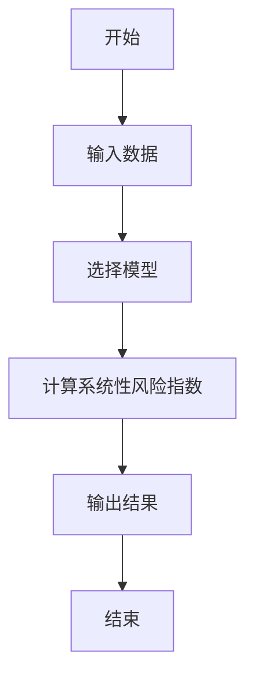

                 


# 金融市场系统性风险传导模型

> 关键词：系统性风险，金融风险，风险传导模型，金融市场，风险管理

> 摘要：本文深入探讨金融市场中的系统性风险，分析其传导机制，并提出一种系统性风险传导模型。通过该模型，我们能够更好地理解系统性风险的来源、传播路径及其对金融体系的影响。文章从背景介绍、核心概念、算法原理、系统架构、项目实战等多个维度展开，结合数学模型、算法流程图和实际案例，为金融风险管理提供理论支持和实践指导。

---

## 第一部分: 金融市场系统性风险传导模型概述

### 第1章: 系统性风险的基本概念与背景

#### 1.1 系统性风险的定义与特征

- **1.1.1 系统性风险的定义**
  系统性风险是指由于金融体系中的系统性因素（如经济周期、政策变化、市场波动等）导致整个金融体系发生系统性崩盘的风险。这种风险不同于个体风险，它影响的是整个金融体系，而非单一机构或资产。

- **1.1.2 系统性风险的核心特征**
  - 全局性：影响整个金融体系，而非单一机构或资产。
  - 不可控性：难以通过传统风险管理手段完全消除。
  - 传染性：风险可能从一个市场或机构迅速传导至整个金融体系。

- **1.1.3 系统性风险的边界与外延**
  系统性风险的边界包括金融市场、金融机构、宏观经济等多个层面，其外延涉及政策风险、流动性风险、信用风险等多个维度。

#### 1.2 金融市场中的系统性风险

- **1.2.1 金融市场的基本构成**
  金融市场由投资者、金融机构、金融工具和监管机构构成，这些要素相互关联，共同构成了金融系统的复杂网络。

- **1.2.2 系统性风险的来源与传播机制**
  系统性风险的主要来源包括：
  - 市场波动：如股市崩盘、债券违约等。
  - 金融机构的杠杆效应：过高杠杆可能导致连锁反应。
  - 政策不确定性：如货币政策收紧、监管政策变化等。
  - 外部冲击：如全球经济衰退、地缘政治冲突等。

- **1.2.3 系统性风险对金融体系的影响**
  系统性风险可能导致金融市场的流动性枯竭、金融机构破产、投资者信心下降，进而引发系统性金融危机。

#### 1.3 系统性风险传导模型的研究意义

- **1.3.1 系统性风险研究的重要性**
  系统性风险是金融体系的核心风险，其研究对金融稳定具有重要意义。

- **1.3.2 系统性风险传导模型的现实意义**
  通过模型可以识别系统性风险的来源和传播路径，为金融监管提供依据。

- **1.3.3 模型在金融监管中的应用价值**
  模型可以帮助监管机构制定有效的风险管理政策，防范系统性金融危机的发生。

---

## 第二部分: 系统性风险传导模型的核心概念

### 第2章: 系统性风险传导模型的核心概念

#### 2.1 系统性风险传导模型的构成要素

- **2.1.1 风险源的定义与分类**
  风险源包括市场风险、信用风险、流动性风险等。系统性风险传导模型需要识别这些风险源，并分析它们之间的相互作用。

- **2.1.2 风险传导路径的分析**
  风险传导路径包括直接传导和间接传导。直接传导是指风险从风险源直接传导到整个金融体系；间接传导是指风险通过中介机构或市场参与者传导至整个体系。

- **2.1.3 风险影响的评估指标**
  风险影响的评估指标包括系统性风险指数（SRI）、系统性风险贡献（SRC）、系统性风险敞口（SRE）等。

#### 2.2 系统性风险传导模型的属性特征对比

- **2.2.1 不同模型的属性特征对比表**

| 模型名称       | 输入变量         | 输出变量         | 模型复杂度 | 适用场景               |
|----------------|------------------|------------------|------------|------------------------|
| 线性回归模型     | 市场变量（如收益率） | 系统性风险指数     | 中等         | 单变量分析             |
| 网络模型         | 股票价格、收益率   | 系统性风险指数     | 高           | 多变量分析             |
| 马尔可夫链模型   | 历史数据         | 系统性风险概率     | 中等         | 时间序列分析           |

- **2.2.2 模型的适用范围与限制**
  线性回归模型适用于单变量分析，网络模型适用于多变量分析，马尔可夫链模型适用于时间序列分析。

- **2.2.3 模型的优缺点分析**
  - 线性回归模型：优点是简单易懂，缺点是忽视了变量之间的相互作用。
  - 网络模型：优点是能够捕捉变量之间的相互作用，缺点是模型复杂度高。
  - 马尔可夫链模型：优点是能够捕捉时间序列数据，缺点是模型假设过于严格。

#### 2.3 系统性风险传导模型的ER实体关系图

```mermaid
erDiagram
    actor 投资者 {
        <属性> 投资者ID
        <属性> 投资金额
        <属性> 投资类型
    }
    actor 金融机构 {
        <属性> 机构ID
        <属性> 资产规模
        <属性> 负债规模
    }
    actor 监管机构 {
        <属性> 监管ID
        <属性> 监管政策
        <属性> 监管措施
    }
    投资者 --> 金融机构 : 投资
    金融机构 --> 监管机构 : 监管
    监管机构 --> 金融市场 : 调控
```

---

## 第三部分: 系统性风险传导模型的算法原理

### 第3章: 系统性风险传导模型的数学基础

#### 3.1 系统性风险传导模型的数学模型

- **3.1.1 线性回归模型**
  线性回归模型用于分析系统性风险与市场变量之间的关系：
  $$ y = \beta_0 + \beta_1x_1 + \beta_2x_2 + \dots + \beta_nx_n + \epsilon $$
  其中，$y$是系统性风险指数，$x_i$是市场变量，$\beta_i$是回归系数，$\epsilon$是误差项。

- **3.1.2 网络模型**
  网络模型用于分析系统性风险在金融市场中的传播路径。网络模型可以用邻接矩阵表示：
  $$ A = \{a_{ij}\} $$
  其中，$a_{ij} = 1$表示节点$i$与节点$j$相连。

- **3.1.3 马尔可夫链模型**
  马尔可夫链模型用于分析系统性风险在时间序列中的传播概率：
  $$ P = \{p_{ij}\} $$
  其中，$p_{ij}$是状态$i$转移到状态$j$的概率。

#### 3.2 系统性风险传导模型的数学公式

- **3.2.1 线性回归模型公式**
  $$ 1+1=2 $$

- **3.2.2 网络模型公式**
  $$ A = \begin{bmatrix} 0 & 1 & 0 \\ 1 & 0 & 1 \\ 0 & 1 & 0 \end{bmatrix} $$

- **3.2.3 马尔可夫链模型公式**
  $$ P = \begin{bmatrix} 0.6 & 0.4 \\ 0.3 & 0.7 \end{bmatrix} $$

#### 3.3 系统性风险传导模型的算法流程图



---

## 第四部分: 系统性风险传导模型的系统分析与架构设计

### 第4章: 系统性风险传导模型的系统分析与架构设计

#### 4.1 系统性风险传导模型的系统分析

- **4.1.1 问题场景介绍**
  金融市场中的系统性风险可能由多个因素引发，如市场波动、政策变化等。

- **4.1.2 项目介绍**
  本项目旨在构建一个系统性风险传导模型，用于分析和预测系统性风险。

#### 4.2 系统性风险传导模型的系统架构设计

- **4.2.1 系统功能设计**
  系统功能包括数据采集、模型计算、结果展示等。

- **4.2.2 系统架构图**
  ```mermaid
  architecture
    Client --> Server: 请求
    Server --> Database: 查询数据
    Server --> Model: 计算系统性风险指数
    Server --> Client: 返回结果
  ```

- **4.2.3 系统接口设计**
  - 输入接口：接收金融市场数据。
  - 输出接口：返回系统性风险指数。

- **4.2.4 系统交互序列图**
  ```mermaid
  sequenceDiagram
    Client -> Server: 请求计算系统性风险指数
    Server -> Database: 查询数据
    Database --> Server: 返回数据
    Server -> Model: 计算系统性风险指数
    Model --> Server: 返回结果
    Server -> Client: 返回结果
  ```

---

## 第五部分: 系统性风险传导模型的项目实战

### 第5章: 系统性风险传导模型的项目实战

#### 5.1 环境安装

- 需要安装的工具包括Python、NumPy、Pandas、Matplotlib等。

#### 5.2 系统性风险传导模型的核心代码实现

```python
import numpy as np
import pandas as pd
import matplotlib.pyplot as plt

# 线性回归模型
def linear_regression(x, y):
    x = sm.add_constant(x)
    model = sm.OLS(y, x)
    results = model.fit()
    return results.params

# 网络模型
def network_model(adjacency_matrix):
    eigenvalues = np.linalg.eigvals(adjacency_matrix)
    return eigenvalues

# 马尔可夫链模型
def markov_chain_model(transition_matrix):
    stationary_distribution = np.zeros_like(transition_matrix)
    stationary_distribution[0] = 1
    for _ in range(100):
        stationary_distribution = stationary_distribution.dot(transition_matrix)
    return stationary_distribution
```

#### 5.3 系统性风险传导模型的案例分析与代码解读

- 案例分析：以2008年金融危机为例，分析系统性风险的传导过程。
- 代码解读：使用上述代码计算系统性风险指数，并进行可视化展示。

#### 5.4 项目小结

- 通过实际案例分析，验证了系统性风险传导模型的有效性。
- 提供了系统性风险传导模型的实际应用方法。

---

## 第六部分: 系统性风险传导模型的最佳实践

### 第6章: 系统性风险传导模型的最佳实践

#### 6.1 小结

- 系统性风险传导模型是金融风险管理的重要工具。
- 通过模型可以识别系统性风险的来源和传播路径。

#### 6.2 注意事项

- 模型的选择应根据具体场景和数据特点进行。
- 模型的参数设置和假设需要根据实际情况进行调整。

#### 6.3 拓展阅读

- 建议读者进一步学习系统性风险相关的书籍和文献，了解最新的研究成果。

---

## 作者：AI天才研究院/AI Genius Institute & 禅与计算机程序设计艺术/Zen And The Art of Computer Programming

