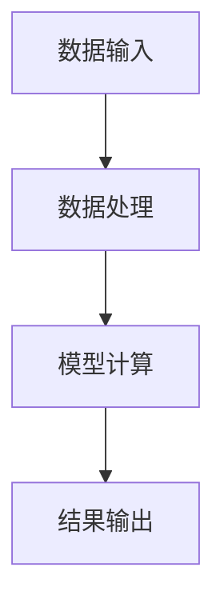

                 


# 金融市场系统性风险传导模拟器

> 关键词：系统性风险，金融模拟器，风险管理，算法，金融网络

> 摘要：本文介绍了一种金融市场系统性风险传导模拟器的设计与实现。该模拟器基于系统性风险的网络模型和数学模型，结合多种算法，能够有效识别和预测系统性风险的传导路径和影响。本文详细探讨了系统性风险的基本概念、传导机制、模拟器的核心算法、系统架构设计以及实际应用案例。

---

# 第1章 金融市场系统性风险概述

## 1.1 系统性风险的基本概念

### 1.1.1 什么是系统性风险
系统性风险是指由于市场中某些系统性因素的影响，导致整个金融系统出现波动或危机的风险。与非系统性风险不同，系统性风险影响的是整个市场，而非单个资产或个体。

### 1.1.2 系统性风险的特征
- **广泛性**：影响整个金融系统，而非单个资产。
- **传染性**：风险可以从一个市场或机构传导到另一个市场或机构。
- **不可分散性**：无法通过资产多样化来完全消除。
- **复杂性**：涉及多个因素和路径，难以预测和管理。

### 1.1.3 系统性风险的分类
系统性风险主要分为以下几种：
1. **市场风险**：由于市场波动导致的风险。
2. **流动性风险**：由于市场流动性不足导致的风险。
3. **信用风险**：由于债务人违约导致的风险。
4. **操作风险**：由于系统故障或人为错误导致的风险。

## 1.2 金融市场概述

### 1.2.1 金融市场的构成
金融市场由以下几个主要部分构成：
- **参与者**：包括投资者、银行、保险公司、基金公司等。
- **金融工具**：包括股票、债券、衍生品等。
- **交易场所**：包括交易所、场外市场等。

### 1.2.2 金融市场的功能
金融市场的主要功能包括：
1. **资金筹集**：为企业和个人提供融资渠道。
2. **价格发现**：通过市场交易确定资产价格。
3. **风险管理**：通过衍生品等工具对冲风险。

### 1.2.3 金融市场的主要参与者
- **投资者**：购买金融资产以获得收益。
- **金融机构**：包括银行、保险公司、证券公司等，提供金融服务。
- **监管机构**：监管金融市场，确保市场公平和透明。

## 1.3 系统性风险的传导机制

### 1.3.1 风险传导的路径
系统性风险的传导路径主要包括以下几种：
1. **直接传导**：风险直接从一个市场传递到另一个市场。
2. **间接传导**：通过中间市场或机构传递。
3. **网络传导**：通过金融网络中的关联性传递。

### 1.3.2 风险传导的驱动因素
- **市场波动**：市场的剧烈波动可能导致系统性风险的传导。
- **杠杆效应**：高杠杆率会放大风险的传导。
- **关联性**：金融市场中的高度关联性会加速风险的传导。

### 1.3.3 风险传导的案例分析
以2008年金融危机为例，系统性风险从房地产市场传导至整个金融系统，导致全球金融危机。

## 1.4 系统性风险模拟器的必要性

### 1.4.1 系统性风险模拟器的作用
系统性风险模拟器能够模拟和预测系统性风险的传导路径和影响，帮助决策者制定有效的风险管理策略。

### 1.4.2 系统性风险模拟器的应用场景
- **风险管理**：帮助金融机构识别和管理系统性风险。
- **政策制定**：帮助监管机构制定有效的监管政策。
- **学术研究**：为学术研究提供数据和工具。

### 1.4.3 系统性风险模拟器的未来发展趋势
随着人工智能和大数据技术的发展，系统性风险模拟器将更加智能化和精准化。

---

# 第2章 系统性风险传导模拟器的核心概念

## 2.1 系统性风险传导的数学模型

### 2.1.1 系统性风险传导的线性模型
线性模型假设风险的传导是线性的，可以用回归分析来描述。

### 2.1.2 系统性风险传导的非线性模型
非线性模型考虑了市场的复杂性，可以用神经网络等方法来建模。

### 2.1.3 系统性风险传导的网络模型
网络模型将金融市场中的机构视为节点，通过边表示它们之间的关联性。

## 2.2 系统性风险传导的网络结构

### 2.2.1 网络节点的定义
节点代表金融市场中的机构，例如银行、保险公司等。

### 2.2.2 网络边的定义
边表示机构之间的关联性，可以用权重来表示关联强度。

### 2.2.3 网络权重的计算
权重可以通过金融机构之间的交易量、资产配置等来计算。

## 2.3 系统性风险传导的数学公式

### 2.3.1 风险传导的矩阵表示
系统性风险的传导可以用矩阵来表示，例如：

$$
R = A \times S
$$

其中，$R$ 表示风险向量，$A$ 表示关联矩阵，$S$ 表示初始风险。

### 2.3.2 风险传导的向量表示
风险传导的向量表示为：

$$
R_i = \sum_{j} A_{ij} R_j
$$

### 2.3.3 风险传导的方程推导
通过推导，可以得到系统性风险传导的方程：

$$
R = (I - A)^{-1} S
$$

---

# 第3章 系统性风险传导模拟器的算法原理

## 3.1 网络分析算法

### 3.1.1 网络分析的基本原理
网络分析通过分析节点之间的关联性来识别系统性风险的传导路径。

### 3.1.2 网络分析的实现步骤
1. 数据收集：收集金融机构之间的关联数据。
2. 网络构建：构建金融网络模型。
3. 风险计算：计算系统性风险的传导路径。

### 3.1.3 网络分析的代码实现
```python
import networkx as nx

# 构建金融网络
G = nx.DiGraph()
G.add_edges_from(edges)

# 计算风险传导
risk_vector = nx.betweenness_centrality(G)
```

## 3.2 时间序列分析算法

### 3.2.1 时间序列分析的基本原理
时间序列分析通过分析历史数据来预测未来风险。

### 3.2.2 时间序列分析的实现步骤
1. 数据预处理：清洗和转换数据。
2. 模型选择：选择合适的模型，例如ARIMA。
3. 模型训练：训练模型并进行预测。

### 3.2.3 时间序列分析的代码实现
```python
from statsmodels.tsa.arima_model import ARIMA

# 训练模型
model = ARIMA(data, order=(1, 1, 1))
model_fit = model.fit()

# 预测未来风险
forecast = model_fit.forecast(steps=10)
```

## 3.3 蒙特卡洛模拟算法

### 3.3.1 蒙特卡洛模拟的基本原理
蒙特卡洛模拟通过多次随机采样来模拟风险的传导路径。

### 3.3.2 蒙特卡洛模拟的实现步骤
1. 确定输入参数：如金融机构的数量、关联性等。
2. 进行随机采样：生成多个随机场景。
3. 计算风险结果：分析每个场景中的风险。

### 3.3.3 蒙特卡洛模拟的代码实现
```python
import numpy as np

# 设置随机种子
np.random.seed(42)

# 进行蒙特卡洛模拟
n_simulations = 1000
results = []
for _ in range(n_simulations):
    # 生成随机场景
    scenario = np.random.normal(size=n Institutions)
    # 计算风险
    risk = np.max(scenario)
    results.append(risk)

# 分析结果
print(f"平均风险：{np.mean(results)}")
```

---

# 第4章 系统性风险传导模拟器的系统架构设计

## 4.1 系统分析与设计

### 4.1.1 问题场景介绍
系统性风险模拟器需要处理复杂的金融市场数据和模型。

### 4.1.2 项目介绍
介绍系统性风险模拟器的开发目标和功能。

### 4.1.3 系统功能设计
- 数据输入模块：接收金融市场数据。
- 数据处理模块：对数据进行清洗和转换。
- 模型计算模块：计算系统性风险的传导路径。
- 结果输出模块：输出模拟结果。

### 4.1.4 系统架构图
使用Mermaid图展示系统架构。



## 4.2 系统架构设计

### 4.2.1 系统功能模块
- 数据输入模块：接收金融市场数据。
- 数据处理模块：对数据进行清洗和转换。
- 模型计算模块：计算系统性风险的传导路径。
- 结果输出模块：输出模拟结果。

### 4.2.2 系统架构设计图
使用Mermaid图展示系统架构。


---

# 第5章 项目实战

## 5.1 环境安装

### 5.1.1 安装Python
安装Python 3.8及以上版本。

### 5.1.2 安装依赖库
安装以下依赖库：
- NetworkX
- statsmodels
- numpy
- matplotlib

## 5.2 核心实现

### 5.2.1 网络分析实现
```python
import networkx as nx

# 构建金融网络
edges = [('A', 'B'), ('B', 'C'), ('C', 'D')]
G = nx.DiGraph()
G.add_edges_from(edges)

# 计算风险传导
risk_vector = nx.betweenness_centrality(G)
```

### 5.2.2 时间序列分析实现
```python
from statsmodels.tsa.arima_model import ARIMA

# 训练模型
data = [1, 2, 3, 4, 5]
model = ARIMA(data, order=(1, 1, 1))
model_fit = model.fit()

# 预测未来风险
forecast = model_fit.forecast(steps=10)
```

### 5.2.3 蒙特卡洛模拟实现
```python
import numpy as np

# 设置随机种子
np.random.seed(42)

# 进行蒙特卡洛模拟
n_simulations = 1000
results = []
for _ in range(n_simulations):
    # 生成随机场景
    scenario = np.random.normal(size=n Institutions)
    # 计算风险
    risk = np.max(scenario)
    results.append(risk)

# 分析结果
print(f"平均风险：{np.mean(results)}")
```

## 5.3 案例分析

### 5.3.1 案例背景
以2008年金融危机为例，分析系统性风险的传导路径。

### 5.3.2 数据准备
收集相关金融机构的数据，构建金融网络。

### 5.3.3 模拟器应用
使用模拟器计算系统性风险的传导路径和影响。

### 5.3.4 分析结果
输出模拟结果，帮助理解系统性风险的传导机制。

---

# 第6章 最佳实践与小结

## 6.1 最佳实践

### 6.1.1 数据收集
确保数据的准确性和完整性。

### 6.1.2 模型选择
根据实际需求选择合适的模型。

### 6.1.3 系统优化
优化系统性能，提高模拟效率。

## 6.2 小结

本文详细介绍了金融市场系统性风险传导模拟器的设计与实现，包括系统性风险的基本概念、模拟器的核心算法、系统架构设计以及实际应用案例。通过本文的学习，读者可以掌握系统性风险的模拟方法，并能够应用到实际的金融风险管理中。

---

# 作者
作者：AI天才研究院/AI Genius Institute  
作者：禅与计算机程序设计艺术/Zen And The Art of Computer Programming

