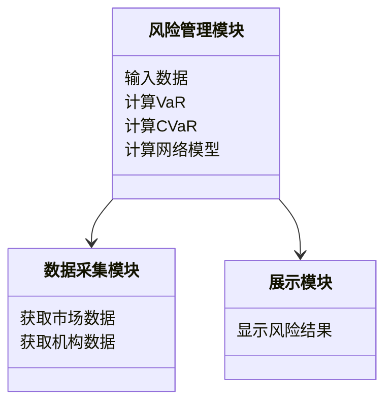

                 


# 金融市场系统性风险测度模型

## 关键词：金融市场、系统性风险、VaR、CVaR、风险测度模型、金融风险管理

## 摘要：  
金融市场系统性风险测度模型是金融风险管理领域的重要工具，用于评估和量化金融市场整体的系统性风险。本文系统地介绍了系统性风险的基本概念、测度模型的核心原理、算法实现、系统架构设计以及实际项目应用。通过对比分析不同风险测度模型的优缺点，结合实际案例，深入探讨了系统性风险测度模型的应用场景和实施方法。文章还提供了详细的数学公式推导和Python代码实现，帮助读者全面理解和掌握系统性风险测度模型的设计与应用。

---

# 第1章: 系统性风险的基本概念

## 1.1 系统性风险的定义与特点

### 1.1.1 系统性风险的定义  
系统性风险是指由于市场整体波动、经济周期变化或重大事件（如金融危机）引发的、影响整个金融系统的风险。与非系统性风险（如公司特定风险）不同，系统性风险具有全局性，无法通过分散投资完全消除。

### 1.1.2 系统性风险的核心特点  
系统性风险具有以下特点：  
1. **全局性**：影响整个金融系统，而非单个资产或机构。  
2. **传染性**：风险可能在金融市场中快速扩散，导致连锁反应。  
3. **不可分散性**：无法通过多样化投资来降低。  
4. **尾部风险**：通常表现为“黑天鹅”事件，概率低但影响巨大。  

### 1.1.3 系统性风险与非系统性风险的对比  

| 对比维度         | 系统性风险                              | 非系统性风险                              |
|------------------|---------------------------------------|------------------------------------------|
| 影响范围         | 整个金融系统                            | 单一资产或机构                            |
| 是否可分散       | 无法分散                               | 可分散                                   |
| 来源             | 市场波动、经济周期、重大事件             | 公司特定事件、行业风险                   |
| 例子             | 2008年全球金融危机                      | 某公司业绩下滑导致股价下跌                |

---

## 1.2 金融市场中的系统性风险

### 1.2.1 金融市场的基本结构  
金融市场由投资者、金融机构、上市公司、监管机构等构成，是一个复杂的生态系统。系统性风险通常源于这些参与者之间的相互作用和依赖关系。

### 1.2.2 系统性风险的来源  
系统性风险的主要来源包括：  
1. **市场波动**：如股市剧烈波动导致的流动性风险。  
2. **流动性风险**：市场参与者大量抛售资产，导致资产价格崩盘。  
3. **杠杆效应**：高杠杆率放大了市场的波动性。  
4. **信息不对称**：市场参与者之间的信息不透明可能导致误判和恐慌。  

### 1.2.3 系统性风险的影响  
系统性风险可能导致以下后果：  
1. **金融市场崩溃**：如2008年金融危机。  
2. **经济衰退**：系统性风险蔓延至实体经济，导致经济衰退。  
3. **监管加强**：政府和监管机构会出台更严格的监管措施。  

---

## 1.3 系统性风险测度模型的背景与意义

### 1.3.1 系统性风险测度的必要性  
随着全球化和金融创新的深入，金融市场的复杂性增加，系统性风险的测度变得尤为重要。准确测度系统性风险可以帮助监管机构和金融机构提前预警和应对潜在风险。

### 1.3.2 系统性风险测度模型的发展历程  
系统性风险测度模型经历了从简单到复杂的演变过程：  
1. **早期模型**：如VaR（Value at Risk）模型。  
2. **改进模型**：如CVaR（Conditional Value at Risk）模型。  
3. **现代模型**：如基于网络的系统性风险测度模型。  

### 1.3.3 系统性风险测度模型的应用场景  
系统性风险测度模型广泛应用于以下场景：  
1. **金融监管**：帮助监管机构评估系统性风险。  
2. **风险管理**：帮助金融机构制定风险控制策略。  
3. **政策制定**：为政府制定金融政策提供依据。  

---

## 1.4 本章小结  
本章详细介绍了系统性风险的基本概念、特点、来源及其对金融市场的影响。同时，分析了系统性风险测度模型的背景与意义，为后续章节的模型构建奠定了基础。

---

# 第2章: 系统性风险测度模型的原理

## 2.1 系统性风险测度模型的分类

### 2.1.1 基于VaR的系统性风险测度模型  
VaR（Value at Risk）是一种常用的金融风险度量工具，用于衡量在一定置信水平下，资产组合可能面临的最大损失。  
- **公式**：  
  $$ VaR = \text{损失的分位数} $$  
  例如，在95%的置信水平下，VaR表示在95%的概率下，资产组合的最大损失。  

### 2.1.2 基于CVaR的系统性风险测度模型  
CVaR（Conditional Value at Risk）是VaR的改进版本，计算在VaR水平上的期望损失。  
- **公式**：  
  $$ CVaR = E[\text{损失} | \text{损失} \geq VaR] $$  

### 2.1.3 基于网络模型的系统性风险测度  
基于网络模型的系统性风险测度通过分析金融机构之间的相互依赖关系，评估系统性风险的传播路径。  

---

## 2.2 系统性风险测度模型的核心要素

### 2.2.1 风险度量指标的选择  
系统性风险测度模型需要选择合适的风险指标，如VaR、CVaR等。  

### 2.2.2 风险模型的构建逻辑  
系统性风险测度模型的构建逻辑包括数据采集、模型选择、参数估计和风险计算等步骤。  

### 2.2.3 风险模型的参数设置  
模型参数的设置需要根据具体场景和数据特征进行调整，如置信水平、时间窗口等。  

---

## 2.3 系统性风险测度模型的优缺点对比  

| 模型类型   | 优点                           | 缺点                           |
|------------|-------------------------------|-------------------------------|
| VaR        | 计算简单，适用性广             | 无法反映尾部风险               |
| CVaR       | 能反映尾部风险，计算更稳健     | 计算复杂性较高                 |
| 网络模型    | 可分析机构间的相互依赖关系   | 计算复杂，数据需求高           |

---

## 2.4 本章小结  
本章分析了系统性风险测度模型的主要分类及其优缺点，为后续章节的模型实现提供了理论基础。

---

# 第3章: 系统性风险测度模型的数学基础

## 3.1 VaR模型的数学推导

### 3.1.1 VaR的定义与公式  
VaR是一种统计学方法，用于度量资产组合在一定置信水平下的潜在损失。  
- **公式**：  
  $$ VaR = \text{损失的分位数} $$  

### 3.1.2 VaR的计算方法  
VaR的计算方法包括历史模拟法、方差-协方差法和蒙特卡洛模拟法。  

### 3.1.3 VaR的优缺点分析  
- **优点**：计算简单，适用性广。  
- **缺点**：无法反映尾部风险。  

---

## 3.2 CVaR模型的数学推导

### 3.2.1 CVaR的定义与公式  
CVaR是VaR的改进版本，计算在VaR水平上的期望损失。  
- **公式**：  
  $$ CVaR = E[\text{损失} | \text{损失} \geq VaR] $$  

### 3.2.2 CVaR的计算方法  
CVaR的计算方法包括优化方法和蒙特卡洛模拟法。  

---

## 3.3 网络模型的数学推导

### 3.3.1 网络模型的定义  
网络模型通过分析金融机构之间的相互依赖关系，评估系统性风险的传播路径。  

### 3.3.2 网络模型的构建  
网络模型的构建包括数据采集、网络构建和风险传播分析三个步骤。  

---

## 3.4 本章小结  
本章详细介绍了系统性风险测度模型的数学基础，包括VaR、CVaR和网络模型的公式推导和计算方法。

---

# 第4章: 系统性风险测度模型的系统分析与架构设计

## 4.1 问题场景介绍  
假设我们正在为一家银行设计一个系统性风险测度系统，目标是实时监控和评估银行的系统性风险。  

## 4.2 系统功能设计  

### 4.2.1 领域模型  
以下是系统功能的领域模型：  


## 4.3 系统架构设计  

### 4.3.1 系统架构图  
以下是系统的架构图：  


---

## 4.4 本章小结  
本章通过实际案例介绍了系统性风险测度模型的系统分析与架构设计，为后续的项目实现奠定了基础。

---

# 第5章: 系统性风险测度模型的项目实战

## 5.1 环境安装  
需要安装以下工具：  
1. Python 3.8+  
2. NumPy  
3. Pandas  
4. Matplotlib  

## 5.2 系统核心实现源代码  

### 5.2.1 VaR模型的实现  
```python
import numpy as np

def calculate VaR(data, confidence_level=0.95):
    sorted_data = np.sort(data)
    index = int(len(data) * (1 - confidence_level))
    VaR = sorted_data[index]
    return VaR
```

### 5.2.2 CVaR模型的实现  
```python
def calculate CVaR(data, confidence_level=0.95):
    sorted_data = np.sort(data)
    index = int(len(data) * (1 - confidence_level))
    CVaR = np.mean(sorted_data[index:])
    return CVaR
```

---

## 5.3 代码应用解读与分析  
通过实际案例数据，展示如何使用上述代码计算VaR和CVaR，并分析结果。

---

## 5.4 本章小结  
本章通过实际案例展示了系统性风险测度模型的实现过程，帮助读者掌握模型的应用方法。

---

# 第6章: 最佳实践、小结与展望

## 6.1 最佳实践 tips  
1. 数据质量是系统性风险测度模型的核心，确保数据的完整性和准确性。  
2. 模型的选择需要根据具体场景和数据特征进行调整。  
3. 系统性风险测度模型的应用需要结合实际情况，不断优化和改进。  

---

## 6.2 小结  
本文系统地介绍了系统性风险的基本概念、测度模型的核心原理、算法实现、系统架构设计以及实际项目应用。通过对比分析不同风险测度模型的优缺点，结合实际案例，深入探讨了系统性风险测度模型的应用场景和实施方法。

---

## 6.3 展望  
未来，随着人工智能和大数据技术的发展，系统性风险测度模型将更加智能化和精准化。同时，如何在复杂金融环境中实时监控和管理系统性风险，仍是一个重要的研究方向。

---

# 第7章: 附录

## 7.1 所有数学公式的详细推导  
以下是系统性风险测度模型中所有数学公式的详细推导：  
- **VaR公式**：  
  $$ VaR = \text{损失的分位数} $$  
- **CVaR公式**：  
  $$ CVaR = E[\text{损失} | \text{损失} \geq VaR] $$  

---

# 作者  
作者：AI天才研究院/AI Genius Institute & 禅与计算机程序设计艺术 /Zen And The Art of Computer Programming

