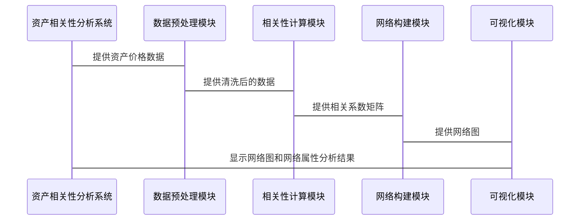

                 


```markdown
# 《金融市场跨资产相关性网络分析工具》

> 关键词：金融市场、相关性网络、复杂网络理论、系统设计、算法实现、数据可视化

> 摘要：本文系统地介绍了金融市场跨资产相关性网络分析工具的设计与实现，从理论基础到算法实现，再到系统设计，全面剖析了该工具的核心原理和应用场景。通过具体案例分析，展示了如何利用相关性网络分析工具揭示资产之间的隐含关联关系，并基于复杂网络理论进行网络属性分析，帮助投资者做出更明智的投资决策。

---

## 第1章: 背景介绍

### 1.1 核心概念术语说明
- **相关性网络**：通过计算资产价格之间的相关性，构建资产网络，展示资产之间的关联关系。
- **复杂网络理论**：研究网络结构及其属性的理论，用于分析相关性网络的拓扑特征。

### 1.2 问题背景
- 金融市场中，不同资产之间存在复杂的相关性，这些相关性在市场波动时尤为显著。
- 传统相关性分析仅能揭示资产对资产的线性关系，难以捕捉复杂的网络结构特征。

### 1.3 问题描述
- 如何构建跨资产的相关性网络，揭示资产之间的非线性关联？
- 如何利用网络分析工具量化相关性网络的拓扑属性，识别网络中的关键节点和社区结构？

### 1.4 问题解决
- 通过计算资产价格数据的相关性矩阵，构建相关性网络。
- 基于复杂网络理论，分析网络的拓扑属性，识别关键资产和社区结构。

### 1.5 边界与外延
- **边界**：专注于资产价格数据，不考虑其他市场因素。
- **外延**：可扩展至其他金融市场数据，如债券、期货等。

### 1.6 核心要素组成
- 数据来源：金融市场资产价格数据。
- 相关性计算：协方差、皮尔逊相关系数。
- 网络构建：边权重、节点度、社区检测。

---

## 第2章: 相关性网络分析的核心原理

### 2.1 相关性计算方法
- **协方差**：衡量资产价格变动的相似性。
  $$ \text{Cov}(X, Y) = \frac{1}{n-1}\sum_{i=1}^{n}(X_i - \bar{X})(Y_i - \bar{Y}) $$
- **皮尔逊相关系数**：标准化的协方差，衡量线性相关性。
  $$ r_{xy} = \frac{\text{Cov}(X, Y)}{\sigma_X \sigma_Y} $$

### 2.2 网络构建步骤
1. 数据预处理：清洗缺失值、异常值。
2. 计算相关性矩阵：使用皮尔逊相关系数。
3. 构建网络图：将相关性大于等于阈值的资产对连接成边。

### 2.3 网络属性分析
- **度**：节点的度数，表示资产与其他资产的相关性强度。
- **中心性**：节点在网络中的重要性，用于识别关键资产。
- **聚类系数**：节点邻居之间的连接程度，用于识别社区结构。

### 2.4 网络可视化工具
- **Gephi**：开源网络可视化工具，支持多种网络布局。
- **NetworkX**：Python网络分析库，支持网络构建和可视化。
- **Matplotlib**：Python绘图库，用于数据可视化。

---

## 第3章: 算法原理与实现

### 3.1 相关性网络分析算法
- **算法流程**
  1. 数据预处理：清洗数据，处理缺失值。
  2. 计算相关性矩阵：使用皮尔逊相关系数。
  3. 构建网络图：将相关性高于阈值的资产对连接成边。
  4. 网络属性分析：计算度、中心性、聚类系数等。
  5. 可视化：将网络图可视化，展示资产之间的关联关系。


### 3.2 算法实现代码

```python
import numpy as np
import pandas as pd
import networkx as nx
import matplotlib.pyplot as plt

def load_data():
    # 加载股票价格数据
    df = pd.read_csv('stock_prices.csv')
    return df

def preprocess_data(df):
    # 数据清洗：处理缺失值
    df.dropna(inplace=True)
    return df

def compute_correlation_matrix(df):
    # 计算皮尔逊相关系数矩阵
    correlation_matrix = df.corr()
    return correlation_matrix

def build_network(correlation_matrix, threshold=0.3):
    # 构建相关性网络
    G = nx.Graph()
    for i in range(len(correlation_matrix.columns)):
        for j in range(i+1, len(correlation_matrix.columns)):
            correlation = correlation_matrix.iloc[i, j]
            if correlation >= threshold:
                G.add_edge(correlation_matrix.columns[i], correlation_matrix.columns[j])
    return G

def visualize_network(G):
    # 可视化网络图
    nx.draw(G, node_size=800, node_color='red', edge_color='blue', with_labels=True)
    plt.show()

if __name__ == "__main__":
    df = load_data()
    df_processed = preprocess_data(df)
    correlation_matrix = compute_correlation_matrix(df_processed)
    G = build_network(correlation_matrix)
    visualize_network(G)
```

### 3.3 算法数学模型
- **相关性计算公式**
  $$ r_{xy} = \frac{\sum (x_i - \bar{x})(y_i - \bar{y})}{\sqrt{\sum (x_i - \bar{x})^2 \sum (y_i - \bar{y})^2}} $$
- **网络构建逻辑**
  $$ \text{若 } r_{xy} \geq \text{阈值} \Rightarrow x \text{与} y \text{之间存在边} $$

---

## 第4章: 系统设计与实现

### 4.1 系统架构设计


### 4.2 系统功能模块
1. 数据预处理模块：清洗数据，处理缺失值。
2. 相关性计算模块：计算资产之间的相关系数矩阵。
3. 网络构建模块：根据相关系数构建网络图。
4. 网络分析模块：计算网络的度、中心性、聚类系数等属性。
5. 可视化模块：将网络图可视化，展示资产之间的关联关系。

### 4.3 系统接口设计
- **输入接口**：接收资产价格数据。
- **输出接口**：输出相关性网络图和网络属性分析结果。

### 4.4 系统交互流程


---

## 第5章: 项目实战与案例分析

### 5.1 数据获取与清洗
- 使用Yahoo Finance API获取股票价格数据。
- 清洗缺失值和异常值。

### 5.2 相关性网络构建与分析
- 选择一组股票，计算它们的相关系数矩阵。
- 构建相关性网络，识别相关性较高的资产。

### 5.3 网络属性分析
- 计算每个资产的度和中心性，识别关键资产。
- 识别网络中的社区结构，分析不同社区的资产相关性。

### 5.4 可视化展示
- 使用Gephi或NetworkX将网络图可视化。
- 展示资产之间的关联关系和网络属性。

---

## 第6章: 总结与展望

### 6.1 最佳实践
- 数据清洗是关键，确保数据质量。
- 选择合适的相关性计算方法，根据数据分布选择皮尔逊相关系数或 Spearman 相关系数。
- 网络可视化工具的选择影响结果的展示效果。

### 6.2 小结
本文详细介绍了金融市场跨资产相关性网络分析工具的设计与实现，从理论到实践，全面剖析了该工具的核心原理和应用场景。

### 6.3 注意事项
- 数据来源和质量直接影响分析结果。
- 相关性分析结果不能直接作为投资决策的唯一依据。

### 6.4 拓展阅读
- 《Network Science》：理解网络理论的基础知识。
- 《Python for Data Analysis》：掌握数据处理和可视化的技巧。

---

## 作者：AI天才研究院/AI Genius Institute & 禅与计算机程序设计艺术 /Zen And The Art of Computer Programming
```

