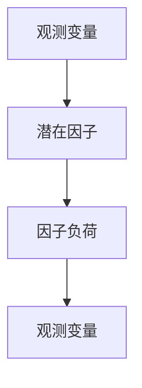

                 


# 金融市场风险因子分解与分析

---

## 关键词  
金融市场风险, 因子分解, 统计分析, 机器学习, 投资组合优化, 风险管理

---

## 摘要  
金融市场风险因子分解与分析是金融领域中的核心问题之一。通过对金融市场数据的因子分解，可以揭示隐藏在数据背后的关键风险驱动因素，从而帮助投资者更好地理解市场风险、优化投资组合以及制定风险管理策略。本文将从风险因子分解的基本概念出发，逐步分析其核心原理、算法实现、系统架构及实际应用，帮助读者全面掌握这一技术。

---

# 第1章 金融市场风险因子分解概述  

## 1.1 金融市场风险分析的背景与重要性  

### 1.1.1 金融市场风险的基本概念  
金融市场风险是指在金融市场上，由于市场价格波动、利率变化、经济周期波动等因素，导致投资组合或资产价值发生不利变化的可能性。风险分析是金融领域中的核心任务之一，旨在识别、量化和管理这些风险。  

### 1.1.2 风险因子分解的定义与目的  
风险因子分解是一种统计方法，用于将复杂的金融市场数据分解为几个关键的驱动因素（即因子）。这些因子通常代表了市场的整体趋势、行业表现、资产特性和其他潜在的驱动因素。通过因子分解，可以简化数据的复杂性，提取出最能解释市场波动的关键因素。  

### 1.1.3 风险因子分解的背景与应用  
金融市场数据通常具有高度的复杂性和相关性，直接分析这些数据往往难以发现其背后的规律。通过因子分解，可以将复杂的市场数据转化为几个简单的因子，从而降低数据维度，提高分析效率。这种方法在投资组合管理、风险定价、资产配置等领域具有广泛的应用。  

---

## 1.2 风险因子分解的核心要素  

### 1.2.1 因子分析的核心概念  
因子分析是一种统计技术，旨在通过线性组合的形式，将观测变量表示为少数几个潜在因子的线性组合。在金融市场中，这些潜在因子通常代表了市场的整体风险、行业风险、风格风险等。  

### 1.2.2 因子分析的目标  
因子分析的目标是：  
1. **降维**：将复杂的市场数据简化为少数几个因子。  
2. **解释性**：通过因子解释观测变量之间的关系。  
3. **预测性**：利用因子进行市场预测和风险评估。  

### 1.2.3 因子分析的核心要素  
1. **观测变量**：金融市场中的资产回报、价格等数据。  
2. **潜在因子**：如市场因子、行业因子、风格因子等。  
3. **因子负荷**：观测变量与潜在因子之间的相关性。  

---

## 1.3 风险因子分解的边界与外延  

### 1.3.1 风险因子分解的边界  
1. **数据范围**：仅限于金融市场数据，不考虑宏观经济因素。  
2. **时间范围**：通常基于历史数据进行分析。  
3. **因子数量**：因子数量通常远小于观测变量数量。  

### 1.3.2 风险因子分解的外延  
1. **宏观经济因子**：如GDP增长率、通货膨胀率等。  
2. **微观经济因子**：如公司财务数据、管理团队等。  

---

## 1.4 风险因子分解的概念结构与核心要素  

### 1.4.1 概念结构图  


### 1.4.2 核心要素对比表  
| 要素 | 描述 | 示例 |
|------|------|------|
| 观测变量 | 资产回报、价格等数据 | 股票价格、债券收益率 |
| 潜在因子 | 市场、行业、风格等驱动因素 | 市场因子、行业因子 |
| 因子负荷 | 观测变量与潜在因子的相关性 | 0.8、-0.5 |

---

## 1.5 风险因子分解的核心原理  

### 1.5.1 因子分析的基本原理  
因子分析通过构建一个线性模型，将观测变量表示为潜在因子的线性组合。模型可以表示为：  
$$
X = \mu + \beta F + \epsilon
$$  
其中，$X$ 是观测变量，$\mu$ 是均值向量，$\beta$ 是因子负荷矩阵，$F$ 是潜在因子，$\epsilon$ 是误差项。  

### 1.5.2 因子分析与主成分分析（PCA）的区别  
| 特性 | 因子分析 | 主成分分析（PCA） |
|------|----------|------------------|
| 目标 | 解释观测变量之间的关系 | 降维数据 |
| 假设 | 观测变量受潜在因子影响 | 数据由少数主成分驱动 |
| 解释性 | 强调因子的解释性 | 强调降维效果 |

---

## 1.6 风险因子分解的数学模型  

### 1.6.1 协方差矩阵的构建  
协方差矩阵是因子分析的核心输入。对于$n$个观测变量，协方差矩阵$C$可以表示为：  
$$
C = \beta \beta^T + \epsilon \epsilon^T
$$  
其中，$\beta$ 是因子负荷矩阵，$\epsilon$ 是误差矩阵。  

### 1.6.2 特征值分解  
通过对协方差矩阵进行特征值分解，可以提取出主成分，从而得到因子负荷矩阵$\beta$。  

---

## 1.7 风险因子分解的实际应用  

### 1.7.1 投资组合管理  
通过因子分解，可以识别出影响投资组合风险的关键因子，从而优化资产配置。  

### 1.7.2 风险定价  
因子分解可以帮助投资者更好地理解资产定价模型中的风险溢价。  

### 1.7.3 市场预测  
基于因子分解的结果，可以构建因子投资组合，并用于市场预测。  

---

## 1.8 风险因子分解的案例分析  

### 1.8.1 案例背景  
假设我们有10只股票的回报数据，希望通过因子分解提取出影响这些股票回报的潜在因子。  

### 1.8.2 数据预处理  
1. 标准化数据：将股票回报数据标准化，消除量纲影响。  
2. 计算协方差矩阵：基于标准化后的数据，计算协方差矩阵。  

### 1.8.3 因子提取  
通过特征值分解，提取出前3个主成分作为潜在因子。  

### 1.8.4 因子解释  
分析因子负荷，确定每个因子的经济含义，例如：  
- 第1个因子可能代表市场整体波动。  
- 第2个因子可能代表行业特定风险。  

---

## 1.9 风险因子分解的Python实现  

### 1.9.1 环境安装  
```bash
pip install numpy pandas sklearn
```

### 1.9.2 核心代码  
```python
import numpy as np
import pandas as pd
from sklearn.decomposition import PCA

# 假设data是股票回报数据
data = pd.DataFrame(np.random.randn(10, 10))  # 示例数据

# 标准化数据
data_norm = (data - data.mean()) / data.std()

# 计算协方差矩阵
cov_matrix = data_norm.cov()

# PCA分解
pca = PCA(n_components=3)
pca.fit(cov_matrix)

# 因子负荷矩阵
factor_loadings = pca.components_

print("因子负荷矩阵：")
print(factor_loadings)
```

### 1.9.3 代码解读  
1. **标准化数据**：消除不同变量的量纲影响。  
2. **协方差矩阵**：衡量变量之间的相关性。  
3. **PCA分解**：提取潜在因子。  
4. **因子负荷矩阵**：解释因子与观测变量之间的关系。  

---

## 1.10 风险因子分解的注意事项  

### 1.10.1 数据质量问题  
- 数据质量直接影响因子分解的结果，需确保数据的完整性和准确性。  

### 1.10.2 因子数量的选择  
- 因子数量过多会导致过拟合，因子数量过少则无法充分解释数据。  

### 1.10.3 因子解释的合理性  
- 因子的解释需符合经济逻辑，避免强行赋予不合理含义。  

---

## 1.11 风险因子分解的未来展望  

### 1.11.1 多因子模型的发展  
- 结合宏观经济因子和微观经济因子，构建更复杂的多因子模型。  

### 1.11.2 机器学习的融合  
- 利用机器学习算法，如随机森林、神经网络等，进一步提高因子分解的准确性。  

### 1.11.3 实时风险监控  
- 基于因子分解的结果，构建实时风险监控系统，帮助投资者及时应对市场波动。  

---

## 1.12 风险因子分解的小结  

通过本章的学习，我们了解了风险因子分解的基本概念、核心原理和实际应用。接下来，我们将深入探讨因子分析的算法实现，以及如何将因子分解技术应用于金融系统的实际设计与实现中。

---

作者：AI天才研究院/AI Genius Institute & 禅与计算机程序设计艺术/Zen And The Art of Computer Programming

