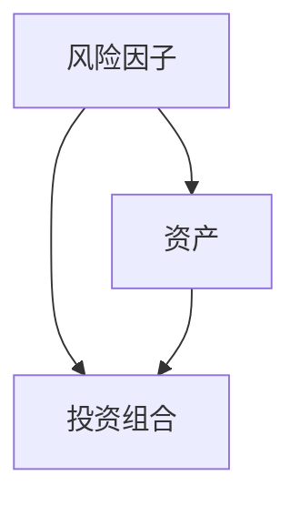
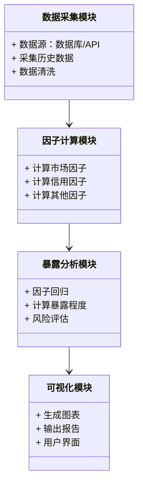
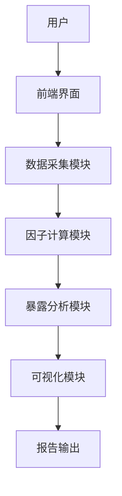
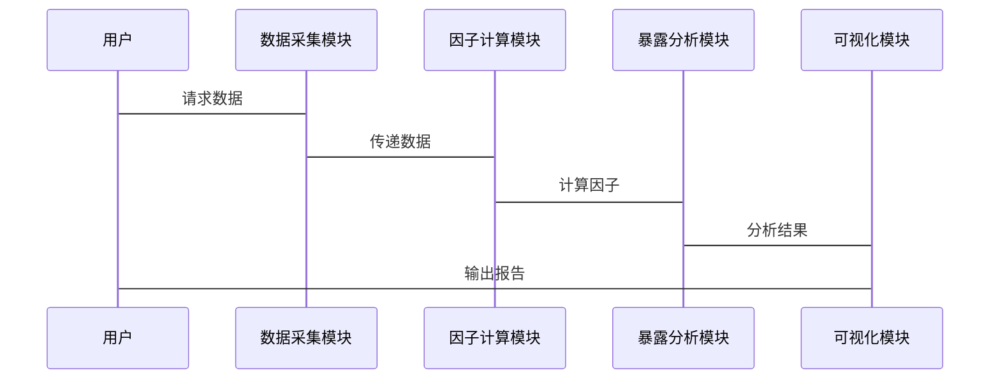

                 


# 金融市场风险因子暴露分析工具

> 关键词：金融市场、风险因子、暴露分析、工具开发、风险评估

> 摘要：金融市场风险因子暴露分析工具旨在帮助投资者和金融机构量化和管理投资组合中的风险因子暴露。本文详细探讨了风险因子的分类、暴露分析的算法原理、系统架构设计以及实际项目案例，为读者提供从理论到实践的全面指南。

---

## 第1章: 风险因子与暴露分析的背景

### 1.1 风险因子的定义与分类

#### 1.1.1 风险因子的基本概念

风险因子（Risk Factor）是影响资产价格波动的重要因素，常见的包括市场风险、利率风险、流动性风险、信用风险等。每个因子都代表一种系统性风险，其变化会直接影响资产的价格波动。

#### 1.1.2 风险因子的分类与特征

风险因子可以分为以下几类：

- **市场因子（Market Factors）**：如市场整体波动、大盘指数走势。
- **利率因子（Interest Rate Factors）**：如国债收益率、短期利率变化。
- **信用因子（Credit Factors）**：如违约风险、评级变化。
- **流动性因子（Liquidity Factors）**：如资产的买卖价差、交易量等。

每类因子都有其独特的特征，例如市场因子通常具有高波动性和广泛影响，而信用因子则更多影响特定资产或行业。

#### 1.1.3 风险因子的量化与度量

风险因子的量化通常通过统计方法实现，例如使用因子分析模型提取主成分，或者通过回归分析确定因子的影响力。量化结果以因子载荷（Factor Loading）表示，反映了资产对特定因子的敏感程度。

### 1.2 风险暴露分析的重要性

#### 1.2.1 风险暴露分析的定义

风险暴露分析（Exposure Analysis）是指通过量化投资组合对各类风险因子的敏感程度，评估这些因子变化对投资组合价值的影响。通过暴露分析，投资者可以更好地理解投资组合的风险来源，并制定相应的风险管理策略。

#### 1.2.2 风险暴露分析在金融投资中的作用

- **风险控制**：通过识别高风险因子的暴露，投资者可以调整投资组合，降低潜在风险。
- **资产配置**：暴露分析帮助投资者优化资产配置，平衡不同风险因子的影响。
- **绩效评估**：暴露分析是评估投资组合绩效的重要指标，可以帮助投资者了解收益来源。

#### 1.2.3 风险暴露分析的边界与外延

风险暴露分析的边界通常包括市场风险、信用风险等系统性风险，而排除了非系统性风险（如公司特定风险）。外延则涉及多因子模型、压力测试等高级分析方法。

### 1.3 风险因子暴露分析工具的框架

#### 1.3.1 工具的基本功能与模块

- **数据采集模块**：收集历史价格、收益率、宏观经济指标等数据。
- **因子计算模块**：计算各风险因子的值，如市场因子、信用因子。
- **暴露分析模块**：使用回归分析或因子分析模型计算投资组合对各因子的暴露程度。
- **风险评估模块**：根据因子暴露和预期因子波动，评估投资组合的风险。
- **可视化模块**：生成图表和报告，直观展示风险暴露情况。

#### 1.3.2 工具的使用场景与目标用户

- **使用场景**：风险管理、资产配置、投资决策支持、绩效评估。
- **目标用户**：机构投资者、基金经理、投资顾问、金融研究人员。

#### 1.3.3 工具的输入输出与流程

- **输入**：投资组合数据、历史市场数据、因子模型参数。
- **输出**：各因子的暴露程度、风险价值（VaR）、风险调整后收益等。
- **流程**：数据采集 → 因子计算 → 暴露分析 → 风险评估 → 结果可视化。

---

## 第2章: 风险因子的属性与特征

### 2.1 风险因子的属性分析

#### 2.1.1 风险因子的线性性

许多风险因子表现出线性关系，例如市场因子和资产收益之间通常呈线性相关。通过线性回归模型可以有效捕捉这种关系。

#### 2.1.2 风险因子的非线性性

部分风险因子的影响是非线性的，例如极端市场波动可能导致非线性损失。此时需要使用非线性回归或其他统计方法进行建模。

#### 2.1.3 风险因子的波动性

风险因子的波动性反映了其对资产价格影响的剧烈程度。高波动性因子通常意味着更大的潜在风险。

### 2.2 风险因子的特征对比

#### 2.2.1 风险因子与资产回报的关系

通过回归分析可以确定不同因子对资产回报的解释力。例如，Fama-French三因子模型表明，市值、价值和动量因子对资产回报有显著影响。

#### 2.2.2 风险因子的独立性与相关性

不同风险因子之间可能存在相关性，例如利率因子和市场因子在某些情况下可能高度相关。需要通过因子分析或主成分分析来降低维度并消除冗余。

#### 2.2.3 风险因子的稳定性与变化性

因子的稳定性反映了其长期影响的持久性，而变化性则反映了其短期波动的剧烈程度。稳定且高度变化的因子通常需要更频繁的监控和调整。

### 2.3 风险因子的ER实体关系图



---

## 第3章: 风险因子暴露分析的算法原理

### 3.1 风险因子暴露的计算方法

#### 3.1.1 风险因子暴露的线性回归模型

通过多元线性回归模型可以计算投资组合对各因子的暴露程度。回归系数即为因子暴露。

$$ \text{收益} = \beta_1 \times F_1 + \beta_2 \times F_2 + ... + \beta_n \times F_n + \epsilon $$

其中，$\beta_i$ 表示对因子 $F_i$ 的暴露程度，$\epsilon$ 为误差项。

#### 3.1.2 风险因子暴露的多元回归模型

多元回归模型可以同时考虑多个因子的影响，但需要确保因子之间不存在多重共线性问题。可以通过计算方差膨胀因子（VIF）来检测共线性。

#### 3.1.3 风险因子暴露的主成分分析

主成分分析（PCA）常用于处理高度相关的因子，提取主要的因子成分。例如，将多个相关因子合并为几个主成分，降低维度。

### 3.2 风险因子暴露的计算流程

#### 3.2.1 数据预处理

- 清洗数据：处理缺失值、异常值。
- 标准化：对不同量纲的数据进行标准化处理。
- 选择因子：根据理论或经验选择相关因子。

#### 3.2.2 因子计算

根据所选因子类型计算因子值。例如，市场因子可以通过计算资产相对于市场指数的偏离度来衡量。

#### 3.2.3 因子回归

使用回归模型计算投资组合对各因子的暴露程度。可以通过手工计算或使用统计软件（如Python中的statsmodels库）实现。

#### 3.2.4 暴露分析

计算出各因子的暴露后，可以进一步分析其对投资组合整体风险的影响。例如，计算VaR或CVaR。

#### 3.2.5 可视化与报告

将分析结果以图表和报告形式呈现，便于用户理解和使用。

### 3.3 Python实现示例

以下是一个简单的多元线性回归模型的Python代码示例：

```python
import pandas as pd
import numpy as np
import statsmodels.api as sm

# 数据准备
X = pd.DataFrame({'Factor1': [0.1, 0.2, 0.3], 'Factor2': [0.4, 0.5, 0.6]})
y = pd.Series([0.05, 0.1, 0.15])

# 添加截距项
X = sm.add_constant(X)

# 回归分析
model = sm.OLS(y, X)
results = model.fit()

# 输出结果
print(results.summary())
```

回归结果中的系数即为各因子的暴露程度。

---

## 第4章: 风险因子暴露分析工具的系统架构设计

### 4.1 项目介绍

本项目旨在开发一个金融市场风险因子暴露分析工具，帮助投资者量化和管理投资组合中的风险因子暴露。工具的核心功能包括数据采集、因子计算、暴露分析、风险评估和结果可视化。

### 4.2 系统功能设计

#### 4.2.1 领域模型类图



#### 4.2.2 系统架构设计



#### 4.2.3 接口设计

- 数据接口：与数据源（如数据库或API）交互，获取历史数据。
- 因子接口：计算并存储因子值。
- 分析接口：执行暴露分析并返回结果。
- 可视化接口：生成图表和报告。

#### 4.2.4 交互流程



---

## 第5章: 项目实战

### 5.1 环境安装与配置

- 安装Python、Pandas、NumPy、statsmodels、Matplotlib等库。
- 数据来源：可以通过Yahoo Finance API获取历史数据。

### 5.2 核心功能实现

#### 5.2.1 数据采集模块

```python
import pandas_datareader as pdr

# 获取数据
data = pdr.get_data_yahoo('AAPL', start='2020-01-01', end='2023-12-31')
```

#### 5.2.2 因子计算模块

```python
import pandas as pd

# 计算市场因子（假设使用指数收益率）
market_returns = data['Adj Close'].pct_change().dropna()
```

#### 5.2.3 暴露分析模块

```python
import statsmodels.api as sm

# 回归分析
X = sm.add_constant(market_returns)
model = sm.OLS(market_returns, X)
results = model.fit()
exposures = results.params
```

#### 5.2.4 可视化模块

```python
import matplotlib.pyplot as plt

# 绘制因子暴露图
exposures.plot.barh()
plt.title('Factor Exposures')
plt.show()
```

### 5.3 案例分析

以苹果公司（AAPL）为例，计算其对市场因子的暴露程度。假设回归结果显示市场因子的系数为0.8，说明苹果股票收益对市场波动的敏感程度较高。

### 5.4 代码应用解读

- 数据采集模块：从Yahoo Finance获取历史数据。
- 因子计算模块：计算资产收益率作为市场因子。
- 暴露分析模块：使用线性回归模型计算因子暴露。
- 可视化模块：生成因子暴露的图表。

### 5.5 项目小结

通过本项目，读者可以掌握从数据采集到结果可视化的完整流程，理解风险因子暴露分析工具的实际应用。

---

## 第6章: 总结与展望

### 6.1 小结

本文详细介绍了金融市场风险因子暴露分析工具的开发过程，从理论基础到实际应用，全面探讨了工具的核心概念、算法原理和系统架构。通过项目实战，读者可以掌握工具的实现方法。

### 6.2 最佳实践 Tips

- **数据质量**：确保数据来源可靠，清洗充分。
- **因子选择**：根据实际情况选择合适的因子。
- **模型选择**：根据因子特性和数据特征选择合适的回归模型。
- **结果验证**：通过回测和压力测试验证工具的有效性。

### 6.3 注意事项

- **数据隐私**：确保数据的安全性和隐私性。
- **模型局限性**：认识到模型的局限性，避免过度依赖工具。
- **持续更新**：定期更新数据和模型，适应市场变化。

### 6.4 拓展阅读

- 《投资学》：了解风险因子的基本概念。
- 《Python金融计算》：学习如何使用Python进行金融数据分析。
- 《因子投资策略》：深入理解因子模型的应用。

---

## 作者

作者：AI天才研究院/AI Genius Institute  
邮箱：contact@aigenius.com  
GitHub：https://github.com/aigenius

