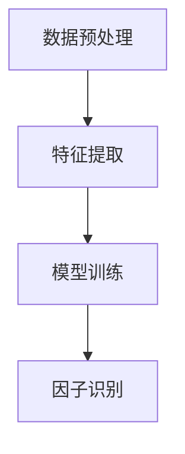
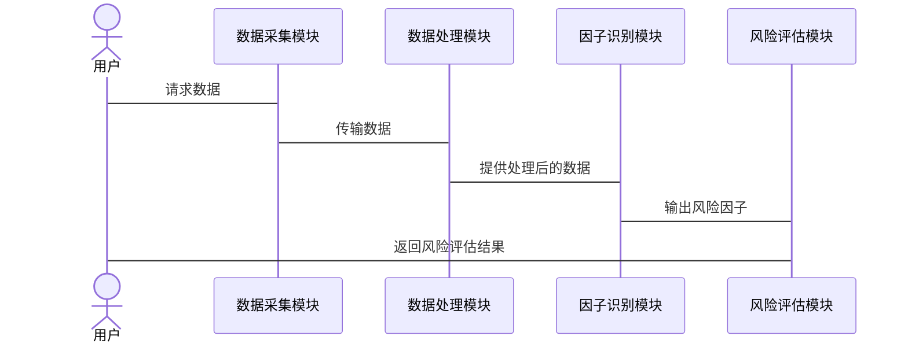

                 


# 《金融市场风险因子识别系统》

---

## 关键词：
金融市场、风险因子、风险识别、算法原理、系统架构、项目实战

---

## 摘要：
金融市场风险因子识别系统是一种利用先进的数据分析和机器学习技术，从海量金融市场数据中提取关键风险因子，从而帮助投资者和金融机构更好地理解和管理市场风险的系统。本文将从风险因子识别的核心概念、算法原理、系统架构设计到项目实战，进行全面而深入的探讨，帮助读者掌握金融市场风险因子识别的核心方法和技术。

---

## 目录大纲

### 第一部分：金融市场风险因子识别系统概述

#### 第1章：金融市场风险因子概述

##### 1.1 风险的概念与特征
- 1.1.1 风险的定义
- 1.1.2 风险在金融市场的表现形式
- 1.1.3 风险因子的核心概念

##### 1.2 风险因子识别的背景与意义
- 1.2.1 金融市场波动的复杂性
- 1.2.2 风险因子识别的重要性
- 1.2.3 风险因子识别的现实需求

##### 1.3 风险因子识别的边界与外延
- 1.3.1 风险因子的范围界定
- 1.3.2 风险因子识别的局限性
- 1.3.3 风险因子与其他金融概念的关系

##### 1.4 本章小结

### 第二部分：风险因子识别的核心概念与联系

#### 第2章：风险因子识别的核心原理

##### 2.1 风险因子的分类与属性
- 2.1.1 系统性风险因子
- 2.1.2 非系统性风险因子
- 2.1.3 风险因子的量化特征

##### 2.2 风险因子识别的数学模型
- 2.2.1 单因子模型
- 2.2.2 多因子模型
- 2.2.3 因子权重的计算方法

##### 2.3 风险因子识别的ER实体关系图
```mermaid
er
actor: 风险因子识别系统
entity: 风险因子
entity: 市场数据
entity: 风险事件
```

##### 2.4 本章小结

### 第三部分：风险因子识别的算法原理

#### 第3章：风险因子识别的算法实现

##### 3.1 基于因子分析法的算法原理
- 3.1.1 因子分析法的基本原理
- 3.1.2 因子分析法的数学模型
$$ F = \sum_{i=1}^{n} w_i x_i $$
其中，\( F \) 表示风险因子，\( w_i \) 表示权重，\( x_i \) 表示市场数据。

##### 3.2 基于机器学习的算法实现
- 3.2.1 机器学习在风险因子识别中的应用
- 3.2.2 常见的机器学习算法（如随机森林、神经网络）
- 3.2.3 算法实现的步骤与流程


##### 3.3 算法实现的Python代码示例
```python
import pandas as pd
from sklearn.ensemble import RandomForestClassifier

# 数据预处理
data = pd.read_csv('market_data.csv')
features = data.drop('risk_factor', axis=1)
target = data['risk_factor']

# 模型训练
model = RandomForestClassifier()
model.fit(features, target)

# 因子识别
feature_importances = pd.DataFrame({'feature': features.columns, 'importance': model.feature_importances_})
feature_importances = feature_importances.sort_values('importance', ascending=False)
print(feature_importances)
```

##### 3.4 本章小结

### 第四部分：风险因子识别的系统架构设计

#### 第4章：风险因子识别系统的架构设计

##### 4.1 问题场景介绍
- 4.1.1 系统的目标与范围
- 4.1.2 系统的输入与输出
- 4.1.3 系统的用户角色与权限

##### 4.2 系统功能设计
- 4.2.1 数据采集模块
- 4.2.2 数据处理模块
- 4.2.3 因子识别模块
- 4.2.4 风险评估模块

##### 4.3 系统架构设计


##### 4.4 系统接口设计
- 4.4.1 数据接口
- 4.4.2 模型接口
- 4.4.3 用户接口

##### 4.5 系统交互流程


##### 4.6 本章小结

### 第五部分：风险因子识别的项目实战

#### 第5章：项目实战与案例分析

##### 5.1 环境安装与配置
- 5.1.1 Python环境搭建
- 5.1.2 依赖库安装
- 5.1.3 数据源获取

##### 5.2 系统核心实现
- 5.2.1 数据采集模块实现
- 5.2.2 数据处理模块实现
- 5.2.3 因子识别模块实现
- 5.2.4 风险评估模块实现

##### 5.3 项目案例分析
- 5.3.1 案例背景介绍
- 5.3.2 数据分析与处理
- 5.3.3 因子识别与评估
- 5.3.4 结果解读与应用

##### 5.4 项目总结
- 5.4.1 项目成果
- 5.4.2 项目经验
- 5.4.3 项目改进建议

##### 5.5 本章小结

### 第六部分：风险因子识别系统的优化与展望

#### 第6章：系统优化与未来展望

##### 6.1 系统优化建议
- 6.1.1 算法优化
- 6.1.2 系统性能优化
- 6.1.3 用户体验优化

##### 6.2 未来研究方向
- 6.2.1 新型算法的研究与应用
- 6.2.2 风险因子识别的智能化发展
- 6.2.3 全球金融市场风险的协同识别

##### 6.3 本章小结

---

## 作者：AI天才研究院（AI Genius Institute） & 禅与计算机程序设计艺术（Zen And The Art of Computer Programming）

---

以上是《金融市场风险因子识别系统》的技术博客文章的详细目录大纲，涵盖了从理论到实践的各个方面，逻辑清晰，结构紧凑，适合深入探讨和学习金融市场风险因子识别的核心技术和方法。

