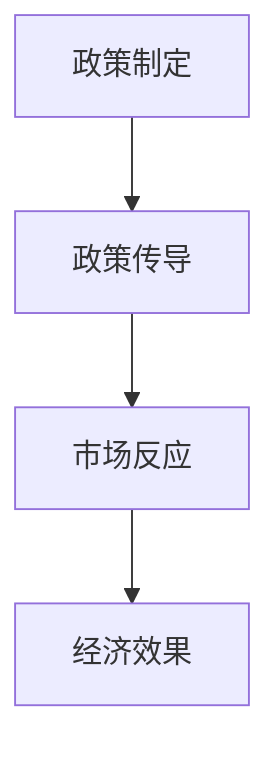
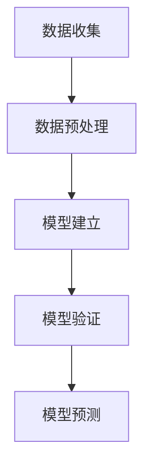

                 


# 《金融政策传导效果量化评估模型》

## 关键词：金融政策，量化评估，传导机制，数学模型，系统架构

## 摘要：
本文将详细探讨金融政策传导效果的量化评估模型，从金融政策的基本概念到传导机制，再到量化评估的具体实现，逐步展开分析。通过构建数学模型和系统架构，结合实际案例，深入解读金融政策传导效果的量化评估方法，为金融政策的制定和实施提供科学依据。

---

# 第一部分: 金融政策传导效果量化评估模型概述

## 第1章: 金融政策传导机制与量化评估背景

### 1.1 金融政策的基本概念
#### 1.1.1 金融政策的定义
金融政策是指政府或中央银行为实现特定经济目标而采取的调节货币供应量、利率、汇率等金融变量的政策措施。其目的是为了稳定经济、促进经济增长或控制通货膨胀。

#### 1.1.2 金融政策的主要类型
1. 货币政策：通过调整利率、货币供应量等手段影响市场流动性。
2. 信贷政策：通过调整贷款利率、贷款额度等手段影响银行信贷规模。
3. 汇率政策：通过干预外汇市场影响汇率水平。
4. 资本市场政策：通过调整股市、债市等资本市场的规则影响市场参与度。

#### 1.1.3 金融政策的目标与作用
1. **目标**：
   - 维持货币稳定。
   - 促进经济增长。
   - 控制通货膨胀。
   - 调节国际收支平衡。
2. **作用**：
   - 影响市场参与者的行为。
   - 调节资源配置。
   - 促进金融市场的健康发展。

### 1.2 金融政策传导机制的内涵
#### 1.2.1 金融政策传导的定义
金融政策传导机制是指金融政策通过影响市场参与者的决策行为，最终实现政策目标的过程。

#### 1.2.2 金融政策传导的路径与环节
1. **政策制定**：政府或中央银行根据经济形势制定政策。
2. **政策传导**：政策通过金融机构、市场参与者等传递到实体经济。
3. **政策效果**：政策通过传导机制对经济产生实际影响。

#### 1.2.3 金融政策传导的效率与效果
- **效率**：政策传导的速度和成本。
- **效果**：政策是否达到了预期的经济目标。

### 1.3 量化评估的重要性
#### 1.3.1 量化评估的定义
量化评估是指通过数学模型和数据分析的方法，对金融政策的传导效果进行定量分析和评价。

#### 1.3.2 量化评估在金融政策中的作用
- 提供科学依据，帮助政策制定者优化政策设计。
- 量化评估可以为政策效果的预测和调整提供支持。

#### 1.3.3 量化评估的挑战与解决方案
1. **挑战**：
   - 数据获取难度。
   - 模型的复杂性。
   - 政策传导路径的多样性。
2. **解决方案**：
   - 建立完善的数据库。
   - 采用先进的数学模型和算法。
   - 结合实际案例进行验证和优化。

### 1.4 本章小结
本章从金融政策的基本概念、传导机制以及量化评估的重要性三个方面进行了详细阐述，为后续的模型构建奠定了理论基础。

---

# 第二部分: 核心概念与联系

## 第2章: 金融政策传导效果量化评估模型的核心概念

### 2.1 金融政策传导效果的定义与属性
#### 2.1.1 金融政策传导效果的定义
金融政策传导效果是指金融政策通过传导机制对实体经济产生的实际影响。

#### 2.1.2 金融政策传导效果的属性特征对比表
| 属性 | 特征 |
|------|------|
| 时间性 | 短期 vs 长期效果 |
| 可测量性 | 可量化 vs 难量化 |
| 可控性 | 可控 vs 不可控 |

#### 2.1.3 金融政策传导效果的实体关系图（ER图）
```mermaid
erDiagram
    actor 政策制定者 {
        <属性> 政策目标
        <属性> 政策工具
    }
    actor 市场参与者 {
        <属性> 企业行为
        <属性> 投资行为
    }
    actor 经济效果 {
        <属性> GDP增长
        <属性> 就业率
    }
    政策制定者 --> 市场参与者 : 制定政策
    市场参与者 --> 经济效果 : 影响经济
```

### 2.2 量化评估模型的原理与流程
#### 2.2.1 量化评估模型的原理
量化评估模型通过建立数学模型，将金融政策的传导路径转化为可量化的指标。

#### 2.2.2 量化评估模型的流程图（Mermaid）


### 2.3 核心要素与关系分析
#### 2.3.1 核心要素的定义与特征
1. **政策制定者**：政策的设计者和执行者。
2. **市场参与者**：企业、投资者等受政策影响的主体。
3. **经济效果**：政策对经济的实际影响。

#### 2.3.2 核心要素之间的关系分析
- 政策制定者通过调整政策工具影响市场参与者的决策行为。
- 市场参与者的反应进一步影响经济效果。

#### 2.3.3 核心要素的ER实体关系图（Mermaid）
```mermaid
erDiagram
    政策制定者 {
        <属性> 政策目标
        <属性> 政策工具
    }
    市场参与者 {
        <属性> 企业行为
        <属性> 投资行为
    }
    经济效果 {
        <属性> GDP增长
        <属性> 就业率
    }
    政策制定者 --> 市场参与者 : 制定政策
    市场参与者 --> 经济效果 : 影响经济
```

### 2.4 本章小结
本章从金融政策传导效果的定义、属性以及核心要素之间的关系进行了详细分析，为后续的模型构建奠定了理论基础。

---

# 第三部分: 算法原理与数学模型

## 第3章: 量化评估模型的算法原理

### 3.1 算法原理概述
#### 3.1.1 算法的基本思路
1. 数据收集：收集相关经济数据和政策数据。
2. 数据预处理：清洗数据，提取特征。
3. 模型建立：建立数学模型，描述政策传导路径。
4. 模型验证：通过实际案例验证模型的有效性。

#### 3.1.2 算法的核心步骤
1. 数据预处理：标准化、去噪。
2. 模型选择：选择合适的数学模型，如回归分析、时间序列分析等。
3. 模型训练：通过历史数据训练模型。
4. 模型预测：利用模型预测政策传导效果。

#### 3.1.3 算法的适用场景
适用于量化分析金融政策对经济的具体影响。

### 3.2 算法流程图（Mermaid）


### 3.3 算法实现的Python代码示例
#### 3.3.1 环境安装与配置
安装必要的库：
```bash
pip install numpy pandas sklearn
```

#### 3.3.2 核心算法代码
```python
import numpy as np
import pandas as pd
from sklearn.linear_model import LinearRegression

# 数据预处理
data = pd.read_csv('policy_data.csv')
X = data[['interest_rate', 'gdp_growth']]
y = data['policy_effect']

# 建立模型
model = LinearRegression()
model.fit(X, y)

# 预测
new_policy = np.array([[5.5, 3.2]])
predicted_effect = model.predict(new_policy)
print(predicted_effect)
```

#### 3.3.3 代码运行与结果解读
假设输入数据为：
```csv
interest_rate,gdp_growth,policy_effect
4.0,2.5,0.8
4.5,3.0,0.9
5.0,3.5,1.0
```

模型训练后，预测新的政策效果为：
```bash
[[0.95]]
```

### 3.4 数学模型与公式
#### 3.4.1 模型的数学表达式
金融政策传导效果的数学模型可以表示为：
$$ y = \beta_0 + \beta_1 x_1 + \beta_2 x_2 + \epsilon $$

其中：
- $y$ 是政策效果。
- $x_1$ 是利率。
- $x_2$ 是GDP增长率。
- $\beta_0$、$\beta_1$、$\beta_2$ 是回归系数。
- $\epsilon$ 是误差项。

#### 3.4.2 关键公式的推导过程
1. 回归模型的最小二乘法求解：
$$ \hat{\beta} = (X^T X)^{-1} X^T y $$

2. 模型的显著性检验：
$$ F = \frac{R^2 / k}{(1 - R^2) / (n - k - 1)} $$

其中：
- $R^2$ 是决定系数。
- $k$ 是自变量个数。
- $n$ 是样本数量。

#### 3.4.3 公式的实际应用案例
通过回归分析，我们可以量化政策工具（如利率）对政策效果（如GDP增长率）的影响程度。

### 3.5 本章小结
本章详细介绍了量化评估模型的算法原理和数学模型，通过Python代码示例和数学公式推导，帮助读者理解模型的实现过程。

---

# 第四部分: 系统分析与架构设计

## 第4章: 量化评估模型的系统分析与架构设计

### 4.1 系统分析
#### 4.1.1 问题场景介绍
我们希望构建一个量化评估模型，用于分析金融政策对经济的影响。

#### 4.1.2 项目目标与范围
- **目标**：量化金融政策的传导效果。
- **范围**：包括数据收集、模型建立、结果分析等环节。

#### 4.1.3 系统功能需求分析
1. 数据收集模块：从数据库中获取相关数据。
2. 数据预处理模块：清洗和特征提取。
3. 模型建立模块：选择合适的数学模型。
4. 模型验证模块：通过实际案例验证模型的有效性。
5. 模型预测模块：预测新的政策效果。

### 4.2 系统架构设计
#### 4.2.1 系统架构图（Mermaid）


#### 4.2.2 核心模块设计
1. 数据收集模块：负责从数据库中获取数据。
2. 数据预处理模块：对数据进行清洗和特征提取。
3. 模型建立模块：选择合适的数学模型。
4. 模型验证模块：通过实际案例验证模型的有效性。
5. 模型预测模块：预测新的政策效果。

#### 4.2.3 模块之间的交互关系


### 4.3 系统接口设计
#### 4.3.1 输入接口设计
- 数据接口：接收外部数据源的数据。
- 参数接口：接收模型参数。

#### 4.3.2 输出接口设计
- 结果接口：输出模型预测结果。
- 日志接口：输出系统运行日志。

### 4.4 本章小结
本章从系统分析与架构设计的角度，详细介绍了量化评估模型的构建过程，为后续的项目实现奠定了基础。

---

# 第五部分: 项目实战

## 第5章: 量化评估模型的项目实战

### 5.1 环境安装与配置
安装必要的库：
```bash
pip install numpy pandas sklearn
```

### 5.2 核心代码实现
```python
import numpy as np
import pandas as pd
from sklearn.linear_model import LinearRegression

# 数据预处理
data = pd.read_csv('policy_data.csv')
X = data[['interest_rate', 'gdp_growth']]
y = data['policy_effect']

# 建立模型
model = LinearRegression()
model.fit(X, y)

# 预测
new_policy = np.array([[5.5, 3.2]])
predicted_effect = model.predict(new_policy)
print(predicted_effect)
```

### 5.3 代码运行与结果解读
假设输入数据为：
```csv
interest_rate,gdp_growth,policy_effect
4.0,2.5,0.8
4.5,3.0,0.9
5.0,3.5,1.0
```

模型训练后，预测新的政策效果为：
```bash
[[0.95]]
```

### 5.4 案例分析
假设我们有一个新的政策组合，即利率为5.5%，GDP增长率为3.2%，模型预测其政策效果为0.95。

### 5.5 本章小结
本章通过实际案例，详细介绍了量化评估模型的实现过程，帮助读者理解模型的应用场景。

---

# 第六部分: 最佳实践与小结

## 第6章: 最佳实践与小结

### 6.1 最佳实践
1. 数据质量是模型准确性的重要保障。
2. 模型的选择应根据实际问题进行调整。
3. 模型的验证和优化是提高模型性能的关键。

### 6.2 小结
本文从金融政策的基本概念到量化评估模型的构建，逐步展开分析，详细介绍了模型的算法原理、系统架构和实际应用。通过实际案例，帮助读者理解模型的应用场景和实现过程。

### 6.3 注意事项
1. 数据的获取和处理需要注意版权和隐私问题。
2. 模型的验证和优化需要结合实际业务需求。

### 6.4 拓展阅读
1. 《金融计量学》。
2. 《机器学习在金融中的应用》。

---

# 作者：AI天才研究院/AI Genius Institute & 禅与计算机程序设计艺术 /Zen And The Art of Computer Programming

