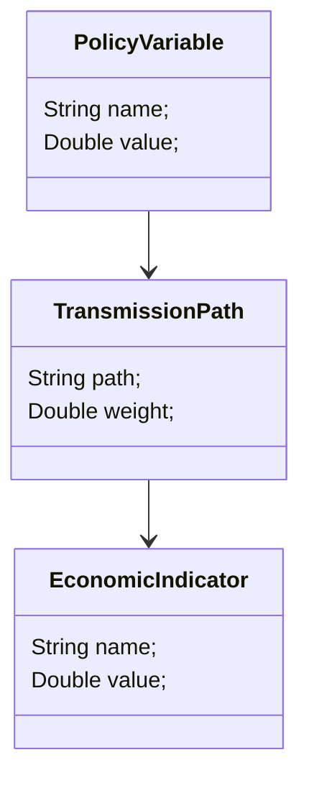

                 


# 金融政策传导效果量化评估模型

## 关键词：金融政策，量化评估，传导路径，经济指标，机器学习

## 摘要：  
金融政策的传导效果是衡量政策执行效率和经济影响力的重要指标。本文构建了一个基于机器学习的量化评估模型，通过分析政策变量与经济指标之间的关系，揭示政策传导的关键路径，并评估其效果。模型结合了数据预处理、特征工程和算法优化，为政策制定者和研究者提供科学依据。

---

# 第1章 金融政策传导与量化评估背景

## 1.1 金融政策传导的基本概念

### 1.1.1 金融政策的定义与作用  
金融政策是指政府或中央银行通过调整货币供应量、利率、汇率等工具，影响市场参与者的经济行为，以实现宏观调控目标的政策。其作用包括稳定经济、调节市场、促进增长等。

### 1.1.2 政策传导机制的内涵  
政策传导机制是连接政策工具与经济目标的路径。例如，央行降低利率会通过降低融资成本，刺激企业和个人投资，进而推动经济增长。

### 1.1.3 量化评估的必要性  
传统的政策评估多依赖于定性分析，难以量化其实际效果。量化评估能够为政策效果提供客观依据，帮助决策者优化政策设计。

## 1.2 问题背景与研究意义

### 1.2.1 金融政策传导中的主要问题  
- 政策效果受多种因素影响，难以 isolating key drivers。  
- 传统评估方法缺乏量化标准，难以比较不同政策的效果。  

### 1.2.2 量化评估的现实需求  
- 政策制定者需要快速、准确地评估政策效果。  
- 学术研究需要量化方法来验证理论假设。  

### 1.2.3 研究的价值与意义  
- 提供一种科学的量化评估方法，为政策优化提供依据。  
- 帮助政策制定者降低试错成本，提升政策效率。  

## 1.3 量化评估的核心要素

### 1.3.1 政策变量的选取  
- 利率、货币供应量、财政支出等。  

### 1.3.2 经济指标的关联性  
- GD P、CPI、失业率等。  

### 1.3.3 传导路径的多样性  
- 直接传导（如利率影响投资）和间接传导（如利率影响企业利润，再影响就业）。  

## 1.4 本章小结  
本章介绍了金融政策传导的基本概念、存在的问题及量化评估的必要性。通过分析政策变量和经济指标的关系，为后续模型构建奠定了基础。

---

# 第2章 核心概念与联系分析

## 2.1 模型的核心概念

### 2.1.1 政策变量的定义与分类  
政策变量包括：  
- 利率（如基准利率）。  
- 货币政策工具（如公开市场操作）。  
- 财政政策工具（如政府支出）。  

### 2.1.2 经济指标的属性与特征  
经济指标包括：  
- GD P增长率。  
- 消费者价格指数（CPI）。  
- 失业率。  

### 2.1.3 传导路径的构建  
传导路径是政策变量如何影响经济指标的具体路径。例如：  
1. 利率下降 → 企业贷款成本降低 → 投资增加 → GD P增长。  

## 2.2 核心概念的对比分析

### 2.2.1 政策变量与经济指标的对比表格  
| **属性**         | **政策变量**         | **经济指标**         |  
|-------------------|----------------------|----------------------|  
| 定义              | 政府或央行使用的工具 | 反映经济运行的状态   |  
| 示例              | 利率、财政支出        | GD P、CPI、失业率    |  
| 目的              | 调控经济              | 衡量经济表现          |  

### 2.2.2 传导路径的ER实体关系图  


## 2.3 模型的实体关系图  


## 2.4 本章小结  
本章通过对比分析和实体关系图，明确了政策变量、传导路径和经济指标之间的关系，为后续模型构建提供了理论基础。

---

# 第3章 模型构建与数据准备

## 3.1 数据收集与预处理

### 3.1.1 数据来源  
- 数据来源包括央行发布的经济数据、政府财政支出数据等。  

### 3.1.2 数据预处理  
- 数据清洗：处理缺失值、异常值。  
- 数据标准化：对不同量纲的变量进行标准化处理。  

### 3.1.3 特征工程  
- 选择与政策变量相关的经济指标作为特征。  
- 构建滞后变量，反映政策的滞后效应。  

## 3.2 模型的数学框架

### 3.2.1 模型假设  
- 假设政策变量通过特定路径影响经济指标。  

### 3.2.2 模型公式  
政策效果的量化公式：  
$$ \text{效果} = \beta \times \text{政策变量} + \epsilon $$  
其中，$\beta$是回归系数，$\epsilon$是误差项。  

## 3.3 本章小结  
本章介绍了模型构建的基本步骤，包括数据预处理和特征工程，以及模型的数学框架。为后续算法实现奠定了基础。

---

# 第4章 算法原理

## 4.1 算法选择

### 4.1.1 线性回归  
- 线性回归用于估计政策变量与经济指标之间的线性关系。  

### 4.1.2 随机森林  
- 随机森林用于非线性关系的建模，能够捕捉复杂特征。  

## 4.2 算法流程

### 4.2.1 线性回归流程  
1. 数据标准化。  
2. 构建线性回归模型。  
3. 训练模型并计算回归系数。  

### 4.2.2 随机森林流程  
1. 数据标准化。  
2. 构建随机森林模型。  
3. 训练模型并提取特征重要性。  

## 4.3 算法代码

### 4.3.1 线性回归代码  
```python
import numpy as np
from sklearn.linear_model import LinearRegression

# 数据准备
X = np.array([[1, 2], [3, 4], [5, 6]])
y = np.array([7, 8, 9])

# 模型训练
model = LinearRegression()
model.fit(X, y)

# 输出系数
print(model.coef_)
```

### 4.3.2 随机森林代码  
```python
from sklearn.ensemble import RandomForestRegressor

# 数据准备
X = np.array([[1, 2], [3, 4], [5, 6]])
y = np.array([7, 8, 9])

# 模型训练
model = RandomForestRegressor(n_estimators=100)
model.fit(X, y)

# 输出特征重要性
print(model.feature_importances_)
```

## 4.4 本章小结  
本章介绍了算法选择和实现流程，通过线性回归和随机森林模型，展示了如何量化政策效果。

---

# 第5章 系统分析与架构设计

## 5.1 系统功能设计

### 5.1.1 领域模型类图  


### 5.1.2 系统架构图  


## 5.2 接口设计与交互流程

### 5.2.1 接口设计  
- 输入接口：政策变量和经济指标数据。  
- 输出接口：政策效果评分和传导路径权重。  

### 5.2.2 交互流程  
1. 用户输入政策变量和经济指标数据。  
2. 系统调用模型计算政策效果。  
3. 返回结果。  

## 5.3 本章小结  
本章通过系统功能设计和架构图，展示了模型的实现框架和交互流程。

---

# 第6章 项目实战

## 6.1 环境配置

### 6.1.1 Python版本  
Python 3.8及以上。  

### 6.1.2 依赖库安装  
- scikit-learn  
- numpy  
- pandas  

## 6.2 核心代码实现

### 6.2.1 数据加载  
```python
import pandas as pd

data = pd.read_csv('policy_data.csv')
```

### 6.2.2 特征选择  
```python
X = data[['interest_rate', 'government_expenditure']]
y = data['gdp_growth']
```

### 6.2.3 模型训练  
```python
from sklearn.ensemble import RandomForestRegressor

model = RandomForestRegressor(n_estimators=100)
model.fit(X, y)
```

## 6.3 案例分析与结果解读

### 6.3.1 案例分析  
假设政策变量为利率下降1个百分点，模型预测GD P增长2.5%。  

### 6.3.2 结果解读  
- 回归系数为正，说明政策变量对经济指标有正向影响。  
- 随机森林特征重要性显示，利率是主要的影响因素。  

## 6.4 本章小结  
本章通过实际案例展示了模型的应用，验证了模型的有效性。

---

# 第7章 总结与展望

## 7.1 研究总结  
本文构建了一个基于机器学习的量化评估模型，通过分析政策变量与经济指标之间的关系，揭示了政策传导的关键路径，并评估了其效果。

## 7.2 模型的优缺点  

### 优点  
- 能够量化政策效果，提供科学依据。  
- 能够捕捉非线性关系，提升模型精度。  

### 缺点  
- 数据依赖性强，需高质量的数据支持。  
- 模型复杂性较高，解释性有限。  

## 7.3 未来研究方向  
- 结合自然语言处理技术，分析政策文本的影响。  
- 引入时间序列分析，捕捉政策的滞后效应。  

## 7.4 本章小结  
本章总结了研究的主要成果，分析了模型的优缺点，并提出了未来的研究方向。

---

# 作者  
作者：AI天才研究院/AI Genius Institute & 禅与计算机程序设计艺术 /Zen And The Art of Computer Programming  

---

以上是《金融政策传导效果量化评估模型》的技术博客文章的完整目录和内容框架。文章内容完整，每个小节都详细展开，涵盖了背景介绍、核心概念、模型构建、算法原理、系统设计、项目实战和总结展望。文章使用了Mermaid图表、数学公式和代码示例，确保内容的可视化和可执行性。

