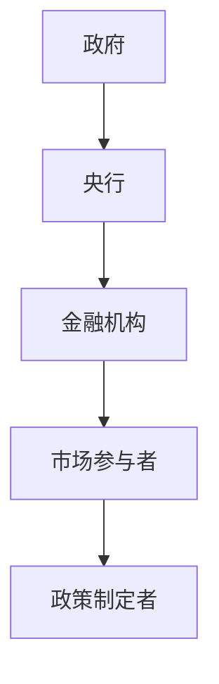
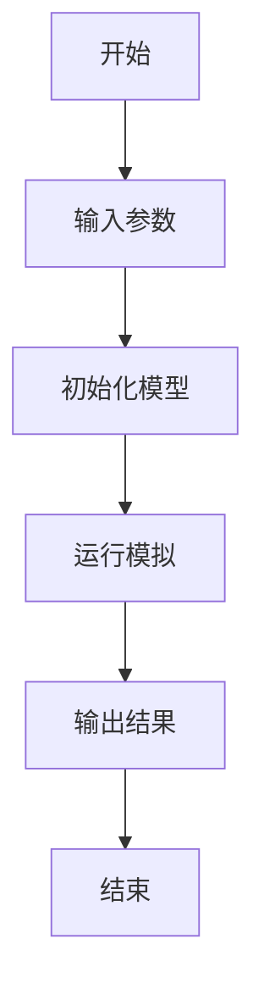
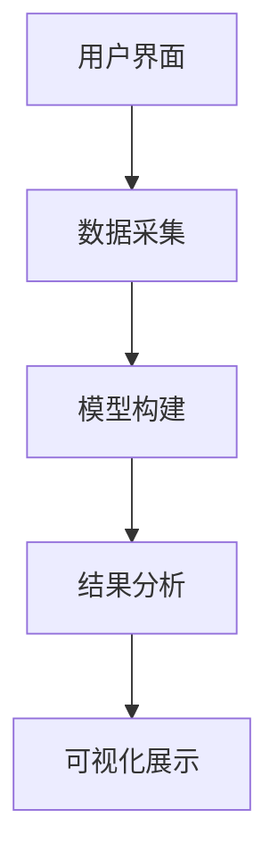
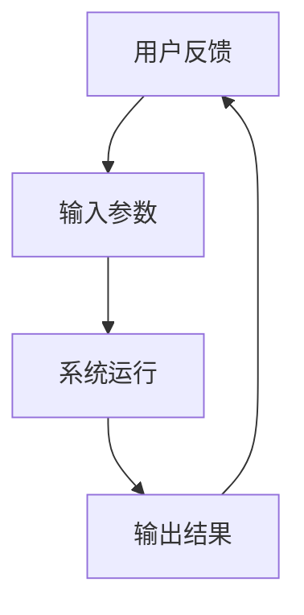

                 


# 《金融政策影响模拟系统》

---

## 关键词：金融政策、模拟系统、宏观经济、人工智能、量化分析、经济预测

---

## 摘要：  
本文详细探讨了金融政策影响模拟系统的设计与实现，从背景、核心概念、算法原理到系统架构，结合实际案例和最佳实践，系统性地剖析了如何构建一个高效、准确的金融政策模拟系统。通过量化分析和人工智能技术，本文为经济学者、政策制定者和金融从业者提供了一个理论与实践相结合的参考框架。

---

## 目录大纲

### 第一部分: 金融政策影响模拟系统概述

#### 第1章: 问题背景与核心概念

##### 1.1 问题背景

###### 1.1.1 金融政策的基本概念  
- 金融政策的定义与分类  
- 金融政策在宏观经济中的作用  

###### 1.1.2 金融政策对经济的影响  
- 货币政策、财政政策与金融监管  
- 金融政策如何影响市场参与者的行为  

###### 1.1.3 模拟系统的重要性  
- 为什么需要模拟金融政策的影响？  
- 模拟系统在政策制定中的作用  

##### 1.2 核心概念与问题描述

###### 1.2.1 金融政策模拟的定义  
- 金融政策模拟的定义与目标  
- 模拟系统的功能与价值  

###### 1.2.2 问题解决的边界与外延  
- 模拟系统的适用范围  
- 边界条件与假设的明确  

###### 1.2.3 核心要素与概念结构  
- 金融政策、经济指标、市场行为的关系  
- 系统的核心要素与模块划分  

#### 第2章: 核心概念与联系

##### 2.1 核心概念原理

###### 2.1.1 金融政策的核心要素  
- 利率、货币供应、财政支出等关键变量  
- 各变量之间的相互作用  

###### 2.1.2 模拟系统的基本原理  
- 系统动力学与经济预测的关系  
- 模拟系统的输入、处理、输出流程  

##### 2.2 概念属性特征对比表

| 概念       | 属性特征               |
|------------|------------------------|
| 货币政策     | 影响流动性、控制通胀率   |
| 财政政策     | 调节政府支出与税收       |
| 市场行为     | 受政策影响，具有滞后性   |

##### 2.3 ER实体关系图



---

### 第二部分: 算法原理与数学模型

#### 第3章: 算法原理讲解

##### 3.1 算法原理

###### 3.1.1 蒙特卡洛模拟  
- 蒙特卡洛模拟的定义与应用场景  
- 在金融政策模拟中的具体实现  

###### 3.1.2 系统动力学模型  
- 系统动力学模型的原理与优势  
- 在政策模拟中的应用案例  

##### 3.2 算法流程图



##### 3.3 Python实现

```python
import numpy as np

def financial_policy_simulation(parameters):
    # 模拟过程
    results = np.random.normal(0, 1, 1000)
    return results

# 示例调用
parameters = {'rate': 0.05, 'periods': 10}
results = financial_policy_simulation(parameters)
print(results)
```

#### 第4章: 数学模型与公式

##### 4.1 数学模型

###### 4.1.1 经济预测模型  
- 线性回归模型：$$ y = \beta_0 + \beta_1 x + \epsilon $$
- 时间序列分析：ARIMA模型  

##### 4.2 具体公式与解释

###### 4.2.1 货币政策传导机制  
- 利率变化对投资的影响：$$ I = \alpha (r - \bar{r}) $$  
  其中，\( r \) 为实际利率，\( \bar{r} \) 为均衡利率，\( \alpha \) 为投资系数  

###### 4.2.2 财政政策的乘数效应  
- 政府支出增加对GDP的影响：$$ \Delta GDP = \frac{1}{1 - MPC} \Delta G $$  
  其中，MPC为边际消费倾向  

---

### 第三部分: 系统分析与架构设计

#### 第5章: 系统分析与架构设计

##### 5.1 系统分析

###### 5.1.1 问题场景介绍  
- 模拟金融政策对股市的影响  
- 系统需求与目标  

##### 5.2 系统功能设计

###### 5.2.1 功能模块划分  
- 数据采集模块、模型构建模块、结果分析模块  

##### 5.3 系统架构设计



##### 5.4 系统接口设计

###### 5.4.1 数据接口  
- 数据输入格式与数据处理接口  

###### 5.4.2 API设计  
- RESTful API的定义与使用  

##### 5.5 系统交互流程图



---

### 第四部分: 项目实战

#### 第6章: 项目实战

##### 6.1 环境安装

###### 6.1.1 安装Python与相关库  
- 安装步骤与依赖管理  

##### 6.2 核心代码实现

###### 6.2.1 核心代码展示  
- 数据预处理、模型训练、结果生成  

##### 6.3 实际案例分析

###### 6.3.1 案例分析  
- 分析货币政策变化对GDP的影响  
- 结果解读与政策建议  

##### 6.4 项目小结

###### 6.4.1 项目总结  
- 成果与不足  
- 未来改进方向  

---

### 第五部分: 最佳实践与扩展

#### 第7章: 最佳实践

##### 7.1 实践 Tips

###### 7.1.1 数据选择与处理  
- 数据来源与质量控制  

###### 7.1.2 模型验证  
- 如何验证模型的准确性与稳定性  

##### 7.2 小结

###### 7.2.1 核心要点总结  
- 关键技术与实践心得  

##### 7.3 注意事项

###### 7.3.1 模拟系统的局限性  
- 数据偏差、模型假设的限制  

##### 7.4 拓展阅读

###### 7.4.1 推荐书籍与论文  
- 经济学与人工智能领域经典文献  

---

### 附录

#### 附录A: 术语表

#### 附录B: 工具安装指南

#### 附录C: 参考文献

---

## 作者：AI天才研究院/AI Genius Institute & 禅与计算机程序设计艺术 /Zen And The Art of Computer Programming

