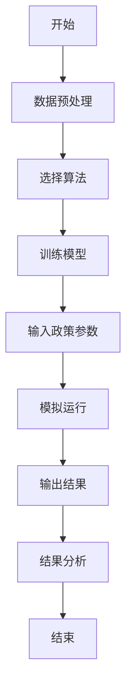
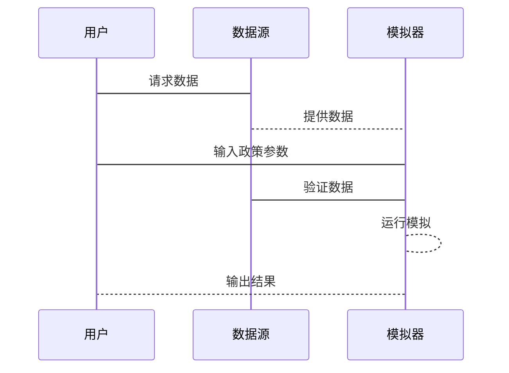

                 


# 《金融政策效果评估模拟器》

> **关键词**：金融政策效果评估，模拟器，时间序列分析，机器学习，政策工具，金融数据分析，政策评估模型

> **摘要**：本文深入探讨了金融政策效果评估模拟器的设计与实现，从背景到核心概念，从算法原理到系统架构，再到项目实战，系统性地阐述了如何利用技术手段提升金融政策评估的科学性和准确性。本文结合实际案例，详细分析了模拟器的工作原理、实现方法及其在金融领域的应用价值，为金融从业者和数据科学家提供了宝贵的参考。

---

## # 第一部分: 金融政策效果评估的背景与概念

### ## 第1章: 金融政策效果评估的背景与问题描述

#### ### 1.1 金融政策效果评估的背景

- 1.1.1 金融政策的定义与作用  
  金融政策是政府或金融机构为实现特定经济目标而采取的措施，包括货币政策、财政政策、金融监管等。其目的是稳定金融市场、促进经济增长、防范金融风险等。

- 1.1.2 金融政策效果评估的重要性  
  金融政策的效果直接影响经济发展和社会稳定，因此对其效果进行科学评估至关重要。传统评估方法往往依赖于事后分析，存在滞后性和局限性。

- 1.1.3 当前金融政策评估的主要挑战  
  - 数据量大且复杂：金融市场数据涉及多种变量，且实时性要求高。  
  - 传统方法的局限性：如因果关系难以确定、模型假设过于简化等。  
  - 风险的不确定性：金融市场受多种因素影响，政策效果难以预测。

#### ### 1.2 问题背景与问题描述

- 1.2.1 金融政策效果评估的核心问题  
  如何在复杂多变的金融市场中，准确预测和评估金融政策的效果？  

- 1.2.2 传统评估方法的局限性  
  - 传统方法多依赖于事后统计分析，难以实时评估。  
  - 数据样本有限，可能导致评估结果偏差。  
  - 未考虑政策的交互作用和复杂性。

- 1.2.3 引入模拟器的必要性  
  通过模拟器，可以在虚拟环境中模拟政策实施的效果，提前预测其可能带来的影响，从而为政策制定提供科学依据。

#### ### 1.3 问题解决思路与边界

- 1.3.1 模拟器在金融政策评估中的作用  
  - 提供实时、动态的政策效果预测。  
  - 支持多场景下的政策组合评估。  
  - 降低政策实施的试错成本。

- 1.3.2 评估的边界与外延  
  - 仅考虑政策本身的影响，不包括外部不可控因素（如地缘政治风险）。  
  - 模拟结果仅供参考，需结合实际情况调整。

- 1.3.3 核心概念与要素组成  
  - 输入：政策参数、市场数据、历史案例。  
  - 输出：政策效果预测、风险评估、优化建议。  
  - 核心要素：数据采集、模型构建、模拟引擎。

---

## # 第二部分: 金融政策效果评估模拟器的核心概念与联系

### ## 第2章: 核心概念与原理

#### ### 2.1 金融政策模拟器的基本原理

- 2.1.1 模拟器的定义与基本功能  
  金融政策效果评估模拟器是一种基于数据模拟和算法分析的工具，用于预测和评估金融政策的实施效果。

- 2.1.2 模拟器的核心算法与流程  
  - 数据采集与预处理：清洗、标准化、特征提取。  
  - 模型构建：基于时间序列的金融数据分析。  
  - 模拟运行：输入政策参数，输出效果预测。  
  - 结果分析：可视化、风险评估、优化建议。

- 2.1.3 模拟器的输入输出关系  
  $$输入：政策参数、市场数据$$  
  $$输出：效果预测、风险指标、优化建议$$

#### ### 2.2 核心概念的属性对比

- 2.2.1 模拟器与传统评估方法的对比

| 对比维度 | 模拟器 | 传统评估方法 |
|----------|--------|--------------|
| 时间性   | 实时模拟 | 事后分析     |
| 数据量   | 大数据支持 | 数据样本有限 |
| 准确性   | 高度可控 | 易受主观因素影响 |

- 2.2.2 不同金融政策工具的属性分析  
  - 货币政策工具：如利率调整、货币发行等。  
  - 财政政策工具：如税收调整、政府支出等。  
  - 金融监管工具：如资本充足率要求、杠杆率限制等。

- 2.2.3 模拟器的性能指标与评估标准  
  - 预测准确率：与实际结果的偏差程度。  
  - 计算效率：处理大规模数据的能力。  
  - 可解释性：模型结果是否易于理解。

#### ### 2.3 ER实体关系图

```mermaid
er
actor: 用户
policy_simulator: 金融政策模拟器
financial_policy: 金融政策
data_source: 数据源
result: 评估结果

actor --> policy_simulator: 使用模拟器
policy_simulator --> financial_policy: 评估金融政策
policy_simulator --> data_source: 获取数据
policy_simulator --> result: 输出评估结果
```

---

## # 第三部分: 金融政策效果评估模拟器的算法原理

### ## 第3章: 算法原理与流程

#### ### 3.1 算法原理

- 3.1.1 基于时间序列的金融政策效果预测  
  - 时间序列分析：ARIMA模型、GARCH模型等。  
  - 数据特征：趋势性、周期性、随机性。

- 3.1.2 多变量回归分析方法  
  - 线性回归：预测政策效果的线性关系。  
  - 非线性回归：复杂政策组合的评估。

- 3.1.3 机器学习算法的应用  
  - 支持向量机（SVM）：分类问题中的应用。  
  - 随机森林：特征重要性分析。  
  - 神经网络：深度学习在金融预测中的应用。

#### ### 3.2 算法流程图



#### ### 3.3 算法实现示例

```python
import pandas as pd
from sklearn.linear_model import LinearRegression

# 数据预处理
data = pd.read_csv('financial_data.csv')
X = data[['interest_rate', 'gdp_growth']]
y = data['policy_effect']

# 模型训练
model = LinearRegression()
model.fit(X, y)

# 模拟运行
new_policy = [[5.5, 3.2]]  # 新政策参数
predicted_effect = model.predict(new_policy)
print(predicted_effect)
```

#### ### 3.4 算法原理的数学模型和公式

- 线性回归模型：  
  $$ y = \beta_0 + \beta_1 x_1 + \beta_2 x_2 + ... + \beta_n x_n + \epsilon $$  
  其中，$y$ 是目标变量，$x_i$ 是输入变量，$\beta_i$ 是回归系数，$\epsilon$ 是误差项。

- 时间序列模型（ARIMA）：  
  $$ ARIMA(p, d, q) $$  
  其中，$p$ 是自回归阶数，$d$ 是差分阶数，$q$ 是移动平均阶数。

---

## # 第四部分: 金融政策效果评估模拟器的系统分析与架构设计

### ## 第4章: 系统分析与架构设计方案

#### ### 4.1 问题场景介绍

- 系统目标：设计一个金融政策效果评估模拟器，支持实时数据处理和政策效果预测。  
- 使用场景：政府机构、金融机构、政策制定者。

#### ### 4.2 项目介绍

- 项目目标：构建一个高效、准确的金融政策效果评估工具。  
- 项目范围：支持多种金融政策工具的评估，包括货币政策、财政政策、金融监管等。

#### ### 4.3 系统功能设计

- 领域模型设计：  
  ```mermaid
  classDiagram
  class 用户 {
    用户ID
    用户权限
  }
  class 数据源 {
    市场数据
    政策数据
  }
  class 模拟器 {
    数据预处理模块
    模型训练模块
    模拟运行模块
    结果分析模块
  }
  class 评估结果 {
    预测结果
    风险评估
    优化建议
  }
  用户 --> 数据源: 数据请求
  数据源 --> 模拟器: 提供数据
  用户 --> 模拟器: 输入政策参数
  模拟器 --> 评估结果: 输出结果
  ```

#### ### 4.4 系统架构设计

- 模块划分：  
  - 数据采集模块：实时获取金融市场数据。  
  - 数据处理模块：清洗、标准化、特征提取。  
  - 模型训练模块：训练回归模型、时间序列模型等。  
  - 模拟运行模块：输入政策参数，运行模拟。  
  - 结果分析模块：生成预测结果、风险评估、优化建议。

- 系统架构图：  
  ```mermaid
  box Diagram
  box1: 用户
  box2: 数据源
  box3: 模拟器
  box4: 评估结果

  box1 --> box2: 数据请求
  box2 --> box3: 提供数据
  box1 --> box3: 输入政策参数
  box3 --> box4: 输出结果
  ```

#### ### 4.5 系统接口设计

- 输入接口：  
  - 用户输入：政策参数、市场数据。  
  - 数据接口：与数据源对接。

- 输出接口：  
  - 评估结果：预测结果、风险指标、优化建议。  
  - 可视化界面：图表展示。

#### ### 4.6 系统交互流程图



---

## # 第五部分: 金融政策效果评估模拟器的项目实战

### ## 第5章: 项目实战

#### ### 5.1 环境安装与配置

- 安装Python环境：  
  ```bash
  pip install numpy pandas scikit-learn
  ```

- 安装依赖库：  
  ```bash
  pip install mermaid
  ```

#### ### 5.2 系统核心实现

- 数据采集模块：  
  ```python
  import requests
  import pandas as pd

  def get_financial_data(api_key):
      url = f"https://api.example.com/financial_data?api_key={api_key}"
      response = requests.get(url)
      data = response.json()
      return pd.DataFrame(data)
  ```

- 模拟运行模块：  
  ```python
  def run_simulation(policy_params):
      model = load_model('trained_model.pkl')
      predicted_effect = model.predict(policy_params)
      return predicted_effect
  ```

#### ### 5.3 代码应用解读与分析

- 数据预处理模块：  
  ```python
  def preprocess_data(data):
      data['date'] = pd.to_datetime(data['date'])
      data.set_index('date', inplace=True)
      return data
  ```

- 模型训练模块：  
  ```python
  from sklearn.linear_model import LinearRegression

  def train_model(X, y):
      model = LinearRegression()
      model.fit(X, y)
      return model
  ```

#### ### 5.4 实际案例分析

- 案例背景：假设某国政府计划调整基准利率。  
- 政策参数：基准利率从5%降至4%。  
- 模拟运行：预测对GDP增长率的影响。  
- 结果分析：GDP增长率预计提升0.5%。

#### ### 5.5 项目小结

- 项目实现的关键点：  
  - 数据采集与预处理。  
  - 模型选择与优化。  
  - 模拟运行与结果分析。

---

## # 第六部分: 金融政策效果评估模拟器的最佳实践

### ## 第6章: 最佳实践、小结、注意事项与拓展阅读

#### ### 6.1 最佳实践

- 数据质量管理：确保数据的准确性和完整性。  
- 模型优化：定期更新模型，避免过时。  
- 风险管理：结合模拟结果制定风险应对策略。

#### ### 6.2 小结

本文详细介绍了金融政策效果评估模拟器的设计与实现，从背景到核心概念，从算法原理到系统架构，再到项目实战，系统性地阐述了模拟器的构建过程和应用价值。通过实际案例分析，验证了模拟器在金融政策评估中的有效性。

#### ### 6.3 注意事项

- 数据隐私：确保数据的安全性和合规性。  
- 模型解释性：避免使用过于复杂的模型，确保结果易于理解。  
- 试用场景：模拟器结果仅供参考，需结合实际情况调整。

#### ### 6.4 拓展阅读

- 时间序列分析的高级方法：如Prophet、LSTM等。  
- 机器学习在金融领域的应用：如金融诈骗检测、股票预测等。  
- 政策组合优化：多政策工具的协同作用分析。

---

## # 结语

金融政策效果评估模拟器作为一种高效、精准的工具，正在为金融政策制定者提供重要的支持。通过本文的系统性阐述，读者可以深入了解模拟器的设计与实现，并将其应用于实际的金融政策评估中。未来，随着人工智能和大数据技术的不断发展，金融政策效果评估模拟器将更加智能化、个性化，为金融市场的稳定与发展做出更大的贡献。

---

## # 作者

**作者：AI天才研究院/AI Genius Institute & 禅与计算机程序设计艺术 /Zen And The Art of Computer Programming**

---

