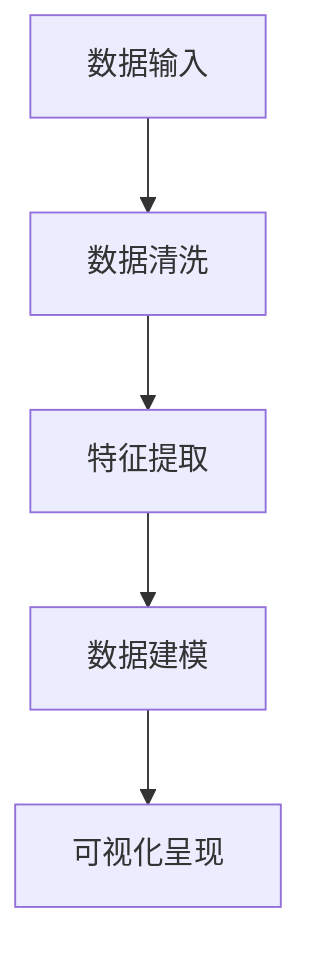

                 


# 金融数据可视化技术应用

## 关键词

- 金融数据可视化
- 数据分析
- 可视化技术
- 金融决策
- 数据处理

## 摘要

金融数据可视化技术在现代金融领域扮演着至关重要的角色。通过将复杂的金融数据转化为直观的图表，数据可视化技术帮助金融从业者快速理解数据、发现趋势、识别风险，并做出更明智的决策。本文深入探讨了金融数据可视化的核心概念、技术原理、系统架构设计以及实际应用案例，结合丰富的图表和代码示例，为读者提供了全面的技术解析。

---

# 第二部分: 数据可视化技术的核心要素

## 第4章: 数据预处理与特征提取

### 4.1 数据清洗与预处理
#### 4.1.1 数据清洗方法
#### 4.1.2 数据标准化与归一化
#### 4.1.3 数据缺失值的处理

### 4.2 特征工程与数据变换
#### 4.2.1 特征选择与提取
#### 4.2.2 数据变换与降维
#### 4.2.3 时间序列数据的处理

## 第5章: 数据分析与特征提取

### 5.1 数据分析的基本方法
#### 5.1.1 描述性分析
#### 5.1.2 预测性分析
#### 5.1.3 聚类分析

### 5.2 数据特征提取技术
#### 5.2.1 统计特征提取
#### 5.2.2 机器学习特征提取
#### 5.2.3 时间序列特征提取

## 第6章: 数据可视化技术的数学模型与算法原理

### 6.1 数据可视化的数学模型
#### 6.1.1 数据可视化中的线性代数基础
#### 6.1.2 数据可视化的概率统计基础
#### 6.1.3 数据可视化的优化算法

### 6.2 数据可视化算法的流程图


### 6.3 数据可视化算法的Python实现
#### 6.3.1 数据清洗与预处理
```python
import pandas as pd
data = pd.read_csv('financial_data.csv')
data_clean = data.dropna()
```

#### 6.3.2 数据分析与特征提取
```python
import numpy as np
from sklearn.decomposition import PCA

pca = PCA(n_components=2)
principal_components = pca.fit_transform(data_clean)
```

---

# 第三部分: 系统分析与架构设计方案

## 第7章: 问题场景与系统功能设计

### 7.1 问题场景介绍
#### 7.1.1 金融数据分析的常见场景
#### 7.1.2 数据可视化在金融决策中的作用
#### 7.1.3 系统设计的目标与范围

### 7.2 系统功能设计
#### 7.2.1 数据采集模块
#### 7.2.2 数据处理模块
#### 7.2.3 可视化展示模块

## 第8章: 系统架构设计

### 8.1 系统架构图


### 8.2 系统接口设计
#### 8.2.1 数据接口设计
#### 8.2.2 可视化接口设计
#### 8.2.3 用户交互接口设计

## 第9章: 系统交互设计

### 9.1 系统交互流程图


---

# 第四部分: 项目实战

## 第10章: 环境安装与核心实现

### 10.1 环境安装
#### 10.1.1 安装Python与Jupyter Notebook
#### 10.1.2 安装数据处理库（Pandas、NumPy）
#### 10.1.3 安装可视化库（Matplotlib、Seaborn、Plotly）

### 10.2 核心实现代码

#### 10.2.1 数据清洗与预处理
```python
import pandas as pd
data = pd.read_csv('financial_data.csv')
# 删除缺失值
data_clean = data.dropna()
# 标准化处理
from sklearn.preprocessing import StandardScaler
scaler = StandardScaler()
data_scaled = scaler.fit_transform(data_clean)
```

#### 10.2.2 数据分析与可视化
```python
import matplotlib.pyplot as plt
import seaborn as sns

# 绘制折线图
plt.figure(figsize=(10, 6))
sns.lineplot(x='date', y='price', data=data_scaled)
plt.title('Stock Price Trend')
plt.xlabel('Date')
plt.ylabel('Price')
plt.show()
```

## 第11章: 项目小结与优化建议

### 11.1 项目小结
#### 11.1.1 实践过程总结
#### 11.1.2 可视化效果分析
#### 11.1.3 项目经验总结

### 11.2 优化建议
#### 11.2.1 数据处理的优化
#### 11.2.2 可视化工具的优化
#### 11.2.3 系统架构的优化

---

# 第五部分: 最佳实践

## 第12章: 小结与注意事项

### 12.1 小结
#### 12.1.1 核心概念回顾
#### 12.1.2 技术要点总结
#### 12.1.3 实践中的关键经验

### 12.2 注意事项
#### 12.2.1 数据可视化的常见误区
#### 12.2.2 数据可视化的最佳实践
#### 12.2.3 数据可视化的未来发展

## 第13章: 拓展阅读与深入思考

### 13.1 拓展阅读
#### 13.1.1 数据可视化的经典书籍
#### 13.1.2 数据可视化的前沿技术
#### 13.1.3 数据可视化的研究方向

### 13.2 深入思考
#### 13.2.1 数据可视化的未来趋势
#### 13.2.2 数据可视化的伦理问题
#### 13.2.3 数据可视化的社会影响

---

# 作者

作者：AI天才研究院/AI Genius Institute & 禅与计算机程序设计艺术 /Zen And The Art of Computer Programming

