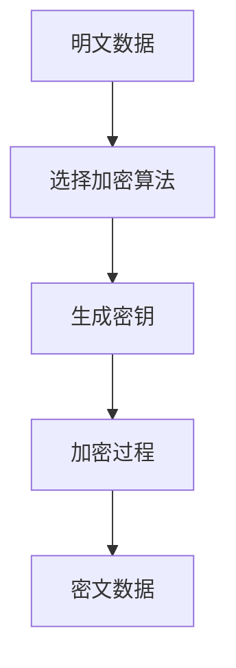
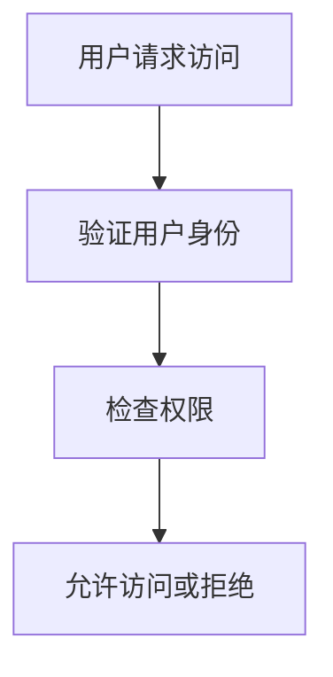
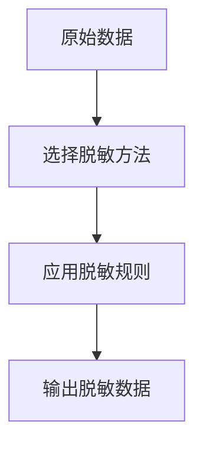
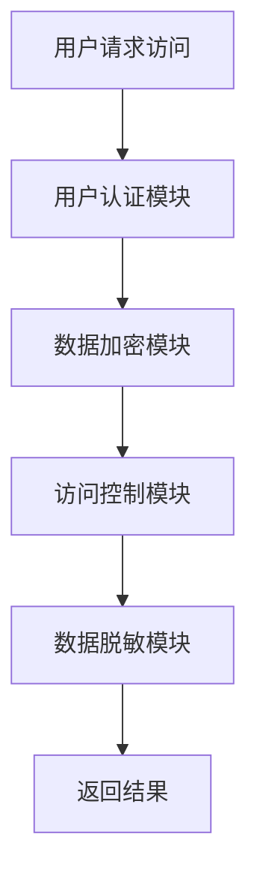
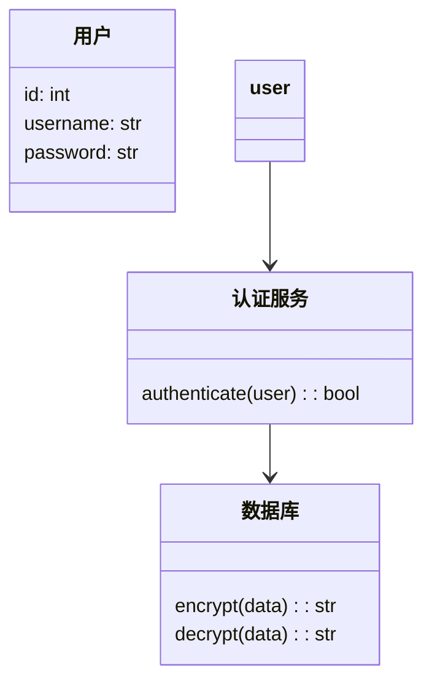
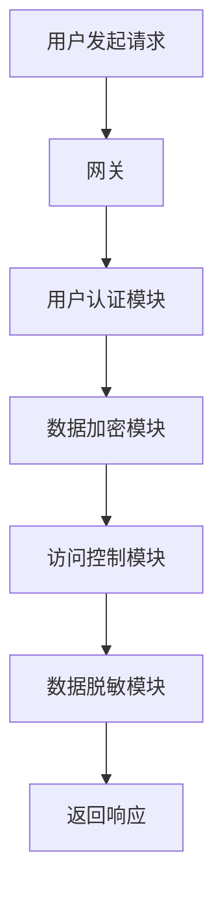

                 


# 《金融数据安全与隐私保护框架设计》

---

## 关键词
金融数据安全、隐私保护、数据加密、访问控制、安全架构

---

## 摘要
在数字化时代，金融数据的安全与隐私保护已成为全球关注的焦点。本文旨在设计一个全面的金融数据安全与隐私保护框架，涵盖数据加密、访问控制、系统架构设计以及实战案例分析。通过结合技术原理、系统设计和实际应用，本文为金融行业提供一套可操作的安全解决方案，帮助机构在保护数据安全的同时，实现高效的隐私保护。

---

# 第一章: 金融数据安全与隐私保护的背景与挑战

## 1.1 问题背景
### 1.1.1 金融数据的敏感性与价值
- 金融数据涉及个人隐私、交易记录和财务信息，具有高价值。
- 数据泄露可能导致身份盗窃、金融欺诈和声誉损失。

### 1.1.2 数字化时代的金融数据安全问题
- 在线交易的普及增加了数据暴露的风险。
- 黑客攻击和内部泄露的双重威胁。

### 1.1.3 金融隐私保护的法律与合规要求
- 各国法规（如GDPR、CCPA）对隐私保护的严格要求。
- 金融机构的合规责任和法律风险。

## 1.2 当前金融数据安全的现状与挑战
### 1.2.1 金融数据泄露的典型案例
- Equifax数据泄露事件分析。
- 数据泄露对企业的影响和教训。

### 1.2.2 数据孤岛与隐私保护的矛盾
- 数据孤岛导致的安全管理困难。
- 数据共享中的隐私保护挑战。

### 1.2.3 新兴技术对金融数据安全的影响
- 区块链技术在金融数据安全中的应用。
- 人工智能在安全威胁检测中的作用。

## 1.3 金融数据安全与隐私保护的目标
### 1.3.1 数据可用性、完整性和机密性的平衡
- 数据可用性与机密性之间的权衡。
- 数据完整性在防止篡改中的作用。

### 1.3.2 隐私保护的核心原则与实现路径
- 最小化数据收集原则。
- 数据匿名化与假名化技术。

### 1.3.3 金融数据安全框架的设计目标
- 保护数据在传输、存储和处理过程中的安全。
- 提供可追溯性和审计能力。

## 1.4 本章小结
- 金融数据安全与隐私保护是金融机构的核心任务。
- 面对复杂的安全威胁，需要构建全面的安全框架。

---

# 第二章: 金融数据安全与隐私保护的核心概念

## 2.1 数据安全的核心要素
### 2.1.1 数据完整性
- 数据完整性定义：确保数据在传输过程中未被篡改。
- 实现方法：使用哈希函数和数字签名。

### 2.1.2 数据机密性
- 数据机密性定义：防止未经授权的访问。
- 实现方法：加密技术和访问控制策略。

### 2.1.3 数据可用性
- 数据可用性定义：确保合法用户可以访问数据。
- 实现方法：容灾备份和高可用性架构。

## 2.2 隐私保护的关键属性
### 2.2.1 数据匿名化
- 数据匿名化定义：通过技术手段去除数据中的个人信息。
- 实现方法：数据脱敏和匿名化处理。

### 2.2.2 数据最小化
- 数据最小化定义：仅收集实现业务所需的最小数据。
- 实现方法：数据字段限制和数据生命周期管理。

### 2.2.3 数据持有者责任
- 数据持有者责任定义：确保数据处理符合隐私法规。
- 实现方法：数据访问日志和审计机制。

## 2.3 数据安全与隐私保护的对比与联系
### 2.3.1 数据安全与隐私保护的异同点
- 数据安全关注数据的整体保护，隐私保护关注个人数据的保护。
- 数据安全是隐私保护的基础，隐私保护是数据安全的目标之一。

### 2.3.2 数据安全与隐私保护的协同关系
- 数据加密技术在隐私保护中的应用。
- 访问控制策略在数据安全中的作用。

### 2.3.3 数据安全与隐私保护的权衡策略
- 数据可用性与隐私保护的平衡。
- 数据共享中的隐私保护策略。

## 2.4 本章小结
- 数据安全与隐私保护是相辅相成的关系。
- 理解核心概念是构建安全框架的基础。

---

# 第三章: 金融数据安全与隐私保护的技术原理

## 3.1 数据加密技术
### 3.1.1 加密算法原理
- 对称加密算法：AES、DES。
- 非对称加密算法：RSA、椭圆曲线加密。
- 加密算法的数学模型：
  $$ E(x) = (x + k) \mod 256 $$
  $$ D(y) = (y - k) \mod 256 $$

### 3.1.2 数据加密的实现流程
- 数据加密流程图（使用Mermaid）：



### 3.1.3 加密算法的代码实现
```python
import hashlib

def encrypt(plaintext, key):
    # 使用AES加密
    key = hashlib.sha256(key.encode()).digest()
    iv = bytes([0]*16)
    cipher = AES.new(key, AES.MODE_CBC, iv)
    plaintext = plaintext + b'\x00' * (16 - len(plaintext) % 16)
    ciphertext = cipher.encrypt(plaintext)
    return ciphertext

def decrypt(ciphertext, key):
    key = hashlib.sha256(key.encode()).digest()
    iv = bytes([0]*16)
    cipher = AES.new(key, AES.MODE_CBC, iv)
    plaintext = cipher.decrypt(ciphertext)
    return plaintext.strip(b'\x00')
```

## 3.2 访问控制机制
### 3.2.1 访问控制原理
- 基于角色的访问控制（RBAC）。
- 基于属性的访问控制（ABAC）。

### 3.2.2 访问控制的实现流程
- 访问控制流程图（使用Mermaid）：



### 3.2.3 访问控制的代码实现
```python
def authenticate(user):
    # 用户认证
    token = generate_token(user)
    return token

def authorize(token, resource):
    # 权限检查
    user = get_user_from_token(token)
    if user.role == 'admin':
        return True
    if resource in user.allowed_resources:
        return True
    return False
```

## 3.3 数据脱敏技术
### 3.3.1 数据脱敏原理
- 数据脱敏技术用于隐藏敏感信息。
- 常见的脱敏方法：替换、加密、部分遮盖。

### 3.3.2 数据脱敏的实现流程
- 数据脱敏流程图（使用Mermaid）：



## 3.4 本章小结
- 数据加密、访问控制和数据脱敏是金融数据安全的核心技术。
- 结合这些技术可以构建多层次的安全防护体系。

---

# 第四章: 金融数据安全与隐私保护的系统架构设计

## 4.1 系统功能设计
### 4.1.1 系统功能模块
- 用户认证模块、数据加密模块、访问控制模块、数据脱敏模块。

### 4.1.2 系统功能流程图（使用Mermaid）：



## 4.2 系统架构设计
### 4.2.1 分层架构设计
- 表现层、业务逻辑层、数据访问层。

### 4.2.2 系统架构图（使用Mermaid）：



## 4.3 系统接口设计
### 4.3.1 API接口定义
- RESTful API设计。
- 使用JSON格式传输数据。

### 4.3.2 接口安全设计
- 使用JWT实现无状态认证。
- HTTPS协议保证传输安全。

## 4.4 系统交互设计
### 4.4.1 用户与系统的交互流程图（使用Mermaid）：



## 4.5 本章小结
- 系统架构设计是实现金融数据安全的基础。
- 分层设计和模块化实现有助于提高系统的可维护性和扩展性。

---

# 第五章: 金融数据安全与隐私保护的项目实战

## 5.1 项目背景与需求分析
### 5.1.1 项目背景
- 某银行的客户身份验证系统。
- 系统需求：保护客户隐私，确保数据安全。

## 5.2 核心代码实现
### 5.2.1 环境搭建
- 安装Python和必要的库（如Django、Flask）。
- 配置数据库（如MySQL、PostgreSQL）。

### 5.2.2 数据加密实现
```python
from django.core.signing import Signer

signer = Signer()

# 加密
encrypted = signer.sign('Sensitive Data')

# 解密
decrypted = signer.unsign(encrypted)
```

### 5.2.3 访问控制实现
```python
from rest_framework.permissions import IsAuthenticated

class CustomPermission(IsAuthenticated):
    def has_permission(self, request, view):
        return super().has_permission(request, view) and request.user.role == 'admin'
```

## 5.3 项目部署与测试
### 5.3.1 系统部署
- 使用Docker容器化部署。
- 配置Nginx反向代理。

### 5.3.2 测试方案
- 功能测试：用户认证、数据加密、访问控制。
- 安全测试：渗透测试、代码审计。

## 5.4 案例分析与优化
### 5.4.1 案例分析
- 测试结果：系统通过OWASP Top 10安全测试。
- 性能优化：使用缓存减少数据库压力。

### 5.4.2 优化建议
- 定期更新加密算法。
- 增加日志监控和异常检测。

## 5.5 本章小结
- 通过项目实战可以验证理论设计的可行性。
- 实践中需要不断优化系统以应对新的安全威胁。

---

# 第六章: 金融数据安全与隐私保护的最佳实践

## 6.1 安全策略与管理
### 6.1.1 数据分类与分级
- 根据数据敏感性分级管理。
- 数据分类标准：PII、交易数据、用户数据。

### 6.1.2 安全审计与监控
- 实施日志审计。
- 部署实时监控系统。

## 6.2 技术实现与选型
### 6.2.1 加密算法的选择
- 根据数据类型选择合适的加密算法。
- 使用经过验证的开源加密库。

### 6.2.2 访问控制策略的优化
- 基于角色的访问控制（RBAC）。
- 使用细粒度的权限管理。

## 6.3 安全培训与意识提升
### 6.3.1 员工安全培训
- 定期进行安全培训。
- 提高员工的安全意识。

### 6.3.2 用户教育
- 提供安全提示。
- 教育用户保护个人隐私。

## 6.4 持续改进与创新
### 6.4.1 跟踪安全趋势
- 关注最新的安全威胁和漏洞。
- 学习先进的安全防护技术。

### 6.4.2 优化安全框架
- 定期评估和优化安全框架。
- 引入新兴技术（如零信任架构）。

## 6.5 本章小结
- 安全是一个持续的过程，需要不断改进和创新。
- 组织内部的安全文化和员工培训至关重要。

---

# 第七章: 总结与展望

## 7.1 核心内容总结
- 金融数据安全与隐私保护的重要性。
- 构建安全框架的核心技术和方法。

## 7.2 未来的发展方向
- 新兴技术在金融数据安全中的应用。
- 数据安全与隐私保护的全球化协作。

## 7.3 本章小结
- 金融数据安全与隐私保护是长期而艰巨的任务。
- 需要技术、管理和法律的多方面协同。

---

# 作者信息

作者：AI天才研究院/AI Genius Institute & 禅与计算机程序设计艺术/Zen And The Art of Computer Programming

---

通过以上目录结构，文章将系统地讲解金融数据安全与隐私保护的各个方面，结合理论与实践，为读者提供一个全面的框架设计。

