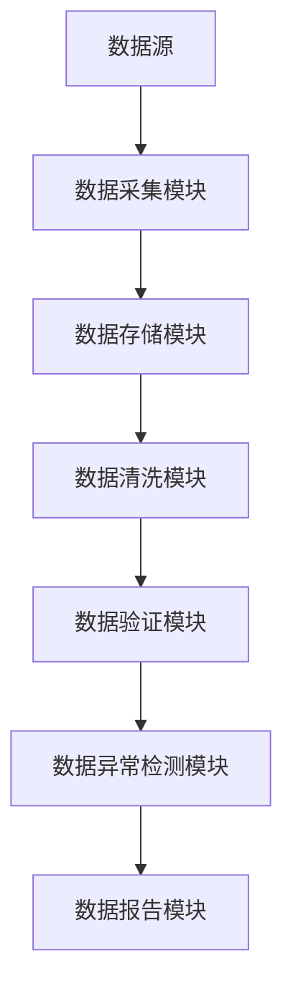

                 


# 《金融数据质量自动化监控系统》

---

## 关键词：
金融数据、数据质量、监控系统、数据清洗、异常检测、机器学习、实时监控

---

## 摘要：
金融数据的质量直接关系到金融机构的决策准确性和合规性。本文将详细探讨如何构建一个高效的金融数据质量自动化监控系统，从数据采集、清洗、分析到异常检测的全生命周期进行深入解析。通过结合机器学习算法和实时监控技术，提出一套系统化解决方案，旨在帮助金融机构提高数据质量，降低风险，提升业务效率。本文还将结合实际案例，分析系统设计的各个环节，并总结最佳实践。

---

## 第1章: 金融数据质量监控的背景与挑战

### 1.1 数据质量的重要性
#### 1.1.1 数据在金融领域的核心地位
金融行业高度依赖数据进行决策，从交易结算到风险评估，数据的准确性和完整性至关重要。任何数据质量问题都可能引发严重的经济损失或声誉损害。

#### 1.1.2 数据质量问题对企业的影响
数据不完整、错误或延迟可能导致交易失败、合规风险增加，甚至引发金融犯罪。例如，2008年金融危机部分源于数据质量问题导致的错误评估。

#### 1.1.3 金融行业对数据质量的特殊要求
金融数据需要满足**完整性**、**准确性**、**一致性**和**及时性**，这些要求比其他行业更为严格。

### 1.2 金融数据质量监控的挑战
#### 1.2.1 数据来源的多样性
金融数据可能来自多个系统，包括交易系统、客户数据库、市场数据等，不同数据源的格式和标准差异大，增加了监控的复杂性。

#### 1.2.2 数据格式的复杂性
金融数据格式多样，包括结构化数据（如表格数据）和非结构化数据（如文本、图像），需要采用多种处理方法。

#### 1.2.3 数据实时性与准确性的平衡
金融交易需要实时数据支持，但实时数据可能存在延迟或不准确的问题，如何在实时性与准确性之间找到平衡是关键挑战。

### 1.3 自动化监控的必要性
#### 1.3.1 传统数据监控的局限性
传统数据监控依赖人工检查，效率低、成本高，且容易出现疏漏。

#### 1.3.2 自动化监控的优势
自动化监控系统能够实时处理海量数据，快速识别异常，显著提高监控效率和准确性。

#### 1.3.3 未来发展趋势
随着人工智能和大数据技术的发展，金融数据监控将更加智能化，从被动响应转向主动预测。

### 1.4 本章小结
本章介绍了金融数据质量的重要性及其在行业中的特殊要求，分析了数据质量监控面临的挑战，并强调了自动化监控的必要性。

---

## 第2章: 数据质量的核心概念与维度

### 2.1 数据质量的定义与维度
#### 2.1.1 数据完整性
数据完整性指数据的完整性和一致性，包括字段完整性、记录完整性和参照完整性。

#### 2.1.2 数据准确性
数据准确性指数据反映真实情况的程度，是数据质量的核心指标。

#### 2.1.3 数据一致性
数据一致性指同一数据在不同系统或不同时间点保持一致。

#### 2.1.4 数据及时性
数据及时性指数据能够反映最新的业务状态，延迟越小越好。

#### 2.1.5 数据规范性
数据规范性指数据符合预定义的格式、标准和约束。

### 2.2 数据质量监控的核心要素
#### 2.2.1 数据源分析
分析数据来源的可靠性、格式和特点，为后续处理提供基础。

#### 2.2.2 数据特征提取
提取数据的关键特征，帮助识别数据中的模式和异常。

#### 2.2.3 数据异常检测
通过算法识别数据中的异常值或不符合规范的情况。

#### 2.2.4 数据修复与优化
对数据进行清洗、补全或标准化处理，确保数据符合业务需求。

### 2.3 数据质量监控的边界与外延
#### 2.3.1 监控范围的界定
明确监控的范围和目标，避免过度监控或遗漏重要数据。

#### 2.3.2 监控系统的功能边界
定义监控系统的功能模块和责任分工，确保各模块协同工作。

#### 2.3.3 数据质量与业务目标的关系
数据质量是业务目标实现的基础，需要结合业务需求进行优化。

### 2.4 本章小结
本章详细阐述了数据质量的核心概念和维度，并分析了监控的核心要素和边界。

---

## 第3章: 数据质量监控的核心概念与联系

### 3.1 数据质量监控的核心原理
#### 3.1.1 数据清洗原理
数据清洗是通过删除、修改或填充的方式处理数据中的错误或缺失值。

#### 3.1.2 数据标准化原理
数据标准化是将数据转换为统一的格式或标准，便于后续处理和分析。

#### 3.1.3 数据去重原理
数据去重是通过算法识别并删除重复数据，减少冗余。

#### 3.1.4 数据补全原理
数据补全是在数据缺失或不完整的情况下，通过插值或其他方法填充缺失值。

### 3.2 核心概念对比分析
#### 3.2.1 数据清洗与数据标准化的对比
| 对比维度         | 数据清洗               | 数据标准化           |
|------------------|------------------------|----------------------|
| 目标             | 修复错误或缺失数据     | 统一数据格式或标准   |
| 方法             | 删除、修改、填充       | 标准化、归一化       |
| 适用场景         | 数据预处理             | 数据特征提取         |

#### 3.2.2 数据去重与数据补全的对比
| 对比维度         | 数据去重               | 数据补全             |
|------------------|------------------------|----------------------|
| 目标             | 删除重复数据           | 填充缺失数据         |
| 方法             | 哈希算法、唯一键检查     | 插值法、模型预测     |
| 适用场景         | 数据存储优化           | 数据完整性保证       |

#### 3.2.3 数据特征提取与数据异常检测的联系
数据特征提取为异常检测提供基础，而异常检测的结果又可以反哺特征提取过程，优化数据质量。

### 3.3 数据质量监控的ER实体关系图
```mermaid
er
    actor: 监控系统
    data_source: 数据源
    data_storage: 数据存储
    data_cleaning: 数据清洗模块
    data_validation: 数据验证模块
    data_feature_extraction: 特征提取模块
    data_anomaly_detection: 异常检测模块
    data_report: 数据报告模块
```

---

## 第4章: 数据质量监控的算法原理与实现

### 4.1 数据清洗算法
#### 4.1.1 基于规则的清洗算法
根据预定义的规则（如正则表达式）清洗数据，适用于结构化数据。

#### 4.1.2 基于机器学习的清洗算法
使用聚类、分类等机器学习算法识别异常值，适用于非结构化数据。

### 4.2 数据异常检测算法
#### 4.2.1 基于统计的方法
使用均值、中位数、标准差等统计指标识别异常值。

#### 4.2.2 基于机器学习的方法
使用Isolation Forest、One-Class SVM等算法进行无监督学习，识别异常数据。

### 4.3 数据清洗与异常检测的Python实现
```python
import pandas as pd
from sklearn.ensemble import IsolationForest

# 数据清洗示例
df = pd.read_csv('data.csv')
df.dropna(inplace=True)  # 删除缺失值
df = df[df['amount'] > 0]  # 删除负数金额

# 异常检测示例
model = IsolationForest(random_state=42)
model.fit(df)
outliers = model.predict(df)
df['outliers'] = outliers
```

### 4.4 数据清洗的数学模型
#### 4.4.1 数据清洗的线性回归模型
$$ y = a x + b $$
其中，$y$是预测值，$x$是输入数据，$a$和$b$是模型参数。

#### 4.4.2 数据异常检测的概率模型
$$ P(y=1|x) = \frac{e^{w x + b}}{1 + e^{w x + b}} $$
其中，$w$是权重，$b$是偏置，$P(y=1|x)$是数据点为异常的概率。

### 4.5 本章小结
本章详细介绍了数据清洗和异常检测的算法原理，并通过Python代码和数学公式进行了实现和解释。

---

## 第5章: 金融数据质量监控系统的设计与实现

### 5.1 系统设计概述
#### 5.1.1 系统架构


#### 5.1.2 功能模块
- 数据采集模块：从多个数据源获取数据。
- 数据存储模块：将数据存储到数据库或数据仓库。
- 数据清洗模块：清洗数据，处理缺失值、重复值等。
- 数据验证模块：验证数据是否符合预定义的规则。
- 数据异常检测模块：使用机器学习算法检测异常值。
- 数据报告模块：生成监控报告，提供可视化界面。

### 5.2 系统实现
#### 5.2.1 数据采集
```python
import requests

response = requests.get('https://api.example.com/data')
data = response.json()
```

#### 5.2.2 数据清洗
```python
import pandas as pd

df = pd.DataFrame(data)
df.drop_duplicates(inplace=True)
df.dropna(inplace=True)
```

#### 5.2.3 数据异常检测
```python
from sklearn.ensemble import IsolationForest

model = IsolationForest(random_state=42)
model.fit(df)
outliers = model.predict(df)
df['is_outlier'] = outliers
```

### 5.3 系统优化
#### 5.3.1 性能优化
使用分布式计算和并行处理提升数据处理速度。

#### 5.3.2 灵活性优化
通过模块化设计，支持多种数据源和多种算法的灵活切换。

### 5.4 本章小结
本章详细介绍了金融数据质量监控系统的设计与实现过程，包括系统架构、功能模块和具体实现。

---

## 第6章: 项目实战与案例分析

### 6.1 项目背景
某银行需要监控其交易数据的质量，确保数据的完整性和准确性。

### 6.2 数据采集与处理
从银行交易系统中获取数据，清洗并存储到数据库中。

### 6.3 异常检测与报告
使用Isolation Forest算法检测异常交易，生成监控报告并通知相关人员。

### 6.4 案例分析
通过实际案例分析，验证系统的有效性和准确性。

### 6.5 本章小结
本章通过实际案例展示了金融数据质量监控系统的应用价值和具体实现。

---

## 第7章: 最佳实践与总结

### 7.1 最佳实践
#### 7.1.1 数据源管理
确保数据源的可靠性和多样性，避免单点故障。

#### 7.1.2 数据格式统一
制定统一的数据格式标准，减少数据处理的复杂性。

#### 7.1.3 系统可扩展性
设计模块化的系统架构，支持未来的扩展和升级。

### 7.2 本章小结
本章总结了金融数据质量监控系统的设计与实现过程，并提出了若干最佳实践建议。

---

## 作者：AI天才研究院/AI Genius Institute & 禅与计算机程序设计艺术/Zen And The Art of Computer Programming

---

以上是《金融数据质量自动化监控系统》的完整目录大纲和文章内容，希望对您有所帮助！

