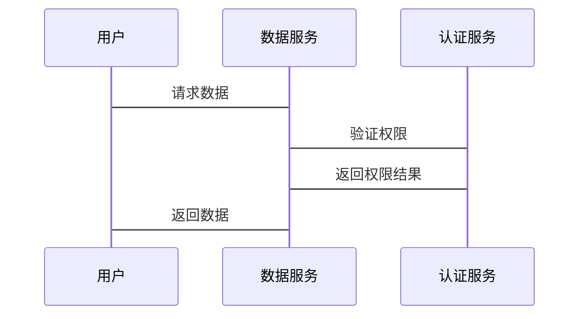

                 


# 《金融数据隐私保护技术》

## 关键词：金融数据、隐私保护、数据加密、数据脱敏、数据安全、数据访问控制

## 摘要：本文深入探讨金融数据隐私保护技术，涵盖数据隐私保护的核心概念、技术原理、系统架构设计及项目实战。内容包括数据加密、脱敏、访问控制等技术，结合实际案例分析，帮助读者掌握金融数据隐私保护的实现方法与最佳实践。

---

## 第一部分: 金融数据隐私保护技术基础

### 第1章: 金融数据隐私保护的背景与挑战

#### 1.1 金融数据隐私保护的背景
- 1.1.1 金融数据的重要性与敏感性
- 1.1.2 数据隐私保护的法律与合规要求
- 1.1.3 数字化金融时代的隐私保护需求

#### 1.2 金融数据隐私保护的核心问题
- 1.2.1 数据泄露的潜在风险
- 1.2.2 数据滥用与非法利用的现状
- 1.2.3 数据隐私与数据利用的平衡

#### 1.3 金融数据隐私保护的边界与外延
- 1.3.1 数据隐私保护的范围界定
- 1.3.2 相关概念的对比与区分
- 1.3.3 核心要素与组成结构

### 第2章: 金融数据隐私保护的核心概念与联系

#### 2.1 核心概念原理
- 2.1.1 数据隐私保护的基本原理
- 2.1.2 数据加密与脱敏技术
- 2.1.3 数据访问控制机制

#### 2.2 核心概念属性特征对比
- 2.2.1 数据隐私与数据安全的对比
- 2.2.2 数据加密与数据脱敏的特征分析
- 2.2.3 数据访问控制与数据共享的关联性

#### 2.3 ER实体关系图架构
```mermaid
er
    actor: 用户
    actor --> entity: 金融数据
    entity --> attribute: 数据字段
    entity --> attribute: 数据类型
    entity --> attribute: 数据敏感级别
    entity --> attribute: 数据访问权限
    actor --> relationship: 数据访问权限
    actor --> relationship: 数据加密策略
    actor --> relationship: 数据脱敏规则
```

---

## 第二部分: 金融数据隐私保护技术原理

### 第3章: 数据加密与隐私保护

#### 3.1 数据加密技术
- 3.1.1 加密算法分类
  - 对称加密算法
  - 非对称加密算法
  - 哈希函数
- 3.1.2 加密算法的数学模型
  - $$E(x) = x \times k \bmod p$$
  - $$D(y) = y \times k^{-1} \bmod p$$
- 3.1.3 加密与解密的流程图


#### 3.2 数据脱敏技术
- 3.2.1 数据脱敏的定义与目的
- 3.2.2 常见的脱敏方法
  - 替换脱敏
  - 截断脱敏
  - 加密脱敏
- 3.2.3 数据脱敏的实现流程


---

## 第三部分: 系统架构设计与实现

### 第4章: 金融数据隐私保护系统架构

#### 4.1 系统功能设计
- 4.1.1 数据采集模块
- 4.1.2 数据处理模块
- 4.1.3 数据存储模块
- 4.1.4 数据访问控制模块

#### 4.2 系统架构设计


#### 4.3 接口设计与交互
- 4.3.1 API接口设计
- 4.3.2 接口安全设计
- 4.3.3 交互流程图


---

## 第四部分: 项目实战与案例分析

### 第5章: 金融交易数据隐私保护系统

#### 5.1 项目背景与需求分析
- 5.1.1 项目背景
- 5.1.2 需求分析
- 5.1.3 项目目标

#### 5.2 系统设计与实现
- 5.2.1 系统设计
- 5.2.2 核心代码实现
  ```python
  def encrypt_data(data, key):
      return data * key % mod
  def decrypt_data(ciphertext, key):
      return ciphertext * pow(key, -1, mod)
  ```

#### 5.3 案例分析与结果展示
- 5.3.1 数据加密案例
- 5.3.2 数据脱敏案例
- 5.3.3 系统测试结果

---

## 第五部分: 总结与展望

### 第6章: 总结与展望

#### 6.1 技术总结
- 6.1.1 核心技术回顾
- 6.1.2 系统设计经验
- 6.1.3 项目实战收获

#### 6.2 未来发展趋势
- 6.2.1 新技术展望
- 6.2.2 行业发展趋势
- 6.2.3 技术融合方向

#### 6.3 注意事项与最佳实践
- 6.3.1 数据隐私保护的注意事项
- 6.3.2 数据安全的持续改进
- 6.3.3 技术与合规的平衡

---

## 作者：AI天才研究院/AI Genius Institute & 禅与计算机程序设计艺术 /Zen And The Art of Computer Programming

