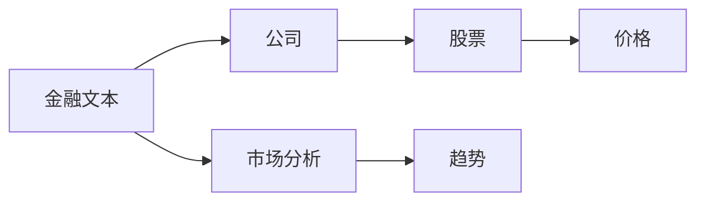
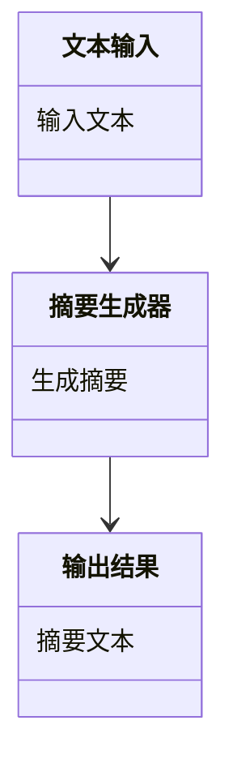
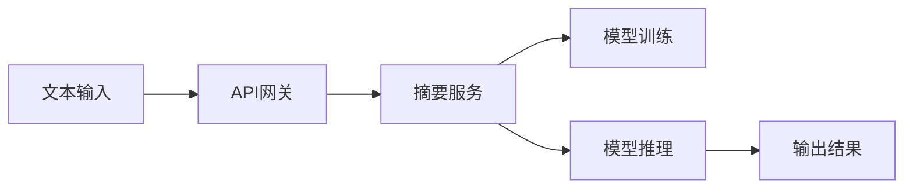
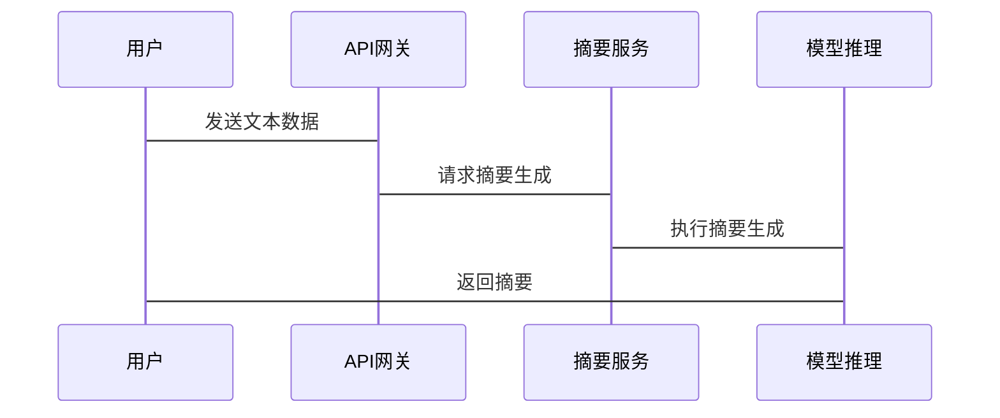

                 


# 金融文本摘要生成的深度学习方法

> **关键词**：金融文本摘要、深度学习、文本摘要生成、Transformer模型、NLP技术  
> **摘要**：本文详细探讨了金融文本摘要生成的深度学习方法，结合金融领域的特点，分析了基于深度学习的文本摘要生成技术的核心原理，介绍了主流的深度学习模型及其优化方法，通过实际案例展示了如何构建高效的金融文本摘要系统，并提出了相关的最佳实践和未来研究方向。

---

## 第一部分: 金融文本摘要的背景与问题

### 第1章: 金融文本摘要的背景与问题

#### 1.1 金融文本摘要的背景
##### 1.1.1 金融文本的特点与挑战
金融文本具有高度的专业性和复杂性，通常包含大量领域特定的术语、数据和结构化信息。由于金融领域的信息爆炸性增长，如何快速提取关键信息变得尤为重要。金融文本的特点包括：  
1. **领域专业性**：涉及金融学、经济学、市场分析等领域的知识。  
2. **信息密度高**：金融文本通常包含大量数据（如价格、指标、趋势等）。  
3. **时间敏感性**：金融信息需要及时处理和摘要。  
4. **语义多样性**：金融文本中可能存在多种语义表达方式。  

##### 1.1.2 文本摘要的基本概念
文本摘要是指从较长的文本中提取关键信息，生成简短、准确的摘要。常见的文本摘要方法包括：  
- **提取式摘要**：从原文中选择重要的句子或词语。  
- **生成式摘要**：通过模型生成新的文本，概括原文内容。  

##### 1.1.3 深度学习在金融领域的应用
深度学习在金融领域的应用广泛，包括股票预测、风险评估、欺诈检测等。在文本摘要生成方面，深度学习的优势在于其强大的特征提取能力和对复杂语义的理解能力。

#### 1.2 问题背景与目标
##### 1.2.1 金融信息爆炸与摘要需求
随着金融新闻、报告和数据的激增，用户需要快速获取关键信息。传统的阅读方式效率低下，因此对自动化的文本摘要生成需求迫切。  

##### 1.2.2 传统文本摘要方法的局限性
传统的文本摘要方法（如基于规则的方法）在处理复杂语义和金融领域特定信息时表现有限，难以满足高精度和高效率的要求。

##### 1.2.3 深度学习在金融文本摘要中的优势
深度学习模型（如Transformer）能够捕捉复杂的语义关系，适用于金融文本中长尾分布的特征，提供更准确的摘要。

#### 1.3 问题解决与边界
##### 1.3.1 金融文本摘要的核心目标
- 提供准确、简洁的摘要。  
- 保留原文的核心信息。  

##### 1.3.2 摘要生成的边界与限制
- 摘要长度需符合用户需求。  
- 需避免信息失真。  
- 需处理金融领域的专业术语。  

##### 1.3.3 摘要生成的评价指标
- **准确率**：摘要是否准确反映原文内容。  
- **简洁性**：摘要是否简短。  
- **可读性**：摘要是否易于理解。  

#### 1.4 本章小结
本章介绍了金融文本摘要的背景、问题和目标，为后续内容奠定了基础。

---

## 第二部分: 核心概念与联系

### 第2章: 文本摘要的核心概念

#### 2.1 文本摘要的基本原理
##### 2.1.1 提取式摘要与生成式摘要
- **提取式摘要**：基于关键词或句的重要性选择文本片段。  
- **生成式摘要**：通过模型生成新的文本，通常更灵活。  

##### 2.1.2 基于规则的摘要方法
- 依赖预定义的规则提取信息，适用于简单场景，但在复杂语义下表现不佳。  

##### 2.1.3 基于深度学习的生成方法
- 利用深度学习模型生成摘要，适用于复杂语义和领域特定信息。

#### 2.2 深度学习在文本摘要中的应用
##### 2.2.1 Transformer架构在文本摘要中的作用
- Transformer的自注意力机制能够捕捉文本中的全局语义关系。  

##### 2.2.2 注意力机制的核心原理
- 注意力机制通过权重分配，聚焦于重要的文本片段。  

##### 2.2.3 预训练语言模型在金融文本中的应用
- 使用如BERT、GPT等预训练模型，提升摘要生成的语义理解能力。

#### 2.3 核心概念对比与联系
##### 2.3.1 提取式与生成式摘要的对比
| 对比维度 | 提取式摘要 | 生成式摘要 |
|----------|------------|------------|
| 方法 | 选择原文片段 | 生成新文本 |  
| 优点 | 简单高效 | 精确灵活 |  
| 缺点 | 受限于原文 | 可能失真 |  

##### 2.3.2 ER实体关系图的构建与展示


---

## 第三部分: 算法原理与数学模型

### 第3章: 深度学习模型的算法原理

#### 3.1 Transformer模型的原理
##### 3.1.1 Transformer的结构与特点
- **编码器-解码器结构**：编码器处理输入，解码器生成输出。  
- **自注意力机制**：捕捉文本内部的语义关系。  

##### 3.1.2 自注意力机制的数学公式
自注意力机制的计算公式如下：
$$
\text{Attention}(Q, K, V) = \text{softmax}\left(\frac{QK^T}{\sqrt{d_k}}\right)V
$$  
其中，$Q$ 是查询向量，$K$ 是键向量，$V$ 是值向量，$d_k$ 是向量的维度。

##### 3.1.3 解码器的生成过程
解码器通过自注意力机制生成目标序列，通常采用贪心搜索策略。

#### 3.2 深度学习模型的优化方法
##### 3.2.1 梯度下降与Adam优化器
- **梯度下降**：优化模型参数，减少损失函数。  
- **Adam优化器**：结合动量和自适应学习率，加速收敛。  

##### 3.2.2 模型训练的损失函数
常用的损失函数是交叉熵损失：
$$
\mathcal{L} = -\sum_{i=1}^{n} y_i \log p(y_i)
$$  
其中，$y_i$ 是真实标签，$p(y_i)$ 是预测概率。

##### 3.2.3 模型调优的技巧与策略
- 调整学习率和批次大小。  
- 使用早停法防止过拟合。  

#### 3.3

---

## 第四部分: 系统分析与架构设计方案

### 第4章: 金融文本摘要系统的架构设计

#### 4.1 问题场景介绍
金融文本摘要系统需要处理大量的金融新闻、报告和数据，生成简洁准确的摘要。

#### 4.2 项目介绍
本项目旨在构建一个基于深度学习的金融文本摘要系统，支持实时信息处理和摘要生成。

#### 4.3 系统功能设计
##### 4.3.1 领域模型


##### 4.3.2 系统架构设计


#### 4.4 系统接口设计
- **输入接口**：接收金融文本数据。  
- **输出接口**：返回生成的摘要。  

#### 4.5 系统交互设计


---

## 第五部分: 项目实战

### 第5章: 金融文本摘要生成的实战

#### 5.1 环境安装
```python
# 安装必要的库
pip install numpy
pip install pandas
pip install torch
pip install transformers
```

#### 5.2 系统核心实现
##### 5.2.1 模型实现
```python
from transformers import BartForConditionalGeneration, BartTokenizer

model = BartForConditionalGeneration.from_pretrained('facebook/bart-large')
tokenizer = BartTokenizer.from_pretrained('facebook/bart-large')

def generate_summary(text):
    inputs = tokenizer(text, max_length=1024, truncation=True, padding=True)
    outputs = model.generate(inputs.input_ids, max_length=100, min_length=50, do_sample=False)
    summary = tokenizer.decode(outputs[0], skip_special_tokens=True)
    return summary
```

##### 5.2.2 代码解读
- 使用预训练的BART模型进行摘要生成。  
- 通过Tokenizer对输入文本进行编码。  
- 使用生成器生成摘要，并解码为文本。  

#### 5.3 实际案例分析
以金融新闻为例，输入文本如下：
```
"金融市场的波动性显著增加，主要股指下跌，受美联储政策影响。"
```
生成的摘要为：
```
"金融市场波动性增加，主要股指下跌。"
```

#### 5.4 项目小结
本章通过实际案例展示了如何使用深度学习模型进行金融文本摘要生成，提供了完整的代码实现和分析。

---

## 第六部分: 最佳实践与小结

### 第6章: 最佳实践与总结

#### 6.1 最佳实践
##### 6.1.1 数据质量的重要性
- 数据清洗和预处理是关键。  
##### 6.1.2 模型调优的技巧
- 选择合适的超参数。  
- 避免过拟合和欠拟合。  

#### 6.2 小结
本文详细探讨了金融文本摘要生成的深度学习方法，从理论到实践，全面分析了相关技术和实现方案。

#### 6.3 注意事项
- 数据隐私和合规性问题需注意。  
- 模型的泛化能力需进一步优化。  

#### 6.4 拓展阅读
- 关注最新的NLP技术，如多模态摘要。  
- 研究领域特定的预训练模型。  

---

## 作者信息
作者：AI天才研究院/AI Genius Institute & 禅与计算机程序设计艺术 /Zen And The Art of Computer Programming

