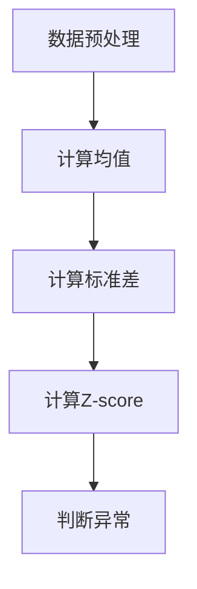
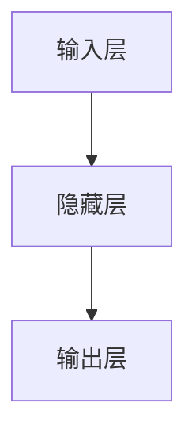
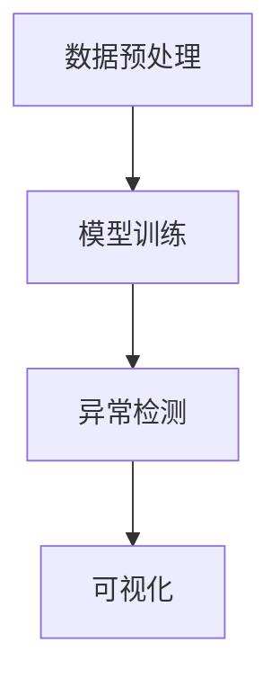
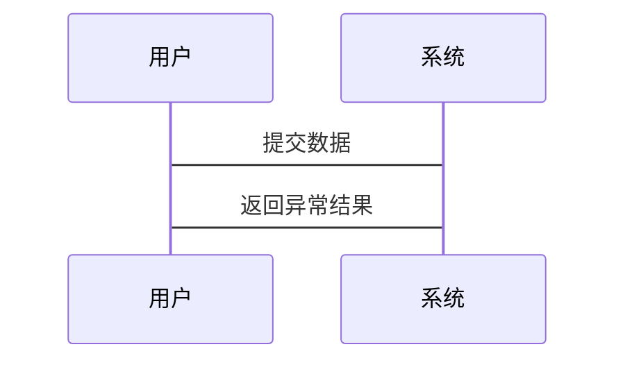

                 


# 金融时序数据异常检测模型

**关键词：** 金融时序数据，异常检测，机器学习，深度学习，模型构建

**摘要：**  
本文详细探讨了金融时序数据异常检测模型的构建与应用。首先，从金融时序数据的定义、特征及其在金融领域的应用入手，分析了异常检测在金融风控中的重要意义。接着，深入讲解了金融时序数据异常检测的核心概念与算法原理，包括传统统计方法和基于机器学习的深度学习方法。随后，通过系统架构设计和项目实战，展示了如何将理论应用于实际场景，并通过具体案例分析验证了模型的有效性。最后，总结了构建金融时序数据异常检测模型的关键点与最佳实践。

---

## 第一部分：金融时序数据异常检测的背景与挑战

### 第1章：金融时序数据异常检测的背景与挑战

#### 1.1 金融时序数据的定义与特点

- **1.1.1 金融时序数据的定义**  
  金融时序数据是指在金融市场上，随着时间推移而产生的数据，如股票价格、交易量、指数等。这些数据通常具有连续性和依赖性，反映了市场的动态变化。

- **1.1.2 金融时序数据的核心特征**  
  金融时序数据具有以下核心特征：
  - **连续性**：数据随时间连续变化。
  - **依赖性**：当前时刻的值与过去时刻的值密切相关。
  - **周期性**：数据往往呈现出一定的周期性，如月度、季度或年度周期。

- **1.1.3 时序数据在金融领域的应用**  
  时序数据广泛应用于股票价格预测、市场趋势分析、风险管理等领域。异常检测在这些应用中起着关键作用，能够帮助识别潜在的市场风险和欺诈行为。

#### 1.2 异常检测在金融领域的意义

- **1.2.1 异常检测的定义与目标**  
  异常检测是指识别数据中偏离预期模式或行为的观测值。在金融领域，异常检测的目标是发现可能的市场操纵、欺诈交易或其他异常事件。

- **1.2.2 金融异常检测的常见场景**  
  金融领域的异常检测常见于以下场景：
  - 股票价格的突然波动。
  - 交易量的异常变化。
  - 市场操纵行为的识别。

- **1.2.3 异常检测在金融风控中的作用**  
  异常检测能够帮助金融机构及时识别潜在风险，避免重大损失。例如，通过检测异常交易行为，可以有效防范欺诈交易和洗钱行为。

#### 1.3 金融时序数据异常检测的挑战

- **1.3.1 数据特征的复杂性**  
  金融时序数据通常具有高度的波动性和复杂性，这使得异常检测的难度增大。

- **1.3.2 异常样本的稀疏性**  
  异常事件在金融数据中通常是稀疏的，这使得基于监督学习的方法难以获得足够的标注数据。

- **1.3.3 模型的可解释性与实时性要求**  
  在金融领域，模型的可解释性和实时性要求较高。异常检测模型需要能够快速识别异常事件，并提供清晰的解释。

---

## 第二部分：金融时序数据异常检测的核心概念与联系

### 第2章：金融时序数据异常检测的核心概念与联系

#### 2.1 时序数据的关键特征

- **2.1.1 数据的连续性**  
  时序数据的连续性意味着数据是随着时间连续变化的。例如，股票价格的变动是连续的，而非离散的。

- **2.1.2 数据的依赖性**  
  时序数据的依赖性是指当前时刻的值与过去时刻的值密切相关。例如，股票价格的走势往往受到前一天价格的影响。

- **2.1.3 数据的周期性**  
  时序数据的周期性是指数据呈现出一定的周期性变化。例如，某些股票的交易量可能在特定的时间段内出现周期性波动。

#### 2.2 异常检测的核心原理

- **2.2.1 异常检测的分类**  
  异常检测可以分为以下几类：
  - **基于统计的方法**：如Z-score、中位数绝对偏差（MAD）等。
  - **基于机器学习的方法**：如Isolation Forest、One-Class SVM等。
  - **基于深度学习的方法**：如LSTM、GRU等。

- **2.2.2 基于统计的方法**  
  基于统计的异常检测方法通过计算数据的统计特征来识别异常。例如，Z-score方法通过计算每个数据点与均值的偏离程度来判断是否为异常。

- **2.2.3 基于机器学习的方法**  
  基于机器学习的异常检测方法通过训练模型来识别异常。例如，Isolation Forest算法通过构建随机森林来隔离异常样本。

#### 2.3 核心概念对比与ER图

- **2.3.1 异常检测方法的对比分析**  
  下表对比了几种常见的异常检测方法：

| 方法名称         | 优点                     | 缺点                       |
|------------------|--------------------------|---------------------------|
| Z-score          | 简单易实现               | 对异常样本敏感             |
| Isolation Forest | 能处理高维数据           | 对异常样本数量敏感         |
| LSTM             | 能捕捉时间依赖性         | 训练时间较长               |

- **2.3.2 ER实体关系图**  
  下图展示了股票价格与异常标记之间的关系：

```mermaid
er
    entity 股票价格 {
        id
        时间戳
        开盘价
        收盘价
        最高价
        最低价
    }
    entity 异常标记 {
        id
        异常类型
        异常时间
        异常值
    }
    股票价格 --> 异常标记: 引发异常
```

---

## 第三部分：金融时序数据异常检测的算法原理

### 第3章：金融时序数据异常检测的算法原理

#### 3.1 常见的异常检测算法

- **3.1.1 基于统计的异常检测**  
  基于统计的异常检测方法通过计算数据的统计特征来识别异常。例如，Z-score方法通过计算每个数据点与均值的偏离程度来判断是否为异常。

- **3.1.2 基于机器学习的异常检测**  
  基于机器学习的异常检测方法通过训练模型来识别异常。例如，Isolation Forest算法通过构建随机森林来隔离异常样本。

- **3.1.3 基于深度学习的异常检测**  
  基于深度学习的异常检测方法通过构建神经网络模型来捕捉数据的复杂模式。例如，LSTM网络能够捕捉时序数据中的时间依赖性。

#### 3.2 传统统计方法

- **3.2.1 Z-score方法**  
  Z-score方法通过计算每个数据点的Z-score值来判断是否为异常。公式如下：

  $$ Z = \frac{x - \mu}{\sigma} $$

  其中，$\mu$ 是数据的均值，$\sigma$ 是数据的标准差。

- **3.2.2 算法流程图**  



#### 3.3 基于机器学习的方法

- **3.3.1 Isolation Forest算法**  
  Isolation Forest算法通过构建随机森林来隔离异常样本。其核心思想是通过随机选择特征和分割数据来逐步缩小异常样本的范围。

- **3.3.2 One-Class SVM算法**  
  One-Class SVM算法是一种基于支持向量机的异常检测方法。其核心思想是通过构建一个超球或超椭球来包含正常样本，异常样本则位于超球或超椭球之外。

#### 3.4 基于深度学习的方法

- **3.4.1 LSTM网络**  
  LSTM（长短期记忆网络）是一种特殊的RNN（循环神经网络），能够捕捉时序数据中的长期依赖性。其结构如下图所示：



  LSTM网络通过记忆单元（Memory Cell）和门控机制（Gate）来捕捉数据的长期依赖性。

- **3.4.2 异常检测的数学模型**  
  LSTM网络的损失函数通常采用交叉熵损失函数，公式如下：

  $$ \mathcal{L} = -\frac{1}{N} \sum_{i=1}^{N} [y_i \log p_i + (1 - y_i) \log (1 - p_i)] $$

  其中，$y_i$ 是真实标签，$p_i$ 是模型预测的概率。

---

## 第四部分：金融时序数据异常检测系统的构建

### 第4章：系统分析与架构设计

#### 4.1 问题场景介绍

- 金融时序数据异常检测系统的目标是通过分析股票价格、交易量等数据，识别潜在的异常事件，如市场操纵、欺诈交易等。

#### 4.2 系统功能设计

- **4.2.1 数据预处理模块**  
  数据预处理模块负责对原始数据进行清洗和转换。例如，处理缺失值、异常值等。

- **4.2.2 模型训练模块**  
  模型训练模块负责训练异常检测模型。例如，使用LSTM网络进行训练。

- **4.2.3 异常检测模块**  
  异常检测模块负责对实时数据进行检测，识别异常事件。

- **4.2.4 可视化模块**  
  可视化模块负责将检测结果以图形化的方式展示，便于用户理解和分析。

#### 4.3 系统架构设计

- **4.3.1 系统架构图**  



- **4.3.2 系统接口设计**  
  系统接口设计包括数据输入接口、模型训练接口、异常检测接口和结果展示接口。

#### 4.4 系统交互流程图



---

## 第五部分：项目实战与案例分析

### 第5章：项目实战

#### 5.1 环境安装

- **5.1.1 安装Python**  
  需要安装Python 3.6及以上版本。

- **5.1.2 安装相关库**  
  需要安装以下库：
  - `numpy`
  - `pandas`
  - `tensorflow`
  - `keras`

#### 5.2 系统核心实现源代码

- **5.2.1 数据加载与预处理**  

```python
import pandas as pd
import numpy as np

# 加载数据
data = pd.read_csv('stock_prices.csv')

# 处理缺失值
data = data.dropna()

# 标准化处理
from sklearn.preprocessing import StandardScaler
scaler = StandardScaler()
data_scaled = scaler.fit_transform(data)
```

- **5.2.2 模型训练**  

```python
from tensorflow.keras.models import Sequential
from tensorflow.keras.layers import LSTM, Dense

# 构建LSTM模型
model = Sequential()
model.add(LSTM(64, input_shape=(None, 1)))
model.add(Dense(1))
model.compile(loss='mean_squared_error', optimizer='adam')

# 训练模型
model.fit(x_train, y_train, epochs=10, batch_size=32)
```

- **5.2.3 异常检测与结果展示**  

```python
# 预测异常
y_pred = model.predict(x_test)

# 可视化结果
import matplotlib.pyplot as plt

plt.plot(y_pred, label='预测值')
plt.plot(y_true, label='真实值')
plt.legend()
plt.show()
```

#### 5.3 实际案例分析

- **5.3.1 案例背景**  
  以某只股票的价格数据为例，分析其是否存在异常波动。

- **5.3.2 模型应用**  
  使用训练好的LSTM模型对股票价格进行预测，并识别异常点。

- **5.3.3 案例结果**  
  模型成功识别出某一天的异常波动，并提示可能的市场操纵行为。

---

## 第六部分：最佳实践与注意事项

### 第6章：最佳实践

#### 6.1 关键点总结

- 数据预处理是异常检测的关键步骤。
- 模型选择应基于数据特征和应用场景。
- 模型调参是提高检测精度的重要手段。

#### 6.2 注意事项

- 数据质量对模型性能有重要影响。
- 模型的实时性和可解释性需满足业务需求。
- 异常检测结果需结合业务知识进行解释。

#### 6.3 拓展阅读

- 《异常检测在金融领域的应用》
- 《深度学习在时间序列分析中的应用》

---

## 第七部分：结语

### 7.1 小结

本文详细探讨了金融时序数据异常检测模型的构建与应用。通过分析金融时序数据的特征和异常检测的原理，结合实际案例，展示了如何利用传统统计方法、机器学习方法和深度学习方法进行异常检测。

### 7.2 展望

未来，随着人工智能技术的不断发展，金融时序数据异常检测模型将更加智能化和高效化。结合最新的研究成果，如图神经网络和强化学习，有望进一步提升异常检测的精度和效率。

---

## 作者：AI天才研究院/AI Genius Institute & 禅与计算机程序设计艺术 /Zen And The Art of Computer Programming

--- 

**全文完**

