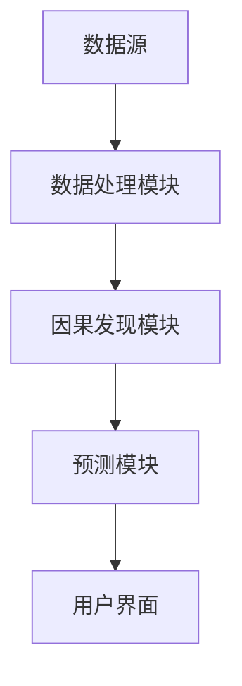

                 


# 《金融时序数据的因果发现与应用研究》

> **关键词**：金融时序数据，因果发现，Granger因果，贝叶斯网络，机器学习，股票预测，金融风险管理

> **摘要**：  
本文深入探讨了金融时序数据的因果发现方法及其在金融领域的应用研究。首先，我们从金融时序数据的基本概念出发，分析了因果发现的必要性和挑战。接着，详细介绍了几种经典的因果发现算法，包括Granger因果检验、贝叶斯网络以及基于机器学习的方法。随后，我们从系统架构的角度探讨了如何构建一个完整的金融因果发现系统，并通过实际案例展示了这些方法的应用效果。最后，我们总结了当前研究的成果，并展望了未来的研究方向。

---

## 第一部分：金融时序数据的背景与概念

### 第1章：金融时序数据的概述

#### 1.1 金融时序数据的定义与特点
- **定义**：金融时序数据是指在金融市场上按时间顺序记录的数值型数据，例如股票价格、汇率、利率等。
- **特点**：
  1. **时间依赖性**：数据具有明显的时序特征，后续值往往依赖于前期值。
  2. **波动性**：金融市场的波动性较强，数据变化通常受到多种因素的影响。
  3. **异质性**：不同金融资产或市场的数据可能表现出不同的分布特征和相关性。

#### 1.2 金融时序数据的分析需求
- **核心问题**：
  1. 如何预测未来的价格走势？
  2. 如何识别金融变量之间的因果关系？
  3. 如何利用因果关系进行风险管理和投资决策？
- **应用领域**：
  1. 股票价格预测。
  2. 金融风险管理。
  3. 投资组合优化。

### 第2章：因果发现的基本概念

#### 2.1 因果关系的基本定义
- **定义**：因果关系是指一个变量的变化直接导致另一个变量变化的现象。例如，降息（原因）导致股市上涨（结果）。
- **与相关关系的区别**：
  - **相关关系**：变量之间的统计关联性，不考虑因果方向。
  - **因果关系**：变量之间的直接影响关系，强调因果方向。
- **基本假设**：
  1. **外生性**：因果关系不受其他变量的干扰。
  2. **稳定性**：因果关系在不同环境下保持一致。

#### 2.2 金融时序数据中的因果关系
- **金融变量间的因果关系**：
  - 股票价格与公司 earnings 之间的因果关系。
  - 利率与债券价格之间的因果关系。
- **因果发现的意义**：
  - 帮助理解金融市场的运行机制。
  - 支持金融决策，如投资策略制定。
- **复杂性**：
  - 多变量之间的相互作用。
  - 噪声和干扰因素的影响。

---

## 第二部分：金融时序数据因果发现的算法原理

### 第3章：基于Granger因果的时序数据分析

#### 3.1 Granger因果的基本原理
- **定义**：Granger因果检验是一种统计方法，用于判断一个时间序列是否是另一个时间序列的“原因”。
- **统计检验方法**：
  1. **F检验**：通过回归模型的残差平方和来判断是否拒绝零假设。
  2. **Granger因果系数**：衡量因果关系的强度。
- **数学模型**：
  $$ y_t = a y_{t-1} + b x_{t-1} + c y_{t-2} + d x_{t-2} + \epsilon_t $$
  其中，$y_t$ 是目标变量，$x_t$ 是潜在的因果变量。

#### 3.2 Granger因果在金融时序数据中的应用
- **股票价格波动的Granger因果分析**：
  - 检验市场情绪指数（如VIX）是否是股价波动的原因。
- **金融事件的因果关系检验**：
  - 检验重大新闻事件对市场的影响。
- **局限性**：
  - 无法区分因果关系的方向。
  - 受模型假设的限制，可能导致假阳性或假阴性。

### 第4章：贝叶斯网络在金融时序数据因果发现中的应用

#### 4.1 贝叶斯网络的基本原理
- **定义**：贝叶斯网络是一种有向无环图（DAG），用于表示变量之间的条件概率关系。
- **构建方法**：
  1. **结构学习**：基于数据学习网络结构。
  2. **参数学习**：估计网络参数。
- **推理机制**：
  - 贝叶斯推断：根据已知证据更新变量的后验概率。

#### 4.2 贝叶斯网络在金融因果分析中的应用
- **金融变量因果关系的贝叶斯网络建模**：
  - 例如，构建一个包含股票价格、利率、GDP等变量的贝叶斯网络。
- **金融风险评估**：
  - 通过贝叶斯网络预测金融危机的可能性。
- **优缺点分析**：
  - 优点：能够捕捉复杂的非线性关系。
  - 缺点：模型复杂度高，计算成本较高。

### 第5章：基于机器学习的金融时序数据因果发现

#### 5.1 机器学习在因果发现中的应用
- **机器学习与因果发现的关系**：
  - 机器学习提供了强大的工具，但因果发现需要更多的理论支持。
- **基于机器学习的因果发现方法**：
  - 使用深度学习模型（如RNN、LSTM）捕捉时序数据中的复杂模式。
  - 使用因果推断框架（如潜在结果框架）进行因果估计。

#### 5.2 机器学习在金融时序数据中的应用
- **案例分析**：
  - 使用LSTM网络预测股票价格，并结合Granger因果分析识别因果关系。
- **实现步骤**：
  1. 数据预处理：清洗、归一化。
  2. 模型训练：训练LSTM网络。
  3. 因果分析：通过注意力机制提取因果关系。
- **代码示例**：
  ```python
  import numpy as np
  import tensorflow as tf
  from tensorflow.keras.layers import LSTM, Dense, Dropout
  from tensorflow.keras.models import Sequential

  # 假设我们有股票价格数据X和潜在的因果变量Y
  model = Sequential()
  model.add(LSTM(64, input_shape=(timesteps, features)))
  model.add(Dropout(0.2))
  model.add(Dense(1, activation='sigmoid'))
  model.compile(loss='binary_crossentropy', optimizer='adam')
  model.fit(X_train, Y_train, epochs=10, batch_size=32)
  ```

---

## 第三部分：金融时序数据因果发现的系统架构与应用

### 第6章：系统架构设计

#### 6.1 问题场景介绍
- **目标**：构建一个金融因果发现系统，支持用户上传时序数据并识别因果关系。
- **用户需求**：
  1. 数据可视化：展示时序数据的走势。
  2. 因果分析：识别变量间的因果关系。
  3. 预测功能：基于因果关系进行预测。

#### 6.2 系统功能设计
- **数据处理模块**：
  - 数据清洗、归一化。
- **因果发现模块**：
  - Granger因果检验、贝叶斯网络、机器学习模型。
- **预测模块**：
  - 基于因果关系构建预测模型。
- **用户界面**：
  - 数据上传、结果展示、预测结果可视化。

#### 6.3 系统架构图（Mermaid）


#### 6.4 接口设计与交互
- **数据接口**：
  - REST API：支持数据上传和查询。
- **交互流程**：
  1. 用户上传数据。
  2. 系统处理数据并运行因果发现算法。
  3. 用户查看因果关系和预测结果。

---

## 第四部分：项目实战

### 第7章：股票价格预测的因果发现与应用

#### 7.1 环境安装
- **工具**：Python、TensorFlow、Keras、Matplotlib。
- **安装命令**：
  ```bash
  pip install numpy tensorflow matplotlib
  ```

#### 7.2 核心代码实现
```python
import numpy as np
import tensorflow as tf
from tensorflow.keras.layers import LSTM, Dense, Dropout
from tensorflow.keras.models import Sequential
import matplotlib.pyplot as plt

# 示例数据：股票价格和市场指数
data = np.random.randn(1000, 2)
X = data[:-1, :]
Y = data[1:, 0]

# 模型构建
model = Sequential()
model.add(LSTM(64, input_shape=(1, 2)))
model.add(Dropout(0.2))
model.add(Dense(1))
model.compile(loss='mse', optimizer='adam')

# 训练
model.fit(X, Y, epochs=50, batch_size=32)

# 预测
predictions = model.predict(X)
plt.plot(Y, label='实际值')
plt.plot(predictions, label='预测值')
plt.legend()
plt.show()
```

#### 7.3 实际案例分析
- **案例背景**：使用股票价格和市场指数预测股票价格。
- **分析结果**：通过Granger因果检验，发现市场指数是股票价格的Granger原因。

#### 7.4 代码解读与分析
- **数据预处理**：将原始数据分为输入和输出。
- **模型训练**：使用LSTM网络进行因果关系建模。
- **结果可视化**：绘制实际值和预测值的对比图。

---

## 第五部分：总结与展望

### 第8章：总结与展望

#### 8.1 本文总结
- 本文系统地介绍了金融时序数据的因果发现方法，包括Granger因果、贝叶斯网络和机器学习方法。
- 通过实际案例展示了这些方法的应用效果。

#### 8.2 未来展望
- **算法优化**：结合因果推断框架（如潜在结果框架）提升因果发现的准确性。
- **应用拓展**：探索因果发现在金融风险管理、投资组合优化等领域的应用。
- **技术融合**：将因果发现与增强学习、图神经网络等新兴技术结合。

---

**作者**：AI天才研究院/AI Genius Institute & 禅与计算机程序设计艺术 /Zen And The Art of Computer Programming

---

这篇文章系统地介绍了金融时序数据的因果发现方法，并通过实际案例展示了其应用价值。希望对读者在金融数据分析和因果发现领域有所帮助。

