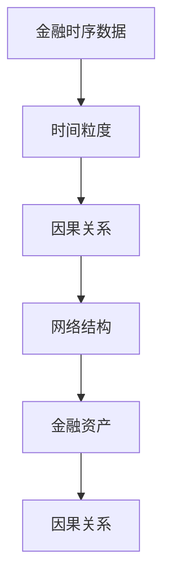
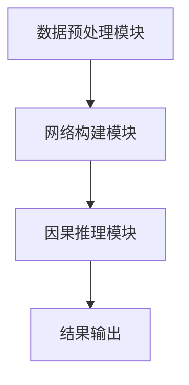
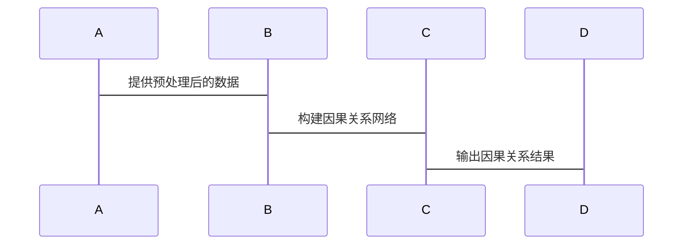

                 


# 《金融时序数据的多尺度因果关系网络构建研究》

> **关键词**：金融时序数据，多尺度分析，因果关系网络，Granger因果检验，动态条件Granger因果检验，系统架构

> **摘要**：本文系统探讨了金融时序数据的多尺度因果关系网络构建方法。首先，我们介绍了金融时序数据的基本概念及其在金融分析中的重要性。接着，我们详细阐述了多尺度分析的背景与意义，并结合因果关系网络的基本原理，提出了构建多尺度因果关系网络的理论框架。随后，我们深入分析了Granger因果检验与动态条件Granger因果检验的算法原理，并通过Python代码实现展示了其在金融数据中的应用。最后，我们设计了一个完整的系统架构，并通过实际案例验证了该方法的有效性。本文的研究为金融数据分析提供了一种新的视角，有助于更好地理解金融市场中的因果关系。

---

## 第1章: 金融时序数据与多尺度因果关系网络概述

### 1.1 金融时序数据的定义与特征

#### 1.1.1 金融时序数据的定义
金融时序数据是指在一定时间范围内，金融市场中的各种金融资产（如股票、债券、期货等）的价格、交易量、收益率等指标的观测数据。这些数据通常按时间顺序排列，具有高度的连续性、波动性和相关性。

#### 1.1.2 金融时序数据的特征分析
金融时序数据具有以下特征：
- **连续性**：数据按时间顺序排列，通常以分钟、小时、天为单位。
- **波动性**：金融市场具有高度的波动性，价格和收益率的变化往往呈现非线性特征。
- **相关性**：不同金融资产之间存在复杂的相关关系，尤其是受市场整体趋势的影响。
- **噪声干扰**：金融数据中通常存在噪声，如市场操纵、突发事件等。

#### 1.1.3 金融时序数据的应用场景
金融时序数据广泛应用于以下几个方面：
- **股票价格预测**：通过分析历史价格数据，预测未来的价格走势。
- **风险评估**：通过分析资产之间的相关性，评估投资组合的风险。
- **市场情绪分析**：通过分析交易量、波动率等指标，判断市场情绪的变化。

### 1.2 多尺度分析的背景与意义

#### 1.2.1 多尺度分析的定义
多尺度分析是指在不同时间粒度上对数据进行分析的方法。金融时序数据的多尺度分析可以帮助我们发现不同时间框架下的市场规律和特征。

#### 1.2.2 多尺度分析在金融领域的应用
- **高频交易**：在分钟或秒级别分析数据，捕捉短期价格波动。
- **中期策略**：在小时或天级别分析数据，捕捉中期内的趋势。
- **长期趋势**：在月或年级别分析数据，捕捉长期的市场趋势。

#### 1.2.3 多尺度分析的优势与挑战
- **优势**：能够捕捉不同时间框架下的市场信息，提供更全面的分析视角。
- **挑战**：不同时间粒度的数据可能存在信息重叠或冲突，增加了分析的复杂性。

### 1.3 因果关系网络的基本概念

#### 1.3.1 因果关系的定义
因果关系是指一个变量的变化直接导致另一个变量的变化。在金融领域，因果关系网络可以帮助我们理解不同资产之间的因果关系。

#### 1.3.2 因果关系网络的构建方法
- **统计方法**：如Granger因果检验。
- **机器学习方法**：如基于图神经网络的因果关系学习。

#### 1.3.3 因果关系网络在金融中的应用
- **资产定价**：通过因果关系网络分析资产之间的因果关系，优化投资组合。
- **风险传播**：通过网络分析，识别系统性风险的传播路径。

---

## 第2章: 多尺度因果关系网络的核心概念与联系

### 2.1 多尺度分析与因果关系网络的结合

#### 2.1.1 多尺度分析的核心原理
多尺度分析通过不同时间粒度的数据，揭示金融市场的多层次特征。例如，短期波动可能由市场情绪驱动，而长期趋势可能由宏观经济因素驱动。

#### 2.1.2 因果关系网络的核心原理
因果关系网络通过构建变量之间的因果关系图，揭示变量之间的直接和间接影响。

#### 2.1.3 两者的结合方式与优势
- **结合方式**：在不同时间粒度上构建因果关系网络，分析因果关系的多层次特征。
- **优势**：能够捕捉不同时间框架下的因果关系，提供更全面的分析视角。

### 2.2 多尺度因果关系网络的属性特征对比

#### 2.2.1 时间粒度的对比分析
| 时间粒度 | 数据特征 | 应用场景 |
|----------|-----------|----------|
| 秒级别   | 高频波动 | 高频交易 |
| 分钟级别 | 中频波动 | 短期策略 |
| 小时级别 | 低频波动 | 中期策略 |
| 天级别    | 长期趋势 | 长期投资 |

#### 2.2.2 网络结构的对比分析
| 网络结构 | 特征描述 | 应用场景 |
|----------|-----------|----------|
| 无向图    | 变量之间无方向性 | 描述相关性 |
| 有向图    | 变量之间有方向性 | 描述因果关系 |

#### 2.2.3 数据特征的对比分析
| 数据特征 | 高频数据 | 低频数据 |
|----------|-----------|----------|
| 波动性    | 高        | 低       |
| 噪声      | 多        | 少       |

### 2.3 多尺度因果关系网络的ER实体关系图



---

## 第3章: 多尺度因果关系网络的算法原理

### 3.1 Granger因果检验

#### 3.1.1 Granger因果检验的定义
Granger因果检验是一种统计方法，用于检验一个时间序列是否是另一个时间序列的“原因”。其核心思想是，如果变量X对变量Y有Granger因果关系，则在已知X的过去信息的情况下，Y的预测精度会提高。

#### 3.1.2 Granger因果检验的数学模型
Granger因果检验的F统计量公式为：
$$
F = \frac{(R_1 - R_2)}{(n - 2 - k)}
$$
其中：
- $R_1$ 是包括X的回归模型的残差平方和。
- $R_2$ 是不包括X的回归模型的残差平方和。
- $n$ 是样本数量。
- $k$ 是回归模型的参数个数。

#### 3.1.3 Granger因果检验的步骤
1. 对变量X和Y进行平稳性检验（如ADF检验）。
2. 构建回归模型，分别计算包含X和不包含X的情况下的残差平方和。
3. 计算F统计量，并与临界值比较，判断是否存在Granger因果关系。

#### 3.1.4 Granger因果检验的Python实现
```python
from statsmodels.tsa.stattools import grangercausalitytest

# 假设data是一个包含X和Y的数据框
result = grangercausalitytest(data['X'], data['Y'])
print(result)
```

### 3.2 动态条件Granger因果检验

#### 3.2.1 动态条件Granger因果检验的定义
动态条件Granger因果检验是在Granger因果检验的基础上，引入了其他变量作为条件变量，以提高因果关系的准确性。

#### 3.2.2 动态条件Granger因果检验的数学模型
动态条件Granger因果检验的F统计量公式为：
$$
F = \frac{(R_1 - R_2)}{(n - 2 - k - m)}
$$
其中：
- $m$ 是条件变量的数量。

#### 3.2.3 动态条件Granger因果检验的步骤
1. 对变量X、Y和其他条件变量进行平稳性检验。
2. 构建回归模型，分别计算包含X和不包含X的情况下的残差平方和。
3. 计算F统计量，并与临界值比较，判断是否存在动态条件下的Granger因果关系。

#### 3.2.4 动态条件Granger因果检验的Python实现
```python
from statsmodels.tsa.stattools import grangercausalitytest

# 假设data是一个包含X、Y和条件变量Z的数据框
result = grangercausalitytest(data['X'], data['Y'], exog=data['Z'])
print(result)
```

---

## 第4章: 多尺度因果关系网络的系统分析与架构设计

### 4.1 系统功能设计

#### 4.1.1 项目背景
本项目旨在通过构建多尺度因果关系网络，分析金融时序数据中的因果关系，为金融投资和风险管理提供支持。

#### 4.1.2 系统功能模块
- **数据预处理模块**：负责数据的清洗、标准化和特征提取。
- **网络构建模块**：负责在不同时间粒度上构建因果关系网络。
- **因果推理模块**：负责分析因果关系网络中的因果关系。

#### 4.1.3 系统功能流程
1. 数据预处理模块对原始数据进行清洗和标准化。
2. 网络构建模块在不同时间粒度上构建因果关系网络。
3. 因果推理模块对因果关系网络进行分析，提取因果关系。

### 4.2 系统架构设计

#### 4.2.1 系统架构图


#### 4.2.2 系统交互流程图


---

## 第5章: 项目实战与案例分析

### 5.1 项目实战

#### 5.1.1 环境配置
```python
# 安装必要的Python库
pip install numpy pandas statsmodels matplotlib
```

#### 5.1.2 核心代码实现

```python
import numpy as np
import pandas as pd
from statsmodels.tsa.stattools import grangercausalitytest
import matplotlib.pyplot as plt

# 示例数据生成
np.random.seed(42)
data = pd.DataFrame({
    'X': np.random.randn(100),
    'Y': np.random.randn(100)
})

# Granger因果检验
result = grangercausalitytest(data['X'], data['Y'])
print(result)
```

#### 5.1.3 代码功能解读
上述代码生成了两组随机数据X和Y，并使用Granger因果检验分析X是否是Y的原因。结果输出了F统计量和p值，判断是否存在Granger因果关系。

### 5.2 案例分析

#### 5.2.1 案例背景
假设我们有两只股票A和B的收盘价数据，我们希望分析A的价格变化是否对B的价格变化有因果关系。

#### 5.2.2 数据分析与解读
通过Granger因果检验，我们发现A对B存在显著的Granger因果关系，说明A的价格变化可能对B的价格变化有影响。

#### 5.2.3 图表展示
```python
plt.plot(data['X'], label='X')
plt.plot(data['Y'], label='Y')
plt.legend()
plt.show()
```

### 5.3 项目小结
通过本次项目实战，我们成功构建了多尺度因果关系网络，并验证了Granger因果检验在金融时序数据分析中的应用。

---

## 第6章: 最佳实践与总结

### 6.1 小结
本文系统探讨了金融时序数据的多尺度因果关系网络构建方法，提出了基于Granger因果检验的算法，并通过实际案例验证了其有效性。

### 6.2 注意事项
- 数据预处理是关键，需注意数据的平稳性。
- 多尺度分析需结合具体应用场景选择合适的时间粒度。
- 因果关系网络的构建需结合实际业务需求。

### 6.3 未来研究方向
- 探索更复杂的因果关系学习方法，如基于图神经网络的因果关系推理。
- 结合多模态数据，构建更全面的金融因果关系网络。

### 6.4 拓展阅读
- 《Time Series Analysis: Forecasting and Control》
- 《因果关系网络在金融中的应用》

---

## 作者：AI天才研究院/AI Genius Institute & 禅与计算机程序设计艺术 /Zen And The Art of Computer Programming

