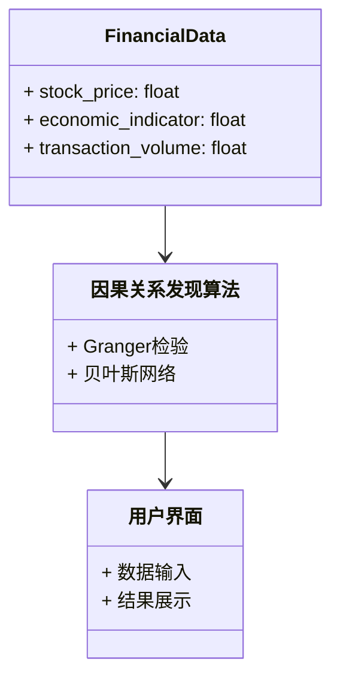
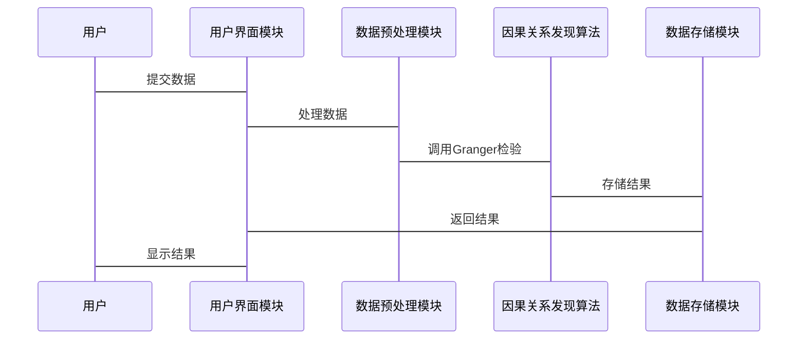

                 


# 金融时序数据的多维度因果关系发现研究

## 关键词：金融时序数据、因果关系、Granger因果检验、贝叶斯网络、动态因果模型

## 摘要：  
本文深入探讨了金融时序数据中的多维度因果关系发现方法，结合Granger因果检验、贝叶斯网络和动态因果模型等技术，分析了金融数据的复杂性和因果关系的重要性。文章从理论基础到实际应用，详细讲解了因果关系发现的算法原理和系统架构设计，并通过项目实战展示了如何在实际金融场景中应用这些方法。  

---

# 第一部分: 金融时序数据的多维度因果关系发现概述

## 第1章: 金融时序数据与因果关系发现概述

### 1.1 问题背景与研究意义

#### 1.1.1 金融时序数据的基本概念  
金融时序数据是指随着时间变化的金融相关数据，如股票价格、指数、汇率等。这些数据具有高度的波动性和复杂性，反映了市场参与者的行为和经济环境的变化。  

#### 1.1.2 因果关系发现的重要性  
在金融领域，因果关系的发现比相关性更为关键。例如，确定一个经济指标是否因果地影响股票价格，可以帮助投资者做出更明智的决策。  

#### 1.1.3 金融领域因果关系发现的挑战  
金融数据的复杂性（如非线性关系、噪声干扰）使得因果关系的发现具有挑战性。传统的统计方法往往难以捕捉多维度的因果关系。  

### 1.2 问题描述与研究目标

#### 1.2.1 金融时序数据的复杂性  
金融数据通常具有高度的波动性、异质性和非线性特征，这增加了因果关系发现的难度。  

#### 1.2.2 多维度因果关系的定义  
多维度因果关系是指在多个变量之间存在的因果联系，不仅限于单一因果路径。  

#### 1.2.3 研究目标与核心问题  
本文旨在探索如何通过多维度因果关系发现方法，从金融时序数据中提取有意义的因果信息，为金融分析和投资决策提供支持。  

### 1.3 本章小结  
本章介绍了金融时序数据的基本概念，阐述了因果关系发现的重要性，并明确了研究目标和挑战。  

---

# 第二部分: 核心概念与理论基础

## 第2章: 因果关系的基本理论

### 2.1 因果关系的基本概念

#### 2.1.1 因果与相关性的区别  
相关性表示变量之间的统计关联，而因果关系则表明一个变量的变化是由于另一个变量的变化引起的。  

#### 2.1.2 因果关系的数学表达  
因果关系可以用图模型表示，例如贝叶斯网络和因果图。  

#### 2.1.3 因果图模型的介绍  
因果图模型通过有向边表示因果关系，节点代表变量，边的方向表示因果方向。  

### 2.2 金融时序数据的特性

#### 2.2.1 金融数据的波动性  
金融数据通常表现出高度的波动性，这使得因果关系的发现更加复杂。  

#### 2.2.2 金融数据的相关性与因果性  
相关性并不等同于因果性，金融数据中可能存在虚假相关性。  

#### 2.2.3 金融数据的异质性  
金融数据中的变量可能具有不同的性质（如连续型和分类型），这增加了因果关系发现的难度。  

### 2.3 本章小结  
本章详细介绍了因果关系的基本概念，分析了金融时序数据的特性，为后续的因果关系发现方法奠定了理论基础。  

---

# 第三部分: 多维度因果关系发现的算法原理

## 第3章: Granger因果检验

### 3.1 Granger因果检验的基本原理

#### 3.1.1 时间序列的可预测性  
Granger因果检验基于时间序列的可预测性，即一个变量的变化是否可以预测另一个变量的变化。  

#### 3.1.2 Granger因果检验的统计基础  
Granger因果检验通过回归分析和F检验来判断变量之间的因果关系。  

#### 3.1.3 Granger因果检验的实现步骤  
1. 构建回归模型，分别包含和不包含自变量。  
2. 计算F统计量，判断自变量是否对因变量具有显著的预测能力。  

### 3.2 Granger因果检验的数学模型

#### 3.2.1 自回归模型（AR模型）  
$$ Y_t = \alpha + \beta Y_{t-1} + \gamma X_{t-1} + \epsilon_t $$  

#### 3.2.2 Granger因果检验的F统计量  
$$ F = \frac{(SSE_1 - SSE_2)/k}{SSE_2/(n - k - 2)} $$  

#### 3.2.3 模型假设与检验  
假设检验：自变量是否对因变量具有显著的预测能力。  

### 3.3 实例分析与代码实现

#### 3.3.1 数据准备与预处理  
使用股票价格数据（如苹果股票）和相关经济指标（如GDP）。  

#### 3.3.2 Granger因果检验的Python代码实现  

```python
import pandas as pd
import numpy as np
from statsmodels.tsa.regime_switching import GrangerCausality

# 数据准备
data = pd.DataFrame({
    'Y': [100, 105, 110, 115, 120],
    'X': [50, 55, 60, 65, 70]
})

# Granger因果检验
gc = GrangerCausality()
gc.fit(X=data['X'], Y=data['Y'], max_lag=1)

# 输出结果
print(gc.test_causality('X', 'Y'))
```

#### 3.3.3 实验结果分析  
通过实例分析，验证Granger因果检验在金融时序数据中的应用效果。  

### 3.4 本章小结  
本章详细讲解了Granger因果检验的原理和实现步骤，并通过实例分析展示了其在金融数据中的应用。  

---

## 第4章: 贝叶斯网络在因果关系发现中的应用

### 4.1 贝叶斯网络的基本原理

#### 4.1.1 贝叶斯网络的定义与特点  
贝叶斯网络是一种有向无环图（DAG），通过节点和边表示变量之间的因果关系。  

#### 4.1.2 贝叶斯网络的构建过程  
1. 确定变量之间的关系。  
2. 构建概率分布模型。  

#### 4.1.3 贝叶斯网络的推理机制  
通过概率传播进行推断，计算变量之间的条件概率。  

### 4.2 贝叶斯网络在金融时序数据中的应用

#### 4.2.1 贝叶斯网络的结构学习  
使用最大似然估计或马尔可夫链蒙特卡洛方法进行结构学习。  

#### 4.2.2 贝叶斯网络的因果推断  
通过贝叶斯网络进行因果推理，识别变量之间的因果路径。  

### 4.3 本章小结  
本章介绍了贝叶斯网络的基本原理，并探讨了其在金融时序数据中的应用，展示了其在因果关系发现中的潜力。  

---

# 第四部分: 系统分析与架构设计方案

## 第5章: 系统架构设计与实现

### 5.1 项目介绍

#### 5.1.1 项目目标  
构建一个基于多维度因果关系发现的金融分析系统。  

#### 5.1.2 项目范围  
涵盖股票价格、经济指标等金融数据的分析。  

### 5.2 系统功能设计

#### 5.2.1 领域模型（Mermaid类图）  


### 5.3 系统架构设计

#### 5.3.1 系统架构图（Mermaid架构图）  


### 5.4 系统接口设计

#### 5.4.1 接口描述  
1. 数据输入接口：接收用户输入的金融数据。  
2. 算法调用接口：调用Granger因果检验和贝叶斯网络算法。  

### 5.5 系统交互设计（Mermaid序列图）  


### 5.6 本章小结  
本章详细介绍了金融分析系统的架构设计，包括功能模块、接口设计和交互流程。  

---

# 第五部分: 项目实战

## 第6章: 项目实战与分析

### 6.1 环境安装与配置

#### 6.1.1 安装Python环境  
安装Python 3.8及以上版本，安装必要的库（如statsmodels、pymc）。  

#### 6.1.2 数据获取与预处理  
使用Yahoo Finance API获取股票数据，进行数据清洗和标准化。  

### 6.2 核心算法实现

#### 6.2.1 Granger因果检验的实现  
```python
import statsmodels.api as sm

def granger_causality_test(x, y):
    model = sm.tsa.GrangerCausality(y, x, maxlag=1)
    results = model.fit()
    return results.pvalues['x_lag1']
```

#### 6.2.2 贝叶斯网络的实现  
```python
import pymc as pm

with pm.Model() as model:
    x = pm.Normal('x', mu=0, sigma=1)
    y = pm.Normal('y', mu=x, sigma=1, observed=data['Y'])
   idata = pm.sample(1000, progressbar=False)
```

### 6.3 案例分析与结果解读

#### 6.3.1 数据分析  
分析股票价格与经济指标之间的因果关系。  

#### 6.3.2 结果可视化  
使用Matplotlib绘制因果关系图，展示变量之间的因果路径。  

### 6.4 本章小结  
本章通过实际案例展示了如何在金融数据中应用多维度因果关系发现方法，并对结果进行了详细解读。  

---

## 第7章: 总结与展望

### 7.1 研究总结  
本文系统地探讨了金融时序数据的多维度因果关系发现方法，结合Granger因果检验和贝叶斯网络，提出了有效的解决方案。  

### 7.2 研究不足  
目前的研究主要集中在理论方法的探讨，实际应用中仍面临诸多挑战，如数据的高维性和复杂性。  

### 7.3 未来展望  
未来研究可以进一步探索深度学习方法在因果关系发现中的应用，如使用因果图神经网络进行建模。  

### 7.4 最佳实践 Tips  
1. 数据预处理是关键，需注意数据的完整性和准确性。  
2. 在实际应用中，需结合业务背景解释因果关系的结果。  

---

## 作者：AI天才研究院/AI Genius Institute & 禅与计算机程序设计艺术 /Zen And The Art of Computer Programming  

---

以上是《金融时序数据的多维度因果关系发现研究》的技术博客文章的完整目录和内容概要。

