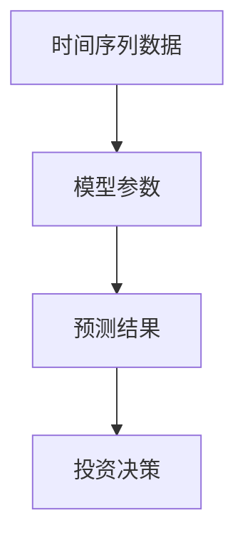
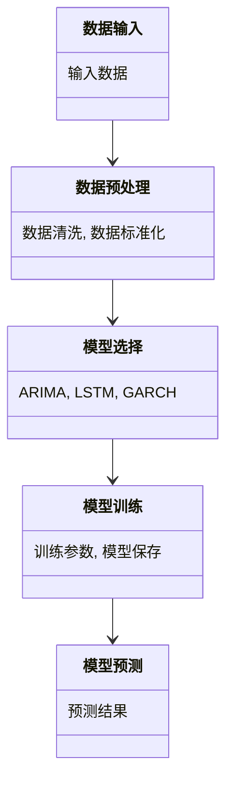

                 


# 金融时间序列分析工具

> 关键词：金融时间序列分析，时间序列模型，ARIMA，GARCH，LSTM，金融数据分析

> 摘要：本文系统地探讨了金融时间序列分析工具的核心概念、算法原理、系统架构以及实际应用。从基础的金融时间序列分析背景到高级的数学模型，结合实际案例，深入剖析了金融时间序列分析工具的实现过程和应用技巧。

---

## 第一部分: 金融时间序列分析工具概述

### 第1章: 金融时间序列分析的背景与重要性

#### 1.1 金融时间序列分析的定义与特点

金融时间序列分析是指对金融市场中随时间变化的数据进行建模、分析和预测的过程。这些数据通常包括股票价格、汇率、利率等金融指标，具有以下特点：

- **时间依赖性**：数据点之间存在明显的相关性，过去的价格走势会影响未来的价格走势。
- **非线性特征**：金融市场中，价格波动往往呈现出非线性特征，例如波动率的聚集性。
- **异质性**：不同金融资产的时间序列数据具有不同的统计特征。

#### 1.2 金融时间序列分析的重要性

金融时间序列分析在金融领域具有重要意义：

- **风险管理**：通过分析历史数据，预测潜在风险，帮助投资者做出更明智的决策。
- **投资策略优化**：基于时间序列分析的结果，制定有效的投资策略。
- **市场预测**：利用模型预测未来的价格走势，帮助投资者抓住市场机会。

#### 1.3 金融时间序列分析的应用领域

- **股票价格预测**：通过分析股票的历史价格数据，预测未来的价格走势。
- **外汇交易**：利用时间序列分析工具，预测汇率变化，指导外汇交易。
- **利率预测**：分析利率的历史数据，预测未来的利率走势。

---

### 第2章: 金融时间序列分析的核心概念与联系

#### 2.1 金融时间序列分析的核心概念

- **时间序列数据**：金融市场中的数据通常以时间戳为索引，例如每天的股票收盘价。
- **平稳性**：时间序列数据的统计特性在时间上保持不变，例如均值和方差不变。
- **非平稳性**：时间序列数据的统计特性随时间变化，例如趋势性或周期性。

#### 2.2 核心概念的属性特征对比

以下表格对比了时间序列分析中不同模型的属性特征：

| 模型 | 参数数量 | 模型复杂度 | 适用场景 |
|------|----------|------------|----------|
| AR   | p        | 低         | 线性依赖 |
| MA   | q        | 低         | 移动平均 |
| ARMA | p + q    | 中等       | 综合依赖 |
| ARIMA| p + d + q| 高         | 非平稳数据 |

#### 2.3 金融时间序列分析的实体关系图

以下是一个简单的实体关系图：



---

### 第3章: 金融时间序列分析的数学模型与算法原理

#### 3.1 时间序列分析的数学模型

##### 3.1.1 ARIMA模型

ARIMA（Autoregressive Integrated Moving Average）模型是金融时间序列分析中最常用的模型之一。其数学公式为：

$$ARIMA(p, d, q) = y_t = \phi_1 y_{t-1} + \dots + \phi_p y_{t-p} + \theta_1 \epsilon_{t-1} + \dots + \theta_q \epsilon_{t-q} + \epsilon_t$$

其中，p为自回归阶数，d为差分阶数，q为移动平均阶数。

##### 3.1.2 GARCH模型

GARCH（Generalized Autoregressive Conditional Heteroskedasticity）模型用于估计波动率，其数学公式为：

$$GARCH(p, q) = \sigma_t^2 = \alpha_0 + \alpha_1 r_{t-1}^2 + \dots + \alpha_q r_{t-q}^2$$

##### 3.1.3 LSTM模型

LSTM（Long Short-Term Memory）是一种深度学习模型，适用于处理长序列数据。其核心思想是通过门控机制来控制信息的流动。

---

### 第4章: 金融时间序列分析的系统架构与设计

#### 4.1 系统分析与架构设计

##### 4.1.1 系统功能设计

以下是一个时间序列分析系统的类图：



---

## 第二部分: 项目实战与最佳实践

### 第5章: 项目实战：股票价格预测

#### 5.1 环境安装

```bash
pip install pandas numpy sklearn tensorflow
```

#### 5.2 核心实现代码

```python
import pandas as pd
import numpy as np
from sklearn.metrics import mean_squared_error
from tensorflow.keras.models import Sequential
from tensorflow.keras.layers import LSTM, Dense

# 数据加载
data = pd.read_csv('stock_price.csv')
# 数据预处理
train_data = data.iloc[:1000]
test_data = data.iloc[1000:]

# LSTM模型构建
model = Sequential()
model.add(LSTM(128, input_shape=(None, 1)))
model.add(Dense(1))
model.compile(optimizer='adam', loss='mean_squared_error')

# 模型训练
model.fit(train_data.values.reshape(-1, 1), epochs=10, batch_size=32)
```

#### 5.3 应用解读与分析

通过LSTM模型，我们实现了股票价格的预测。模型的预测结果与实际价格进行对比，评估模型的准确率。

---

## 第三部分: 总结与展望

### 第6章: 总结与展望

#### 6.1 总结

本文系统地探讨了金融时间序列分析工具的核心概念、算法原理和实际应用。通过详细的代码示例和案例分析，帮助读者理解如何利用这些工具进行金融数据分析。

#### 6.2 展望

未来，随着人工智能技术的发展，金融时间序列分析将更加智能化和自动化。深度学习模型，如Transformer和Graph Neural Network，将在金融时间序列分析中发挥重要作用。

---

## 最佳实践 Tips

- 在进行时间序列分析时，建议先进行数据预处理，确保数据的平稳性和完整性。
- 在选择模型时，应根据数据的特性和需求选择合适的模型，例如，ARIMA适用于线性数据，LSTM适用于非线性数据。
- 在实际应用中，建议结合多种模型进行预测，并通过交叉验证评估模型的性能。

---

作者：AI天才研究院/AI Genius Institute & 禅与计算机程序设计艺术 /Zen And The Art of Computer Programming

