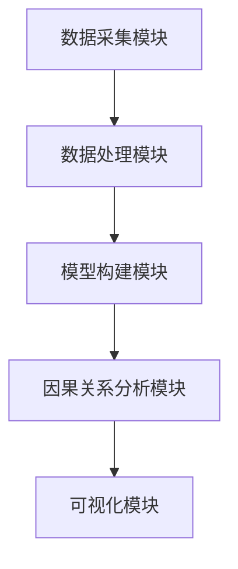

                 

# 《金融时间序列因果关系分析》

## 关键词：金融时间序列，因果关系分析，Granger因果，贝叶斯网络，时间序列建模，金融数据分析

## 摘要：  
本文系统地探讨了金融时间序列因果关系分析的核心理论、方法及其在实际金融数据分析中的应用。首先，介绍了时间序列分析的基本概念和因果关系的重要性。接着，深入分析了Granger因果关系和贝叶斯网络等核心方法的原理及其在金融领域的应用。随后，详细讲解了时间序列数据的预处理、建模与评估方法，并结合实际案例进行了系统架构设计和项目实战。本文旨在为金融从业者和数据分析人员提供一套完整的理论与实践框架，帮助他们在复杂的金融环境中识别和分析因果关系，从而做出更明智的投资决策。

---

## 第三章: 金融时间序列因果关系的理论基础

### 3.2 贝叶斯网络与因果关系

#### 3.2.1 贝叶斯网络的基本概念
- **贝叶斯网络**是一种基于概率论的图形模型，通过有向无环图（DAG）来表示变量之间的依赖关系。
- **节点**：代表随机变量（如股票价格、市场指数等）。
- **边**：表示变量之间的因果关系或条件依赖。
- **概率分布**：贝叶斯网络通过节点的条件概率表（CPT）来描述变量之间的概率关系。

#### 3.2.2 贝叶斯网络在因果关系分析中的应用
- **因果推理**：通过贝叶斯网络可以推断变量之间的因果关系，尤其是在存在潜在变量的情况下。
- **金融风险评估**：通过构建贝叶斯网络模型，可以分析不同金融事件（如市场崩盘、经济衰退）之间的因果关系及其对投资组合的影响。
- **动态因果关系**：贝叶斯网络可以动态更新，适用于金融时间序列数据的实时分析。

#### 3.2.3 贝叶斯网络与Granger因果的对比
| 对比维度          | Granger因果关系                | 贝叶斯网络                     |
|-------------------|-------------------------------|-------------------------------|
| **核心思想**      | 基于线性回归模型，检验变量之间是否存在预测关系。 | 基于概率图模型，描述变量之间的条件依赖关系。 |
| **适用场景**      | 适用于平稳时间序列数据         | 适用于非平稳数据，支持动态更新。 |
| **优势**          | 计算简单，易于实现             | 能处理复杂的非线性关系           |
| **局限性**        | 仅限于线性关系，无法处理复杂的非线性因果关系。 | 计算复杂，对模型假设敏感。        |

#### 3.2.4 贝叶斯网络的构建与应用案例
- **案例分析**：构建一个贝叶斯网络模型，分析宏观经济指标（如GDP、失业率）对股票市场的影响。
- **步骤**：
  1. 数据采集：收集宏观经济指标和股票市场的历史数据。
  2. 数据预处理：标准化数据，处理缺失值。
  3. 模型构建：基于领域知识和数据分布，设计贝叶斯网络的结构。
  4. 参数学习：使用最大似然估计或变分推断方法估计模型参数。
  5. 因果推理：通过贝叶斯网络推断变量之间的因果关系。

---

## 第四章: 金融时间序列数据的预处理

### 4.1 时间序列数据的平稳化

#### 4.1.1 平稳化的重要性
- **平稳时间序列**：均值和方差在时间上保持恒定，适用于大多数统计模型。
- **非平稳时间序列**：均值或方差随时间变化，需要通过预处理使其平稳化。

#### 4.1.2 平稳化的方法
| 方法             | 描述                     | 适用场景               |
|------------------|--------------------------|------------------------|
| **差分法**       | 通过计算序列的差分，消除趋势和季节性。 | 适用于线性趋势的序列。 |
| **Log变换**      | 对数据取对数，稳定方差。     | 适用于指数增长的数据。 |
| **箱-Tukey变换**  | 对数据进行分位数变换，消除异方差。 | 适用于非正态分布的数据。 |

#### 4.1.3 平稳化的验证
- **单位根检验**：ADF（Augmented Dickey-Fuller）检验、KPSS检验。
- **可视化方法**：绘制时间序列图，观察数据的平稳性。

---

## 第五章: 金融时间序列因果关系的建模与评估

### 5.1 时间序列因果关系的传统模型

#### 5.1.1 ARIMA模型
- **ARIMA（自回归积分移动平均模型）**：适用于非平稳时间序列的预测。
- **模型公式**：$$ARIMA(p, d, q)$$，其中：
  - $p$：自回归阶数。
  - $d$：差分阶数。
  - $q$：移动平均阶数。

#### 5.1.2 GARCH模型
- **GARCH（广义自回归条件异方差模型）**：用于建模金融时间序列的波动性。
- **模型公式**：$$GARCH(p, q)$$，其中：
  - $p$：自回归阶数。
  - $q$：移动平均阶数。

#### 5.1.3 ARIMA与GARCH的对比
| 对比维度          | ARIMA模型                | GARCH模型               |
|-------------------|--------------------------|--------------------------|
| **核心思想**      | 基于线性回归，预测序列的均值。 | 基于条件异方差，预测序列的波动性。 |
| **适用场景**      | 适用于预测序列的均值       | 适用于预测序列的波动性   |
| **优势**          | 计算简单，适用于线性趋势。   | 能捕捉波动性，适用于金融时间序列。 |
| **局限性**        | 无法捕捉非线性关系         | 参数较多，计算复杂。       |

---

## 第六章: 金融时间序列因果关系的系统架构与实现

### 6.1 系统架构设计

#### 6.1.1 系统功能模块
- **数据采集模块**：从金融数据源（如Yahoo Finance、Alpha Vantage）获取时间序列数据。
- **数据处理模块**：对数据进行清洗、平稳化和标准化处理。
- **模型构建模块**：基于预处理后的数据，构建因果关系模型（如Granger因果、贝叶斯网络）。
- **因果关系分析模块**：通过模型推断变量之间的因果关系。
- **可视化模块**：将因果关系结果可视化，便于理解和分析。

#### 6.1.2 系统架构图

---

## 第七章: 项目实战——股票价格预测与因果关系分析

### 7.1 项目背景
- **目标**：分析宏观经济指标对某只股票价格的影响，识别因果关系。
- **数据来源**：从Yahoo Finance获取股票价格数据和宏观经济指标（如GDP、失业率）。

### 7.2 数据预处理
- **数据清洗**：处理缺失值、异常值。
- **平稳化**：对数据进行Log变换和差分处理。

### 7.3 模型实现
- **Granger因果分析**：使用Granger因果检验方法，分析宏观经济指标与股票价格之间的因果关系。
- **贝叶斯网络构建**：基于领域知识和数据分布，构建贝叶斯网络模型，分析变量之间的因果关系。

### 7.4 结果分析
- **Granger因果分析结果**：宏观经济指标对股票价格的影响程度。
- **贝叶斯网络结果**：变量之间的因果关系路径和概率。

---

## 第八章: 总结与展望

### 8.1 本文总结
- **核心内容**：本文系统地探讨了金融时间序列因果关系分析的核心理论、方法及其在实际金融数据分析中的应用。
- **主要结论**：
  - Granger因果和贝叶斯网络是金融时间序列因果关系分析的重要方法。
  - 数据预处理和模型选择对因果关系分析结果有重要影响。
  - 金融时间序列因果关系分析在金融投资、风险管理等领域具有广泛的应用前景。

### 8.2 展望
- **未来研究方向**：
  - 开发更高效的金融时间序列因果关系分析算法。
  - 结合机器学习和深度学习方法，提升因果关系分析的准确性和鲁棒性。
  - 研究因果关系分析在金融风险管理中的应用。

---

## 作者：AI天才研究院/AI Genius Institute & 禅与计算机程序设计艺术/Zen And The Art of Computer Programming

