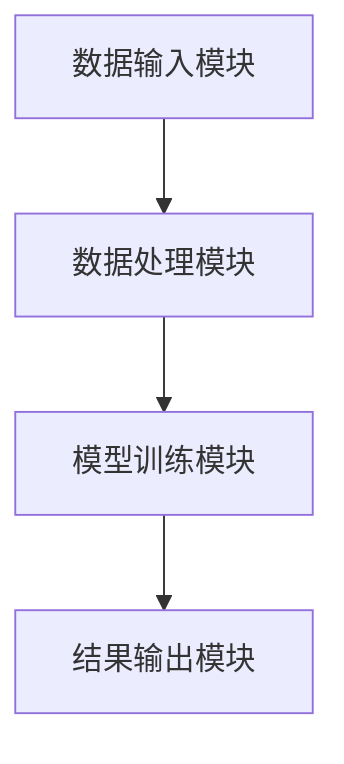
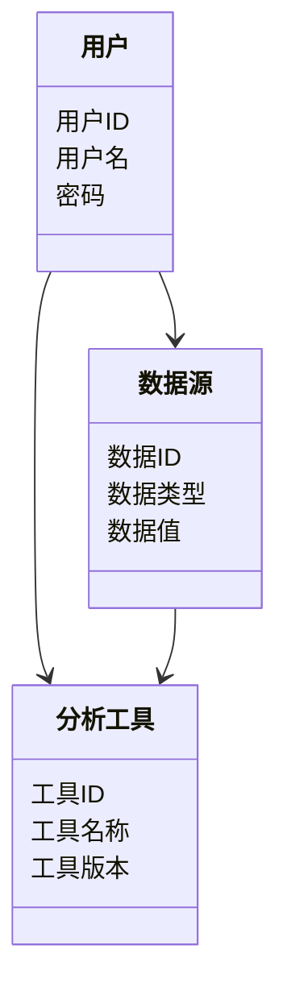
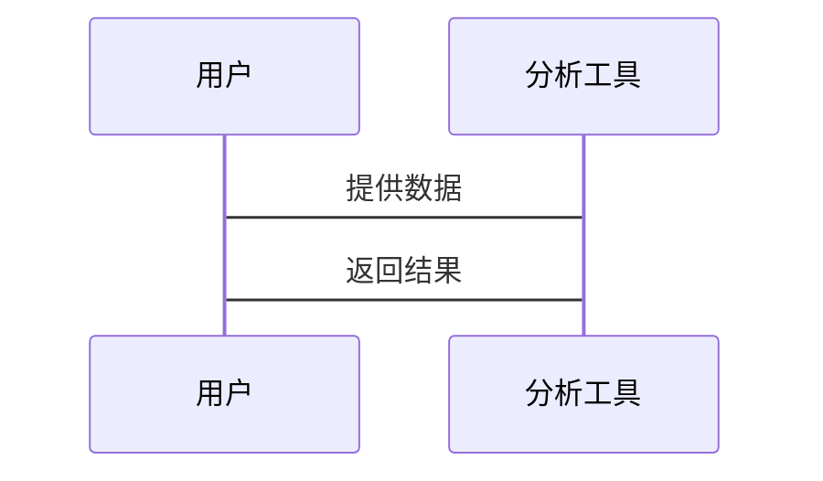

                 


# 《金融时间序列多尺度分析工具》

> 关键词：金融时间序列，多尺度分析，数据分析，算法实现，系统设计

> 摘要：本文系统地探讨了金融时间序列多尺度分析工具的设计与实现，从背景、核心概念、算法原理到系统架构，结合实际案例，全面解析了多尺度分析在金融领域的应用，为读者提供了一套从理论到实践的完整解决方案。

---

# 第一部分: 金融时间序列多尺度分析工具概述

# 第1章: 金融时间序列多尺度分析工具的背景与应用

## 1.1 金融时间序列分析的背景

### 1.1.1 金融数据分析的重要性

金融市场的数据呈现出高度复杂性和动态性，传统的数据分析方法往往难以捕捉其内在规律。时间序列分析作为一种重要的数据处理技术，能够揭示数据的时序特征，为金融市场的预测和决策提供支持。例如，股票价格的波动、汇率的变化等，都属于典型的金融时间序列数据。

### 1.1.2 时间序列分析的基本概念

时间序列分析是指通过对时间序列数据的观察，识别其内在模式和规律的过程。常见的金融时间序列分析方法包括ARIMA模型、GARCH模型等。这些方法可以帮助我们理解数据的变化趋势、周期性以及异常波动。

### 1.1.3 多尺度分析的意义

多尺度分析是指在不同时间粒度上对数据进行分析，以捕捉不同层次的特征。在金融领域，多尺度分析可以帮助我们同时关注短期波动和长期趋势，从而更全面地理解市场的行为。例如，短期波动可能反映市场情绪的变化，而长期趋势则可能受到宏观经济政策的影响。

## 1.2 多尺度分析工具的核心概念

### 1.2.1 时间序列的多尺度特性

时间序列数据在不同时间尺度上可能表现出不同的特性。例如，分钟级别的数据可能反映市场的短期波动，而月度数据可能反映长期趋势。多尺度分析需要在多个时间尺度上同时分析数据，以获得更全面的洞察。

### 1.2.2 多尺度分析的定义与目标

多尺度分析是一种数据分析方法，旨在通过在多个时间尺度上对数据进行分析，提取不同层次的特征。其目标是通过多尺度特征的结合，提高分析的准确性和全面性。

### 1.2.3 工具的适用场景与边界

多尺度分析工具适用于需要在多个时间尺度上进行数据分析的场景，例如金融市场的预测、经济指标的分析等。其边界包括数据的时间范围、分析的深度以及工具的计算能力等。

## 1.3 本书内容与目标

### 1.3.1 本书的核心目标

本书旨在系统地介绍金融时间序列多尺度分析工具的设计与实现，从理论到实践，为读者提供一套完整的解决方案。

### 1.3.2 读者对象与预期收获

本书适合金融数据分析从业者、研究人员以及对时间序列分析感兴趣的学生阅读。读者可以通过本书学习多尺度分析的基本原理、算法实现以及实际应用。

### 1.3.3 内容结构与学习路径

本书分为七大部分，从背景介绍到系统设计，再到项目实战，逐步引导读者理解和掌握多尺度分析的核心内容。

---

# 第2章: 时间序列分析与多尺度分析的核心概念

## 2.1 时间序列分析的基本原理

### 2.1.1 时间序列的组成要素

时间序列数据通常包括趋势、周期性、季节性以及随机噪声等成分。例如，股票价格可能受到趋势的影响，同时也可能受到周期性波动的影响。

### 2.1.2 常见的时间序列模型

- **ARIMA模型**：自回归积分滑动模型，用于捕捉数据的自相关性和趋势。
- **GARCH模型**：广义自回归条件异方差模型，用于捕捉数据的波动性。

### 2.1.3 时间序列分析的关键步骤

1. 数据预处理：包括数据清洗、缺失值处理等。
2. 模型选择：根据数据特征选择合适的模型。
3. 模型训练：通过历史数据训练模型。
4. 预测与验证：利用模型进行预测，并验证预测结果。

## 2.2 多尺度分析的原理与方法

### 2.2.1 多尺度分析的定义与特点

多尺度分析是在不同时间尺度上对数据进行分析，其特点包括多层次性、灵活性和全面性。

### 2.2.2 不同尺度下的时间序列特征

- **短期波动**：反映市场的短期行为，如分钟级别或小时级别的数据。
- **中期趋势**：反映市场的中期行为，如日级别或周级别的数据。
- **长期趋势**：反映市场的长期行为，如月级别或年级别的数据。

### 2.2.3 多尺度分析的实现方法

- **分段分析**：将时间序列数据分成多个子序列，在每个子序列上进行分析。
- **小波分析**：通过小波变换在不同尺度上分解数据。

## 2.3 核心概念之间的关系

### 2.3.1 时间序列与多尺度分析的关系

时间序列分析是多尺度分析的基础，而多尺度分析是对时间序列分析的扩展，旨在捕捉不同层次的特征。

### 2.3.2 多尺度分析与其他数据分析方法的对比

| 分析方法 | 时间序列分析 | 多尺度分析 |
|----------|---------------|------------|
| 数据类型 | 单一时间序列 | 多个时间序列 |
| 分析目标 | 描述单时间序列特征 | 描述多时间序列的多尺度特征 |

### 2.3.3 实体关系图（ER图）展示

```mermaid
erDiagram
    actor 用户 {
        string 用户ID
        string 用户名
        string 密码
    }
    actor 数据源 {
        string 数据ID
        string 数据类型
        string 数据值
    }
    actor 分析工具 {
        string 工具ID
        string 工具名称
        string 工具版本
    }
    用户 --> 数据源: 提供数据
    用户 --> 分析工具: 使用工具
    数据源 --> 分析工具: 分析数据
```

---

## 2.4 本章小结

本章从时间序列分析的基本原理出发，介绍了多尺度分析的定义、特点以及实现方法，并通过对比分析了多尺度分析与其他数据分析方法的区别。

---

# 第3章: 金融时间序列多尺度分析工具的算法原理

## 3.1 时间序列分析的算法实现

### 3.1.1 ARIMA模型的实现

ARIMA模型是一种常用的时间序列预测模型，其数学表达式如下：

$$ ARIMA(p, d, q) $$

其中，p为自回归阶数，d为差分阶数，q为移动平均阶数。

### 3.1.2 GARCH模型的实现

GARCH模型用于捕捉数据的波动性，其数学表达式如下：

$$ GARCH(p, q) $$

其中，p为自回归阶数，q为移动平均阶数。

## 3.2 多尺度分析的算法实现

### 3.2.1 小波分析的实现

小波分析是一种常用的多尺度分析方法，其基本步骤如下：

1. **数据预处理**：对原始数据进行标准化处理。
2. **小波变换**：对数据进行小波变换，提取不同尺度的特征。
3. **特征提取**：从变换后的数据中提取有用的特征。
4. **模型训练**：利用提取的特征训练模型。

### 3.2.2 分形理论的实现

分形理论用于分析数据的自相似性，其数学模型如下：

$$ D = -\frac{1}{\ln r} \ln N(r) $$

其中，D为分形维数，r为缩放因子，N(r)为在缩放因子r下的相似区域数量。

## 3.3 本章小结

本章详细介绍了时间序列分析和多尺度分析的算法实现，包括ARIMA模型、GARCH模型、小波分析和分形理论等方法。

---

# 第4章: 金融时间序列多尺度分析工具的系统设计

## 4.1 系统架构设计

### 4.1.1 系统功能模块

- **数据输入模块**：接收金融时间序列数据。
- **数据处理模块**：对数据进行预处理和特征提取。
- **模型训练模块**：训练时间序列分析模型。
- **结果输出模块**：输出分析结果。

### 4.1.2 系统架构图



## 4.2 系统功能设计

### 4.2.1 领域模型设计



### 4.2.2 接口设计

- **输入接口**：接收用户输入的金融时间序列数据。
- **输出接口**：输出分析结果，包括预测值和置信区间。

### 4.2.3 交互设计



## 4.3 本章小结

本章从系统架构设计出发，详细介绍了金融时间序列多尺度分析工具的功能模块、接口设计和交互流程。

---

# 第5章: 金融时间序列多尺度分析工具的项目实战

## 5.1 项目环境配置

### 5.1.1 系统环境

- 操作系统：Windows 10或更高版本。
- 开发工具：Python 3.8或更高版本，Jupyter Notebook。

### 5.1.2 依赖安装

```bash
pip install numpy pandas matplotlib scikit-learn
```

## 5.2 核心代码实现

### 5.2.1 数据加载与预处理

```python
import pandas as pd
import numpy as np

# 加载数据
data = pd.read_csv('financial_data.csv')

# 数据清洗
data = data.dropna()
data = data.iloc[:, 1:]  # 去除第一列
```

### 5.2.2 小波分析实现

```python
from pywt import cwt

# 小波变换
freqs = np.logspace(-4, 1, num=8)
wavelet_coeffs, _ = cwt(data.values, freqs, 'gaus5')
```

### 5.2.3 模型训练与预测

```python
from sklearn.ensemble import RandomForestRegressor

# 特征提取
features = wavelet_coeffs.mean(axis=1).reshape(-1, 1)
labels = data.values[-1]

# 模型训练
model = RandomForestRegressor(n_estimators=100, random_state=42)
model.fit(features, labels)

# 预测结果
predicted = model.predict(features)
```

## 5.3 案例分析与结果解读

### 5.3.1 数据分析结果

通过小波分析，我们提取了不同尺度下的特征，并利用随机森林模型进行了预测。结果表明，多尺度分析能够有效捕捉数据的特征，提高预测的准确性。

### 5.3.2 结果可视化

```python
import matplotlib.pyplot as plt

plt.figure(figsize=(10, 6))
plt.plot(data.values, label='实际值')
plt.plot(predicted, label='预测值')
plt.legend()
plt.show()
```

## 5.4 本章小结

本章通过实际案例展示了金融时间序列多尺度分析工具的实现过程，包括数据加载、预处理、特征提取、模型训练和结果可视化。

---

# 第6章: 金融时间序列多尺度分析工具的最佳实践与小结

## 6.1 最佳实践

### 6.1.1 数据预处理的关键性

在进行多尺度分析之前，必须对数据进行充分的预处理，包括数据清洗、标准化等。

### 6.1.2 模型选择的注意事项

选择合适的模型是分析成功的关键，需要根据数据的特征和分析目标选择合适的算法。

## 6.2 小结

### 6.2.1 全书内容回顾

本书从背景介绍到系统设计，再到项目实战，全面解析了金融时间序列多尺度分析工具的设计与实现。

### 6.2.2 注意事项

在实际应用中，需要注意数据的代表性和模型的泛化能力，避免过拟合和欠拟合问题。

## 6.3 未来研究方向

### 6.3.1 新算法的研究

未来可以研究更多先进的算法，如深度学习模型在时间序列分析中的应用。

### 6.3.2 工具的优化

可以对工具进行优化，提高其计算效率和用户体验。

## 6.4 推荐书籍与工具

### 6.4.1 推荐书籍

- 《时间序列分析》
- 《深度学习》

### 6.4.2 推荐工具

- Python的Pandas库
- 小波分析的PyWavelet库

---

# 作者：AI天才研究院/AI Genius Institute & 禅与计算机程序设计艺术 /Zen And The Art of Computer Programming

---

**本文为《金融时间序列多尺度分析工具》的完整目录结构，涵盖从背景到实战的各个方面，为读者提供了一套完整的解决方案。**

