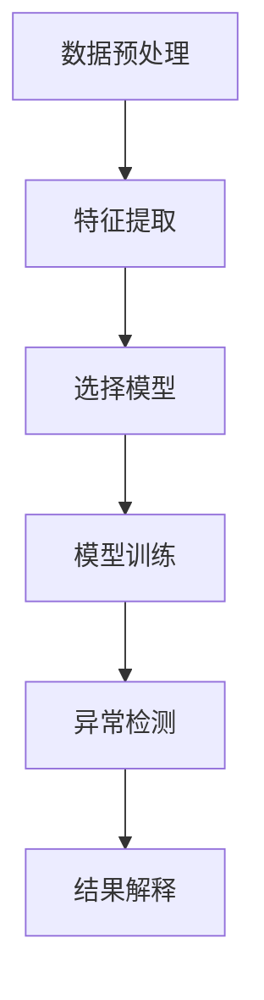
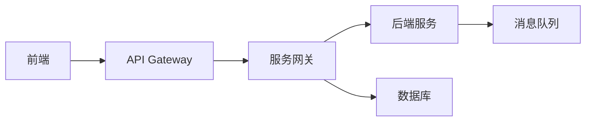

                 


```markdown
# 金融时间序列异常检测与处理

> 关键词：金融时间序列、异常检测、机器学习、统计学、风险管理

> 摘要：本文系统地探讨了金融时间序列异常检测与处理的核心方法，涵盖了从基础概念到高级算法的详细分析，结合实际案例和系统设计，为读者提供全面的指导。

---

# 第一部分: 金融时间序列异常检测概述

## 第1章: 金融时间序列的基础概念

### 1.1 金融时间序列的基本定义与特点
- 1.1.1 时间序列数据的定义
- 1.1.2 金融时间序列的特性：趋势、周期性、随机性
- 1.1.3 异常检测的定义与重要性

### 1.2 金融时间序列的应用场景
- 1.2.1 金融市场的异常交易识别
- 1.2.2 风险管理中的异常检测
- 1.2.3 金融监管与合规性检查

### 1.3 异常检测的基本流程与挑战
- 1.3.1 数据预处理的重要性
- 1.3.2 异常检测的分类：点异常、集体异常、上下文异常
- 1.3.3 数据量、实时性与计算复杂度的挑战

---

## 第2章: 异常检测的核心概念与联系

### 2.1 异常检测的多维度分析
- 2.1.1 统计学方法与机器学习方法的对比
- 2.1.2 基于规则的检测与基于模型的检测的区别
- 2.1.3 实时检测与离线检测的优缺点

### 2.2 金融时间序列的异常检测框架
- 2.2.1 数据预处理：缺失值处理、标准化、平滑处理
- 2.2.2 异常检测算法的选择与应用
- 2.2.3 结果解释与反馈机制

### 2.3 实体关系与架构设计
```mermaid
er
    entity(金融时间序列数据) {
        id: string
        timestamp: datetime
        value: float
        label: string
    }
    entity(异常检测模型) {
        id: string
        model_type: string
        parameters: map
    }
    entity(异常结果) {
        id: string
        timestamp: datetime
        confidence: float
        description: string
    }
    relation(属于, 金融时间序列数据, 异常结果)
    relation(应用于, 异常检测模型, 金融时间序列数据)
```

---

## 第3章: 异常检测算法原理与实现

### 3.1 统计学方法
- 3.1.1 基于均值和标准差的异常检测
- 3.1.2 稽查检验法（Grubbs Test）
- 3.1.3 孤立点分析（Isolation Forest）

### 3.2 机器学习方法
- 3.2.1 基于k近邻（k-NN）的局部异常因子分析（LOF）
- 3.2.2 基于聚类的异常检测：DBSCAN算法
- 3.2.3 基于支持向量机（SVM）的异常检测

### 3.3 深度学习方法
- 3.3.1 基于RNN的异常检测：LSTM网络
- 3.3.2 基于Transformer的异常检测：使用自注意力机制
- 3.3.3 深度生成模型：GAN在异常检测中的应用

### 3.4 算法实现步骤


---

## 第4章: 数学模型与公式推导

### 4.1 统计学模型
- 4.1.1 马尔可夫链模型
  $$ P_{ij} = \text{概率从状态i转移到状态j} $$
- 4.1.2 自回归模型（ARIMA）
  $$ ARIMA(p, d, q) $$
- 4.1.3 GARCH模型
  $$ GARCH(p, q) $$

### 4.2 机器学习模型
- 4.2.1 支持向量机（SVM）
  $$ \text{最大化} \ 1/\gamma - \text{支持向量} $$
- 4.2.2 随机森林（Random Forest）
  $$ \text{基于基尼指数的特征重要性} $$

### 4.3 深度学习模型
- 4.3.1 LSTM网络结构
  $$ \text{门控机制：} \ gate = \sigma(W_g x + U_g h_{prev}) $$
- 4.3.2 Transformer模型
  $$ \text{自注意力机制：} \ attention(Q, K, V) $$

---

## 第5章: 系统分析与架构设计

### 5.1 问题场景分析
- 5.1.1 金融交易监控系统
- 5.1.2 实时数据流处理
- 5.1.3 数据存储与查询优化

### 5.2 系统功能设计
- 5.2.1 数据采集模块
- 5.2.2 异常检测引擎
- 5.2.3 结果可视化模块

### 5.3 系统架构设计


---

## 第6章: 项目实战与案例分析

### 6.1 项目环境与工具安装
- 6.1.1 安装Python、TensorFlow、Keras
- 6.1.2 数据集准备：股票价格数据
- 6.1.3 数据预处理代码示例

### 6.2 异常检测代码实现
```python
import numpy as np
from sklearn.ensemble import IsolationForest

# 示例数据
data = np.random.normal(loc=0, scale=1, size=1000)
# 模型训练
model = IsolationForest(n_estimators=100, contamination=0.05)
model.fit(data.reshape(-1, 1))
# 预测异常
outliers = model.predict(data.reshape(-1, 1))
```

### 6.3 实际案例分析
- 6.3.1 某股票异常波动检测
- 6.3.2 异常交易行为识别
- 6.3.3 系统性能优化与调优

---

## 第7章: 最佳实践与总结

### 7.1 小结与回顾
- 异常检测的重要性与应用场景
- 各种算法的优缺点与适用场景

### 7.2 注意事项与建议
- 数据质量的重要性
- 模型选择与调优的技巧
- 实时系统中的性能优化

### 7.3 拓展阅读与资源
- 推荐书籍：《时间序列分析：基于R》
- 推荐工具：TensorFlow、PyTorch
- 推荐博客与在线课程

---

# 作者：AI天才研究院/AI Genius Institute & 禅与计算机程序设计艺术 /Zen And The Art of Computer Programming
```

