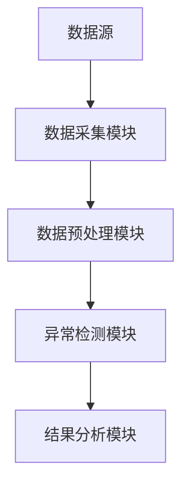

                 


# 《金融时间序列异常检测系统》

> **关键词**：金融时间序列，异常检测，统计方法，机器学习，深度学习，系统架构

> **摘要**：  
> 金融时间序列数据是金融领域的重要数据类型，其异常检测对于风险管理、交易监控和投资决策具有重要意义。本文系统地介绍了金融时间序列异常检测的核心概念、常见算法、系统架构及实际应用。通过对时间序列数据的特征分析、建模方法及异常检测算法的深入探讨，结合具体的实现案例，本文为读者提供了一套完整的金融时间序列异常检测解决方案。本文还详细分析了系统架构设计、项目实战及最佳实践，帮助读者从理论到实践全面掌握金融时间序列异常检测技术。

---

# 第一部分：金融时间序列异常检测系统概述

## 第1章：金融时间序列数据与异常检测概述

### 1.1 金融时间序列数据的特点

#### 1.1.1 时间序列数据的定义与特点
时间序列数据是指按时间顺序排列的数据，通常具有以下特点：
- **有序性**：数据按时间顺序排列。
- **时间依赖性**：数据点之间存在依赖关系。
- **趋势性**：数据可能呈现上升或下降的趋势。
- **周期性**：数据可能具有某种周期性模式。
- **随机性**：数据中可能存在无法预测的随机波动。

#### 1.1.2 金融时间序列数据的特殊性
金融时间序列数据具有以下特殊性：
- **高波动性**：金融市场数据波动较大，异常点可能与正常波动重叠。
- **非线性**：金融数据通常表现出非线性特征，难以用简单的线性模型描述。
- **复杂性**：金融数据可能受到多种因素影响，如市场情绪、经济政策等。

#### 1.1.3 异常检测在金融领域的应用价值
在金融领域，异常检测具有以下应用价值：
- **风险管理**：及时发现异常交易或市场波动，降低风险。
- **交易监控**：监控交易行为，防止欺诈或违规操作。
- **投资决策**：通过异常检测发现市场异动，辅助投资决策。

---

### 1.2 异常检测的基本概念

#### 1.2.1 异常检测的定义与分类
- **定义**：异常检测是指识别数据中与预期模式或行为显著不同的数据点。
- **分类**：
  - **点异常**：单个数据点的异常。
  - **上下文异常**：相对于特定上下文的异常。
  - **群体异常**：数据点与某一群体的异常。

#### 1.2.2 异常检测的常见应用场景
- **金融领域**：股票价格波动、交易行为监控。
- **网络领域**：网络安全中的异常流量检测。
- **医疗领域**：异常生理指标检测。

#### 1.2.3 金融时间序列异常检测的挑战与难点
- **数据稀疏性**：金融数据可能较少，难以训练 robust 的模型。
- **数据噪声**：金融数据中可能存在大量噪声，影响检测效果。
- **模型选择**：不同场景需要选择不同的模型，模型选择具有挑战性。

---

### 1.3 本章小结
本章介绍了金融时间序列数据的特点、异常检测的基本概念及其在金融领域的应用价值。通过对金融时间序列数据的特殊性和异常检测的挑战性分析，为后续章节奠定了基础。

---

# 第二部分：金融时间序列异常检测的核心概念与原理

## 第2章：时间序列数据的特征与建模

### 2.1 时间序列数据的特征分析

#### 2.1.1 时间依赖性
时间依赖性是时间序列数据的核心特征，可以通过自相关函数（ACF）和偏自相关函数（PACF）进行分析。

#### 2.1.2 趋势性与周期性
- **趋势性**：数据整体呈现上升或下降趋势。
- **周期性**：数据呈现周期性波动，如月度或季度周期。

#### 2.1.3 随机性与异常点
随机性是时间序列数据中的随机波动，异常点是偏离正常模式的数据点。

---

### 2.2 时间序列数据的建模方法

#### 2.2.1 统计建模方法
- **ARIMA模型**：自回归积分滑动平均模型，适用于线性时间序列数据。
- **ARIMA模型的优缺点**：
  - 优点：简单易用，适合线性数据。
  - 缺点：无法处理非线性数据。

#### 2.2.2 机器学习建模方法
- **随机森林**：通过特征提取和投票机制进行异常检测。
- **支持向量机（SVM）**：适用于小规模数据，但训练时间较长。

#### 2.2.3 深度学习建模方法
- **LSTM网络**：适用于长序列数据，能够捕捉长期依赖关系。
- **GRU网络**：与LSTM类似，但结构更简单，训练速度更快。

---

## 第3章：异常检测的核心原理

### 3.1 基于统计的方法
- **Z-score方法**：通过计算数据点的Z-score值，判断是否为异常点。
- **四分位数法**：通过计算数据的四分位数，判断数据点是否为异常值。

### 3.2 基于距离的方法
- **KNN方法**：通过计算数据点与最近邻居的距离，判断是否为异常点。

### 3.3 基于密度的方法
- **DBSCAN算法**：基于密度的聚类算法，适用于高密度区域的异常检测。

### 3.4 基于深度学习的方法
- **AE（自编码器）**：通过重构误差判断异常点。
- **VAE（变分自编码器）**：通过重构概率分布判断异常点。

---

# 第三部分：金融时间序列异常检测系统的架构与实现

## 第4章：系统架构设计

### 4.1 系统功能设计
- **数据采集**：从金融数据源获取时间序列数据。
- **数据预处理**：对数据进行清洗、归一化处理。
- **异常检测**：选择合适的算法进行异常检测。
- **结果分析**：对异常结果进行分析和解读。

### 4.2 系统架构图


---

## 第5章：项目实战

### 5.1 环境搭建
- **工具安装**：安装Python、TensorFlow、Keras等工具。

### 5.2 核心代码实现
```python
import numpy as np
import pandas as pd
from sklearn.ensemble import IsolationForest
from tensorflow.keras.models import Sequential
from tensorflow.keras.layers import LSTM, Dense

# 数据加载
data = pd.read_csv('financial_data.csv')

# 数据预处理
def preprocess(data):
    # 数据标准化
    data = (data - data.mean()) / data.std()
    return data

processed_data = preprocess(data)

# 基于LSTM的异常检测模型
model = Sequential()
model.add(LSTM(64, input_shape=(None, 1)))
model.add(Dense(1))
model.compile(loss='mse', optimizer='adam')

# 训练模型
model.fit(processed_data, processed_data, epochs=10, batch_size=32)

# 预测异常点
y_pred = model.predict(processed_data)
```

---

## 第6章：总结与展望

### 6.1 最佳实践
- **数据预处理**：确保数据的高质量，减少噪声干扰。
- **模型选择**：根据实际场景选择合适的模型，避免过度复杂。

### 6.2 小结
金融时间序列异常检测是一项具有重要应用价值的技术，通过本文的系统介绍，读者可以全面掌握其核心概念、算法原理及系统实现。

### 6.3 未来研究方向
- **多模态数据融合**：结合文本、图像等多模态数据，提高异常检测的准确性。
- **实时检测技术**：研究实时异常检测技术，满足金融领域的实时需求。

---

**作者：AI天才研究院/AI Genius Institute & 禅与计算机程序设计艺术 /Zen And The Art of Computer Programming**

