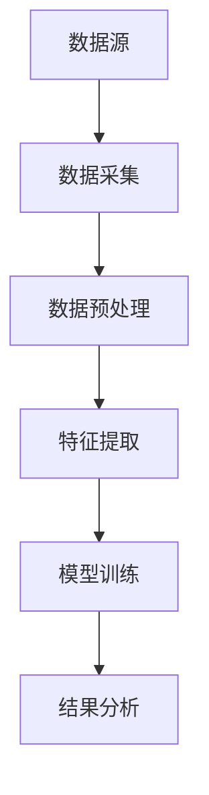
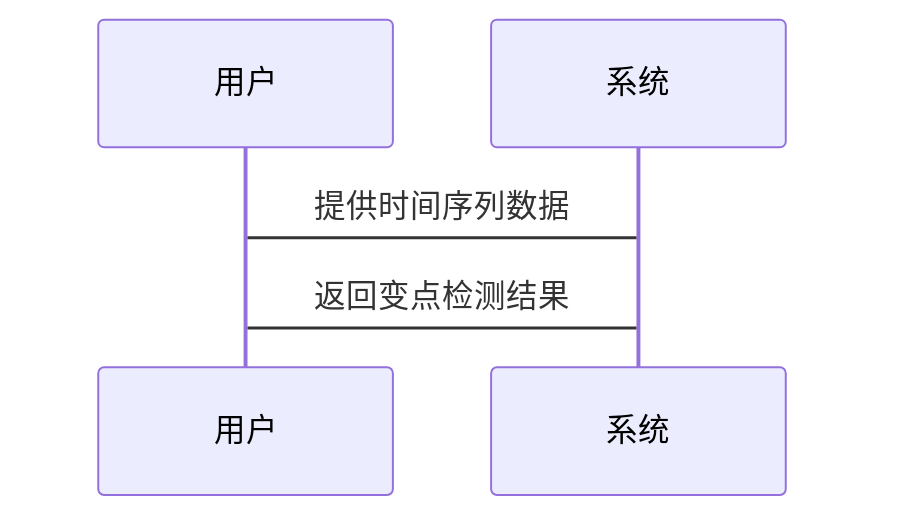

                 

<think>
好的，现在我需要撰写一篇关于《金融时间序列趋势变点检测》的技术博客文章。首先，我会先理解用户的需求，确保文章符合逻辑、结构紧凑、语言专业且易于理解。

### 关键词
- 金融时间序列
- 变点检测
- 统计分析
- 机器学习
- 金融风险管理

### 摘要
本文深入探讨了金融时间序列趋势变点检测的核心概念、算法原理及实际应用。通过结合统计学和机器学习方法，分析了金融时间序列数据中的变点检测问题，提出了有效的解决方案，并通过具体案例展示了如何在实际金融场景中应用这些方法，为金融风险管理提供了有力支持。

接下来，我将按照目录大纲逐步展开每个章节的内容。

---

## 第1章: 金融时间序列趋势变点检测概述

### 1.1 时间序列分析的基本概念
时间序列是一种按时间顺序排列的数据形式，通常用于分析随时间变化的变量。金融时间序列则指股票价格、汇率、利率等金融变量随时间变化的数据。

#### 1.1.1 时间序列的定义与特征
- **定义**：时间序列是按时间顺序排列的数据序列，形式为$(t_i, x_i)$，其中$t_i$表示时间点，$x_i$表示在$t_i$时刻的观测值。
- **特征**：
  - **趋势**：长期向上的或向下的趋势。
  - **季节性**：周期性变化，如月度或季度数据。
  - **周期性**：长期周期性波动，如经济周期。
  - **噪声**：随机波动，无法用模型解释的部分。

#### 1.1.2 金融时间序列的独特性
- **高波动性**：金融市场的波动通常较大，容易受到突发事件的影响。
- **非线性**：金融时间序列往往表现出非线性特征，如“肥尾”现象。
- **异质性**：不同金融资产或市场的波动性可能差异很大。

#### 1.1.3 变点检测的定义与意义
- **定义**：变点检测是指在时间序列中识别出统计分布或模型参数发生显著变化的点。
- **意义**：
  - **风险管理**：及时发现趋势变化，有助于规避风险。
  - **投资决策**：识别市场趋势变化，为投资决策提供支持。
  - **模型优化**：变点检测可以帮助模型适应数据分布的变化，提高预测准确性。

### 1.2 金融时间序列中的变点检测问题
#### 1.2.1 变点检测的背景与应用
- **背景**：金融市场中，价格波动、市场情绪变化等因素可能导致数据分布发生显著变化，这种变化点即是变点。
- **应用**：
  - 股票价格预测
  - 汇率预测
  - 风险管理

#### 1.2.2 金融领域的变点检测需求
- **需求**：
  - 实时检测市场趋势变化。
  - 确定变点后，及时调整投资策略。
  - 提供历史数据的变点分析，便于事后研究。

#### 1.2.3 变点检测的挑战与难点
- **挑战**：
  - 数据的高噪声特性。
  - 变点的渐变性，即变点可能不是突然发生的，而是逐渐变化的。
  - 多个变点同时发生的情况，增加了检测的复杂性。

---

## 第2章: 时间序列分析基础

### 2.1 时间序列的基本分解
时间序列分析的基本任务是将时间序列分解为几个组成部分，以便更好地理解数据的生成机制。

#### 2.1.1 趋势（Trend）
趋势是时间序列中的长期方向性变化。可以通过线性回归、指数平滑等方法提取趋势成分。

#### 2.1.2 季节性（Seasonality）
季节性是指时间序列在固定周期内重复出现的模式。常见的季节性分析方法包括季节性分解（如加法模型和乘法模型）。

#### 2.1.3 噪声（Noise）
噪声是时间序列中的随机波动部分，无法用确定性模型解释。

### 2.2 时间序列的统计特征
统计特征分析是时间序列分析的重要步骤，可以帮助我们理解数据的分布特性。

#### 2.2.1 均值与方差
- **均值**：时间序列的平均值，反映数据的中心位置。
- **方差**：时间序列数据的离散程度，反映数据的波动性。

#### 2.2.2 自相关性（Autocorrelation）
自相关性是指时间序列中不同时间点之间的相关性。自相关系数可以帮助我们识别数据的周期性。

#### 2.2.3 偏自相关性（Partial Autocorrelation）
偏自相关性是控制其他时间点的影响后，某两个时间点之间的相关性。常用于识别时间序列的生成模型。

### 2.3 时间序列的分解方法
#### 2.3.1 加法模型（Additive Model）
加法模型假设时间序列可以分解为趋势、季节性和噪声三部分之和：
$$ T_t + S_t + N_t $$

#### 2.3.2 乘法模型（Multiplicative Model）
乘法模型假设时间序列可以分解为趋势、季节性和噪声三部分之积：
$$ T_t \times S_t \times N_t $$

#### 2.3.3 混合模型（Hybrid Model）
混合模型结合了加法模型和乘法模型的特点，适用于复杂的时间序列分解。

---

## 第3章: 变点检测的核心概念与方法

### 3.1 变点检测的定义与分类
#### 3.1.1 离散变点与连续变点
- **离散变点**：变点发生在特定时间点，如某一天或某个小时。
- **连续变点**：变点是一个过程，随着时间推移逐渐发生。

#### 3.1.2 突变点与渐变点
- **突变点**：变点发生时，数据分布发生突然变化。
- **渐变点**：变点发生时，数据分布逐渐变化。

#### 3.1.3 单变点与多变点
- **单变点**：时间序列中只有一个变点。
- **多变点**：时间序列中存在多个变点。

### 3.2 变点检测的关键指标
#### 3.2.1 变点检测的显著性水平
显著性水平用于判断变点是否显著，通常采用p值进行判断。

#### 3.2.2 变点检测的置信区间
置信区间表示变点发生的范围，用于评估变点检测的准确性。

#### 3.2.3 变点检测的误差指标
误差指标用于衡量变点检测的准确性和精确度，如F1分数、准确率等。

### 3.3 变点检测的数学模型
#### 3.3.1 参数模型
参数模型假设数据分布服从某种参数化的概率分布，如正态分布、泊松分布等。

#### 3.3.2 非参数模型
非参数模型不假设数据分布的形式，适用于复杂的数据分布情况。

#### 3.3.3 混合模型
混合模型结合了参数模型和非参数模型的特点，适用于复杂变点检测场景。

---

## 第4章: 时间序列变点检测的统计方法

### 4.1 基于均值的变点检测
基于均值的变点检测方法通过比较不同时间段的均值差异来判断是否存在变点。

#### 4.1.1 突变检验（Changepoint Test）
突变检验是一种常用的变点检测方法，通过比较不同时间段的均值或方差差异来判断是否存在突变点。

#### 4.1.2 累积和检验（Cumulative Sum Test）
累积和检验通过计算累积和统计量，判断数据分布是否发生显著变化。

### 4.2 基于回归的变点检测
基于回归的变点检测方法通过回归模型的参数变化来判断是否存在变点。

#### 4.2.1 线性回归模型
线性回归模型用于分析时间序列的趋势变化，通过回归系数的变化判断是否存在变点。

#### 4.2.2 分段回归模型
分段回归模型将时间序列分成多个时间段，在每个时间段内建立回归模型，通过比较不同时间段的回归系数差异判断是否存在变点。

### 4.3 基于机器学习的变点检测
机器学习方法在变点检测中表现出色，尤其是深度学习方法。

#### 4.3.1 基于K-means的变点检测
K-means聚类算法通过将时间序列数据分成不同的簇，判断是否存在变点。

#### 4.3.2 基于SVM的变点检测
支持向量机（SVM）通过学习数据分布，判断是否存在变点。

#### 4.3.3 基于LSTM的变点检测
长短期记忆网络（LSTM）通过捕捉时间序列的长期依赖关系，判断是否存在变点。

---

## 第5章: 金融时间序列变点检测的算法实现

### 5.1 算法选择与比较
- **算法选择**：根据具体需求选择合适的变点检测算法，如统计方法、机器学习方法等。
- **算法比较**：通过比较不同算法的性能指标，选择最优算法。

### 5.2 算法实现步骤
1. **数据预处理**：去除噪声，标准化数据。
2. **特征提取**：提取时间序列的统计特征，如均值、方差、自相关性等。
3. **模型训练**：训练变点检测模型，如统计模型、聚类模型、SVM模型等。
4. **结果分析**：判断是否存在变点，分析变点的影响。

### 5.3 算法实现代码
以下是一个基于统计方法的变点检测代码示例：

```python
import numpy as np
from statsmodels.tsa.changepoint import changepoint_test

# 生成模拟时间序列数据
np.random.seed(123)
n = 100
mu = np.zeros(n)
sigma = np.zeros(n)
sigma[:50] = 1
sigma[50:] = 2

data = np.random.normal(mu, sigma)

# 变点检测
result = changepoint_test(data, method='maxim likelihood')
print(result)
```

### 5.4 算法实现的数学模型
- **统计模型**：基于似然比的变点检测。
- **机器学习模型**：基于SVM的变点检测，模型如下：
  $$ y = \text{sign}(w^T x + b) $$
  其中，$w$为权重向量，$b$为偏置项，$x$为输入特征。

---

## 第6章: 金融时间序列变点检测的系统架构设计

### 6.1 系统功能设计
- **数据采集**：从金融市场获取时间序列数据。
- **数据预处理**：清洗数据，去除异常值。
- **特征提取**：提取时间序列的统计特征。
- **模型训练**：训练变点检测模型。
- **结果分析**：判断是否存在变点，分析变点的影响。

### 6.2 系统架构设计
以下是一个变点检测系统的架构图：



### 6.3 系统接口设计
- **输入接口**：接收金融市场数据。
- **输出接口**：输出变点检测结果。

### 6.4 系统交互设计
以下是一个变点检测系统的交互图：



---

## 第7章: 项目实战——基于金融时间序列的变点检测

### 7.1 项目背景
本文将通过一个具体案例，展示如何在金融时间序列中检测变点。

### 7.2 数据集选择
选择一个股票价格数据集，例如苹果公司（AAPL）的股票价格数据。

### 7.3 数据预处理
- **数据清洗**：去除缺失值。
- **数据标准化**：对数据进行标准化处理。

### 7.4 模型实现
基于统计方法和机器学习方法，分别实现变点检测模型。

### 7.5 结果分析
通过实际案例分析，展示变点检测的结果，并解释其在金融风险管理中的应用。

---

## 第8章: 总结与展望

### 8.1 本章总结
本文详细探讨了金融时间序列变点检测的核心概念、算法原理及系统设计，展示了如何在实际金融场景中应用这些方法。

### 8.2 未来展望
未来的研究方向包括：
- 开发更高效的变点检测算法。
- 研究在线变点检测方法。
- 结合多模态数据，提升变点检测的准确性。

---

## 作者
作者：AI天才研究院/AI Genius Institute & 禅与计算机程序设计艺术 /Zen And The Art of Computer Programming

---

以上是《金融时间序列趋势变点检测》的技术博客文章的完整内容，按照目录大纲逐步展开，确保了内容的逻辑性和深度，同时保持语言的专业性和可读性。

