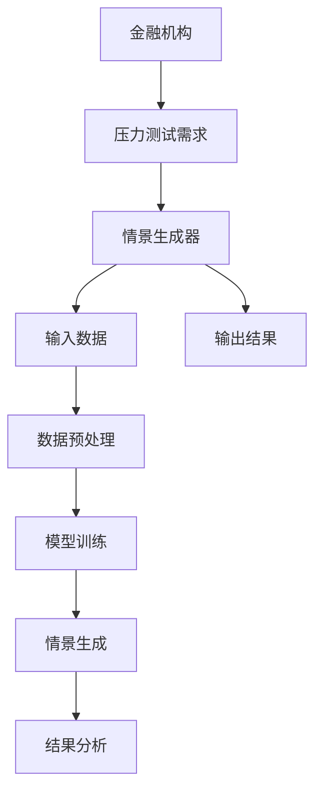
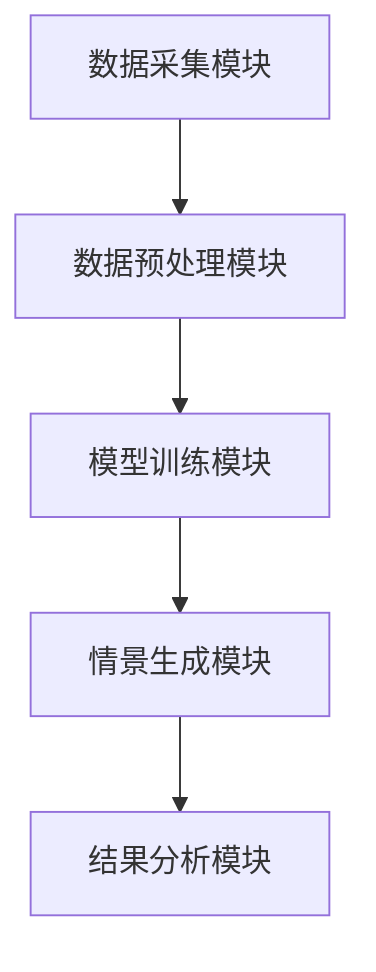

                 

# 金融机构压力测试情景生成器

## 关键词：金融机构, 压力测试, 情景生成器, 算法原理, 系统架构, 项目实战, 最佳实践

## 摘要：  
金融机构压力测试情景生成器是一种基于数据驱动和模型驱动的智能系统，用于模拟和评估金融机构在极端市场条件下的风险承受能力。本文详细探讨了压力测试情景生成器的核心概念、算法原理、系统架构、项目实战及最佳实践，为金融机构的风险管理提供了一种高效、智能的解决方案。通过结合实际案例分析和代码实现，本文为读者提供了从理论到实践的完整指导。

---

# 第一部分: 金融机构压力测试情景生成器概述

## 第1章: 压力测试与情景生成器背景

### 1.1 压力测试的定义与重要性  
压力测试是一种通过模拟极端市场条件，评估金融机构在不利环境下的风险承受能力和财务稳定性的方法。  

#### 1.1.1 什么是压力测试  
压力测试是通过假设极端市场条件（如经济危机、市场崩盘、利率骤升等），评估金融机构在这些条件下的表现。  

#### 1.1.2 压力测试在金融机构中的作用  
- **风险识别**：识别潜在的市场风险和信用风险。  
- **资本规划**：评估资本充足性，确保机构在极端情况下的生存能力。  
- **决策支持**：为管理层提供数据支持，优化资产配置和风险管理策略。  

#### 1.1.3 压力测试的演变与发展趋势  
随着金融市场复杂性的增加，压力测试从简单的假设分析逐步发展为基于大数据和人工智能的智能分析系统。

### 1.2 金融机构的压力测试需求  
金融机构在进行压力测试时，需要考虑多种因素，包括市场波动、经济周期、政策变化等。  

#### 1.2.1 金融机构面临的市场风险  
- **市场波动风险**：如股票市场、外汇市场的剧烈波动。  
- **信用风险**：如债券违约、贷款违约等。  
- **流动性风险**：如资金流动性不足导致的市场崩盘。  

#### 1.2.2 监管要求与压力测试  
全球金融危机后，监管机构对金融机构的压力测试提出了更高的要求，压力测试成为合规的重要组成部分。  

#### 1.2.3 压力测试情景生成器的必要性  
传统压力测试依赖人工经验，效率低且覆盖面有限。情景生成器通过自动化和智能化，显著提升了压力测试的效率和准确性。

### 1.3 情景生成器的核心概念  
情景生成器是压力测试系统的核心模块，负责生成多样化的极端市场情景。  

#### 1.3.1 情景生成器的定义  
情景生成器是一种基于数据驱动和模型驱动的算法系统，用于生成符合特定条件的市场情景。  

#### 1.3.2 情景生成器的功能与特点  
- **多样性**：生成多种极端市场情景。  
- **可定制化**：根据金融机构的需求定制情景。  
- **高效性**：通过算法快速生成情景，减少人工干预。  

#### 1.3.3 情景生成器的边界与外延  
情景生成器的边界包括输入数据、算法模型和输出结果。外延则涉及数据源、模型优化和用户界面设计。

---

## 第2章: 压力测试情景生成器的核心要素  

### 2.1 情景生成器的输入与输出  

#### 2.1.1 输入数据的类型与来源  
- **市场数据**：如股票价格、汇率、利率等。  
- **历史数据**：如历史市场波动、经济指标等。  
- **假设条件**：如极端市场假设（如全球经济衰退、地缘政治冲突等）。  

#### 2.1.2 输出结果的格式与应用  
- **情景数据**：如生成的极端市场情景数据。  
- **风险评估报告**：如金融机构在不同情景下的表现分析。  

#### 2.1.3 数据预处理与清洗  
- **数据清洗**：处理缺失值、异常值等。  
- **数据标准化**：对数据进行标准化处理，便于模型训练。  

### 2.2 情景生成器的算法与模型  

#### 2.2.1 生成模型的分类  
- **基于统计的模型**：如蒙特卡洛模拟。  
- **基于机器学习的模型**：如深度学习、强化学习等。  
- **混合模型**：结合统计和机器学习的模型。  

#### 2.2.2 模型的特征与属性  
- **模型输入**：市场数据、经济指标等。  
- **模型输出**：生成的市场情景。  
- **模型评估**：评估模型的准确性和稳定性。  

#### 2.2.3 模型的评估与优化  
- **评估指标**：如准确率、召回率、F1分数等。  
- **优化方法**：如参数调优、模型集成等。  

### 2.3 情景生成器的系统架构  

#### 2.3.1 系统功能模块划分  
- **数据采集模块**：负责采集市场数据和历史数据。  
- **模型训练模块**：负责训练生成模型。  
- **情景生成模块**：负责生成市场情景。  
- **结果分析模块**：负责分析情景结果并生成报告。  

#### 2.3.2 系统的输入输出流程  
1. 数据采集模块从数据源获取数据。  
2. 数据预处理模块对数据进行清洗和标准化。  
3. 模型训练模块基于预处理后的数据训练生成模型。  
4. 情景生成模块根据输入的假设条件生成市场情景。  
5. 结果分析模块对生成的情景进行分析并生成报告。  

#### 2.3.3 系统的交互设计  
- **用户界面**：用户可以通过界面输入假设条件并查看生成的情景和报告。  
- **模块交互**：各模块之间通过API或消息队列进行交互。  

---

## 第3章: 核心概念原理  

### 3.1 压力测试生成器的原理  

#### 3.1.1 数据驱动的生成原理  
数据驱动的生成器基于历史数据和统计分析生成市场情景。  

#### 3.1.2 模型驱动的生成原理  
模型驱动的生成器基于机器学习模型生成市场情景。  

#### 3.1.3 组合驱动的生成原理  
组合驱动的生成器结合数据驱动和模型驱动的方法生成市场情景。  

### 3.2 核心概念属性特征对比  

#### 3.2.1 数据特征对比  
| 特征 | 数据驱动生成器 | 模型驱动生成器 | 组合驱动生成器 |
|------|-----------------|-----------------|----------------|
| 输入 | 历史数据         | 机器学习模型     | 综合数据和模型   |
| 输出 | 统计结果         | 模型预测结果     | 综合预测结果     |

### 3.3 ER实体关系图架构  

---

## 第4章: 压力测试情景生成器的算法原理  

### 4.1 算法原理概述  

#### 4.1.1 算法的基本思想  
通过机器学习模型生成符合特定条件的市场情景。  

#### 4.1.2 算法的输入输出  
- **输入**：市场数据、经济指标等。  
- **输出**：生成的市场情景。  

#### 4.1.3 算法的数学模型  
$$ P(x|y) = \frac{P(y|x)P(x)}{P(y)} $$  
其中，$P(x|y)$ 是条件概率，表示生成情景 $x$ 的概率。  

### 4.2 算法实现步骤  

#### 4.2.1 数据预处理  
- 数据清洗：处理缺失值、异常值等。  
- 数据标准化：对数据进行标准化处理，便于模型训练。  

#### 4.2.2 模型训练  
- 使用深度学习模型（如LSTM）训练生成模型。  
- 模型训练目标是最小化生成情景与实际数据的差异。  

#### 4.2.3 情景生成  
- 根据输入的假设条件生成市场情景。  
- 输出生成的情景数据和相关分析报告。  

### 4.3 算法的优化与改进  

#### 4.3.1 参数调优  
- 调整模型参数（如学习率、批量大小等）以提高生成效果。  

#### 4.3.2 模型集成  
- 使用集成学习方法（如投票法、加权法）提高模型的准确性和稳定性。  

---

## 第5章: 压力测试情景生成器的系统架构设计  

### 5.1 系统功能模块划分  

#### 5.1.1 数据采集模块  
- 从数据源获取市场数据和历史数据。  

#### 5.1.2 数据预处理模块  
- 对数据进行清洗和标准化处理。  

#### 5.1.3 模型训练模块  
- 使用机器学习模型训练生成器。  

#### 5.1.4 情景生成模块  
- 根据输入条件生成市场情景。  

#### 5.1.5 结果分析模块  
- 分析生成的情景并生成报告。  

### 5.2 系统架构设计  

#### 5.2.1 系统架构图  

#### 5.2.2 系统交互设计  
- 用户通过界面输入假设条件。  
- 系统根据输入条件生成市场情景并输出报告。  

---

## 第6章: 压力测试情景生成器的项目实战  

### 6.1 项目背景  
模拟经济危机下的市场情景，评估金融机构的风险承受能力。  

### 6.2 项目需求  
- 生成符合极端市场条件的市场情景。  
- 分析金融机构在不同情景下的表现。  

### 6.3 项目实现  

#### 6.3.1 环境搭建  
- 安装Python、TensorFlow、Pandas等依赖库。  

#### 6.3.2 数据准备  
- 获取历史市场数据（如股票价格、汇率等）。  
- 数据预处理（清洗、标准化）。  

#### 6.3.3 模型训练  
- 使用深度学习模型训练生成器。  
- 调整模型参数以提高生成效果。  

#### 6.3.4 情景生成  
- 根据输入的假设条件生成市场情景。  
- 输出生成的情景数据和分析报告。  

### 6.4 项目小结  
通过项目实战，我们掌握了压力测试情景生成器的核心实现方法，为金融机构的风险管理提供了有效的工具。

---

## 第7章: 压力测试情景生成器的最佳实践  

### 7.1 最佳实践 tips  
- 数据预处理是关键，确保数据质量。  
- 模型选择要根据具体需求，避免过度复杂。  

### 7.2 小结  
压力测试情景生成器是一种高效、智能的工具，能够显著提升金融机构的风险管理能力。  

### 7.3 注意事项  
- 情景生成器的结果仅供参考，需结合实际情况进行调整。  
- 定期更新模型和数据，确保生成器的准确性。  

### 7.4 拓展阅读  
- 深度学习在金融中的应用。  
- 时间序列分析与市场预测。  

---

## 作者：AI天才研究院/AI Genius Institute & 禅与计算机程序设计艺术 /Zen And The Art of Computer Programming

