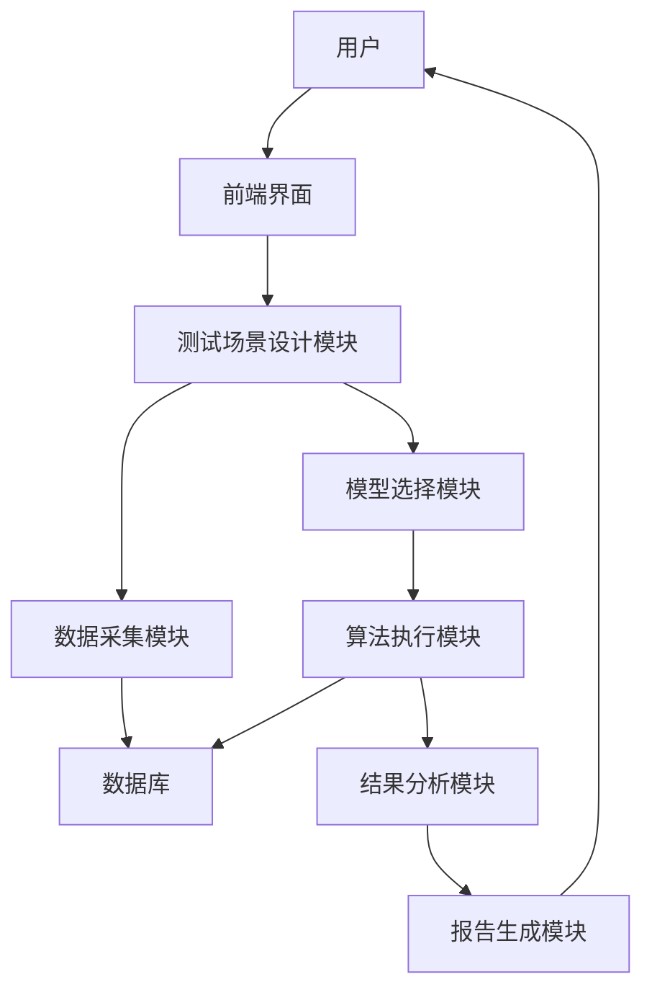

                 


# 金融机构压力测试自动化工具

> 关键词：金融机构，压力测试，自动化工具，风险管理，系统架构，算法原理，项目实战

> 摘要：金融机构压力测试是评估机构在极端市场条件下的风险承受能力的重要手段。随着金融市场复杂性的增加，传统的手动压力测试方法逐渐暴露出效率低、成本高等问题。本文将详细介绍金融机构压力测试自动化工具的设计与实现，包括压力测试的核心概念、算法原理、系统架构设计、项目实战以及高级主题。

---

## 第一部分: 金融机构压力测试概述

### 第1章: 压力测试的基本概念

#### 1.1 什么是压力测试
压力测试是一种评估系统或模型在极端条件下的表现和稳定性的方法。在金融机构中，压力测试用于评估资产组合在市场波动、经济衰退或其他极端情况下可能承受的损失。

- **定义**: 压力测试通过模拟极端市场条件，评估金融机构在这些条件下的财务状况和风险承受能力。
- **目的**: 识别潜在风险，评估资产组合的稳定性，确保金融机构能够在极端情况下保持稳健。
- **分类**: 
  - **情景分析**: 根据不同的市场情景（如经济衰退、市场崩盘）进行测试。
  - **敏感性分析**: 评估资产组合在单一风险因素变化下的反应。
  - **VaR（在险价值）测试**: 估计在一定置信水平下可能的最大损失。

#### 1.2 金融机构的业务特点
金融机构的业务复杂性、高风险性和监管严格性，决定了其对压力测试的特殊需求。

- **主要业务**: 银行贷款、投资组合管理、资产管理、保险产品等。
- **风险类型**: 市场风险、信用风险、流动性风险、操作风险。
- **监管要求**: 各国监管机构（如巴塞尔委员会）要求金融机构定期进行压力测试，并提交报告。

#### 1.3 压力测试在金融机构中的重要性
压力测试是金融机构风险管理的核心工具之一，能够帮助机构在极端情况下做好准备。

- **作用**: 识别潜在风险，制定应对策略，增强市场信心。
- **监管要求**: 各国监管机构要求金融机构定期进行压力测试，并提交报告。
- **实施难点**: 数据获取困难、模型复杂性高、测试场景设计难度大。

### 第2章: 压力测试自动化工具的背景

#### 2.1 压力测试的传统方法
传统的压力测试方法依赖人工操作，效率低且成本高。

- **手动流程**: 确定测试目标、设计测试场景、执行测试、分析结果。
- **优缺点**: 
  - **优点**: 精度高，可以根据具体情况调整测试方案。
  - **缺点**: 时间成本高，难以应对频繁的测试需求。
- **局限性**: 随着金融市场数据的爆炸式增长，手动方法难以满足需求。

#### 2.2 自动化压力测试工具的发展
随着技术的进步，自动化压力测试工具逐渐成为金融机构的首选方案。

- **自动化测试的定义**: 利用软件工具自动执行压力测试，减少人工干预。
- **工具的演变**: 从简单的脚本执行到复杂的多场景自动化测试平台。
- **优势**: 提高测试效率，降低成本，支持大规模数据处理。

#### 2.3 金融机构对自动化压力测试工具的需求
金融机构对自动化压力测试工具的需求主要集中在效率和准确性方面。

- **提高测试效率**: 自动化工具可以快速执行多个测试场景，缩短测试周期。
- **降低测试成本**: 减少人工参与，节省时间和资源。
- **提高测试准确性**: 自动化工具可以确保测试结果的一致性和可重复性。

---

## 第二部分: 压力测试自动化工具的核心概念

### 第3章: 压力测试的流程与模型

#### 3.1 压力测试的基本流程
压力测试的流程包括目标确定、场景设计、执行测试和结果分析。

- **确定测试目标**: 明确测试的目的，例如评估资产组合在市场崩盘情况下的损失。
- **设计测试场景**: 根据测试目标设计具体的测试场景，例如模拟经济衰退或市场崩盘。
- **执行测试**: 执行压力测试，记录测试结果。
- **分析结果**: 解读测试结果，评估风险，并制定应对策略。

#### 3.2 压力测试模型的选择
选择合适的模型是压力测试成功的关键。

- **线性回归模型**: 适用于单一变量对结果的影响分析。
- **时间序列模型**: 适用于分析历史数据中的趋势和周期性。
- **随机过程模型**: 适用于模拟市场波动和极端情况。

#### 3.3 压力测试指标的定义
压力测试指标用于量化测试结果，常见的指标包括VaR（在险价值）和CVaR（条件在险价值）。

- **VaR**: 在一定置信水平下，资产组合可能遭受的最大损失。
- **CVaR**: 在VaR的基础上，考虑超过VaR的情况，更全面地评估风险。

---

## 第三部分: 压力测试自动化工具的算法原理

### 第4章: 压力测试的核心算法

#### 4.1 蒙特卡洛模拟
蒙特卡洛模拟是一种常用的随机模拟方法，广泛应用于压力测试。

- **算法原理**: 通过随机采样模拟市场波动，评估资产组合的损失。
- **流程**: 
  1. 确定市场变量的分布。
  2. 生成随机数。
  3. 计算资产组合的损失。
  4. 统计结果，计算VaR或CVaR。

#### 4.2 遗传算法
遗传算法是一种基于自然选择和遗传机制的优化算法，可用于优化压力测试场景。

- **流程**: 
  1. 初始化种群。
  2. 计算适应度。
  3. 选择、交叉和变异。
  4. 重复迭代，优化测试场景。

---

## 第四部分: 系统架构设计

### 第5章: 自动化压力测试系统的架构

#### 5.1 系统功能设计
自动化压力测试系统应具备以下功能模块：

- **数据采集**: 获取市场数据、资产组合信息等。
- **测试场景设计**: 用户定义测试场景，选择模型和参数。
- **测试执行**: 执行压力测试，记录结果。
- **结果分析**: 解读测试结果，生成报告。

#### 5.2 系统架构图
使用Mermaid绘制系统架构图：



---

## 第五部分: 项目实战

### 第6章: 自动化压力测试工具的实现

#### 6.1 环境安装
- **安装Python**: 安装Anaconda或Miniconda。
- **安装依赖库**: 使用pip安装numpy、pandas、scipy等库。

#### 6.2 核心实现
以下是压力测试自动化工具的核心代码示例：

```python
import numpy as np
import pandas as pd

def monte_carlo_simulation(assets, scenarios):
    returns = np.random.normal(0, 0.05, scenarios)
    portfolio_value = np.dot(assets, returns)
    return portfolio_value

def calculate VaR(portfolio_values, confidence_level):
    sorted_values = np.sort(portfolio_values)
    VaR = sorted_values[int(len(sorted_values) * (1 - confidence_level))]
    return VaR

# 示例使用
assets = [1, 2, 3]
scenarios = 10000
portfolio_values = []
for _ in range(scenarios):
    portfolio_values.append(monte_carlo_simulation(assets, scenarios))

VaR = calculate_VaR(portfolio_values, 0.95)
print(f"VaR at 95% confidence level: {VaR}")
```

---

## 第六部分: 高级主题

### 第7章: 机器学习在压力测试中的应用

#### 7.1 机器学习模型的应用
- **神经网络**: 用于预测市场波动和资产组合风险。
- **随机森林**: 用于分类和回归分析，评估资产组合风险。

#### 7.2 压力测试的前沿技术
- **实时压力测试**: 利用实时数据进行动态压力测试。
- **分布式计算**: 利用分布式计算技术处理大规模数据。

---

## 第七部分: 总结与展望

### 第8章: 总结与未来展望

#### 8.1 总结
金融机构压力测试自动化工具通过自动化流程和先进算法，显著提高了压力测试的效率和准确性。本文详细介绍了压力测试的核心概念、算法原理、系统架构设计以及项目实战。

#### 8.2 未来展望
未来，随着人工智能和大数据技术的发展，压力测试自动化工具将更加智能化和精准化。金融机构可以通过整合机器学习模型和实时数据，进一步提升压力测试的能力。

---

## 作者

作者：AI天才研究院/AI Genius Institute & 禅与计算机程序设计艺术 /Zen And The Art of Computer Programming

---

以上是《金融机构压力测试自动化工具》的技术博客文章的详细目录和部分内容展示。如需进一步扩展或具体章节的详细内容，请随时告知。

