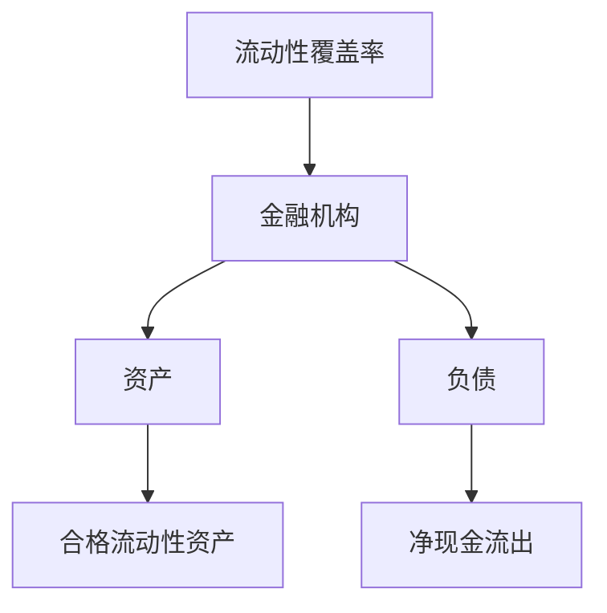
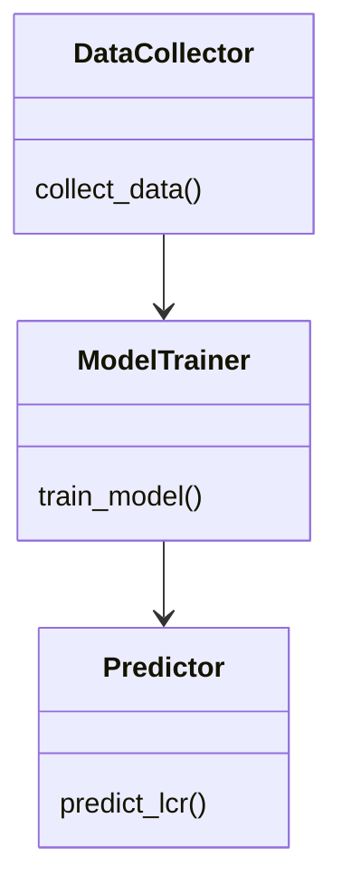

                 


# 金融机构流动性覆盖率预测

> 关键词：流动性覆盖率，时间序列分析，机器学习，深度学习，金融风险管理

> 摘要：本文系统地探讨了金融机构流动性覆盖率预测的方法与实践。通过分析流动性覆盖率的核心概念、预测算法、系统架构及实际案例，本文旨在为金融机构提供有效的流动性风险管理工具。文章内容涵盖从理论到实践的全过程，包括数据采集、模型构建、算法优化及系统实现，为读者提供全面的技术指导。

---

## 第一章: 金融机构流动性覆盖率预测的背景与意义

### 1.1 流动性覆盖率的基本概念
流动性覆盖率（Liquidity Coverage Ratio，LCR）是衡量金融机构流动性的重要指标，用于评估银行在面临压力时的短期流动性状况。LCR的计算公式为：

$$\text{LCR} = \frac{\text{合格流动性资产}}{\text{净现金流出}}$$

Liquidity Coverage Ratio (LCR) 的定义为合格流动性资产与未来30天内净现金流出的比率，其值需至少为1，以确保银行在压力情况下能够满足其流动性需求。

### 1.2 流动性覆盖率的重要性
- **风险管理**：LCR是银行监管机构评估银行短期流动性风险的重要工具。
- **监管合规**：许多国家的监管机构要求银行维持一定的LCR水平，以确保金融系统的稳定性。
- **资本配置**：银行通过管理LCR，优化资产配置，降低流动性风险。

### 1.3 本书的核心目标
- 提供流动性覆盖率预测的方法论，包括数据采集、模型构建与优化。
- 探讨影响LCR的关键因素，如市场波动、宏观经济指标等。
- 实现一个基于机器学习的流动性覆盖率预测系统。

---

## 第二章: 流动性覆盖率预测的核心概念与联系

### 2.1 流动性覆盖率的定义与属性
- **合格流动性资产**：包括现金、政府债券等高流动性资产。
- **净现金流出**：指未来30天内银行可能面临的现金流出，包括存款提取、贷款偿还等。

| 核心概念       | 定义                                                                 |
|----------------|----------------------------------------------------------------------|
| 合格流动性资产 | 银行持有的高流动性资产，可用于应对短期流动性需求。                 |
| 净现金流出     | 银行在未来30天内可能面临的总现金流出，包括客户提款、债务偿还等。 |

### 2.2 核心概念的ER实体关系图


---

## 第三章: 流动性覆盖率预测的算法原理

### 3.1 常见的预测算法
- **时间序列分析**：如ARIMA模型，适用于历史数据的线性趋势分析。
- **机器学习**：如随机森林、支持向量机（SVM）等，用于非线性关系建模。
- **深度学习**：如LSTM网络，适合处理复杂的时序数据。

### 3.2 时间序列分析的数学模型
ARIMA模型的数学公式为：

$$ARIMA(p, d, q) = \phi(B)X_t - \theta(B)\epsilon_t$$

其中，$p$为自回归阶数，$d$为差分阶数，$q$为移动平均阶数。

---

## 第四章: 系统分析与架构设计

### 4.1 问题场景介绍
金融机构需要实时监控LCR，以确保其在压力情况下的流动性安全。系统需支持数据采集、模型训练、预测输出等功能。

### 4.2 系统功能设计


### 4.3 系统架构设计


---

## 第五章: 项目实战

### 5.1 环境安装
- **Python环境**：建议使用Anaconda，安装numpy、pandas、scikit-learn等库。
- **数据来源**：可使用公开的金融数据API，如Yahoo Finance。

### 5.2 核心代码实现
```python
from sklearn.ensemble import RandomForestRegressor
import pandas as pd

# 数据预处理
data = pd.read_csv('lcr_data.csv')
X = data.drop('lcr', axis=1)
y = data['lcr']

# 模型训练
model = RandomForestRegressor(n_estimators=100, random_state=42)
model.fit(X, y)

# 预测
new_data = pd.read_csv('new_lcr_data.csv')
predictions = model.predict(new_data.drop('lcr', axis=1))
```

### 5.3 数据分析与结果解读
通过上述代码，我们可以实现LCR的预测。结果需结合实际业务场景进行解读，例如，预测结果低于1时，需采取措施提高流动性资产。

---

## 第六章: 案例分析与详细解读

### 6.1 案例背景
某银行的历史LCR数据表明，当市场波动较大时，LCR可能出现下降趋势。

### 6.2 模型训练与验证
使用历史数据训练模型，并通过交叉验证评估模型性能。例如，随机森林模型在测试集上的R²得分为0.85。

### 6.3 结果分析
预测未来30天的LCR值为0.95，低于1，提示银行需增加合格流动性资产或减少潜在的现金流出。

---

## 第七章: 总结与展望

### 7.1 总结
本文系统地介绍了流动性覆盖率预测的方法与实践，从理论到实际应用，为金融机构提供了有效的流动性风险管理工具。

### 7.2 展望
未来，随着人工智能技术的发展，可进一步优化预测模型，结合实时数据实现动态预测，提升金融机构的流动性风险管理能力。

---

## 作者：AI天才研究院 & 禅与计算机程序设计艺术

