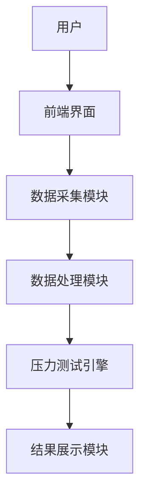
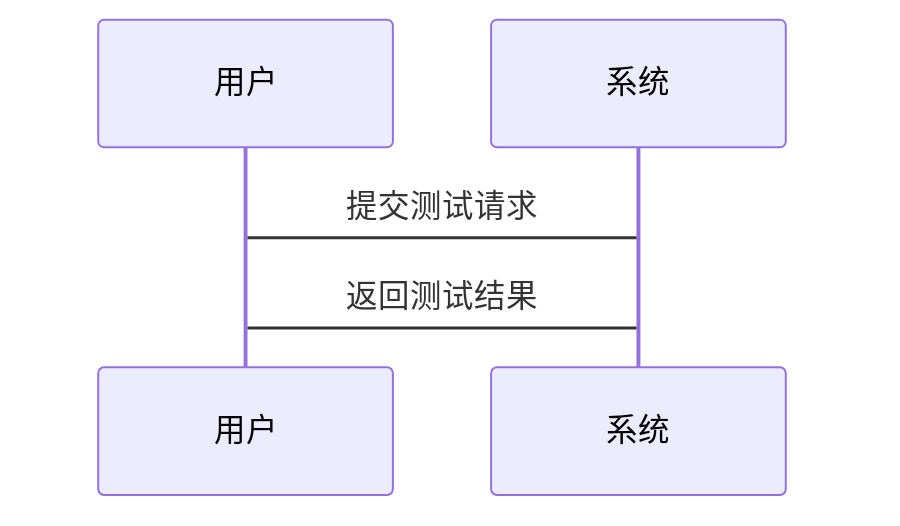

                 


# 金融机构流动性风险压力测试与管理平台

> 关键词：流动性风险、压力测试、金融机构、风险管理平台、算法模型

> 摘要：金融机构流动性风险是金融市场稳定运行的重要影响因素，有效的流动性风险管理对于保障金融机构的稳健运营至关重要。本文围绕金融机构流动性风险压力测试与管理平台的构建，详细阐述了流动性风险的核心概念、压力测试的算法原理、系统架构设计以及实际应用案例。通过系统化的分析与实践，展示了如何利用现代技术手段构建一个高效、智能的流动性风险管理平台，为金融机构的风险管理提供有力支持。

---

## 第一部分: 金融机构流动性风险压力测试与管理平台概述

### 第1章: 流动性风险与压力测试概述

#### 1.1 流动性风险的定义与特征

流动性风险是指金融机构在面对市场波动、资产贬值或其他突发事件时，无法及时以合理成本获得足够资金来满足其资产增长或履行负债义务的风险。其核心特征包括：

- **时间性**：流动性风险随时间变化而变化，通常在市场波动加剧时显著增加。
- **传染性**：流动性风险可能通过金融市场传导，影响整个金融体系的稳定性。
- **不确定性**：流动性风险的触发因素具有不确定性，难以完全预测。

#### 1.2 压力测试的定义与作用

压力测试是一种通过模拟极端市场条件，评估金融机构在特定情景下的财务状况和应对能力的方法。其主要作用包括：

- **风险识别**：发现潜在的流动性风险点。
- **情景分析**：模拟不同市场环境下的资金流动情况。
- **制定应对策略**：通过测试结果优化资产负债结构，制定应急预案。

#### 1.3 金融机构流动性风险压力测试的必要性

随着金融市场的日益复杂化，金融机构面临的流动性风险不断增加。压力测试成为评估和管理流动性风险的重要工具，能够帮助金融机构在极端情况下保持稳健运行。

### 第2章: 流动性风险压力测试与管理平台的背景与需求

#### 2.1 金融机构流动性风险管理的现状

传统流动性风险管理方法依赖于静态分析和人工判断，存在效率低、覆盖面窄等问题。随着金融市场数据的爆发式增长，亟需构建一个智能化的管理平台，实现数据的实时处理和风险的动态评估。

#### 2.2 压力测试技术的发展与应用

近年来，基于大数据和人工智能的压力测试技术快速发展，为金融机构提供了更精准的风险评估方法。通过机器学习算法，可以有效捕捉市场波动中的潜在风险因素。

#### 2.3 平台建设的必要性与目标

- **必要性**：传统方法难以应对复杂市场环境下的流动性风险。
- **目标**：构建一个智能化、自动化的流动性风险管理平台，实现风险的实时监测、情景模拟和应急处置。

---

## 第二部分: 压力测试算法原理与实现

### 第3章: 压力测试算法原理

#### 3.1 蒙特卡洛模拟

蒙特卡洛模拟是一种通过随机抽样方法模拟市场波动的技术，常用于评估资产在不同情景下的表现。其核心步骤如下：

1. **定义变量**：确定影响流动性风险的关键因素，如资产价值、市场利率等。
2. **生成随机数**：模拟不同市场情景下的变量值。
3. **计算结果**：根据模拟结果评估流动性风险。

#### 3.2 情景分析

情景分析是通过设定特定市场情景，评估金融机构在不同条件下的流动性状况。常用情景包括：

- **正常情景**：市场运行平稳。
- **压力情景**：市场出现剧烈波动。
- **极端情景**：发生系统性金融危机。

### 第4章: 算法实现与数学模型

#### 4.1 蒙特卡洛模拟的Python实现

```python
import numpy as np
import pandas as pd

# 定义参数
n_assets = 100
n_simulations = 10000
mu = 0.05
sigma = 0.2

# 生成随机数
np.random.seed(42)
returns = np.random.normal(mu, sigma, (n_simulations, n_assets))

# 计算资产价值
assets = pd.DataFrame(returns)
cumulative_returns = (1 + assets).cumprod()
```

#### 4.2 数学模型

流动性风险的评估公式可以表示为：

$$
\text{流动性风险} = \frac{\text{资产贬值} \times \text{负债规模}}{\text{资产流动性}}
$$

---

## 第三部分: 系统架构设计与实现

### 第5章: 系统架构设计

#### 5.1 系统功能设计

- **数据采集**：实时采集市场数据和金融机构的资产负债信息。
- **情景模拟**：基于历史数据和机器学习模型生成多种市场情景。
- **风险评估**：根据模拟结果评估流动性风险。
- **应急预案**：制定应对极端情景的策略。

#### 5.2 系统架构图



### 第6章: 接口设计与交互流程

#### 6.1 接口设计

- **API接口**：提供RESTful API，支持数据的上传和下载。
- **交互流程**：用户输入测试参数，系统返回测试结果。

#### 6.2 交互流程图



---

## 第四部分: 项目实战与案例分析

### 第7章: 项目实战

#### 7.1 环境安装

- **工具安装**：安装Python、Jupyter Notebook、Pandas、NumPy等工具。
- **数据准备**：收集金融机构的资产负债数据和市场数据。

#### 7.2 核心代码实现

```python
import pandas as pd
import numpy as np

def calculate流动性风险(assets, liabilities, risk_factors):
    # 计算资产贬值
    asset_depreciation = assets * risk_factors
    # 计算流动性风险
    liquidity_risk = asset_depreciation * liabilities
    return liquidity_risk

# 示例数据
assets = pd.DataFrame({'资产': [100, 200, 300]})
liabilities = pd.DataFrame({'负债': [50, 100, 150]})
risk_factors = pd.DataFrame({'风险因素': [0.8, 0.9, 1.0]})

# 计算流动性风险
risk = calculate流动性风险(assets, liabilities, risk_factors)
print(risk)
```

#### 7.3 案例分析

以某银行为例，分析其在不同市场情景下的流动性风险。通过平台模拟极端市场条件，评估该银行的应对能力，并制定相应的风险管理策略。

---

## 第五部分: 最佳实践与总结

### 第8章: 最佳实践

- **数据质量管理**：确保数据的准确性和完整性。
- **模型优化**：定期更新模型参数，提高预测精度。
- **系统维护**：及时修复系统漏洞，确保平台稳定运行。

### 第9章: 小结与展望

本文详细介绍了金融机构流动性风险压力测试与管理平台的构建过程，从理论到实践，为金融机构提供了有效的风险管理工具。未来，随着人工智能和大数据技术的进一步发展，流动性风险管理平台将更加智能化和精准化。

---

## 作者

作者：AI天才研究院/AI Genius Institute & 禅与计算机程序设计艺术 /Zen And The Art of Computer Programming

---

这篇文章通过系统化的分析与实践，详细阐述了金融机构流动性风险压力测试与管理平台的构建过程，为金融机构的风险管理提供了理论支持和实践指导。

