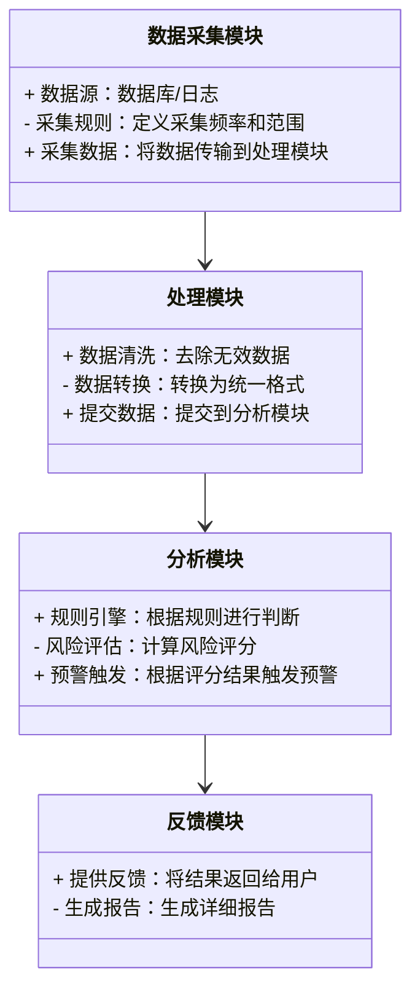

                 


# 金融监管合规自动化工具

> 关键词：金融监管、合规自动化、规则引擎、风险评估、预警系统

> 摘要：随着金融市场的快速发展，传统的金融监管模式面临诸多挑战，合规性问题日益突出。本文深入探讨了金融监管合规自动化工具的核心概念、算法原理、数学模型、系统架构以及实际应用，旨在为金融行业提供一套高效、智能的解决方案，助力金融机构实现合规管理的自动化和智能化。

---

## 第1章: 金融监管合规的背景与问题

### 1.1 金融监管的现状与挑战
金融市场的快速发展带来了复杂的监管环境。传统监管模式依赖人工审查，效率低下且容易出错，难以应对日益增长的监管需求。金融机构需要在合规性、效率和成本之间找到平衡点。

### 1.2 金融监管中的合规问题
合规性是金融机构运营的核心要求。本文将介绍金融合规的主要领域，包括反洗钱（AML）、反欺诈、关联交易监管等，并分析合规问题对企业的影响，如罚款、声誉损失等。

### 1.3 金融监管合规工具的必要性
手动审查的局限性日益显现，而自动化工具通过智能化手段，能够高效、准确地完成合规审查工作。本文将探讨自动化工具的优势及其在各场景中的应用。

---

## 第2章: 金融监管合规自动化工具的核心概念与联系

### 2.1 核心概念
金融监管合规工具主要包括数据采集与处理、规则引擎和风险评估与预警三个核心模块。

### 2.2 核心概念的联系与对比
通过对比分析，我们展示了各核心概念的属性特征，并绘制了实体关系图（ER图）。

```
# ER实体关系图
```mermaid
erd
    title 金融监管合规工具核心概念关系图
    entity(监管规则)
    entity(数据源)
    entity(风险评估)
    entity(预警系统)
    relation(->, 监管规则, "基于规则进行")
    relation(->, 数据源, "提供数据支持")
    relation(->, 风险评估, "生成评估结果")
    relation(->, 预警系统, "触发预警")
```

---

## 第3章: 金融监管合规自动化工具的算法原理

### 3.1 规则引擎算法
规则引擎通过预定义的规则对数据进行处理和判断。其实现流程包括规则解析、匹配和执行。

```python
def rule_engine(data):
    for rule in rules:
        if rule.match(data):
            return rule.execute(data)
    return None
```

### 3.2 风险评估算法
基于机器学习的风险评估模型可以实时分析数据，生成风险评分。公式如下：

$$风险评分 = \alpha \cdot 信用评分 + \beta \cdot 账户行为 + \gamma \cdot 交易频率$$

### 3.3 预警系统算法
预警系统通过异常检测算法触发预警机制。例如，基于时间序列的异常检测可以识别异常交易。

---

## 第4章: 金融监管合规自动化工具的数学模型与公式

### 4.1 数学模型
风险评分模型是一个典型的数学模型，用于评估交易的潜在风险：

$$风险评分 = \sum_{i=1}^{n} w_i \cdot x_i$$

其中，$w_i$ 是权重，$x_i$ 是特征变量。

### 4.2 示例
假设某笔交易的风险评分为：

$$风险评分 = 0.3 \cdot 收入 + 0.4 \cdot 交易频率 + 0.3 \cdot 账户余额$$

如果风险评分超过阈值，系统将触发预警。

---

## 第5章: 系统分析与架构设计

### 5.1 系统功能设计
系统功能包括数据采集、规则管理、风险评估和预警反馈。领域模型如图所示：



---

## 第6章: 项目实战

### 6.1 环境安装
安装Python和相关库（如pandas、scikit-learn）。

### 6.2 核心代码实现
以下是一个规则引擎的实现示例：

```python
class RuleEngine:
    def __init__(self, rules):
        self.rules = rules

    def process(self, data):
        for rule in self.rules:
            if rule.apply(data):
                return rule.execute(data)
        return None
```

### 6.3 案例分析
通过实际案例分析，展示工具在合规审查中的应用效果。

---

## 第7章: 最佳实践与总结

### 7.1 最佳实践
- 定期更新规则库，确保合规性。
- 结合人工审查，确保系统准确性。

### 7.2 小结
本文系统地介绍了金融监管合规自动化工具的核心概念、算法原理、系统架构和实际应用，为金融机构提供了一套高效的解决方案。

---

## 注意事项
- 本文仅作为技术参考，具体实施需根据实际情况调整。
- 本文中的代码和模型仅供参考，实际应用中需结合具体需求进行优化。

---

## 拓展阅读
- 《金融风险管理》
- 《自动化系统设计》
- 《Python机器学习实战》

---

作者：AI天才研究院/AI Genius Institute & 禅与计算机程序设计艺术 /Zen And The Art of Computer Programming

