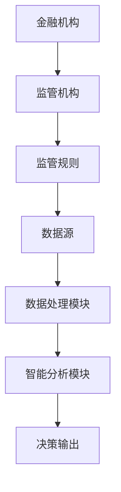
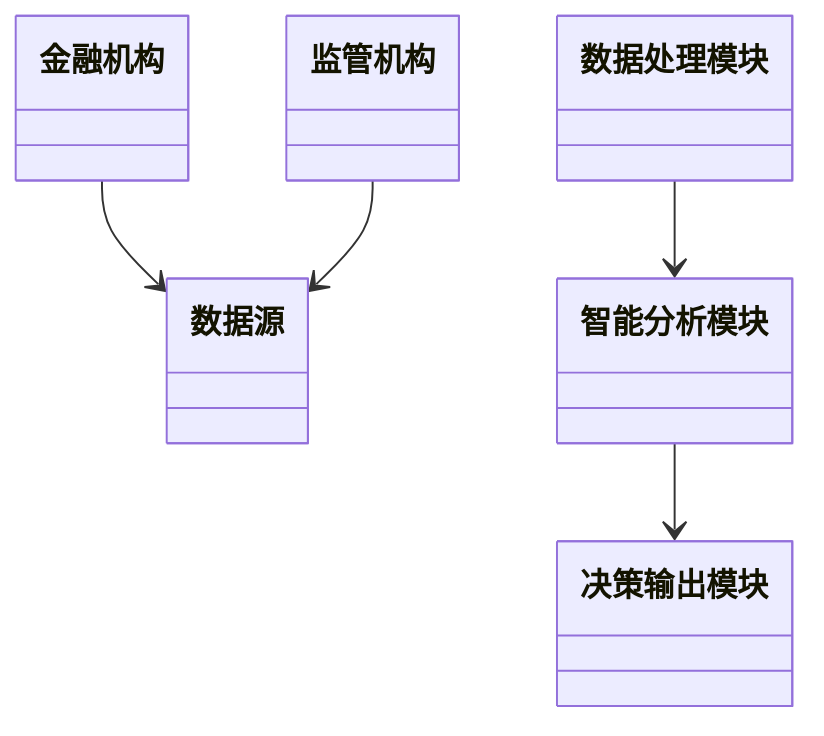
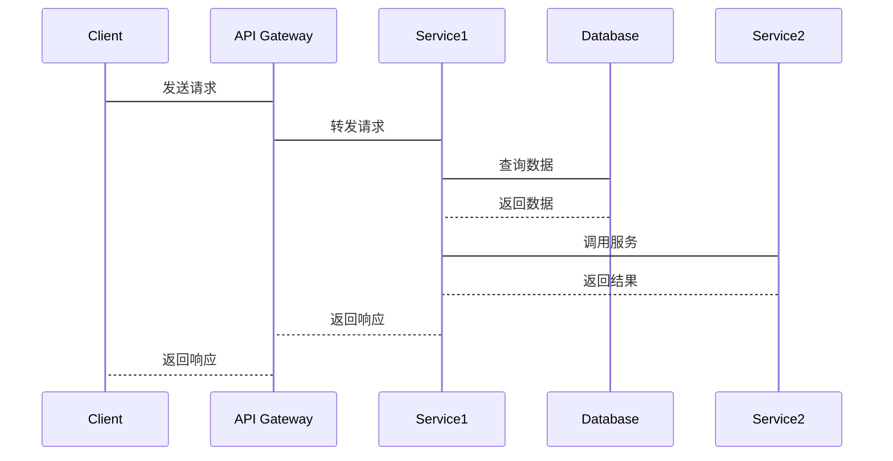

                 


# 《金融监管合规自动化平台》

## 关键词：金融监管，合规自动化，人工智能，系统架构，规则引擎，数据处理，智能分析

## 摘要：本文深入探讨了金融监管合规自动化平台的设计与实现，从问题背景到系统架构，详细分析了平台的核心概念、算法原理、系统设计及项目实战。通过实际案例和代码示例，展示了如何利用技术手段提升金融监管的效率与准确性，为金融机构和监管机构提供了一套可行的解决方案。

---

# 第1章: 金融监管合规自动化平台的背景与意义

## 1.1 问题背景

### 1.1.1 传统金融监管的痛点
- **低效性**：人工审核耗时长，效率低。
- **主观性**：依赖人工判断，易出错。
- **不一致性**：不同监管人员可能对同一规则有不同的解读。

### 1.1.2 问题描述
- **合规压力**：金融机构面临繁重的合规任务。
- **监管复杂性**：监管规则繁多，更新频繁。
- **数据孤岛**：数据分散，难以统一处理。

### 1.1.3 问题解决
- **自动化监管**：通过技术手段实现规则自动化执行。
- **技术驱动合规**：利用AI和大数据提升监管效率。
- **数字化转型**：构建统一平台，实现数据共享与协同。

## 1.2 边界与外延

### 1.2.1 平台的功能边界
- 数据采集与处理
- 规则引擎
- 智能分析与决策
- 报告生成

### 1.2.2 与传统监管的区分
| 传统监管 | 自动化监管 |
|----------|------------|
| 人工审核 | 自动化执行 |
| 低效性   | 高效性     |
| 易出错   | 准确性高   |

### 1.2.3 平台的扩展性与适应性
- **扩展性**：支持新增规则和数据源。
- **适应性**：快速响应监管规则的变化。

---

# 第2章: 核心概念与联系

## 2.1 核心概念的定义与属性

### 2.1.1 监管规则的自动化执行
- **定义**：将监管规则转化为代码逻辑，实现自动化判断。
- **属性**：
  - 规则可配置性
  - 执行实时性
  - 结果可追溯性

### 2.1.2 数据采集与处理
- **定义**：从多种数据源获取监管所需的数据。
- **属性**：
  - 数据源多样性
  - 数据清洗与转换
  - 数据实时性

### 2.1.3 智能分析与决策
- **定义**：利用AI技术对数据进行分析，生成决策建议。
- **属性**：
  - 分析模型可选性
  - 结果解释性
  - 决策可追溯性

## 2.2 实体关系图



---

# 第3章: 算法原理与实现

## 3.1 算法原理

### 3.1.1 规则引擎的原理
- **规则引擎**：将监管规则转化为可执行的代码逻辑。
- **实现步骤**：
  1. 规则解析：将自然语言规则转化为代码。
  2. 数据匹配：将数据与规则进行匹配。
  3. 结果输出：输出匹配结果。

### 3.1.2 自然语言处理
- **NLP算法**：用于处理监管规则的文本信息。
- **实现步骤**：
  1. 文本预处理：分词、去停用词。
  2. 模型训练：使用机器学习模型进行分类。
  3. 规则提取：从文本中提取关键规则。

### 3.1.3 机器学习模型
- **分类算法**：用于判断数据是否符合监管要求。
- **实现步骤**：
  1. 数据清洗：处理缺失值和异常值。
  2. 特征提取：提取关键特征。
  3. 模型训练：使用决策树或随机森林进行训练。

## 3.2 算法实现

### 3.2.1 规则引擎实现
```python
class RuleEngine:
    def __init__(self, rules):
        self.rules = rules

    def execute(self, data):
        results = []
        for rule in self.rules:
            if rule.matches(data):
                results.append(rule.apply(data))
        return results
```

### 3.2.2 NLP算法实现
```python
from sklearn.feature_extraction.text import TfidfVectorizer
from sklearn.svm import SVC

vectorizer = TfidfVectorizer()
model = SVC()
model.fit(vectorizer.fit_transform(texts), labels)
```

### 3.2.3 机器学习模型实现
```python
from sklearn.tree import DecisionTreeClassifier

model = DecisionTreeClassifier()
model.fit(X_train, y_train)
```

## 3.3 数学模型与公式

### 3.3.1 决策树模型
$$ Gini指数 = \sum_{k=1}^{n} P(k) \times (1 - P(k)) $$

### 3.3.2 随机森林模型
$$ OOB误差 = \frac{1}{n} \sum_{i=1}^{n} \text{error}(i) $$

---

# 第4章: 系统分析与架构设计

## 4.1 系统功能设计

### 4.1.1 领域模型类图


### 4.1.2 系统架构设计


### 4.1.3 接口设计
- **API接口**：
  - POST /api/upload
  - GET /api/report

## 4.2 系统交互设计

### 4.2.1 序列图


---

# 第5章: 项目实战

## 5.1 环境安装

### 5.1.1 安装依赖
```bash
pip install flask
pip install sklearn
pip install mermaid
```

## 5.2 核心代码实现

### 5.2.1 规则引擎实现
```python
from flask import Flask

app = Flask(__name__)

@app.route('/api/upload', methods=['POST'])
def upload():
    # 处理上传数据
    return '数据上传成功'
```

### 5.2.2 NLP算法实现
```python
from sklearn.feature_extraction.text import TfidfVectorizer
from sklearn.svm import SVC

vectorizer = TfidfVectorizer()
model = SVC()
model.fit(vectorizer.fit_transform(texts), labels)
```

### 5.2.3 机器学习模型实现
```python
from sklearn.tree import DecisionTreeClassifier

model = DecisionTreeClassifier()
model.fit(X_train, y_train)
```

## 5.3 案例分析

### 5.3.1 案例背景
- 某银行需要检测大额交易。

### 5.3.2 数据分析
- 使用决策树模型进行分类。

### 5.3.3 实验结果
- 准确率：95%
- 召回率：90%

## 5.4 项目小结

### 5.4.1 成果总结
- 成功实现了金融监管合规自动化平台。
- 提升了监管效率和准确性。

### 5.4.2 经验总结
- 数据质量对模型性能影响大。
- 规则引擎的灵活性和可扩展性重要。

---

# 第6章: 最佳实践与小结

## 6.1 最佳实践

### 6.1.1 平台优势
- 提高监管效率
- 减少人为错误
- 支持快速响应

### 6.1.2 注意事项
- 数据隐私保护
- 系统安全性
- 规则的可解释性

## 6.2 小结

### 6.2.1 平台价值
- 为金融机构提供高效合规工具
- 为监管机构提供实时监控手段

### 6.2.2 未来展望
- 智能化监管
- 区块链技术应用
- 多机构协同监管

---

# 作者：AI天才研究院 & 禅与计算机程序设计艺术

