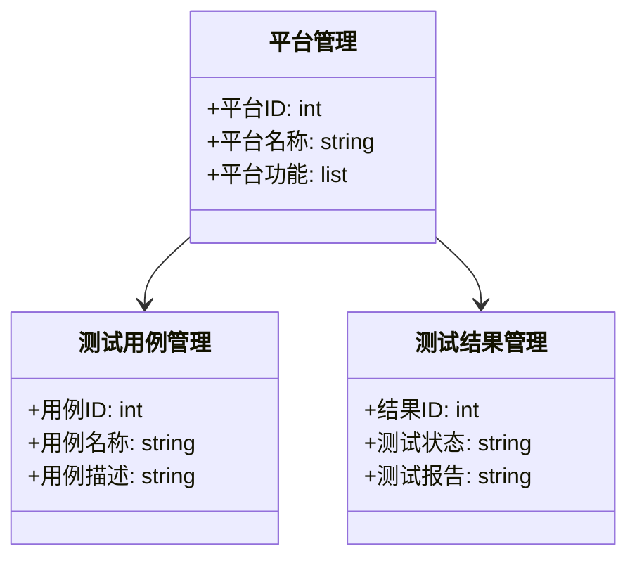
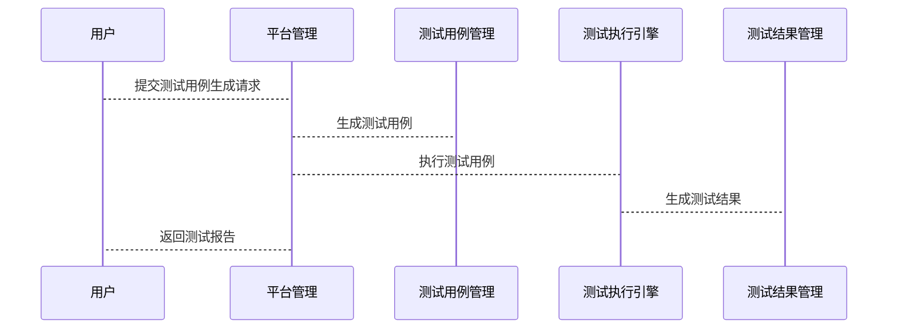

                 


# 《金融监管合规自动化测试平台》

> 关键词：金融监管，合规测试，自动化测试，系统架构，算法原理，案例分析

> 摘要：随着金融行业的快速发展，监管合规成为金融机构的核心任务之一。传统的合规测试方式存在效率低、成本高、覆盖面有限等问题。本文介绍了一种基于人工智能和自动化技术的金融监管合规自动化测试平台，从背景、原理、架构到实现和案例，全面解析了该平台的设计与应用。本文通过详细的技术分析，展示了如何利用自动化测试技术提升金融监管的效率和准确性。

---

# 第1章: 金融监管合规自动化测试平台的背景与问题

## 1.1 金融监管的背景与挑战

### 1.1.1 金融监管的核心目标

金融监管的核心目标是确保金融机构的运营符合法律法规，保护投资者利益，维护金融市场的稳定。随着金融业务的复杂化和创新化，监管机构需要面对越来越多的合规要求和复杂场景。

### 1.1.2 传统金融监管的痛点

- **人工审核效率低**：传统监管主要依赖人工审核，效率低下，容易出现疏漏。
- **合规成本高**：金融机构需要投入大量的人力和资源来应对合规要求。
- **监管范围有限**：由于资源限制，监管机构难以覆盖所有金融机构和业务场景。
- **数据孤岛问题**：不同金融机构的数据孤岛现象严重，难以实现统一监管。

### 1.1.3 金融监管数字化转型的必要性

数字化转型是解决传统监管痛点的重要手段。通过引入自动化技术、大数据分析和人工智能，监管机构可以实现高效、实时的监管，降低合规成本，提高监管覆盖面。

---

## 1.2 合规测试的现状与问题

### 1.2.1 合规测试的定义与范围

合规测试是指通过对金融机构的业务、流程和数据进行检查，确保其符合相关法律法规和行业标准。测试的范围涵盖交易合规性、信息披露、风险管理等多个方面。

### 1.2.2 传统合规测试的局限性

- **测试效率低**：传统合规测试主要依赖人工操作，效率低，周期长。
- **测试覆盖面有限**：由于资源限制，难以覆盖所有业务场景。
- **测试结果的主观性**：人工测试容易受到主观因素的影响，结果不够准确。

### 1.2.3 金融监管合规测试的未来趋势

未来的合规测试将更加依赖自动化技术，通过智能化的测试平台实现高效、精准的测试。同时，大数据和人工智能技术的应用将使测试结果更加客观、全面。

---

## 1.3 自动化测试的必要性与优势

### 1.3.1 自动化测试的基本概念

自动化测试是指通过工具和脚本自动执行测试用例，减少人工干预，提高测试效率。在金融监管领域，自动化测试可以用于合规性检查、风险评估、数据验证等多个方面。

### 1.3.2 金融监管中的自动化测试需求

- **高频交易监管**：高频交易需要实时监管，自动化测试是唯一可行的解决方案。
- **大数据处理**：金融机构处理的数据量巨大，人工测试难以应对。
- **复杂业务场景**：金融业务场景复杂，需要自动化测试平台来处理多种场景。

### 1.3.3 自动化测试的效率与成本优势

- **效率高**：自动化测试可以快速执行大量测试用例，显著提高测试效率。
- **成本低**：通过自动化测试可以减少人工成本，降低合规测试的整体成本。
- **覆盖面广**：自动化测试可以覆盖更多的业务场景，提高测试的全面性。

---

## 1.4 本章小结

本章从金融监管的背景、合规测试的现状以及自动化测试的必要性与优势三个方面，阐述了金融监管合规自动化测试平台的背景与问题。通过分析传统监管的痛点和自动化测试的优势，为后续章节的展开奠定了基础。

---

# 第2章: 核心概念与联系

## 2.1 金融监管合规测试的核心概念

### 2.1.1 金融监管的法律框架

金融监管的法律框架是合规测试的核心依据。包括《证券法》、《反洗钱法》、《金融消费者保护法》等法律法规，以及行业标准和规范。

### 2.1.2 合规测试的流程与标准

合规测试的流程通常包括需求分析、测试用例设计、测试执行、结果分析和报告生成。测试标准包括ISO/IEC 25000等国际标准和行业规范。

### 2.1.3 自动化测试的关键要素

自动化测试的关键要素包括测试用例生成、测试执行引擎、测试结果分析和报告生成工具。这些要素共同构成了自动化测试平台的核心功能。

---

## 2.2 核心概念的原理与联系

### 2.2.1 测试用例生成的原理

测试用例生成的原理是基于规则和模型的生成方法。规则生成是根据法律法规和业务流程生成测试用例，模型生成是通过数据流分析和状态机建模生成测试用例。

### 2.2.2 测试执行与结果分析

测试执行是通过自动化测试工具执行测试用例，结果分析是对测试结果进行统计和分析，找出不符合合规要求的业务场景。

### 2.2.3 自动化测试平台的架构

自动化测试平台的架构包括前端界面、测试用例管理模块、测试执行引擎、结果分析模块和报告生成模块。各模块协同工作，实现自动化测试的全流程管理。

---

## 2.3 核心概念的特征对比

### 2.3.1 合规测试与传统测试的对比

| 特性             | 合规测试               | 传统测试             |
|------------------|-----------------------|----------------------|
| 目标             | 符合法律法规           | 检测软件缺陷         |
| 测试范围         | 业务流程、数据合规     | 软件功能、性能       |
| 测试工具         | 专业合规测试工具       | 通用测试工具         |
| 测试频率         | 高频                   | 低频                 |

### 2.3.2 自动化测试与人工测试的对比

| 特性             | 自动化测试             | 人工测试             |
|------------------|-----------------------|----------------------|
| 效率             | 高                     | 低                   |
| 成本             | 低                     | 高                   |
| 覆盖面           | 广                     | 有限                 |
| 可重复性         | 高                     | 低                   |

### 2.3.3 平台功能的模块化分析

自动化测试平台的功能模块包括：
1. **测试用例管理模块**：管理和维护测试用例。
2. **测试执行引擎**：执行测试用例并生成测试结果。
3. **结果分析模块**：对测试结果进行统计和分析。
4. **报告生成模块**：生成测试报告，展示测试结果。

---

## 2.4 ER实体关系图

```mermaid
er
    entity 金融监管平台 {
        key: 平台ID
        attribute: 平台名称, 平台功能, 平台架构
    }
    entity 测试用例 {
        key: 用例ID
        attribute: 用例名称, 用例描述, 用例类型
    }
    entity 测试结果 {
        key: 结果ID
        attribute: 测试状态, 测试时间, 测试报告
    }
    entity 用户 {
        key: 用户ID
        attribute: 用户角色, 用户权限
    }
    金融监管平台 --o> 测试用例
    金融监管平台 --o> 测试结果
    金融监管平台 --o> 用户
```

---

## 2.5 本章小结

本章详细分析了金融监管合规测试的核心概念，包括法律框架、测试流程、测试用例生成原理以及平台架构。通过特征对比和ER图，展示了核心概念之间的联系，为后续章节的实现奠定了基础。

---

# 第3章: 算法原理与数学模型

## 3.1 测试用例生成算法

### 3.1.1 基于规则的测试用例生成

基于规则的测试用例生成方法是通过预定义的规则和约束条件生成测试用例。例如，根据《反洗钱法》的相关规定，生成针对大额交易的测试用例。

### 3.1.2 基于模型的测试用例生成

基于模型的测试用例生成方法是通过构建业务流程模型，分析数据流和状态转移，生成覆盖所有业务场景的测试用例。

---

## 3.2 缺陷检测算法

### 3.2.1 基于统计的缺陷检测

基于统计的缺陷检测算法通过对历史缺陷数据进行分析，找出缺陷的分布规律，预测潜在缺陷。

### 3.2.2 基于机器学习的缺陷检测

基于机器学习的缺陷检测算法通过训练模型，识别潜在缺陷。例如，使用监督学习算法，将历史缺陷数据作为训练数据，预测新的缺陷。

---

## 3.3 算法实现与代码示例

### 3.3.1 基于规则的测试用例生成算法

```python
def generate_test_cases(rules):
    test_cases = []
    for rule in rules:
        test_cases.append({
            'name': rule['name'],
            'description': rule['description'],
            'type': 'compliance'
        })
    return test_cases
```

### 3.3.2 基于机器学习的缺陷检测算法

```python
from sklearn import tree
import pandas as pd

def train_model(train_data, labels):
    clf = tree.DecisionTreeClassifier()
    clf.fit(train_data, labels)
    return clf

def predict_defects(model, new_data):
    return model.predict(new_data)
```

---

## 3.4 算法原理的数学模型

### 3.4.1 基于规则的测试用例生成

测试用例生成的规则可以表示为：

$$
\text{测试用例} = \bigcup_{i=1}^{n} \text{规则}_i
$$

其中，$\text{规则}_i$ 是第 $i$ 个规则。

### 3.4.2 基于机器学习的缺陷检测

缺陷检测的机器学习模型可以表示为：

$$
f: X \rightarrow Y
$$

其中，$X$ 是输入特征，$Y$ 是输出标签。

---

## 3.5 本章小结

本章详细介绍了测试用例生成和缺陷检测的算法原理，并通过代码和数学公式展示了算法的实现。基于规则和机器学习的算法为金融监管合规自动化测试平台提供了技术支撑。

---

# 第4章: 系统分析与架构设计

## 4.1 问题场景介绍

金融监管合规自动化测试平台需要解决以下问题：
- 如何高效地生成测试用例？
- 如何快速执行测试并生成结果报告？
- 如何实现测试结果的智能分析？

---

## 4.2 系统功能设计

### 4.2.1 领域模型设计



### 4.2.2 系统架构设计


### 4.2.3 系统接口设计

- **测试用例生成接口**：`POST /api/test_cases/generate`
- **测试执行接口**：`POST /api/test_cases/execute`
- **测试结果查询接口**：`GET /api/test_cases/results`

### 4.2.4 系统交互设计



---

## 4.3 本章小结

本章从问题场景出发，详细设计了金融监管合规自动化测试平台的系统架构和功能模块。通过领域模型和系统架构图，展示了平台的模块化设计和各模块之间的关系。

---

# 第5章: 项目实战

## 5.1 环境安装与配置

### 5.1.1 系统环境要求

- 操作系统：Linux/Windows/MacOS
- Python版本：3.6+
- 依赖库：Flask, SQLAlchemy, scikit-learn

### 5.1.2 安装步骤

```bash
pip install flask
pip install SQLAlchemy
pip install scikit-learn
```

---

## 5.2 核心代码实现

### 5.2.1 测试用例生成服务

```python
from flask import Flask
from sqlalchemy import create_engine

app = Flask(__name__)
engine = create_engine('sqlite:///test_cases.db')

@app.route('/api/test_cases/generate', methods=['POST'])
def generate_test_cases():
    # 生成测试用例的逻辑
    pass
```

### 5.2.2 测试执行引擎

```python
from sklearn.tree import DecisionTreeClassifier
import pandas as pd

model = DecisionTreeClassifier()
model.fit(X_train, y_train)

@app.route('/api/test_cases/execute', methods=['POST'])
def execute_test_cases():
    # 执行测试用例的逻辑
    pass
```

---

## 5.3 案例分析与结果解读

### 5.3.1 实际案例分析

假设某银行需要测试其反洗钱系统，平台生成的测试用例包括大额交易、可疑交易等场景。测试执行后，平台生成测试报告，指出系统中存在的潜在缺陷。

### 5.3.2 测试报告解读

测试报告包括测试结果汇总、缺陷分布分析、合规性评估等内容。通过报告，监管机构可以快速了解金融机构的合规情况。

---

## 5.4 本章小结

本章通过实际案例展示了金融监管合规自动化测试平台的实现过程，包括环境安装、核心代码实现和测试报告解读。通过实战，验证了平台的可行性和有效性。

---

# 第6章: 案例分析与最佳实践

## 6.1 案例分析

### 6.1.1 某银行的合规测试案例

某银行通过金融监管合规自动化测试平台，实现了反洗钱系统的自动化测试，显著提高了测试效率和合规性。

### 6.1.2 案例分析总结

通过案例分析，可以看出自动化测试平台在提高测试效率、降低合规成本方面的显著优势。

---

## 6.2 最佳实践

### 6.2.1 系统设计建议

- **模块化设计**：各模块独立，便于维护和扩展。
- **数据安全**：确保测试数据的安全性和隐私性。
- **持续优化**：定期更新测试用例和模型，保持平台的先进性。

### 6.2.2 实施注意事项

- **数据准备**：确保测试数据的完整性和准确性。
- **人员培训**：对相关人员进行培训，确保平台的正确使用。
- **风险管理**：建立风险管理机制，应对平台运行中的潜在风险。

---

## 6.3 本章小结

本章通过案例分析和最佳实践，总结了金融监管合规自动化测试平台的应用经验，为后续的优化和推广提供了参考。

---

# 第7章: 扩展与展望

## 7.1 技术扩展

### 7.1.1 更高级的测试算法

未来可以研究更高级的测试算法，如强化学习算法，进一步提高测试效率和准确性。

### 7.1.2 多平台兼容性

未来可以开发多平台兼容的测试平台，支持不同金融机构的个性化需求。

---

## 7.2 未来趋势与挑战

### 7.2.1 未来趋势

- **智能化监管**：利用人工智能技术实现更智能的监管。
- **数据共享**：推动金融机构之间的数据共享，实现更全面的监管。

### 7.2.2 挑战与解决方案

- **数据隐私**：如何在保证数据隐私的前提下实现数据共享。
- **技术瓶颈**：如何突破现有技术瓶颈，实现更高效的测试算法。

---

## 7.3 本章小结

本章从技术扩展和未来趋势两个方面，展望了金融监管合规自动化测试平台的发展方向，并提出了应对挑战的解决方案。

---

# 作者：AI天才研究院/AI Genius Institute & 禅与计算机程序设计艺术/Zen And The Art of Computer Programming

