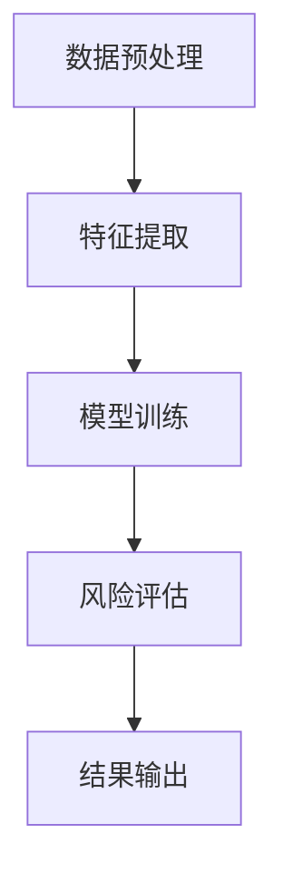
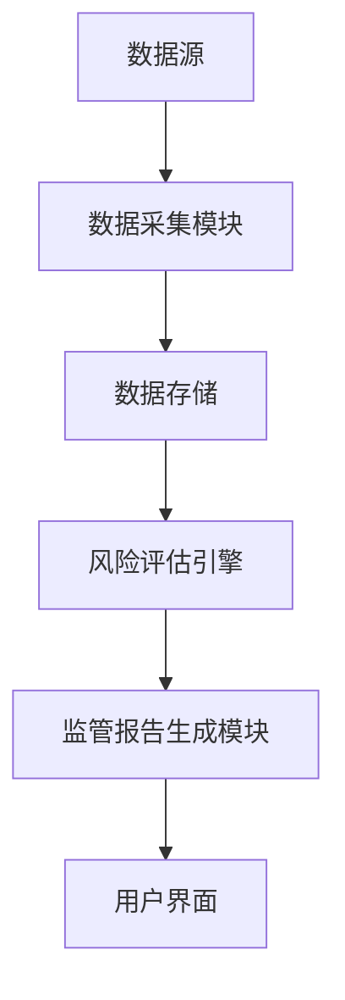
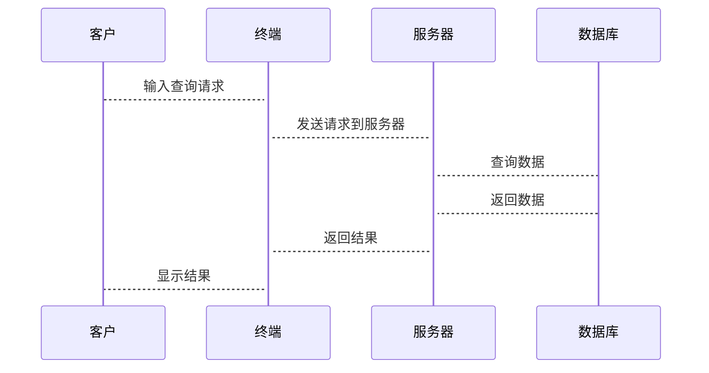

                 


# 金融监管合规风险评估自动化平台

> 关键词：金融监管，合规风险，自动化平台，机器学习，自然语言处理，系统架构

> 摘要：本文详细探讨了金融监管合规风险评估自动化平台的设计与实现。首先介绍了金融监管与合规风险的基本概念，分析了传统监管模式的局限性，并提出了自动化平台的必要性。接着从算法原理、系统架构设计、项目实战等方面深入剖析了平台的技术实现，最后结合实际案例展示了平台的应用效果。本文旨在为金融行业的监管科技（RegTech）发展提供理论支持和实践指导。

---

# 第一部分: 金融监管合规风险评估自动化平台背景与概述

## 第1章: 金融监管合规风险评估概述

### 1.1 金融监管的背景与意义

#### 1.1.1 金融监管的核心概念
金融监管是指通过对金融机构和金融市场行为的监督，确保金融体系的稳定性和合规性。监管的核心目标包括防范金融风险、保护投资者利益、维护市场秩序等。

#### 1.1.2 合规风险的定义与特征
合规风险是指金融机构在经营活动中因未能遵守相关法律法规和监管要求而可能导致的法律制裁、财务损失或声誉损害。其特征包括复杂性、动态性、隐蔽性等。

#### 1.1.3 金融监管与合规风险的关系
金融监管是防范合规风险的重要手段，而合规风险评估是金融监管的核心环节之一。通过有效评估合规风险，监管机构能够及时发现和处理问题，确保金融体系的稳健运行。

---

### 1.2 传统金融监管的局限性

#### 1.2.1 传统监管模式的痛点
传统金融监管主要依赖人工审核和事后检查，存在效率低、覆盖面有限、成本高等问题。

#### 1.2.2 人工监管的效率瓶颈
人工监管依赖于大量的人力资源，且容易受到主观因素的影响，难以实现全面、实时的监管。

#### 1.2.3 信息孤岛与数据碎片化问题
金融机构内部数据分散，监管机构难以获取全面、准确的数据，导致监管效果不理想。

---

### 1.3 自动化平台的提出与目标

#### 1.3.1 自动化监管的必要性
随着金融业务的复杂化和数字化，传统的监管模式已难以满足需求。自动化监管能够提高效率、降低成本、增强监管的全面性。

#### 1.3.2 平台的核心目标
- 提供实时、动态的合规风险评估。
- 实现数据的自动采集、分析和报告。
- 为监管机构和金融机构提供决策支持。

#### 1.3.3 平台的预期效益
- 提高监管效率，降低合规成本。
- 通过智能化手段，发现潜在风险，提前采取措施。
- 促进金融机构的合规文化建设。

---

## 第2章: 核心概念与联系

### 2.1 核心概念原理

#### 2.1.1 金融监管的三要素模型
金融监管可以分为三个核心要素：监管主体、监管对象和监管手段。监管主体包括监管机构和金融机构，监管对象是金融行为和市场，监管手段包括法律法规、技术工具等。

#### 2.1.2 合规风险的评估维度
合规风险的评估可以从以下几个维度进行：
- 业务合规性：是否符合相关法律法规。
- 数据完整性：数据是否真实、准确。
- 风险暴露度：风险可能带来的损失程度。

#### 2.1.3 自动化平台的技术支撑
自动化平台依赖于大数据技术、人工智能（AI）、自然语言处理（NLP）等技术，实现数据的自动化采集、分析和报告。

---

### 2.2 核心概念属性对比

#### 2.2.1 金融监管与合规风险的对比分析
| 特性       | 金融监管                     | 合规风险                     |
|------------|------------------------------|-------------------------------|
| 定义       | 对金融机构的监管行为          | 金融机构因不合规导致的风险     |
| 主体       | 监管机构                     | 金融机构                     |
| 目标       | 维护市场秩序                 | 减少风险，确保合规性           |
| 方法       | 法律法规、现场检查            | 风险评估、预警                |

#### 2.2.2 合规风险评估的关键指标
- 合规性：是否符合法律法规。
- 风险暴露度：风险可能带来的损失。
- 可能性：风险发生的概率。
- 影响范围：风险可能涉及的业务领域。

#### 2.2.3 自动化平台的功能特征
- 实时监控：实时采集和分析数据。
- 智能评估：利用AI技术进行风险评估。
- 自动报告：生成合规报告并提供改进建议。

---

### 2.3 ER实体关系图

```mermaid
erd
    客户(客户ID, 姓名, 身份证号)
    员工(员工ID, 姓名, 职位)
    金融机构(机构ID, 机构名称, 法定代表人)
    监管机构(监管机构ID, 机构名称, 负责人)
    业务数据(业务ID, 业务类型, 数据来源)
    合规标准(标准ID, 标准名称, 标准内容)
    风险评估(评估ID, 评估时间, 评估结果)
    监管报告(报告ID, 报告时间, 报告内容)
```

---

## 第3章: 算法原理与数学模型

### 3.1 机器学习算法在风险评估中的应用

#### 3.1.1 监督学习与无监督学习的对比
- 监督学习：需要标注数据，适用于分类和回归问题。
- 无监督学习：不需要标注数据，适用于聚类和异常检测。

#### 3.1.2 常见的金融风险评估算法
- 支持向量机（SVM）：用于分类问题。
- 随机森林：用于特征重要性分析和分类。
- 线性回归：用于风险预测。

#### 3.1.3 支持向量机（SVM）在风险分类中的应用
SVM是一种常用的分类算法，适用于高维数据。其核心思想是通过找到一个超平面，将数据分成两类。

---

### 3.2 自然语言处理（NLP）在合规文本分析中的应用

#### 3.2.1 NLP的核心技术与流程
NLP流程包括文本预处理、分词、实体识别、关系抽取等。

#### 3.2.2 基于BERT的文本相似度计算
BERT是一种预训练语言模型，可用于计算文本相似度，帮助识别合规文本中的相似问题。

#### 3.2.3 实体识别与关系抽取
通过NLP技术，可以自动识别文本中的实体（如公司名称、人名）并抽取它们之间的关系。

---

### 3.3 算法流程图



---

### 3.4 数学模型与公式

#### 3.4.1 支持向量机分类公式
$$ \text{max} \{\frac{1}{2}\|w\|^2 + C \sum_{i=1}^{n} \xi_i \} $$

#### 3.4.2 概率计算公式
$$ P(A|B) = \frac{P(B|A)P(A)}{P(B)} $$

---

## 第4章: 系统分析与架构设计

### 4.1 问题场景介绍

#### 4.1.1 金融机构的合规需求
金融机构需要实时监控自身的业务行为，确保符合相关法律法规。

#### 4.1.2 监管机构的自动化需求
监管机构需要高效、全面地监控金融机构的合规情况，及时发现和处理问题。

#### 4.1.3 平台的目标用户与使用场景
- 用户：金融机构、监管机构、合规部门人员。
- 使用场景：实时监控、风险评估、合规报告生成。

---

### 4.2 系统功能设计

#### 4.2.1 数据采集模块
负责从金融机构采集业务数据，包括交易数据、客户信息等。

#### 4.2.2 风险评估引擎
利用机器学习和NLP技术，对数据进行分析，生成风险评估结果。

#### 4.2.3 监管报告生成模块
根据风险评估结果，自动生成合规报告，提供改进建议。

---

### 4.3 系统架构设计

#### 4.3.1 系统架构图


---

### 4.4 系统接口设计

#### 4.4.1 数据接口
- 数据采集接口：从金融机构获取数据。
- 数据存储接口：将数据存入数据库。

#### 4.4.2 API接口
- 提供RESTful API，供外部系统调用。

---

### 4.5 系统交互流程



---

## 第5章: 项目实战

### 5.1 环境安装

#### 5.1.1 系统环境
- 操作系统：Linux/Windows。
- 开发工具：Python、Jupyter Notebook。
- 数据库：MySQL/PostgreSQL。

#### 5.1.2 依赖安装
```bash
pip install numpy pandas scikit-learn spacy transformers
```

---

### 5.2 系统核心实现源代码

#### 5.2.1 数据预处理代码
```python
import pandas as pd
import numpy as np

def preprocess_data(data):
    # 删除缺失值
    data = data.dropna()
    # 标准化处理
    from sklearn.preprocessing import StandardScaler
    scaler = StandardScaler()
    data_scaled = scaler.fit_transform(data)
    return data_scaled
```

#### 5.2.2 风险评估引擎代码
```python
from sklearn.svm import SVC

def risk_assessment(data):
    model = SVC()
    model.fit(data)
    return model.predict(data)
```

---

### 5.3 案例分析

#### 5.3.1 案例背景
某银行的交易数据存在异常交易行为，需要通过平台进行风险评估。

#### 5.3.2 数据分析与结果解读
通过机器学习算法，平台发现存在高风险交易行为，并生成风险报告。

---

## 第6章: 总结与展望

### 6.1 总结
本文详细探讨了金融监管合规风险评估自动化平台的设计与实现，分析了传统监管模式的局限性，并提出了自动化平台的必要性和实现方案。

### 6.2 展望
未来，随着技术的不断发展，自动化平台将在金融监管中发挥越来越重要的作用。建议进一步研究如何结合区块链、人工智能等新技术，提升平台的智能化水平。

---

## 参考文献

1. 金融科技发展报告，2023年。
2. 监管科技（RegTech）白皮书，2022年。
3. 机器学习在金融领域的应用，2021年。

---

## 附录

### 工具与资源

#### 1. 数据采集工具
- Python：`requests`、`BeautifulSoup`。
- Java：`HttpClient`。

#### 2. 数据分析工具
- Python：`pandas`、`numpy`。
- R：`dplyr`、`ggplot2`。

#### 3. 机器学习框架
- `scikit-learn`、`tensorflow`、`pytorch`。

---

## 作者

作者：AI天才研究院/AI Genius Institute & 禅与计算机程序设计艺术 /Zen And The Art of Computer Programming

