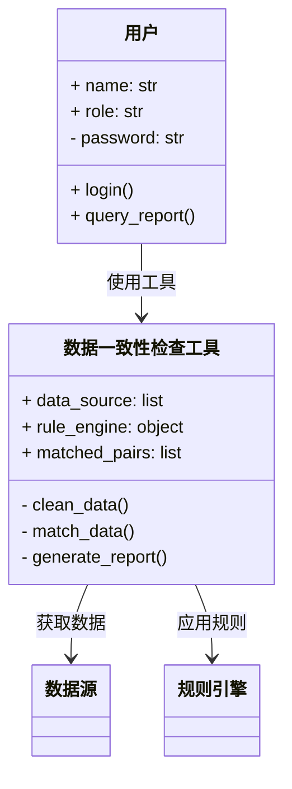
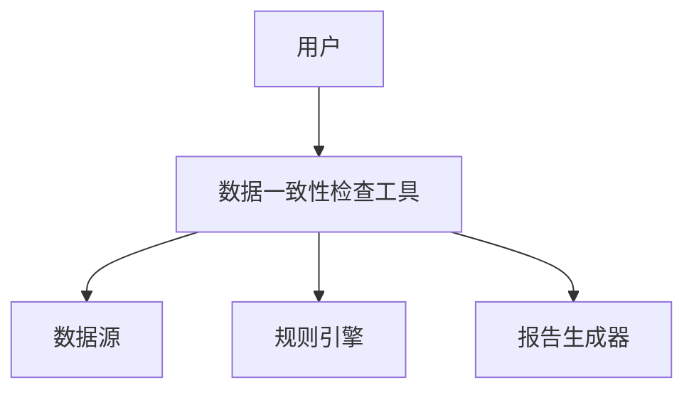
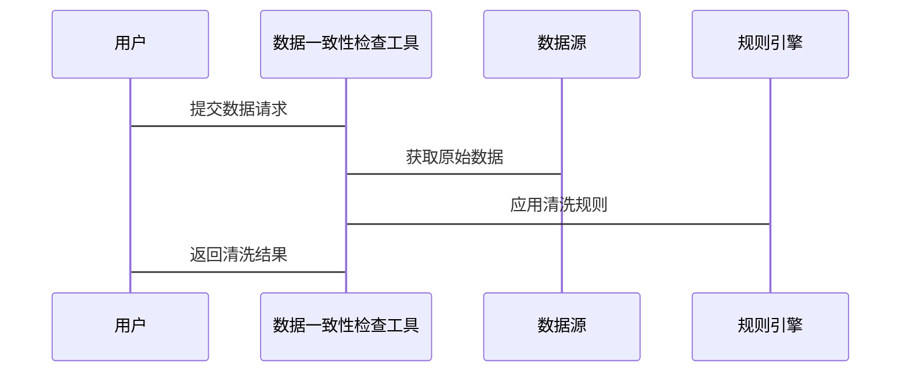

                 


# 《金融监管报告数据一致性检查工具》

> 关键词：金融监管，数据一致性，数据检查工具，数据清洗，数据匹配

> 摘要：金融监管报告数据一致性检查工具是确保金融数据准确性和完整性的关键工具。本文详细介绍了该工具的背景、核心概念、算法原理、系统架构、项目实现及最佳实践，帮助读者理解如何利用该工具解决金融监管中的数据一致性问题。

---

## 第一部分: 金融监管报告数据一致性检查工具概述

### 第1章: 背景与问题描述

#### 1.1 金融监管的重要性
- 金融监管是维护金融市场稳定的核心机制。
- 数据一致性是金融监管的基础，直接关系到监管决策的准确性。
- 金融监管报告的准确性依赖于数据的一致性。

#### 1.2 数据一致性问题的提出
- 数据一致性是指同一数据在不同系统或报告中保持一致的特性。
- 数据不一致的常见原因包括输入错误、系统集成问题、人为操作失误等。
- 数据不一致可能导致监管失灵，引发金融风险。

#### 1.3 数据一致性检查工具的必要性
- 数据一致性检查工具能够自动化识别和修复数据不一致问题。
- 该工具适用于金融监管中的实时数据核验、历史数据校对等场景。
- 工具的边界包括数据格式、数据范围和数据关联性。

---

## 第二部分: 核心概念与原理

### 第2章: 数据一致性检查的核心概念

#### 2.1 数据一致性检查的原理
- 数据一致性检查基于规则匹配和机器学习算法，通过对比不同数据源的信息，识别不一致项。
- 数据清洗算法用于消除数据中的噪声，确保数据的准确性和完整性。

#### 2.2 核心概念对比分析
| 概念         | 数据一致性 | 数据准确性 | 数据完整性 | 数据冗余性 |
|--------------|------------|------------|------------|------------|
| 定义         | 数据在不同系统中的统一性 | 数据反映真实情况的正确性 | 数据包含所有必要信息的特性 | 数据中重复信息的特性 |
| 关系         | 数据一致性是数据准确性和完整性的基础 | 数据准确性依赖于数据一致性 | 数据一致性影响数据完整性 | 数据冗余性与数据一致性无关 |

#### 2.3 数据一致性检查的ER实体关系图
```mermaid
er
actor: 用户
tool: 数据一致性检查工具
report: 金融监管报告
data_source: 数据源
rule_engine: 规则引擎
```

---

## 第三部分: 算法原理与实现

### 第3章: 数据清洗与匹配算法

#### 3.1 数据清洗算法
- **基于规则的清洗算法**：通过预定义规则（如正则表达式）过滤无效数据。
  ```python
  def rule_based_cleaning(data):
      cleaned_data = []
      for item in data:
          if re.match(r'^\d+$', item):
              cleaned_data.append(item)
      return cleaned_data
  ```
- **基于机器学习的清洗算法**：使用聚类算法识别异常值。
  ```python
  def ml_cleaning(data):
      from sklearn.cluster import KMeans
      model = KMeans(n_clusters=2).fit(data)
      cleaned_data = model.predict(data)
      return cleaned_data
  ```

#### 3.2 数据匹配算法
- **基于字符串匹配的算法**：使用编辑距离（Levenshtein距离）匹配相似字符串。
  ```python
  def levenshtein_distance(s1, s2):
      m = len(s1)
      n = len(s2)
      # 创建二维数组存储子问题结果
      dp = [[0]*(n+1) for _ in range(m+1)]
      for i in range(m+1):
          for j in range(n+1):
              if i == 0:
                  dp[i][j] = j
              elif j == 0:
                  dp[i][j] = i
              else:
                  dp[i][j] = min(dp[i-1][j], dp[i][j-1], dp[i-1][j-1]+1)
      return dp[m][n]
  ```

#### 3.3 算法实现的代码示例
```python
def data_cleaning(data):
    cleaned_data = []
    for item in data:
        if isinstance(item, str) and len(item) > 0:
            cleaned_data.append(item.strip().lower())
        else:
            cleaned_data.append(item)
    return cleaned_data

def data_matching(data1, data2):
    matched_pairs = []
    for item1 in data1:
        for item2 in data2:
            if levenshtein_distance(item1, item2) <= 2:
                matched_pairs.append((item1, item2))
    return matched_pairs
```

---

## 第四部分: 系统分析与架构设计

### 第4章: 系统架构设计

#### 4.1 问题场景介绍
- 金融监管报告数据一致性检查工具主要用于实时核验和历史数据校对。
- 工具支持多数据源接入，包括数据库、文件和API接口。

#### 4.2 系统功能设计


#### 4.3 系统架构设计


#### 4.4 系统接口设计
- 数据源接口：`GET /api/data`
- 规则引擎接口：`POST /api/rules`

#### 4.5 系统交互序列图


---

## 第五部分: 项目实战

### 第5章: 项目实现

#### 5.1 环境安装
- 安装Python和必要的库：
  ```bash
  pip install numpy pandas scikit-learn
  ```

#### 5.2 核心实现代码
```python
import pandas as pd
from sklearn.metrics.pairwise import pairwise_distances

def clean_and_match(data1, data2):
    # 数据清洗
    cleaned_data1 = data1.apply(lambda x: x.strip().lower())
    cleaned_data2 = data2.apply(lambda x: x.strip().lower())
    
    # 数据匹配
    distances = pairwise_distances(cleaned_data1, cleaned_data2)
    matched_pairs = []
    for i in range(distances.shape[0]):
        for j in range(distances.shape[1]):
            if distances[i][j] <= 2:
                matched_pairs.append((cleaned_data1.iloc[i], cleaned_data2.iloc[j]))
    return matched_pairs
```

#### 5.3 案例分析
- 案例：某银行的客户信息重复问题。
- 实施步骤：
  1. 数据清洗：去除多余空格，统一大小写。
  2. 数据匹配：使用编辑距离识别相似项。
  3. 生成报告：标记重复项并提供修复建议。

---

## 第六部分: 总结与展望

### 第6章: 总结

#### 6.1 项目小结
- 数据一致性检查工具能够显著提高金融监管的效率和准确性。
- 通过结合规则引擎和机器学习算法，工具能够处理复杂的数据匹配问题。

#### 6.2 注意事项
- 数据清洗规则需谨慎设计，避免误删或误改数据。
- 数据匹配算法的选择应基于数据特性和性能需求。

#### 6.3 拓展阅读
- 推荐阅读《数据清洗与分析》和《金融监管技术》相关书籍。

---

作者：AI天才研究院/AI Genius Institute & 禅与计算机程序设计艺术 /Zen And The Art of Computer Programming

