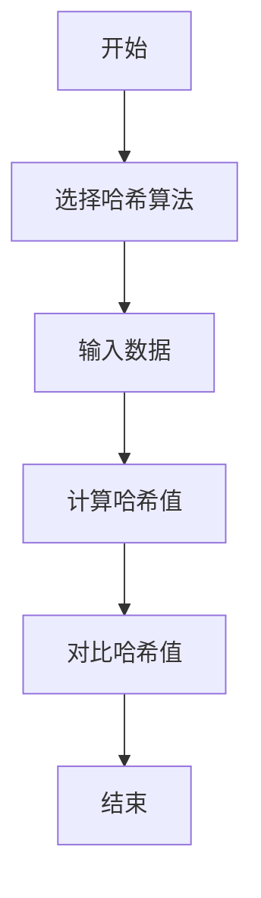
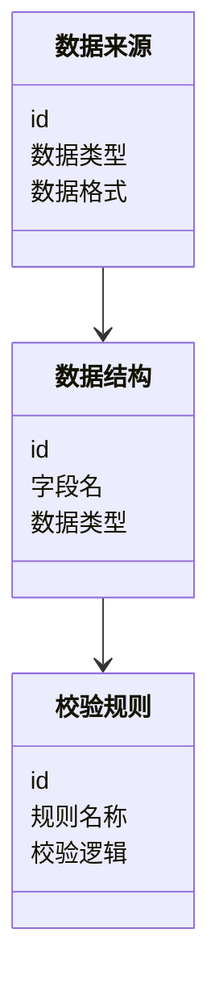

                 


```markdown
# 《金融监管报告数据一致性自动校验》

> 关键词：金融监管，数据一致性，自动校验，算法，系统架构

> 摘要：本文详细探讨了金融监管报告数据一致性自动校验的重要性、核心概念、算法原理、系统架构设计以及实际项目实现。通过结合实际案例和系统设计，深入分析了如何利用技术手段确保金融数据的准确性和一致性，从而提升金融监管的效率和准确性。

---

## 第一部分：数据一致性校验的背景与意义

### 第1章：问题背景

#### 1.1 数据一致性的重要性
- 数据一致性是金融监管的核心要求，直接影响监管的准确性和权威性。
- 数据不一致可能导致监管决策失误，引发金融风险。

#### 1.2 问题描述
- 金融监管数据来源多样，包括银行、证券公司、保险公司等机构的报告。
- 数据格式、字段定义、校验规则可能存在差异，导致数据不一致。
- 数据量大、更新频繁，人工校验效率低且容易出错。

#### 1.3 校验的意义
- 提高数据质量，确保监管决策的准确性。
- 降低人为错误，提升监管效率。
- 增强金融机构的透明度和信任度。

### 第2章：技术背景

#### 2.1 数据校验技术的发展
- 从人工校验到自动化校验的演变。
- 数据校验技术在金融领域的应用现状。

#### 2.2 自动化校验的必要性
- 高效性：快速处理海量数据。
- 准确性：避免人为疏漏。
- 可扩展性：适应业务变化。

---

## 第二部分：核心概念与联系

### 第3章：核心概念

#### 3.1 数据来源
- 数据来源的多样性：银行、证券公司、保险公司等。
- 数据来源的特征：数据格式、数据类型、数据结构。

#### 3.2 数据结构
- 数据结构的定义：字段名、数据类型、字段长度。
- 数据结构的复杂性：嵌套结构、关联关系。

#### 3.3 校验规则
- 校验规则的定义：规则名称、规则逻辑、规则参数。
- 校验规则的动态性：规则可配置、可扩展。

### 第4章：核心概念之间的关系

#### 4.1 数据来源与数据结构的关系
- 数据来源生成数据结构：不同来源的数据格式不同。
- 数据结构决定数据来源的兼容性。

#### 4.2 数据结构与校验规则的关系
- 数据结构定义校验规则：字段类型决定校验逻辑。
- 校验规则确保数据结构的正确性。

#### 4.3 校验规则与业务逻辑的关系
- 校验规则反映业务逻辑：规则根据业务需求制定。
- 业务逻辑驱动规则的变更：业务变化需要规则调整。

### 第5章：ER实体关系图

```mermaid
er
    entity 数据来源(DS) {
        id: string
        数据类型: string
        数据格式: string
    }
    entity 数据结构(DS) {
        id: string
        字段名: string
        数据类型: string
    }
    entity 校验规则(RR) {
        id: string
        规则名称: string
        校验逻辑: string
    }
    DS --> DS: 数据来源生成数据结构
    DS --> RR: 数据结构定义校验规则
```

---

## 第三部分：算法原理

### 第6章：算法概述

#### 6.1 哈希校验算法
- 哈希函数的作用：将数据转换为固定长度的哈希值。
- 哈希校验的步骤：数据输入、哈希计算、结果对比。

#### 6.2 区块链共识算法
- 共识机制：确保数据一致性的分布式算法。
- 常见的共识算法：PoW、PoS、Raft。

#### 6.3 数据加密算法
- 加密校验：通过加密技术确保数据完整性。
- 常见加密算法：MD5、SHA-256。

### 第7章：哈希校验算法实现

#### 7.1 算法流程


#### 7.2 Python代码示例
```python
import hashlib

def compute_hash(data):
    # 创建哈希对象
    hash_object = hashlib.sha256(data.encode())
    # 返回哈希值
    return hash_object.hexdigest()

# 示例数据
data = "金融监管报告"
print(compute_hash(data))
```

#### 7.3 数学模型
- 哈希函数定义：
  $$ H: D \rightarrow \{0,1\}^n $$
  其中，D是数据集合，H是哈希函数，n是哈希值的长度。

---

## 第四部分：数学模型与公式

### 第8章：数学模型

#### 8.1 哈希函数模型
- 哈希函数的数学表示：
  $$ H(x) = \sum_{i=1}^{n} x_i \cdot w_i \mod p $$
  其中，x是输入数据，w是权重，p是模数。

#### 8.2 区块链共识模型
- 共识算法的数学表示：
  $$ C = \argmax_{C} \sum_{i=1}^{m} P_i(C) $$
  其中，C是候选区块，P是节点的概率函数，m是节点数。

---

## 第五部分：系统分析与架构设计

### 第9章：系统功能设计

#### 9.1 功能模块
- 数据采集模块：从不同来源获取数据。
- 校验规则引擎：定义和执行校验规则。
- 结果分析模块：生成校验报告。

#### 9.2 领域模型


### 第10章：系统架构设计

#### 10.1 架构图


---

## 第六部分：项目实战

### 第11章：环境安装

#### 11.1 安装Python环境
- 安装Python：https://www.python.org/downloads/
- 安装依赖：`pip install hashlib`

### 第12章：核心代码实现

#### 12.1 校验规则引擎
```python
class 校验规则引擎:
    def __init__(self, 规则文件):
        self.规则文件 = 规则文件
        self.规则列表 = self.加载规则()

    def 加载规则(self):
        # 从规则文件中加载校验规则
        pass

    def 执行校验(self, 数据):
        # 根据规则对数据进行校验
        pass
```

### 第13章：案例分析

#### 13.1 实际案例
- 案例背景：某银行提交的监管报告存在数据格式不一致的问题。
- 解决方案：使用自动校验系统进行数据校验。
- 校验结果：发现并修复了多个数据不一致的问题。

---

## 第七部分：总结与展望

### 第14章：总结

#### 14.1 核心内容回顾
- 数据一致性校验的重要性
- 核心概念与技术实现
- 系统架构与项目实战

### 第15章：最佳实践

#### 15.1 小结
- 数据一致性校验是金融监管的关键环节。
- 技术手段的应用提升了监管效率和准确性。

#### 15.2 注意事项
- 数据来源的多样性增加了校验的复杂性。
- 系统性能需要优化以适应海量数据。

#### 15.3 拓展阅读
- 区块链技术在金融监管中的应用
- 机器学习在数据校验中的应用

---

作者：AI天才研究院/AI Genius Institute & 禅与计算机程序设计艺术 /Zen And The Art of Computer Programming
```

